# 使用带有 Octopus Deploy 的 GitLab 提要

> 原文：<https://octopus.com/blog/gitlab-external-feeds>

Octopus Deploy 有一个[内置存储库](https://octopus.com/docs/packaging-applications/package-repositories/built-in-repository)，支持多种[包类型](https://octopus.com/docs/packaging-applications#supported-formats)。然而，一些客户更喜欢使用第三方存储库，或者使用内置于他们的持续集成(CI)工具中的存储库。

在这篇文章中，我演示了如何使用 GitLab 的内置注册表作为外部提要来使用 Octopus 部署您的项目。

## GitLab 注册表

GitLab 支持多种注册表类型:

*   包注册表
*   集装箱登记处
*   基础设施注册

在本文中，我将介绍包和容器注册。

### 包注册表

[GitLab 包注册表](https://docs.gitlab.com/ee/user/packages/package_registry/)支持多种包类型，但是，Octopus 只支持以下 GitLab 包注册表类型作为外部提要:

#### 专家

Maven 存储库通常与 Java 应用程序相关联，尽管它们可以更通用地使用(稍后将详细介绍)。我们的 [PetClinic](https://bitbucket.org/octopussamples/petclinic/src/master/) 示例应用程序包含了演示 GitLab 的 Maven 注册功能所需的大部分组件。唯一缺少的是向 Maven 注册中心认证的机制。 [GitLab 的文档](https://docs.gitlab.com/ee/user/packages/maven_repository/#create-maven-packages-with-gitlab-cicd-by-using-maven)向您展示了如何通过添加一个包含以下内容的`ci_settings.xml`文件来轻松实现这一点:

```
<settings  xmlns:xsi="http://www.w3.org/2001/XMLSchema-instance"
  xsi:schemaLocation="http://maven.apache.org/SETTINGS/1.1.0 http://maven.apache.org/xsd/settings-1.1.0.xsd">
  <servers>
    <server>
      <id>gitlab-maven</id>
      <configuration>
        <httpHeaders>
          <property>
            <name>Job-Token</name>
            <value>${env.CI_JOB_TOKEN}</value>
          </property>
        </httpHeaders>
      </configuration>
    </server>
  </servers>
</settings> 
```

添加这些内容之后，您就可以定义您的构建定义了。

GitLab 使用基于 YAML 的方法来配置构建定义。下面是 PetClinic 应用程序的示例构建定义:

```
stages:
    - set-version
    - java-build
    - maven-push

set-version:
  stage: set-version
  tags:
    - shell
  script:
    - dayOfYear=$(date +%j)
    - hour=$(date +%H)
    - minutes=$(date +%M)
    - seconds=$(date +%S)
    - year=$(date +%y)
    - echo "1.0.$year$dayOfYear.$hour$minutes$seconds" >> version.txt
  artifacts:
    paths:
      [ version.txt ]

java-build:
  stage: java-build
  tags:
    - shell
  script:
    - VERSION_NUMBER=$(cat version.txt)
    - mvn clean package -DskipTests=true -Dproject.versionNumber=$VERSION_NUMBER
  artifacts:
    paths:
      - "$CI_PROJECT_DIR/target/*.war"

maven-push:
  stage: maven-push
  tags:
    - shell
  variables:
    GROUP: "com.octopus"
    VERSION: $VERSION_NUMBER
    REPO_PROJECT_ID: $CI_PROJECT_ID
  script:
    - VERSION_NUMBER=$(cat version.txt)
    - mvn deploy:deploy-file -s ci_settings.xml -DgroupId=$GROUP 
      -Dversion=$VERSION_NUMBER
      -Dfile=$CI_PROJECT_DIR/target/petclinic.web.$VERSION_NUMBER.war
      -Durl=${CI_API_V4_URL}/projects/${CI_PROJECT_ID}/packages/maven
      -DrepositoryId=gitlab-maven
      -DpomFile=pom.xml
    - zip -r $CI_PROJECT_DIR/petclinic.mysql.flyway.$VERSION_NUMBER.zip $CI_PROJECT_DIR/flyway
    - mvn deploy:deploy-file -s ci_settings.xml
      -DgroupId=$GROUP
      -DartifactId=petclinic.mysql.flyway
      -Dpackaging=zip
      -Dfile=$CI_PROJECT_DIR/petclinic.mysql.flyway.$VERSION_NUMBER.zip
      -DrepositoryId=gitlab-maven
      -Durl=${CI_API_V4_URL}/projects/${CI_PROJECT_ID}/packages/maven
      -DartifactId=petclinic.mysql.flyway
      -Dversion=$VERSION_NUMBER 
```

PetClinic 应用程序由两个主要组件组成:

*   Java web 应用程序
*   [Flyway](https://flywaydb.org/) ，用于执行数据库更新

要使用 Octopus 部署这两者，首先需要将它们添加到 Maven 注册表中，这样 Octopus 就可以找到并部署它们。

构建定义的`maven-push`部分是工件上传到 Maven 注册中心的地方。注意，脚本部分定义了 2 个`mvn deploy:deploy-file`命令。第一个`deploy`命令将在`java-build`阶段编译的`.war`文件上传到注册表。

与 web 组件不同，Flyway 已经编译好了，你只需要压缩然后上传到注册表。`zip`命令压缩`flyway`文件夹的内容。

接下来，使用马特·卡斯珀森在[上发布的关于从 Maven](https://octopus.com/blog/deploy-and-consume-zip-files-from-maven) 部署和使用 ZIP 文件的指导，将`.zip`文件上传到 Maven 注册表。

[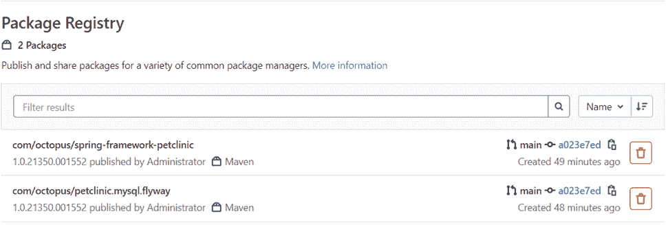](#)

#### 努格特

因为。NET 应用程序中，最常用的注册表类型是 NuGet。的。NET core 示例应用程序 [OctoPetShop](https://github.com/OctopusSamples/OctoPetShop) 很适合这个演示。

使用以下构建定义(该定义利用了 GitLab 的 Docker-in-Docker (DIND)特性):

```
image: ubuntu:latest

stages:
    - set-version
    - build-dotnet
    - package-dotnet
    - push-packages

set-version:
  stage: set-version
  script:
    - dayOfYear=$(date +%j)
    - hour=$(date +%H)
    - minutes=$(date +%M)
    - seconds=$(date +%S)
    - year=$(date +%y)
    - echo "1.0.$year$dayOfYear.$hour$minutes$seconds" >> version.txt
  artifacts:
    paths:
      [ version.txt ]

build-dotnet:
  stage: build-dotnet
  image: mcr.microsoft.com/dotnet/core/sdk:3.1
  script:
    - VERSION_NUMBER=$(cat version.txt)
    - dotnet build OctopusSamples.OctoPetShop.Database/OctopusSamples.OctoPetShop.Database.csproj --output "$CI_PROJECT_DIR/output/OctopusSamples.OctoPetShop.Database"
    - dotnet publish OctopusSamples.OctoPetShop.ProductService/OctopusSamples.OctoPetShop.ProductService.csproj --output "$CI_PROJECT_DIR/output/OctopusSamples.OctoPetShop.ProductService"
    - dotnet publish OctopusSamples.OctoPetShop.ShoppingCartService/OctopusSamples.OctoPetShop.ShoppingCartService.csproj --output "$CI_PROJECT_DIR/output/OctopusSamples.OctoPetShop.ShoppingCartService"
    - dotnet publish OctopusSamples.OctoPetShop.Web/OctopusSamples.OctoPetShop.Web.csproj --output "$CI_PROJECT_DIR/output/OctopusSamples.OctoPetShop.Web"

  artifacts:
    paths:
      - "$CI_PROJECT_DIR/output/"

package-dotnet:
  stage: package-dotnet
  image: octopuslabs/gitlab-octocli
  script: 
    - VERSION_NUMBER=$(cat version.txt)
    - octo pack --id=OctopusSamples.OctoPetShop.ProductService --version=$VERSION_NUMBER --basePath="$CI_PROJECT_DIR/output/OctopusSamples.OctoPetShop.ProductService" --outFolder="$CI_PROJECT_DIR/packages" --format="NuPkg"
    - octo pack --id=OctopusSamples.OctoPetShop.Database --version=$VERSION_NUMBER --basePath="$CI_PROJECT_DIR/output/OctopusSamples.OctoPetShop.Database" --outFolder="$CI_PROJECT_DIR/packages" --format="NuPkg"
    - octo pack --id=OctopusSamples.OctoPetShop.ShoppingCartService --version=$VERSION_NUMBER --basePath="$CI_PROJECT_DIR/output/OctopusSamples.OctoPetShop.ShoppingCartService" --outFolder="$CI_PROJECT_DIR/packages" --format="NuPkg"
    - octo pack --id=OctopusSamples.OctoPetShop.Web --version=$VERSION_NUMBER --basePath="$CI_PROJECT_DIR/output/OctopusSamples.OctoPetShop.Web" --outFolder="$CI_PROJECT_DIR/packages" --format="NuPkg"
  artifacts:
    paths:
      - "$CI_PROJECT_DIR/packages/"

push-packages:
  stage: push-packages
  image: mcr.microsoft.com/dotnet/core/sdk:3.1
  script:
    - dotnet nuget add source "${CI_API_V4_URL}/projects/${CI_PROJECT_ID}/packages/nuget/index.json" --name gitlab --username gitlab-ci-token --password $CI_JOB_TOKEN --store-password-in-clear-text
    - dotnet nuget push "$CI_PROJECT_DIR/packages/*.nupkg" --source gitlab 
```

默认情况下，web 应用程序的`IsPackable`属性设置为 false。您可以使用 Octopus Deploy GitLab CLI 映像将编译后的应用程序打包到 NuGet 包中，而不是弄乱项目属性。在创建了`.nupkg`文件之后，可以使用`dotnet`命令将包推入 GitLab NuGet 注册表。

[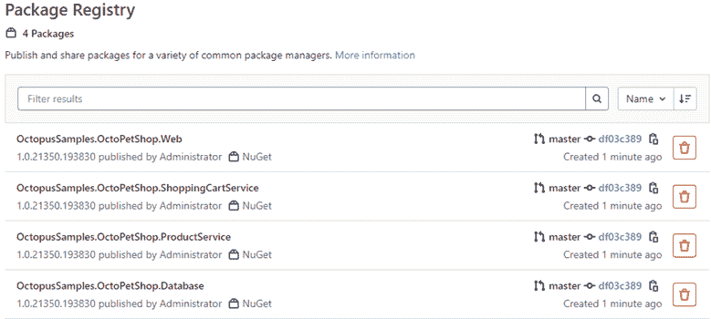](#)

### 集装箱登记处

除了包注册表，GitLab 还有一个容器注册表。为了演示如何使用容器注册中心，您可以再次使用 OctoPetShop 应用程序:

```
image: ubuntu:latest

stages:
    - set-version
    - build-docker

set-version:
  stage: set-version
  script:
    - dayOfYear=$(date +%j)
    - hour=$(date +%H)
    - minutes=$(date +%M)
    - seconds=$(date +%S)
    - year=$(date +%y)
    - echo "1.0.$year$dayOfYear.$hour$minutes$seconds" >> version.txt
  artifacts:
    paths:
      [ version.txt ]

build-docker:
    stage: build-docker
    image: docker:1.11
    services:
      - docker:dind
    before_script:
      - docker info
    script:
      - VERSION_NUMBER=$(cat version.txt)
      - docker build -t $CI_REGISTRY/$CI_PROJECT_NAMESPACE/$CI_PROJECT_NAME/octopetshop.database:$VERSION_NUMBER ./OctopusSamples.OctoPetShop.Database/ 
      - docker build -t $CI_REGISTRY/$CI_PROJECT_NAMESPACE/$CI_PROJECT_NAME/octopetshop.productservice:$VERSION_NUMBER ./OctopusSamples.OctoPetShop.ProductService/ 
      - docker build -t $CI_REGISTRY/$CI_PROJECT_NAMESPACE/$CI_PROJECT_NAME/octopetshop.shoppingcartservice:$VERSION_NUMBER ./OctopusSamples.OctoPetShop.ShoppingCartService/ 
      - docker build -t $CI_REGISTRY/$CI_PROJECT_NAMESPACE/$CI_PROJECT_NAME/octopetshop.web:$VERSION_NUMBER ./OctopusSamples.OctoPetShop.Web/ 
      - docker login -u $CI_REGISTRY_USER -p $CI_REGISTRY_PASSWORD $CI_REGISTRY
      - docker push $CI_REGISTRY/$CI_PROJECT_NAMESPACE/$CI_PROJECT_NAME/octopetshop.database:$VERSION_NUMBER
      - docker push $CI_REGISTRY/$CI_PROJECT_NAMESPACE/$CI_PROJECT_NAME/octopetshop.productservice:$VERSION_NUMBER
      - docker push $CI_REGISTRY/$CI_PROJECT_NAMESPACE/$CI_PROJECT_NAME/octopetshop.shoppingcartservice:$VERSION_NUMBER
      - docker push $CI_REGISTRY/$CI_PROJECT_NAMESPACE/$CI_PROJECT_NAME/octopetshop.web:$VERSION_NUMBER 
```

[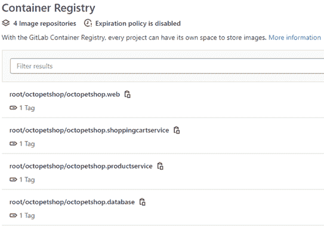](#)

## 将 GitLab 注册表作为外部提要进行连接

除了内置的存储库之外，Octopus Deploy 还支持使用[外部提要](https://octopus.com/docs/packaging-applications/package-repositories)来获取用于部署的包。

要添加外部提要，请转到您的 Octopus 仪表盘，点击**库**，然后点击**外部提要**，再点击**添加提要**。

[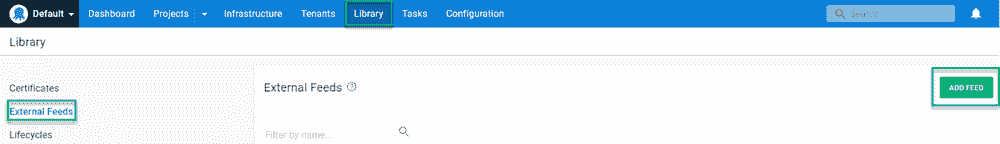](#)

### 添加 GitLab Maven 提要

要添加 GitLab Maven 注册表，您需要与提要相关联的项目或组 ID。这篇文章展示了项目的水平。要获取项目 ID，请在 GitLab 中导航到该项目，ID 会显示在初始屏幕上:

[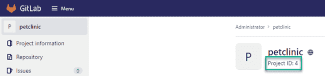](#)

填写 Octopus 中的表单字段:

*   **进给类型** : `Maven Feed`
*   **Name** :给 feed 起一个名字，比如`GitLab Petclinic Maven Feed`
*   **网址** : `https://[gitlabserver]/api/v4/projects/[project or group id]/packages/maven`
*   (可选)**凭证**:访问提要的用户名和密码

[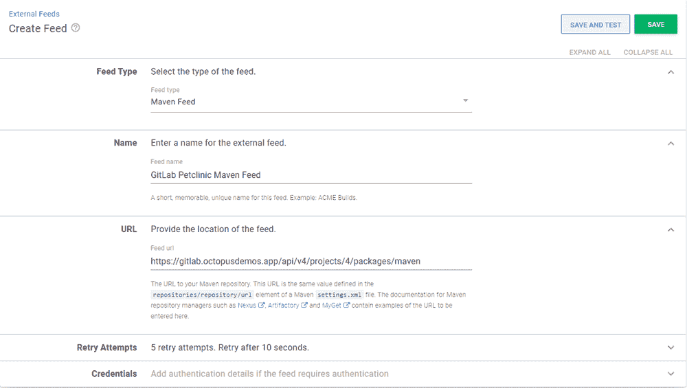](#)

点击**保存并测试**以确保进给功能正常。使用“组:工件”格式输入包的名称。

[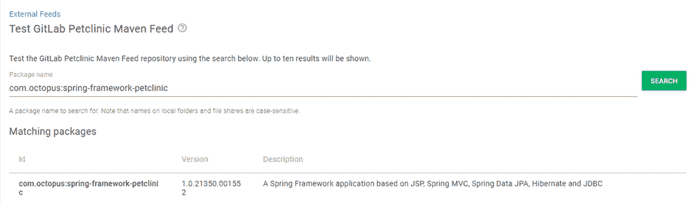](#)

### 添加 GitLab NuGet 提要

与 Maven 提要类似，您需要与提要相关联的项目或组 ID。

填写表单字段:

*   **进给类型** : `NuGet Feed`
*   **名称**:给提要起一个名字，例如`GitLab OctoPetShop Nuget Feed`
*   **网址** : `https://[gitlabserver]/api/v4/projects/[project or group id]/packages/nuget/index.json`
*   (可选)**凭证**:访问提要的用户名和密码

[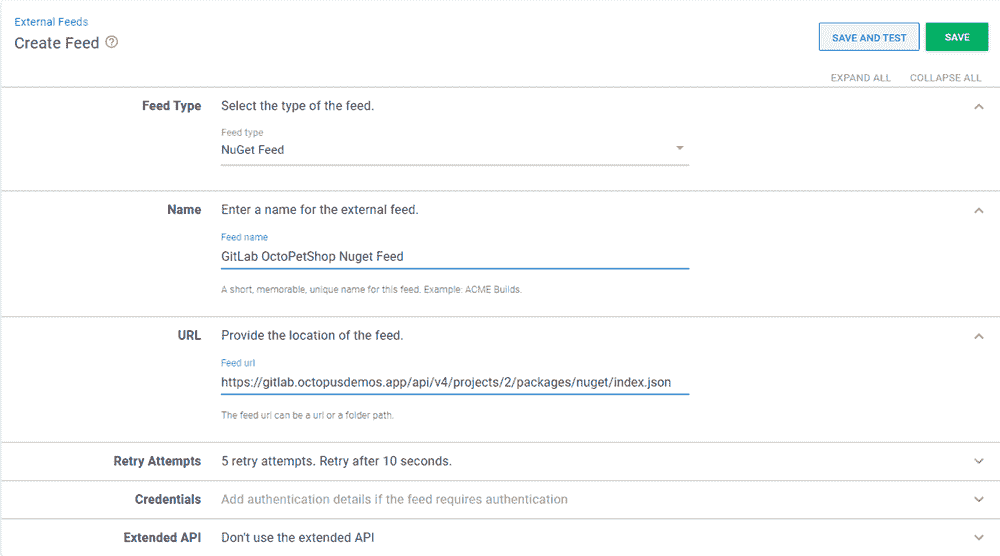](#)

点击**保存并测试**以确保进给功能正常。输入包的名称(可以是部分名称):

[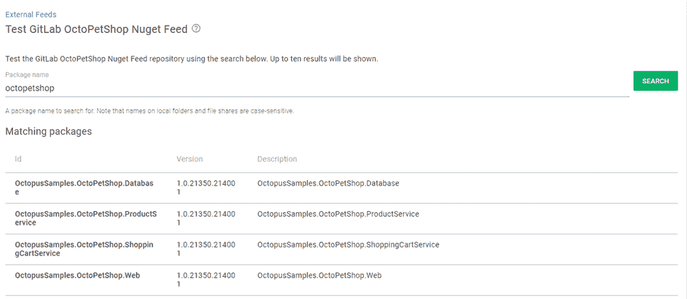](#)

### 添加 GitLab 容器提要

与其他两种提要类型不同，容器提要不需要项目或组 ID。但是，它确实需要知道服务器上的哪个端口被配置为托管容器注册中心。

填写表单字段:

*   **进给类型** : `Docker Container Registry`
*   **名称**:给 feed 起一个名字，比如`GitLab Container Registry`
*   **网址** : `https://[gitlabserver]:[port]`
*   **凭证**:访问提要的用户名和密码

[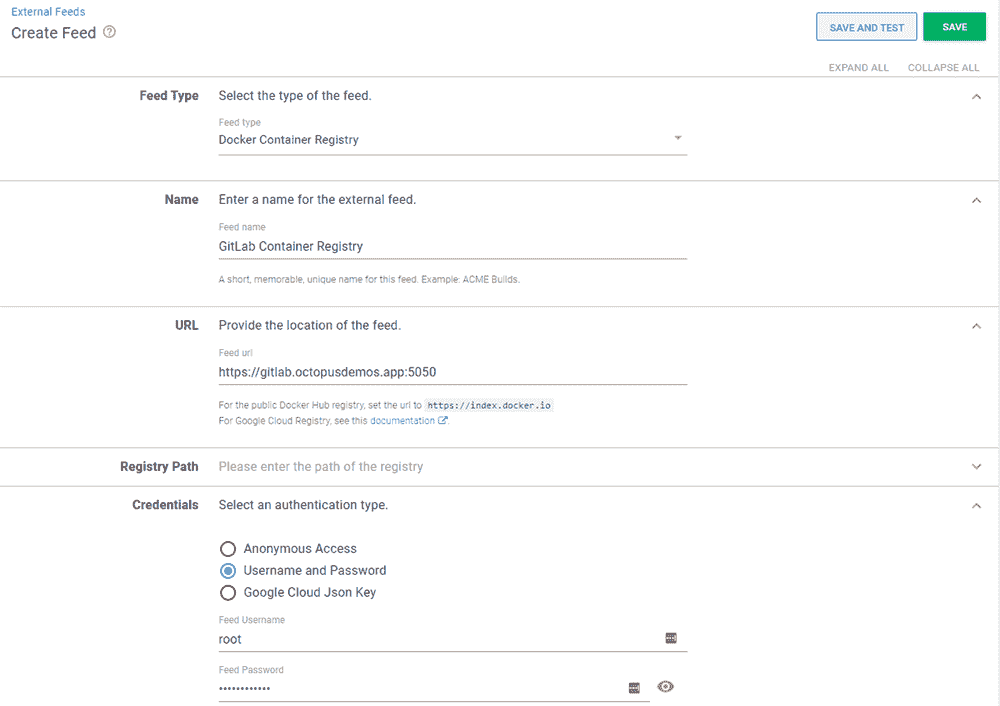](#)

点击**保存并测试**以确保进给功能正常。输入包的名称(可以是部分名称):

[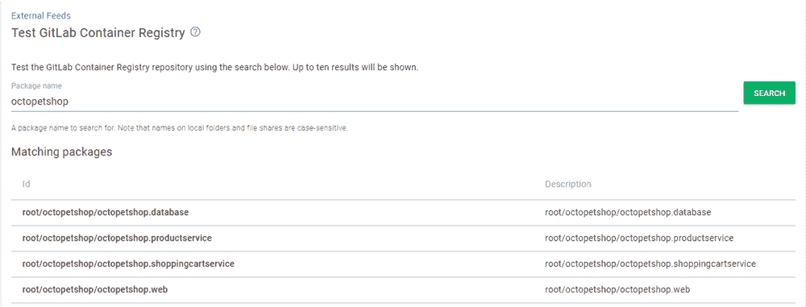](#)

## 结论

在许多情况下，使用 Octopus Deploy 的内置存储库会让您受益匪浅。但是，如果你需要跨空间的东西，又不想重复，也有替代方案。在这篇文章中，我向您展示了如何使用 GitLab 的内置注册表作为外部提要来使用 Octopus 部署您的项目。

愉快的部署！