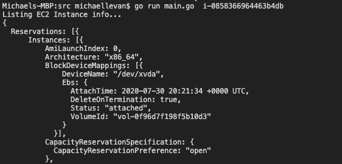

# Golang 用于 AWS - Octopus 部署中的自动化

> 原文：<https://octopus.com/blog/golang-for-automation-in-aws>

[](#)

当我们想到自动化时，首先想到的是代码。我们可能会被问到的几个问题是:

1.  什么编程语言最适合自动化？
2.  团队需要学习什么样的简单明了的语言？

默认情况下，Golang 是一种基于过程的语言。这意味着它主要基于编写函数。当您想到自动化代码时，例如 PowerShell 或 Python，您可能会想到为脚本编写一些函数。正因为如此，Golang 是一个天然的选择。

在这篇博文中，您将学习如何使用 Golang 实现 AWS 自动化，就像使用 PowerShell 或 Python 一样。

## 先决条件

要跟进这篇博文，您需要以下内容:

1.  GoLang 的初级知识。
2.  AWS 的初级知识。
3.  [Visual Studio 代码(VS 代码)](https://code.visualstudio.com/)。
4.  [Golang 装机](https://golang.org/doc/install)。
5.  本地主机上的 AWS 配置。您可以通过安装 AWS CLI 并运行`aws configure`来做到这一点。
6.  正在运行的 EC2 实例。

## 确定使用什么包

在运行任何代码之前，您需要导入一些包，也称为库。在 Golang 中导入 AWS 包的主要方法是直接指向包所在的 [GitHub 库](https://github.com/)。

要开始添加 Golang 代码，您需要一个保存代码的地方。为了这篇博文的目的，您可以在桌面上保存一个目录，并在 VS 代码中打开它。

1.  创建一个新文件并命名为`main.go`来存储 AWS 的 Golang 代码。
2.  添加以下代码以创建主包并导入包列表:

```
package main

import (
    "fmt"
    "os"

    "github.com/aws/aws-sdk-go/aws"
    "github.com/aws/aws-sdk-go/aws/session"
    "github.com/aws/aws-sdk-go/service/ec2"
) 
```

特定于 AWS 的三个软件包是:

1.  [github.com/aws/aws-sdk-go/aws](http://github.com/aws/aws-sdk-go/aws):允许您连接到 AWS 包，特别是认证和指定您想要在 AWS 中工作的区域。
2.  [github.com/aws/aws-sdk-go/aws/session](http://github.com/aws/aws-sdk-go/aws/session):允许你创建一个新的会话来连接 AWS。
3.  [github.com/aws/aws-sdk-go/service/ec2](http://github.com/aws/aws-sdk-go/service/ec2):允许您处理特定的 EC2 服务数据，如 EC2 状态、负载平衡器、公共 IP 等。

使用上面的软件包，您可以连接到 AWS 并开始使用可用的 Golang EC2 功能。

## 设置功能

上一节向您展示了如何设置主包和特定于 AWS 的包，需要导入这些包以便在编程级别与 AWS 进行交互。既然已经导入了 AWS 包，是时候开始编写`ListInstances`函数了，它将列出来自特定实例 ID 的元数据，您可以在运行时传入这些元数据。

### AWS 连接

1.  在`import`下，设置一个名为`listInstances`的函数，在运行时传递一个名为`instanceID`的参数:

```
func listInstances(instanceID string) {

} 
```

2.  在该函数中，要设置的第一段代码是使用本地主机上现有的 AWS 配置连接到 AWS。该变量将被称为`awsConnect`，并包含错误处理。`session`包用于调用`aws`包来指向本地主机上现有的 AWS 配置。然后，指定一个特定的区域(如果需要，可以随意更改):

```
awsConnect, err := session.NewSession(&aws.Config{
        Region: aws.String("us-east-2")},
    ) 
```

### 错误处理

接下来，为变量中配置的`err`添加错误处理。如果出现错误，它会简单地输出到屏幕上:

```
if err != nil {
        fmt.Println(err)
    } 
```

### 启动 AWS 连接

启动 AWS 连接是通过`EC2`包中的`New()`方法完成的，并使用指向本地 AWS 配置的`awsConnect`变量:

```
ec2sess := ec2.New(awsConnect) 
```

### 输出 EC2 信息

为了输出 EC2 实例元数据，`ec2`包与`DescribeInstancesInput`方法一起使用。在`DescribeInstancesInput`方法中，`instanceID`变量被传入(关于`main`函数的`instanceID`参数将在下一节中详细解释)。

传入实例 ID 后，有两个打印语句:

1.  让用户知道 EC2 信息正在打印。
2.  使用`DescribeInstances`方法打印实例信息:

```
instanceInfo := &ec2.DescribeInstancesInput{
        InstanceIds: []*string{aws.String(instanceID)},
    }
    fmt.Println("Listing EC2 Instance info...")

    fmt.Println(ec2sess.DescribeInstances(instanceInfo))
} 
```

## 配置主要功能

在上一节中，您配置了完成所有跑腿工作的主要功能。在本节中，您将配置主函数。main 函数执行以下操作:

1.  运行`listInstances`功能。
2.  设置在`listInstances`功能中用作参数的`instanceID`变量。

主函数中的`instanceID`变量使用了`os.Args`包，所以你可以在运行时传入值。这使得代码可以重用，因为它没有任何硬编码的 EC2 实例 id:

```
func main() {
    instanceID := os.Args[1]

    listInstances(instanceID)
} 
```

## 运行代码

在前面三节中，您设置了检索 EC2 元数据信息所需的所有代码。整个程序应该是这样的:

```
package main

import (
    "fmt"
    "os"

    "github.com/aws/aws-sdk-go/aws"
    "github.com/aws/aws-sdk-go/aws/session"
    "github.com/aws/aws-sdk-go/service/ec2"
)

func main() {
    instanceID := os.Args[1]

    listInstances(instanceID)
}

func listInstances(instanceID string) {
    awsConnect, err := session.NewSession(&aws.Config{
        Region: aws.String("us-east-2")},
    )
    if err != nil {
        fmt.Println(err)
    }

    ec2sess := ec2.New(awsConnect)

    instanceInfo := &ec2.DescribeInstancesInput{
        InstanceIds: []*string{aws.String(instanceID)},
    }
    fmt.Println("Listing EC2 Instance info...")

    fmt.Println(ec2sess.DescribeInstances(instanceInfo))
} 
```

程序正确编写后，就该运行它了:

1.  打开终端，进入`main.go`程序所在的目录(`cd`)。
2.  运行以下命令来运行 Golang 程序:

```
go run main.go instance_id 
```

该程序成功完成后，您应该会看到类似于以下屏幕截图的输出:

[](#)

恭喜你。您已经成功使用 Golang 从 AWS 检索 EC2 信息。

## 结论

自动化有几种方法，也有许多不同的编程语言来实现，但这并不意味着所有的编程语言都是自动化的最佳选择。当您为自动化编写脚本时，您需要一种易于阅读、直截了当并且为编写小函数而构建的编程语言。

在这篇博文中，您了解了如何编写一个小函数来检索 EC2 实例上的元数据，以及如何在 AWS 中自动执行这些任务。