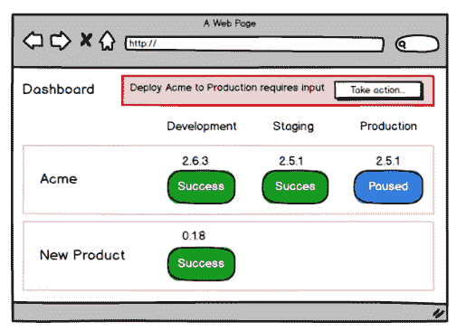
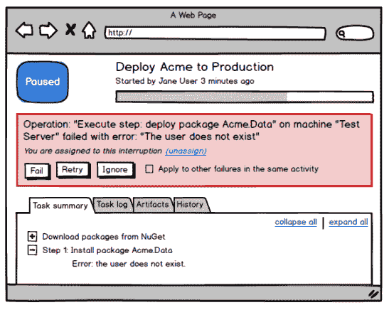

# Octopus 2.0 引导失败:RFC - Octopus 部署

> 原文：<https://octopus.com/blog/guided-failures-rfc>

*这是由[尼克](/blog/introducing-nick)写的一篇文章，他本周一直致力于这个专题。*

一个破碎的构建是令人讨厌的，有时令人沮丧和适得其反，但很少是危机。当出现问题时，构建服务器理所当然地“快速失败”,并且当问题被纠正时，期望从零开始执行全新的构建。

在 Octopus 1.0 中，我们也使用了这个模型。但是，中断的部署与中断的构建有一点不同:如果部署在生产中中断，那么通常会有一个升级和“所有人都在甲板上”直到部署成功完成。部署中断会导致停机，尽管在理想情况下，冗余和回滚可能会挽救局面，但通常:

*   回滚过程，尤其是对于数据库，很难可靠地实现
*   一旦纠正了故障原因，执行复杂的部署可能会非常耗时
*   一台机器的故障，比如说，五台服务器中的一台，最好忽略掉，而不是停止剩下的部署任务

有时失败的原因很简单，如缺少依赖项、计算机上的 Windows 功能或配置设置、锁定的文件或只读路径。从中断到部署的最快方法是让一个人参与进来，当有意义时，忽略或重试失败的活动。

因此，在 Octopus 2.0 中，虽然我们的默认策略仍然是像第一个版本一样“快速失败”，但我们正在探索在出现问题时让人类参与解决问题的可能性。我们称这个特性为**引导失败**。

为了避免解决问题的人之间的意外“竞赛”，你需要在采取行动之前负责解决失败。

一旦您决定对失败采取行动，您就可以查看关于错误的完整信息以及部署的其余部分的进度。

选择*忽略*失败将导致部署继续，尽管有错误，可能导致更多的失败。*重试*失败的动作将导致 Octopus 再次尝试，而选择*失败*将导致部署像今天一样结束。

许多故障发生在大型环境中的多台机器上。为了保持开销最小，我们将允许*忽略*和*重试*动作在一个步骤中对所有类似的活动应用一次。

引导式故障将针对每个环境启用，因此它可以在生产等关键环境中启用，而不会妨碍持续部署的构建和测试脚本。该行为也将能够在每次部署的基础上被覆盖。

你怎么想呢?引导失败对你部署 Octopus 有帮助吗？我们希望在下面的评论中得到您的反馈。