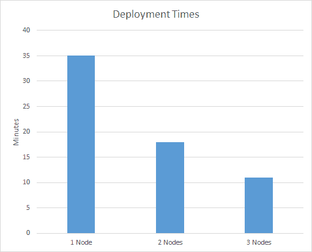

# 高可用性性能优势- Octopus 部署

> 原文：<https://octopus.com/blog/high-availability-performance>

Octopus Deploy 高可用性是我们为 Octopus Deploy 已成为关键基础架构的客户提供的产品。除了额外的可靠性之外，高可用性还提供了优于单个 Octopus 服务器的性能增益。我们的目标是随着您向高可用性集群添加节点，提供线性的性能提升。进入[触手军](/blog/how-we-create-the-tentacle-army)。

我们在 Amazon EC2 上测试了高可用性，配置如下:

*   m3.2xlarge 上的 Octopus 服务器(8 个 vCPU，30GB 内存)
*   m3.large 上的章鱼触手(2 个 vCPU，7.5GB 内存)
*   m3.large 上的 SQL Server 2014 Express
*   m3.large 上的 Samba 文件共享
*   弹性负载平衡器 ping/API

我们对 150 个从 10MB 到 1000MB 的包的部署进行了排队，有些是脚本，有些是工件。部署的包的总大小刚刚超过 50GB，计算了大量的增量压缩，给 CPU 和文件共享带来了压力。

结果是:

一台八达通服务器在 35 分钟内完成所有部署，而两台八达通服务器需要 18 分钟，三台八达通服务器需要 11 分钟。两台 Octopus 服务器的速度是一台的两倍，三台服务器的速度是一台的三倍。这是我们希望实现的线性性能提升。

## 瓶颈

在进行这些测试时，我们遇到了一些影响集群执行部署速度的瓶颈。以下是我们发现的一些瓶颈:

*   使用外部 NuGet 提要对性能有很大的影响，因为节点中的所有 Octopus 服务器都是同时从提要中获取包的。使用 Octopus 服务器内置的包存储库消除了这个瓶颈。
*   让多个服务器部署到同一个触手会限制速度。在这些测试中，没有触手重叠。
*   每个 Octopus 服务器节点并发运行任务的限制会影响性能。我们使用默认值 5。

我们有一些最后的测试和工作要做，然后我们将在几周内提供高可用性供试用。我们希望你会喜欢它！

