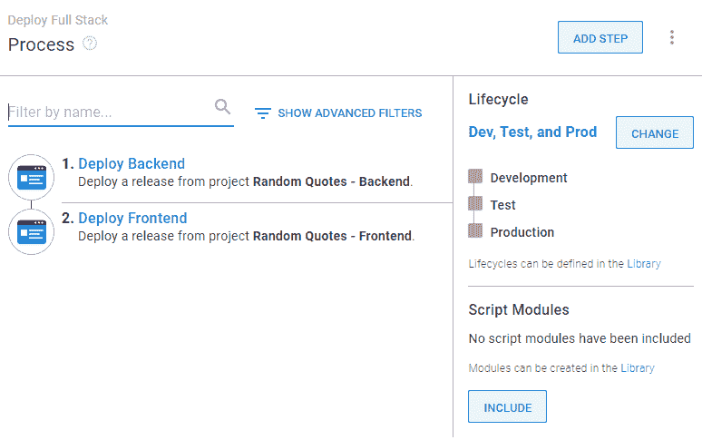

# Octopus 如何补充您的构建服务器- Octopus Deploy

> 原文：<https://octopus.com/blog/how-octopus-complements-build-server>

在过去的几个月里，我们在 Jenkins 和 GitHub Actions 中探索了两个构建服务器选项。正如我们所发现的，Jenkins 是一个传统的构建服务器，在其中心有一个自我管理的实例，而 GitHub Actions 执行类似的任务，但作为一个服务在您可能已经使用的产品中。根据您的需求，这两者都值得作为持续集成和持续部署(CI/CD)工作流的一部分。

然而，作为位于包和它们的目的地之间的部署工具，Octopus 是与构建服务器无关的。Octopus 支持市场上所有主要的自动化服务，但为什么要将它们连接到 Octopus？

构建服务器也可以部署，但是它们不能解决 Octopus 所面临的问题。

在这篇文章中，我们来看看 Octopus 如何补充您选择的构建服务器，并完成您的[开发管道](https://octopus.com/devops/continuous-delivery/what-is-a-deployment-pipeline/)。

## 构建服务器提供持续集成，Octopus 提供持续部署

我们在这个博客上谈论了很多关于 CI/CD 的内容。虽然“CI”和“CD”组合成一个引人注目的首字母缩略词，并且都相信重复会带来自信，但它们是两个不同的概念。

CI 的存在主要是为了服务开发者。它是关于自动化那些曾经让他们慢下来的任务，比如编译、构建和测试代码。这些都是构建服务器擅长的功能，所以开发人员将构建服务器称为“CI 平台”并不意外。

当一个版本在一个管道环境中工作时，CD 过程通常会涉及到许多团队。CD 与 CI 的根本区别在于需要在几个阶段进行人工干预。

让我们看看 Octopus 如何帮助管理这些手动操作。

### 在您的部署过程中构建人机交互

当一个版本通过一个典型的开发管道(至少包括开发、QA 和生产环境)时，您可能需要以下类型的人工检查或操作:

*   开发人员可能希望在一个版本进入 QA 之前检查开发中已部署的变更。
*   QA 团队通常测试产品，就像你期望客户使用它一样。这不同于构建期间的自动化代码测试。
*   在部署到生产之前，一个版本可能需要领导的签署(因此也需要您的客户的签署)。

在 Octopus 中，您可以将[手动干预步骤](https://octopus.com/docs/projects/built-in-step-templates/manual-intervention-and-approvals)构建到您的部署流程中。例如，如果您需要部署暂停并检查 QA 确认或管理层签署，这很容易添加。

这有助于保持您的部署快速进行。

### 使用共享空间管理手动交互的访问权限

有时，执行手动检查的人不需要看到完整的部署情况。您可以使用 Octopus Deploy 的空间功能来确保团队只看到他们需要的内容。

您可以这样设置 Octopus 访问:

*   开发团队只能部署到开发
*   QA 团队可以从开发提升到 QA
*   经理只能确认、同意或拒绝部署到下一阶段
*   项目经理只能看到仪表板和报告功能
*   团队只能看到他们附属的项目

这为您的实例提供了安全性，并通过减少每个人的混乱而使您的信息更加清晰。

## 章鱼让你对发布充满信心

Octopus 有助于在您的产品投入生产之前增强信心。它以几种方式做到这一点。

### 章鱼符合你的环境结构

虽然构建服务器在技术上可以将包部署到任何目标，但是它们往往缺乏环境的概念。

环境是用于特定目的的部署目标的集合，例如区域服务器场、虚拟代理和云服务。

一个理想的部署应该至少经过两个环境才能到达用户手中。例如，极简环境结构看起来像这样:

*   开发——开发人员用来消除错误的环境
*   测试——测试应用程序的环境如用户所愿
*   生产——用户访问您的应用程序的实时环境

一些管道可能会添加额外的环境，如用户验收测试(UAT)或试运行。不管怎样，我们的想法是在你的产品发布之前建立信心。

这就是为什么使用 Octopus，您可以部署到环境中，而不是每个单独的目标。

如果您有复杂的项目，只需要在您的环境中达到某些目标，我们有工具来帮助您管理这些，例如[变量](https://octopus.com/docs/projects/variables)和[租户](https://octopus.com/docs/tenants)。

### Octopus 通过生命周期控制部署顺序

当设置您的环境时，Octopus 会自动创建一个“生命周期”。生命周期控制着包在部署时在环境中的移动顺序。

这意味着:

*   你永远不会不小心跳过一个环境
*   版本总是以正确的顺序升级
*   用户只有在你希望的时候才能得到你的发布

但是，您可以有多个生命周期。例如，您可能想要不同项目的特殊生命周期，或者使用它们来帮助建立一个受欢迎的[部署模式](https://octopus.com/blog/common-deployment-patterns-and-how-to-set-them-up-in-octopus)。

【T2 

### Octopus 在项目的整个生命周期中只使用一个部署过程

使用 Octopus，您只需为每个项目设置一次部署过程。除非您在部署到 Dev 时遇到问题，否则这个过程在您的整个管道中都将保持不变。

当您准备好投入生产时，您可以信任您的部署过程，因为它以前工作过。可重复部署带来信心！

## Octopus 很容易连接到开发管道的两端

我们已经探索了如何，由于插件和连接器，Octopus 可以连接到您选择的构建服务器。您可以在以下市场找到我们针对流行 CI 平台的插件:

Octopus 也很容易连接到您的部署目标。无论是物理服务器、容器还是任何主要的云提供商——Octopus 都可以部署在那里。我们在 Octopus 中构建了很多这样的东西，以使它尽可能简单。在您定义了一些环境之后，使用我们简单的设置向导来设置您的部署目标。

## Octopus 为项目状态提供了清晰度

如果构建服务器的部署失败，您可能需要查看日志来找出问题所在。这对于技术人员来说可能没问题，但是对于参与部署的每个人来说并不理想，比如发布经理、领导或者 QA 团队。

令人欣慰的是，Octopus 的仪表板可以很容易地检查每个环境有什么版本，也可以跨您的所有项目。即使在部署期间。

Octopus 的 Runbooks 功能是其最有用的附加功能之一，允许您自动执行一系列日常或紧急操作任务。

这可能包括执行:

*   事故恢复
*   备份、恢复和测试
*   基础设施的启动和拆除
*   系统服务的停止、启动和重启
*   文件清理
*   运行你需要的任何语言的脚本

我们将从下个月开始更详细地介绍章鱼手册，但同时，查看我们的[手册文档](https://octopus.com/docs/runbooks)以获取更多信息。

## 结论

在[我们的持续集成和构建服务器系列](https://octopus.com/blog/tag/CI%20Series)中，我们介绍了 Jenkins 和 GitHub 行动中的两个重要选项。我们研究了它们如何帮助您的团队，并提供了设置建议。

我们还解释了 CI 和 CD 是解决不同问题的不同概念，但它们是同一枚硬币的两面，结合起来可以实现更大的目标。

最后，我们深入探讨了 Octopus 如何帮助您完善完整的 CI/CD 渠道。但是不要只相信我们的话，[注册一个免费试用版](https://octopus.com/start)来亲自体验一下。

浏览 [DevOps 工程师手册](https://octopus.com/devops/)以了解有关 DevOps、CI/CD 和部署管道的更多信息。

愉快的部署！