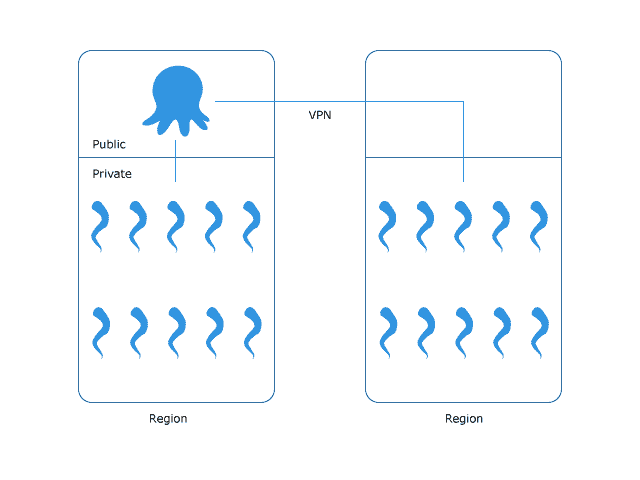

# 我们如何创建触手军队-章鱼部署

> 原文：<https://octopus.com/blog/how-we-create-the-tentacle-army>

作为一个独立的软件供应商，面临的挑战之一是在类似于您的客户正在使用的基础设施上使用您的软件。Octopus Deploy 安装在各种操作系统上，并部署在可以想象到的每种网络配置上，目标范围从单个触手到一千个触手怪物。我们典型的开发配置由一个服务器和驻留在同一台机器上的一个或两个触角组成。在这种配置下，一切都很好，直到章鱼被部署到野外，它才开始瓦解。

## 触手军团

触手部队是我们试图复制章鱼将运行的最苛刻的配置。在章鱼发布之前，我们发动了触手军团并试图打破发布。目前，触手军团由位于新加坡和巴西的 800 只触手组成，这两个地区因其区域间的高延迟而被选中。在这种配置中，我们有 40 台触手虚拟机，每台机器有 20 个触手实例。

## 供应触手部队

我们使用亚马逊 AWS 为触手军提供基础设施。一个配置文件指定了我们在测试环境中需要什么:

```
{
  "OctopusServerConfiguration" : {
      "Environments" : [ "Development", "Test", "Production" ],
        "InstanceType" : {
            "Value" : "m3.medium"
          },
      "NumberOfInstances" : 1,
      "Platform" : "OctopusServer",
      "PrimaryStorage" : 40,
      "Projects" : [ {
            "Name" : "Multi release project",
            "DeploymentSteps" : [ {
                  "Name" : "Deploy package",
                  "PackageId" : "100mb",
                  "PackageUrl" : "https://s3-ap-southeast-1.amazonaws.com/octopus-testing/100mb.1.0.0.nupkg.zip"
                } ],            
            "Releases" : [ {
                  "Environment" : "Development",
                  "RepeatAfterMinutes" : 10,
                  "RunAfterMinutes" : 5
                } ]
          }],
      "RegionEndpoint" : "ap-southeast-1",
      "ServerInstallerDownloadPath" : "http://download.octopusdeploy.com/octopus/Octopus.2.5.12.666-x64.msi",
      "ToolsInstallerDownloadPath" : "http://download.octopusdeploy.com/octopus-tools/2.5.10.39/OctopusTools.2.5.10.39.zip"
    },
  "TentacleConfiguration" : [ {
        "InstanceType" : {
            "Value" : "m3.medium"
          },
        "Mode" : "Listening",
        "NumberOfInstances" : 5,
        "NumberOfTentaclesPerInstance" : 5,
        "Platform" : "Server2012_R2",
        "PrimaryStorage" : 40,
        "RegionEndpoint" : "ap-southeast-1",
        "TentacleInstallerDownloadPath" : "http://octopusdeploy.com/downloads/latest/OctopusTentacle64"
      } ],
  "VPCConfiguration" : [ { 
        "RegionEndpoint" : "ap-southeast-1"
      } ]
} 
```

通过配置文件，我们可以指定:

*   该平台(我们测试了 2008 年 32 台服务器、2008 年 64 台服务器、2012 年 r 2 服务器)
*   章鱼服务器和触手的版本
*   触须的数量和它们的位置
*   环境、项目和自动部署
*   域控制器配置

该配置被提供给一个调用 AWS API 的应用程序，以提供所需的机器。一旦配置好机器，就可以通过 PowerShell 对它们进行设置。除了 Octopus 服务器和 tentacles，我们还提供 NAT，如果需要，还提供区域到区域 VPN。触手军队最终看起来像这样:



## 到无限和更远

触手军团帮助我们更好地与那些给章鱼施加压力的顾客建立联系。我们已经能够识别章鱼挣扎的区域，并通过我们的 UI 感受到管理大量触角的体验。随着更多的工作，我们将收集指标，以便我们可以对我们的发布进行基准测试，并验证我们在 Octopus 上继续做出的改进。我们还将提供触须军团作为服务，允许任何团队成员启动测试环境，并将触须军团集成到我们的自动化流程中。