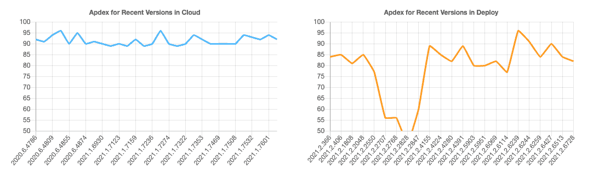
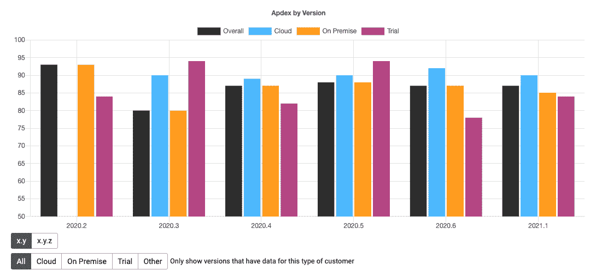
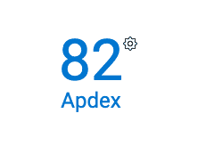
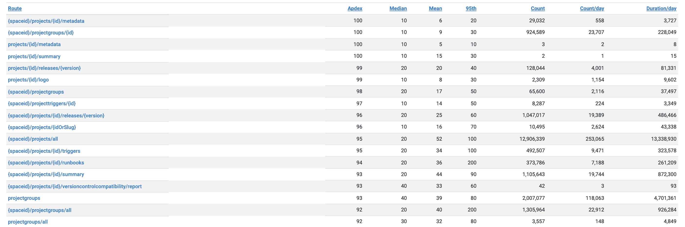
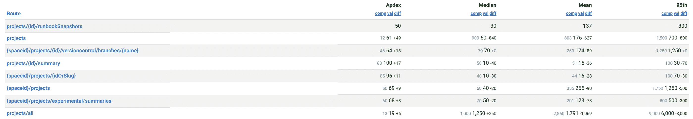
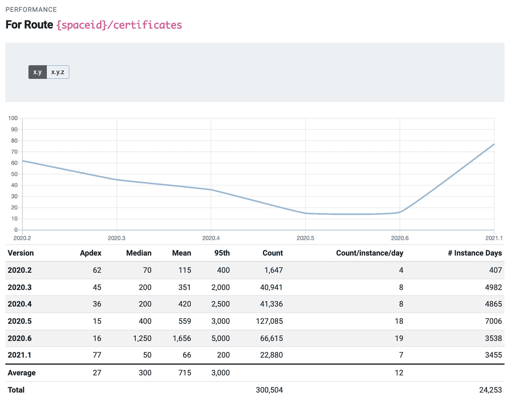

# 我们如何使用遥测技术来改善八达通部署-八达通部署

> 原文：<https://octopus.com/blog/how-we-use-telemetry-to-improve-octopus>

多年来，Octopus Deploy 已经发展到在应用程序中包含许多新功能和新领域。客户使用它们来查看仪表板、创建或部署版本、创作项目或针对其基础架构运行操作手册。为了更好地为客户服务，我们想知道体验的速度和响应速度。

像许多软件公司一样，我们收集遥测数据来衡量客户如何使用和体验产品。我们收集的一些遥测是 API 调用和数据库操作的计时，我们称之为性能遥测。我们在定制的工程仪表板上展示这种遥测技术，代号为“乌鸦之巢”。

乌鸦巢提供了用户体验产品的高层次概述。当客户想要访问一个页面或轮询一个端点时，就会触发一个 web 请求，而 Crow's Nest 会测量该请求需要多长时间。

我们还在多个版本中跟踪这些请求，以确保 Octopus Deploy 的响应能力不断提高。

## Apdex

我们计算一个 Apdex(应用性能指数)分数，该分数旨在将测量结果转化为关于用户满意度的见解。公式是:

```
Apdex = (SatisfiedCount + ToleratingCount * 0.5) / TotalCount 
```

Apdex 使用返回 2xx 响应的 API (web)请求。Apdex 排除了某些经常被调用并被缓存的请求。

*   在小于或等于 50 毫秒内返回的请求被视为在满足的阈值范围内。
*   大于 50 毫秒小于 200 毫秒的请求被认为是在可容忍的阈值范围内。

Apdex 给出了测试客户体验的统一尺度。数字越大，表示用户体验越好。我们可以改变阈值来试验给定的特定耐受性偏好的 Apdex 分数。

这篇文章中的例子显示了默认的阈值。这些可在应用程序中实时配置，以根据不同标准查看 Apdex 分数。

计算中仅包括具有 2xx 状态的 web 请求。2xx 状态表示 web 请求成功。对任何给定数据发送遥测数据的实例少于 50 个的版本会被过滤掉，以去除异常值。这些 web 请求的响应时间评估了客户对其服务的满意度。

## 可视化 Apdex 和 Octopus 部署

有几种方法可以可视化 Apdex。下图显示了我们如何使用 Crow's Nest 来显示 Apdex 并获得有价值的见解。

### 面向云和部署的 Apdex

蓝线表示 Octopus Cloud 和部署服务器中最近版本的 Apdex 性能。在此期间，云 Apdex 性能一直保持在 90 左右。部署服务器是内部 Octopus 实例，不会向客户发布。

橙色图表显示，自 2048 年 2 月 21 日起，Apdex 出现显著下降，在修正回归后，该指数于 2021 年 2 月 4155 日回升。

回顾一下不同的版本是如何影响用户体验的是很有帮助的。如果性能显著下降，我们可以进行根本原因分析来确定和解决原因。

[](#)

### 按版本和许可的 Apdex

我们可以比较不同版本和许可证的 Apdex 分数。许可证分为云、内部、试用和整体。这些数字有很大的可变性，因为它们代表了所有客户。

[](#)

### Apdex 总分

每个客户都有一个总体 Apdex 分数，它表示客户体验的响应度。

[](#)

### Apdex 路线

单个路线的性能在客户视图中。我们对网络请求进行计时，并根据路由对结果进行分组。从这些计时中，我们显示了平均值、中间值和第 95 百分位时间。

通过按路由存储请求，我们避免了传输大量数据。在以后的版本中，我们可以使用这些度量来识别性能最差的路由。

[](#)

#### Apdex 路线差异

我们可以使用乌鸦巢来查看不同版本之间的路线差异。项目路线在 2020.6 年和 2021.1 年之间有所改善，如 Apdex 得分的绿色差异指标所示。

[](#)

#### Apdex 路线视图

历史业绩在每条路线上都是可见的。这使我们可以看到路由的性能在每个版本中是如何变化的。

例如，上述证书路由的性能从 2020.2 下降到 2020.6。Apdex 评分从 62 分降至 16 分。

在 2021.1 中，我们确定了 Apdex 分数下降的原因并解决了该问题，使 Apdex 分数提高到 77 分。

[](#)

#### 未来的改进

乌鸦巢帮助我们计划下一步的工作。它突出了最需要注意的领域，应该首先解决。在监控我们的整体应用程序健康状况时，它也给了我们另一个信号。

## 结论

遥测技术是一种强大的工具，可以为企业提供完整的用户体验。

遥测和 Apdex 提供了每个用户和每条路线性能的全面可见性。我们可以比较不同版本和许可证的性能。比较版本可以量化每次更新的效果。表现不佳的路由在每个用户或整个 Octopus Deploy 平台上都是可见的。

我们的 Crow's Nest 工具有助于改善客户体验，带来更灵敏的交互和更愉快的部署。