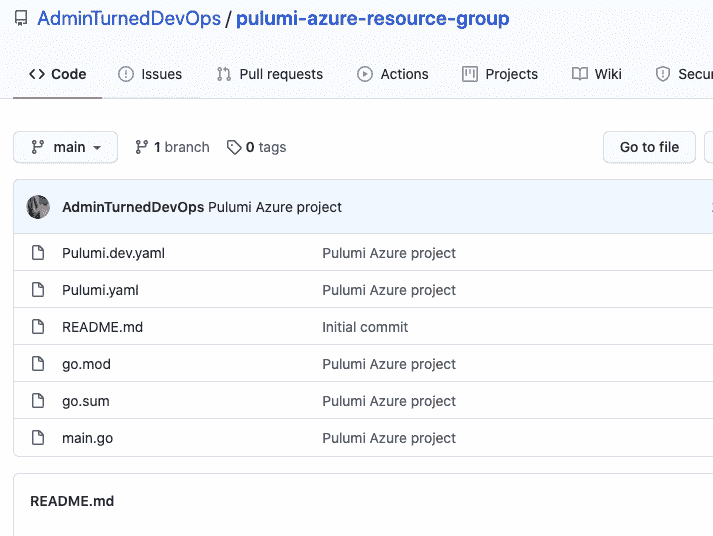
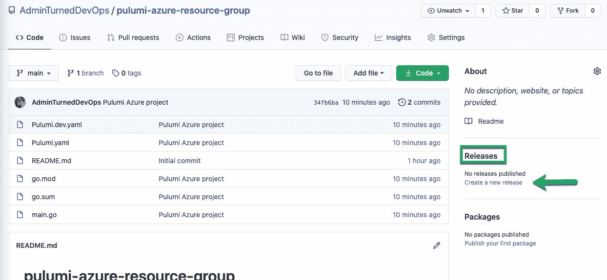

# 使用 Octopus Deploy 和 Pulumi 将基础设施作为代码:第二部分——Octopus Deploy

> 原文：<https://octopus.com/blog/iac-azure-octopus-pulumi-part-2>

在本系列关于使用 Pulumi 和 Octopus Deploy 进行基础设施开发的第一部分中，我向您展示了如何使用一个新项目配置 Pulumi，并使用 Pulumi SDK 编写代码，该 SDK 使用 Go 指定 Azure。

在这篇文章中，我将讨论部署，并向您展示如何用 Octopus Deploy 打包和部署第一部分中的 Go 代码。

## 使用 GitHub repo

有不同的场景可用于构建和打包应用程序:

*   构建服务器。
*   从藏物仓库里取出一个包裹。
*   拉上包裹的拉链。
*   加上很多其他的。

在这篇文章中，我们使用 GitHub，它涵盖了一个免费的通用场景。

### 创建 GitHub Repo

首先，创建一个新的 GitHub repo:

1.  登录[github.com](https://www.github.com)。
2.  在存储库下，单击**新建**。
3.  给存储库起一个名字，例如，我用了名字`pulumi-azure-resource-group`。
4.  因为这个存储库没有任何敏感信息，所以保留它`public`也没问题。
5.  点击**创建存储库**。

### 本地拉下回购，推送代码

1.  克隆 GitHub repo 并将您的 Pulumi 项目(来自[第一部分](/blog/iac-azure-octopus-pulumi-part-1))复制到您的本地 repo 中。
2.  提交并将代码推送到 GitHub repo。

### 创建一个版本

为了让 Octopus Deploy 从 GitHub 获取外部提要，GitHub repo 需要一个从 repo 内部代码构建的版本。

1.  在 GitHub repo 中，在**发布**下，点击**创建新发布**。

【T2 

2.  给版本一个名称和版本号。
3.  点击**发布发布**。这将创建一个版本。

## 为 Pulumi 配置 Octopus 项目

代码现在已经编写好了，被推送到 GitHub，并准备好打包使用 Octopus Deploy 进行部署。为此，创建一个新项目并使用 Pulumi 社区步骤模板。

### 创建外部源

1.  登入八达通网站。
2.  转到 **库➜外部进给** 。
3.  点击**添加进给**。
4.  对于**馈送类型**，选择 **GitHub 库馈送**。
5.  给它起名叫`Pulumi Azure Resource Group`。

您不必添加任何凭据，因为回购是公开的。

### 创建新项目和项目组

1.  导航到**项目**。
2.  点击**添加组**。
3.  将群组命名为`Pulumi`。
4.  在新组中，添加一个名为 **Golang-Pulumi** 的新项目。

### 创建项目变量

为了将 Pulumi 步骤模板部署到 Azure，它需要对 Azure 进行身份验证。通过使用类型为 **Azure Account** 的项目变量来实现这一点。

1.  导航到您创建的项目，在**变量**下，点击**项目**。
2.  创建一个新的帐户类型变量 **Azure Account** 。确保变量名为 **Azure** ，因为步骤模板在项目变量中搜索变量名为 **Azure** 的变量。
3.  选择有权部署资源的 Azure 帐户。
4.  保存变量。

### 添加部署包步骤

1.  从您的项目中选择**流程**并点击**添加步骤**。
2.  选择**包**，然后选择**部署包**。
3.  点击**配置功能**，选择**自定义安装目录**。
4.  取消勾选**。净配置变量**和**。网络配置转换**并点击**确定**。
5.  指定名称、目标角色和包详细信息。确保包细节指向 GitHub 提要和存储 Pulumi Azure 项目的 repo。
6.  对于自定义安装目录，选择 Pulumi Azure 代码将驻留的位置。这也是 Pulumi 步骤创建 Azure 资源组的地方。
7.  保存该步骤。

### 添加一个运行 Pulumi (Linux)步骤

1.  从您的项目中，选择**流程**并点击**添加步骤**。

2.  选择 **社区步骤➜ Pulumi ➜运行 Pulumi (Linux)** 并安装该步骤。

3.  指定名称和目标角色。

4.  为运行 Pulumi (Linux)步骤模板添加参数:

    *   **栈名**:Pulumi 中项目的全称，使用以下格式:`OrganizationName/ProjectName/StackName`。比如我的是`AdminTurnedDevOps/azure-go-new-resource-group/dev`。您可以在 Pulumi 门户中找到您的堆栈名称的信息。
    *   **创建堆栈**:您可以忽略此选项，因为堆栈已经存在。
    *   **命令**:普鲁米有几个命令，但是你只需要`pulumi up`。不必键入完整的命令，只需键入`up`。
    *   **命令参数**:命令参数`--yes`是必需的。例如，当您从命令行运行 Pulumi 时，有一个创建资源的选项。两个选项是`yes`或`no`。因为我们在步骤模板中没有这些弹出窗口，所以我们使用了`--yes`标志。
    *   **Pulumi 访问令牌**:这是一个 API 密钥，可以在 Pulumi 门户的设置下生成。
    *   **Pulumi 工作目录**:工作目录是您从 **Deploy a Package** 步骤复制代码的地方。
    *   **恢复依赖关系**:该步骤用于 NodeJS 恢复依赖关系。您没有使用 NodeJS，所以取消选中该框。
5.  完成后，保存该步骤。

## 部署代码

现在是时候创建一个新版本，并运行持续部署过程，使用 Pulumi 和 Octopus Deploy 创建一个新的 Azure 资源组。

1.  在 Octopus 项目中，点击**创建发布**。
2.  点击**保存**。
3.  通过点击**部署到**并选择环境，部署到您选择的环境。
4.  点击**展开**。

现在，您已经使用 Octopus Deploy 和 Pulumi 成功地创建了一个 Azure 资源组。

## 结论

将 Octopus Deploy 和 Pulumi 等工具结合起来，您可以从开始到结束自动执行整个工作流程，而无需手动流程。

## 观看网络研讨会

[https://www.youtube.com/embed/SA3-efF5PWk](https://www.youtube.com/embed/SA3-efF5PWk)

VIDEO

我们定期举办网络研讨会。请参见[网络研讨会第](https://octopus.com/events)页，了解以往网络研讨会的档案以及即将举办的网络研讨会的详细信息。

愉快的部署！