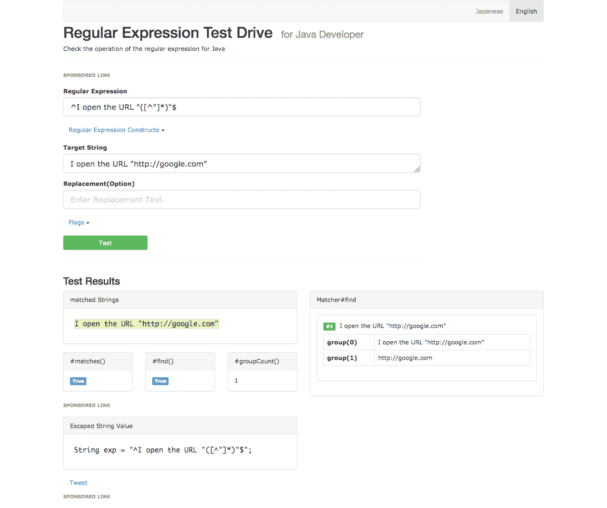
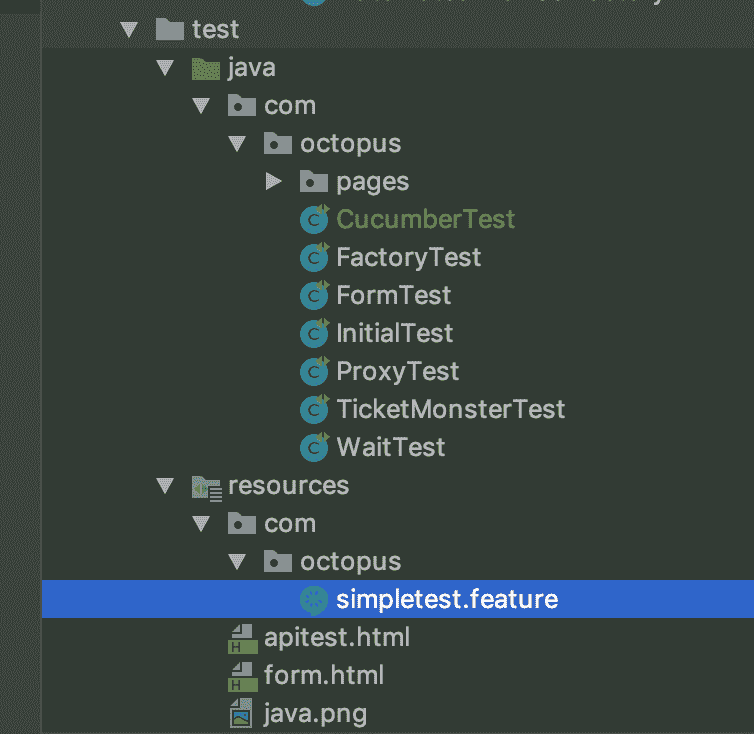
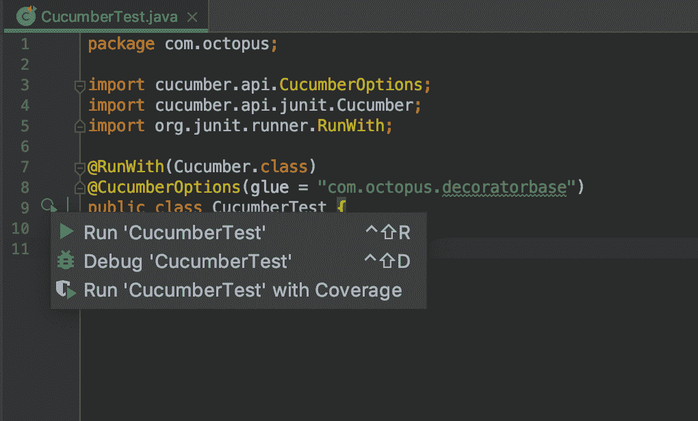
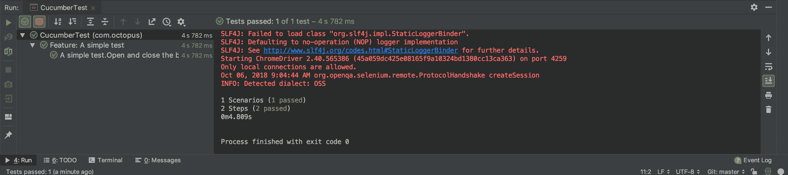

# Selenium 系列:实现黄瓜-章鱼部署

> 原文：<https://octopus.com/blog/selenium/25-implementing-cucumber/implementing-cucumber>

这篇文章是关于[创建 Selenium WebDriver 测试框架](/blog/selenium/0-toc/webdriver-toc)的系列文章的一部分。

到目前为止，我们所有的代码都是用 Java 编写的，并且我们实现了像页面对象模型这样的设计模式来增加代码的可读性和可维护性。

但是归根结底，这些代码仍然是用 Java 编写的，对设计、测试和维护 web 应用程序感兴趣的利益相关者中很少有人是 Java 专家。这意味着无论我们的代码有多干净和设计得多好，它都不是非开发人员能够阅读和理解的。

集成 Cucumber 库是让测试对非开发人员来说更容易理解的一种解决方案。我们可以使用 cumber 库作为 Java 代码和一种叫做 Gherkin 的语言之间的粘合剂，我们将在本文中这样做。

## 小黄瓜语言

小黄瓜语言被设计成提供一种描述需求、行为和与系统交互的自然语言。小黄瓜使用一个惯例，所有的步骤都以单词`Given`、`When`、`Then`和`And`开始。这方面的一个例子是步骤:

```
Given an employee named Bob making $12 per hour.
When Bob works 40 hours in one week;
Then Bob will be paid $480 on Friday evening. 
```

即使对小黄瓜语言没有任何特别的理解，这种风格也非常易读。

我们想利用这种能力用自然语言描述一个系统，并将其应用于 WebDriver 测试。这将允许我们编写如下测试:

```
Given I open the URL "https://ticket-monster.herokuapp.com"
When I click the "Buy tickets now" button
And I click the "Concert" link
And I click the "Rock concert of the decade" link
And I select the option "Toronto : Roy Thomson Hall" from the "Venues" drop-down list
And I click the "Book" button
And I select the option "A - Premier platinum reserve" from the "Sections" drop-down list
Then I verify the text from the "Adult Price" label equals "@ $167.75" 
```

这些步骤测试的场景与我们在 Java 中测试的场景非常相似。与 Java 代码不同，任何人都可以阅读这个测试并理解它的含义。更好的是，只需少量的培训，任何人都可以编写这些测试。

首先，我们需要添加两个依赖项:`cucumber-java`和`cucumber-junit`。`cucumber-java`库提供了许多注释，我们将使用它们将小黄瓜步骤链接到 Java 方法。`cucumber-junit`库允许我们执行小黄瓜特性和场景，作为 JUnit 测试的一部分。当我们开始编写测试时，我们将了解更多关于特性和场景的信息:

```
<project 
xmlns:xsi="http://www.w3.org/2001/XMLSchema-instance"
xsi:schemaLocation="http://maven.apache.org/POM/4.0.0
http://maven.apache.org/xsd/maven-4.0.0.xsd">
  <modelVersion>4.0.0</modelVersion>

  <!-- ... -->

  <properties>
    <!-- ... -->
    <cucumber.version>2.3.1</cucumber.version>
  </properties>

  <!-- ... -->

  <dependencies>
    <!-- ... -->
    <dependency>
      <groupId>io.cucumber</groupId>
      <artifactId>cucumber-java</artifactId>
      <version>${cucumber.version}</version>
    </dependency>
    <dependency>
      <groupId>io.cucumber</groupId>
      <artifactId>cucumber-junit</artifactId>
      <version>${cucumber.version}</version>
      <scope>test</scope>
    </dependency>
  </dependencies>
</project> 
```

Cucumber 的工作方式是给方法附加注释，将 Gherkin 步骤与正则表达式匹配，然后将这些正则表达式中的组与方法中的参数匹配。

这些注释被称为`@Given`、`@When`、`@And`和`@Then`。与小黄瓜语言本身一样，这些注释是可以互换的，并且不需要将注释与小黄瓜步骤中使用的相应前缀相匹配。

例如，我们可以用`@And`注释来注释一个打开给定 URL 的方法:

```
@And("^I open the URL \"([^\"]*)\"$")
public void goTo(String url) {

} 
```

但是然后在一个带有步骤前缀`Given`的小黄瓜步骤中引用它，就像这样:

```
Given I open the URL "http://google.com" 
```

让我们分解一下分配给注释的正则表达式。

| 模式 | 模式含义 |
| --- | --- |
| `^` | 匹配字符串的开头 |
| `I open the URL \"` | 匹配文字字符串`I open the URL "` |
| `(` | 启动捕获组 |
| `[^"]*` | 匹配除双引号以外的任何字符零次或多次 |
| `)` | 结束捕获组 |
| `\"` | 匹配文字字符串`"` |
| `$` | 匹配字符串的结尾 |

为了理解这些正则表达式，我们可以使用像 http://regex-testdrive.com/en/这样的在线工具。这里我们已经输入了正则表达式和一个我们想要匹配正则表达式的目标字符串。点击`Test`按钮，我们就会看到这场比赛的结果。

可以看到这个匹配返回了两个组。正则表达式中的 Group 0 总是返回匹配的完整字符串，在我们的例子中是完整的句子`I open the URL "http://google.com"`。组 1 只返回括号中的字符，在本例中是 URL[http://google.com](http://google.com)。

[](#)

这些正则表达式组就是 Cucumber 从字符串中提取数据并将其传递给相关方法的方式。在我们的例子中，该方法采用单个字符串参数。Cucumber 会将 group 1 的值传递给第一个参数。

所以我们的任务是将注释`@Given`、`@When`、`@And`和`@Then`添加到将执行一些有用工作的方法中。分配给注释的正则表达式定义了我们可以用来编写测试的小黄瓜方言。

在选择要应用这些注释的类时，有一些重要的考虑因素。

首先是注释必须放在具体的方法上。这意味着我们不能将注释应用于接口中定义的方法。

第二是注释所应用到的类不能被扩展。Cucumber 不支持带有注释的类的继承。

第三，当执行带有 Cucumber 注释的方法时，Cucumber 将管理包含该方法的类的生命周期。这意味着在创建类的新实例时，像`AutomatedBrowserFactory`这样的工厂将被绕过。

这让我们陷入了某种困境。考虑到这些限制，我们可以在哪里应用注释呢？

我们不能将注释放在`AutomatedBrowser`接口上，因为我们需要将注释添加到具体的类中。

乍一看，我们可能能够将注释放在`WebDriverDecorator`类上，因为这里定义了我们的大部分功能。然而，装饰器只有在特定的组合中构建时才有用。我们已经使用了`AutomatedBrowserFactory`类来为我们构建这些装饰器组合，但是因为 Cucumber 将控制带注释的类的生命周期，它将绕过`AutomatedBrowserFactory`使我们的装饰器变得无用。

唯一的另一个选项是`AutomatedBrowserBase`类，但是它已经被每个 decorator 类继承了，Cucumber 不支持它。

幸运的是，Cucumber 对用注释扩展类的限制有一个解决办法。你可能已经注意到，我们将`AutomatedBrowserBase`类单独放在它自己的包`com.octopus.decoratorbase`中。为一个单独的类准备一个包可能看起来很奇怪，但这是经过深思熟虑的。通过将包中的`AutomatedBrowserBase`类与所有扩展它的 decorator 类隔离开来，我们可以解决 Cucumber 的局限性。

为了了解这个变通方法是如何工作的，让我们从创建一个测试类开始，这个测试类使用了我们在`cucumber-junit` Maven 依赖项中包含的代码。

```
package com.octopus;

import cucumber.api.CucumberOptions;
import cucumber.api.junit.Cucumber;
import org.junit.runner.RunWith;

@RunWith(Cucumber.class)
@CucumberOptions(glue = "com.octopus.decoratorbase")
public class CucumberTest {

} 
```

这个测试类有两个注释，将它与 Cucumber 库集成在一起。

首先是`@RunWith`标注。这个 JUnit 注释接受一个类，可以用来修改测试的运行方式。在这种情况下，Cucumber 类修改测试，在与测试类相同的包中查找任何`*.feature`文件，并执行它们:

```
@RunWith(Cucumber.class) 
```

第二个标注是`@CucumberOptions`。这个注释用于定制 Cucumber 如何运行它找到的`*.feature`文件。这里我们已经将包`com.octopus.decoratorbase`作为包含“glue”类的包进行了传递。Glue 类只是带有注释`@Given`、`@When`、`@And`或`@Then`的类。

Cucumber 将对这个包中的类以及任何子包进行分类。在这个包里面和下面的 Glue 类不能互相扩展。

这意味着因为`AutomatedBrowserBase`类是这个包中找到的唯一的类，Cucumber 确信不存在非法的类层次结构。`com.octopus.decorators`包下的所有装饰器类都扩展了`AutomatedBrowserBase`类，这没关系，因为 Cucumber 不知道这些装饰器类。

因此，通过将`AutomatedBrowserBase`类隔离在它自己的包中，我们可以将它用作黄瓜胶类:

```
@CucumberOptions(glue = "com.octopus.decoratorbase") 
```

除了这两个注释，`CucumberTest`类应该是空的。与传统的 JUnit 测试类不同，在传统的 JUnit 测试类中，测试是在方法中定义的，所有 Cucumber 测试都是在外部`*.feature`文件中定义的。

因为`AutomatedBrowserBase`类中的方法是小黄瓜测试执行测试的唯一方式，我们需要公开一些方法来创建和销毁`AutomatedBrowser`实例。通常我们会在 JUnit 测试中执行这个逻辑，在测试开始时调用`AutomatedBrowserFactory.getAutomatedBrowser()`，在测试结束时调用`automatedBrowser.destroy()`。为了向 Cucumber 公开这个功能，我们创建了方法`openBrowser()`和`closeBrowser()`:

```
public class AutomatedBrowserBase implements AutomatedBrowser {

  static private final AutomatedBrowserFactory AUTOMATED_BROWSER_FACTORY
    = new AutomatedBrowserFactory();

  // ...

  @Given("^I open the browser \"([^\"]*)\"$")
  public void openBrowser(String browser) {
    automatedBrowser =
      AUTOMATED_BROWSER_FACTORY.getAutomatedBrowser(browser);
    automatedBrowser.init();
  }

  @Given("^I close the browser$")
  public void closeBrowser() {
    if (automatedBrowser != null) {
      automatedBrowser.destroy();
      automatedBrowser = null;
  }
}

// ...

} 
```

让我们更详细地看看这两种方法:

```
@Given("^I open the browser \"([^\"]*)\"$") 
```

附加到`openBrowser()`方法的注释`@Given("^I open the browser \"([^\"]*)\"$")`的工作方式与前面的`@And("^I open the URL \"([^\"]*)\"$")`示例相同。注释`@Given`和`@And`可以互换。通常`@Given`用在执行某种初始化或管理功能的方法上，但这只是惯例而不是规则。

分配给`@Given`注释的正则表达式遵循相同的模式，使用脱字符(`^`)和美元(`$`)字符来结束表达式，字符串`I open the browser`的文字匹配，以及引号内的非贪婪捕获组。

然后捕获组的值被传递给名为`browser`的参数:

```
public void openBrowser(String browser) { 
```

从这一点来看，该方法的工作方式与其他任何方法一样。在这种情况下，我们调用`AutomatedBrowserFactory.getAutomatedBrowser()`来构建指定的`AutomatedBrowser`配置，然后调用`init()`函数来初始化它:

```
automatedBrowser = AUTOMATED_BROWSER_FACTORY.getAutomatedBrowser(browser);
automatedBrowser.init(); 
```

附加到`closeBrowser()`方法的注释`@Given("^I close the browser$")`没有捕获组，这意味着它所附加的方法没有参数。这里的正则表达式只能匹配文字字符串`I close the browser`:

```
@Given("^I close the browser$")
public void closeBrowser() { 
```

这个方法负责在由`openBrowser()`方法创建的`AutomatedBrowser`实例上调用`destroy()`方法:

```
 if (automatedBrowser != null) {
    automatedBrowser.destroy();
    automatedBrowser = null;
  }
} 
```

我们现在有足够的证据来进行一个非常简单的黄瓜测试。在`src/test/resources/com/octopus`目录下创建以下名为`simpletest.feature`的文件。

默认情况下，目录`src/test/resources/com/octopus`是 Maven 为`com.octopus`包放置资源的地方。记住，我们需要将这个文件放在与测试类相同的包中，这样才能找到它。文件名可以是我们想要的任何东西，但是它必须有被 Cucumber 识别的`.feature`扩展名。

[](#)

```
Feature: A simple test
  Scenario: Open and close the browser
    Given I open the browser "ChromeNoImplicitWait"
    Then I close the browser 
```

让我们把这个文件分解一下。

所有小黄瓜特征文件都以一个`Feature:`部分开始。功能是一组相关的场景:

```
Feature: A simple test 
```

接下来我们有了`Scenario:`。场景类似于传统单元测试类中的方法，因为它是自包含的，并且演示了被测试系统的某些方面:

```
Scenario: Open and close the browser 
```

最后，我们有在`AutomatedBrowserBase`类中定义的两个步骤。

请注意，这里使用的步骤前缀与注释的名称并不完全匹配。虽然如果这些步骤与注释名匹配就好了，但这不是必需的。

还要注意，我们定义的正则表达式并没有捕捉到单词`Given`、`When`、`Then`或`And`，尽管完整的步骤总是以这样的单词开始。我们定义的正则表达式从匹配这个初始单词之后的步骤的内容开始:

```
Given I open the browser "ChromeNoImplicitWait"
Then I close the browser 
```

要运行测试，点击测试类旁边的图标并选择`Run 'CucumberTest'`。

[](#)

运行测试将找到`simpletest.feature`文件并执行它。该功能文件将依次打开 Chrome，然后立即关闭它。在测试结果中，我们可以看到我们成功地运行了 1 个场景，导致了 2 个步骤的运行。

[](#)

我们现在已经为创建一种小黄瓜方言奠定了基础，这种方言将允许我们编写可以使用 WebDriver 验证的自然语言测试。然而，要创建端到端测试，我们还有很多工作要做。在下一篇文章中，我们将向 Cucumber 展示更多的`AutomatedBrowser`类，并努力创建一个可读的端到端测试。

这篇文章是关于[创建 Selenium WebDriver 测试框架](/blog/selenium/0-toc/webdriver-toc)的系列文章的一部分。