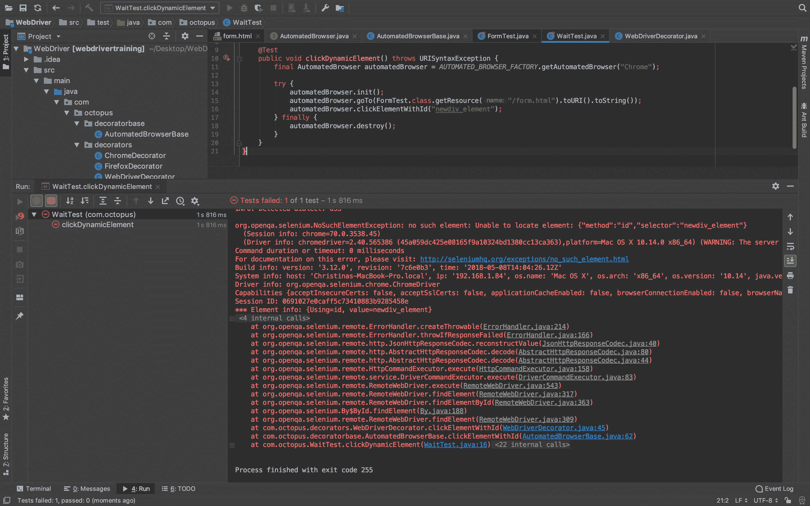
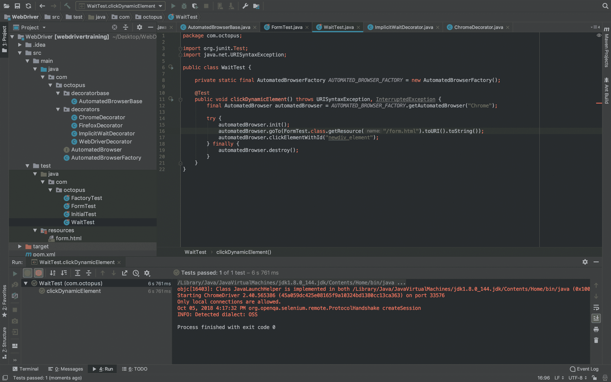
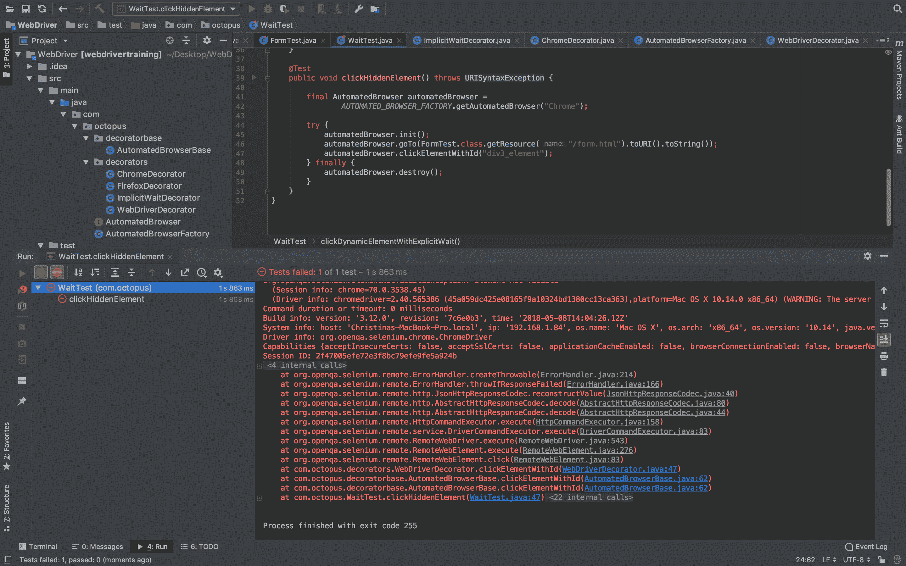

# Selenium 系列:隐式和显式等待- Octopus 部署

> 原文：<https://octopus.com/blog/selenium/7-implicit-and-explicit-waits/implicit-and-explicit-waits>

这篇文章是关于[创建 Selenium WebDriver 测试框架](/blog/selenium/0-toc/webdriver-toc)的系列文章的一部分。

在我们的测试网页中，我们有一个`setTimeout()`方法调用，它在 5 秒钟后创建了一个 ID 为`newdiv_element`的新的`<div>`。这种动态更新在现代 web 开发中很常见，并且广泛用于使用 React 和 Angular 等库编写的单页面应用程序(spa)。

然而，这些动态元素在编写测试时提出了挑战。让我们创建一个新的测试，尝试点击这个动态元素:

```
package com.octopus;

import org.junit.Test;
import java.net.URISyntaxException;

public class WaitTest {
  private static final AutomatedBrowserFactory AUTOMATED_BROWSER_FACTORY = new AutomatedBrowserFactory();

  @Test
  public void clickDynamicElement() throws URISyntaxException {
    final AutomatedBrowser automatedBrowser = AUTOMATED_BROWSER_FACTORY.getAutomatedBrowser("Chrome");

    try {
      automatedBrowser.init();
      automatedBrowser.goTo(FormTest.class.getResource("/form.html").toURI().toString());
      automatedBrowser.clickElementWithId("newdiv_element");
    } finally {
      automatedBrowser.destroy();
    }
  }
} 
```

运行该测试将导致如下异常:

```
org.openqa.selenium.NoSuchElementException: no such element: Unable to
locate element: {"method":"id","selector":"newdiv_element"} 
```

[](#)

这个例外并不奇怪。我们的测试试图点击一个 5 秒内不会被创建的元素。

我们可以在测试中自己等待几秒钟。通过在尝试单击元素之前添加代码`Thread.sleep(6000);`，我们可以确保元素是可用的:

```
package com.octopus;

import org.junit.Test;
import java.net.URISyntaxException;

public class WaitTest {

  private static final AutomatedBrowserFactory AUTOMATED_BROWSER_FACTORY = new AutomatedBrowserFactory();

  @Test
  public void clickDynamicElement() throws URISyntaxException, InterruptedException {
    final AutomatedBrowser automatedBrowser = AUTOMATED_BROWSER_FACTORY.getAutomatedBrowser("Chrome");

    try {
      automatedBrowser.init();
      automatedBrowser.goTo(FormTest.class.getResource("/form.html").toURI().toString());
      Thread.sleep(6000);
      automatedBrowser.clickElementWithId("newdiv_element");
    } finally {
      automatedBrowser.destroy();
    }
  }
} 
```

虽然这个测试会通过，但它不是一个可靠的解决方案。

在我们的测试网页中，我们可以知道元素将在 5 秒后出现，因为对`setTimeout()`的调用非常清楚地在 5 秒后创建了元素。然而，现实世界中的 web 应用程序不太可能以这种可预测的方式创建测试需要与之交互的元素。最有可能的是，元素将被创建以响应 API 调用、页面导航或其他处理，并且我们的测试代码没有办法知道这些事件将花费多长时间。

幸运的是，WebDriver 提供了两种等待动态元素可用的方法:隐式等待和显式等待。

隐式等待是两者中比较简单的。使用隐式等待，我们定义了一个全局时间量来等待我们的测试与之交互的元素出现在网页中。

我们可以用一个名为`ImplicitWaitDecorator`的新装饰器实现隐式等待，它将调用`manage().timeouts().implicitlyWait()`:

```
package com.octopus.decorators;

import com.octopus.AutomatedBrowser;
import com.octopus.decoratorbase.AutomatedBrowserBase;
import java.util.concurrent.TimeUnit;

public class ImplicitWaitDecorator extends AutomatedBrowserBase {

  private final int waitTime;

  public ImplicitWaitDecorator(final int waitTime, final AutomatedBrowser automatedBrowser) {

  super(automatedBrowser);
    this.waitTime = waitTime;
  }

  @Override
  public void init() {
    getAutomatedBrowser()
      .getWebDriver()
      .manage()
      .timeouts()
      .implicitlyWait(waitTime, TimeUnit.SECONDS);

    getAutomatedBrowser().init();
  }
} 
```

然后，我们可以通过编辑`AutomatedBrowserFactory`类来利用这个装饰器:

```
private AutomatedBrowser getChromeBrowser() {
  return new ChromeDecorator(
    new ImplicitWaitDecorator(10,
      new WebDriverDecorator()
      )
    );
} 
```

配置好隐式等待时间后，我们可以运行原始测试(即没有`Thread.sleep()`的测试)，它将会通过。这是因为 WebDriver 将等待 10 秒钟，等待我们搜索的任何元素出现在网页中。这给了我们在 5 秒钟后创建的动态元素足够的时间出现在页面上。

[](#)

显式等待是 WebDriver 提供的第二种等待元素可用的方法。与应用于我们试图在页面中找到的任何元素的隐式等待不同，显式等待可以用于逐个元素的情况。

为了利用显式等待，我们向`AutomatedBrowser`接口添加了一个新方法，该方法将等待元素的时间量作为参数:

```
void clickElementWithId(String id, int waitTime); 
```

一个默认方法被添加到`AutomatedBrowserBase`类中:

```
@Override
public void clickElementWithId(final String id, final int waitTime) {
  if (getAutomatedBrowser() != null) {
    getAutomatedBrowser().clickElementWithId(id, waitTime);
  }
} 
```

然后在`WebDriverDecorator`类中定义该方法:

```
@Override
public void clickElementWithId(final String id, final int waitTime) {
  if (waitTime <= 0) {
    clickElementWithId(id);
  } else {
    final WebDriverWait wait = new WebDriverWait(webDriver, waitTime);
    wait.until(ExpectedConditions.elementToBeClickable((By.id(id)))).click();
  }
} 
```

显式等待分为三个部分。

我们首先定义我们希望等待一个元素的时间。这是通过创建一个`WebDriverWait`类的实例来实现的:

```
final WebDriverWait wait = new WebDriverWait(webDriver, waitTime); 
```

然后我们在产生的`WebDriverWait`实例上调用`until()`方法。

最后，我们使用`ExpectedCondition`类上的一个静态方法来指示我们正在搜索的元素在返回给我们之前必须处于什么状态。

因为我们试图点击元素，所以我们希望确保元素是可点击的。这是通过调用`ExpectedConditions.elementToBeClickable()`方法来完成的:

```
wait.until(ExpectedConditions.elementToBeClickable((By.id(id)))).click(); 
```

这段代码的最终结果是，我们通过 ID 查找的元素只有在指定的持续时间内处于可点击状态时才会被点击。

为了测试显式等待，我们创建了一个新的测试，它使用了新的`clickElementWithId()`方法:

```
@Test
public void clickDynamicElementWithExplicitWait() throws URISyntaxException {
  final AutomatedBrowser automatedBrowser =
    AUTOMATED_BROWSER_FACTORY.getAutomatedBrowser("Chrome");

  try {
    automatedBrowser.init();
    automatedBrowser.goTo(FormTest.class.getResource("/form.html").toURI().toString());
    automatedBrowser.clickElementWithId("newdiv_element", 10);

  } finally {
    automatedBrowser.destroy();
  }
} 
```

和以前一样，测试将等待动态元素被创建，然后单击它，测试将通过。

但是你可能会问，为什么有人会费心使用显式等待呢？它们需要更多的代码来实现，那么显式等待比隐式等待有什么好处呢？

为了演示为什么显式等待是有用的，让我们尝试单击 ID 为`div3_element`的 div。如果您回头看看示例 web 页面的源代码，您会看到这个元素被`style="display: none"`隐藏了，并且在对`setTimeout()`的调用中没有被隐藏。

虽然对于查看页面的人来说，隐藏的元素和根本不存在的元素没有什么区别，但是这种区别对于我们的测试非常重要。

让我们创建一个依赖于隐式等待来单击隐藏元素的测试:

```
@Test
public void clickHiddenElement() throws URISyntaxException {

  final AutomatedBrowser automatedBrowser =
    AUTOMATED_BROWSER_FACTORY.getAutomatedBrowser("Chrome");

  try {
  automatedBrowser.init();
  automatedBrowser.goTo(FormTest.class.getResource("/form.html").toURI().toString());
  automatedBrowser.clickElementWithId("div3_element");
  } finally {
    automatedBrowser.destroy();
  }
} 
```

运行该测试将引发异常:

```
org.openqa.selenium.ElementNotVisibleException: element not visible 
```

[](#)

我们得到这个异常是因为隐式等待立即返回了`<div>`,因为它出现在网页上。隐式等待不考虑元素是否被禁用或隐藏。如果元素在页面上可用，则隐式等待被满足，测试继续。或者，在我们的例子中，失败了，因为你不能点击一个不可见的元素。

将此行为与使用显式等待测试进行比较:

```
@Test
public void clickHiddenElementWithExplicitWait() throws URISyntaxException {
  final AutomatedBrowser automatedBrowser =
    AUTOMATED_BROWSER_FACTORY.getAutomatedBrowser("Chrome");

  try {
    automatedBrowser.init();
    automatedBrowser.goTo(FormTest.class.getResource("/form.html").toURI().toString());
    automatedBrowser.clickElementWithId("div3_element", 10);
  } finally {
    automatedBrowser.destroy();
  }
} 
```

这个测试成功了，因为在继续测试之前，我们明确地等待目标元素处于一个非常特定的状态(一个可点击的状态)。因为我们在等待元素是可点击的，而不仅仅是出现在页面上，所以测试按预期进行。

显式等待允许我们在尝试与元素交互之前定义元素的期望状态，从而提供了更高级别的控制。隐式等待要普遍得多，只等待元素出现在页面上。

实际上，显式等待允许我们编写更加健壮的测试。最初还需要做一些工作来支持显式等待，但是在用利用显式等待的方法填充了`WebDriverDecorator`类之后，它们就很容易使用了。

让我们看看如何重载`WebDriverDecorator`中的方法来利用显式等待。

从下拉列表中选择一个选项，等待`<select>`元素被点击:

```
@Override
public void selectOptionByTextFromSelectWithId(final String optionText, final String id, final int waitTime) {
  if (waitTime <= 0) {
    selectOptionByTextFromSelectWithId(id, optionText);
  } else {
    final WebDriverWait wait = new WebDriverWait(webDriver, waitTime);
    new Select(wait.until(ExpectedConditions.elementToBeClickable((By.id(id))))).selectByVisibleText(optionText);
  }
} 
```

同样，我们在试图填充像`<textarea>`这样的元素之前，等待它们变成可点击的:

```
@Override
public void populateElementWithId(final String id, final String text, final int waitTime) {
  if (waitTime <= 0) {
    populateElementWithId(id, text);
  } else {
    final WebDriverWait wait = new WebDriverWait(webDriver, waitTime);
    wait.until(ExpectedConditions.elementToBeClickable((By.id(id)))).sendKeys(text);
  }
} 
```

当从一个元素返回文本时，它只需要出现在页面上，所以我们调用`ExpectedConditions.presenceOfElementLocated()`:

```
@Override
public String getTextFromElementWithId(final String id, final int waitTime) {
  if (waitTime <= 0) {
    return getTextFromElementWithId(id);
  } else {
    final WebDriverWait wait = new WebDriverWait(webDriver, waitTime);

    return
    wait.until(ExpectedConditions.presenceOfElementLocated((By.id(id)))).getText();
  }
} 
```

使用 XPaths 和 CSS 选择器查找元素的方法重复了相同的模式。我们不会逐一查看所有这些方法，但是您可以在下面的填充类和接口的副本中看到它们。

下面是为显式等待定义的所有方法的`AutomatedBrowser`接口:

```
package com.octopus;

import org.openqa.selenium.WebDriver;

public interface AutomatedBrowser {

  WebDriver getWebDriver();

  void setWebDriver(WebDriver webDriver);

  void init();

  void destroy();

  void goTo(String url);

  void clickElementWithId(String id);

  void clickElementWithId(String id, int waitTime);

  void selectOptionByTextFromSelectWithId(String optionText, String id);

  void selectOptionByTextFromSelectWithId(String optionText, String id, int waitTime);

  void populateElementWithId(String id, String text);

  void populateElementWithId(String id, String text, int waitTime);

  String getTextFromElementWithId(String id);

  String getTextFromElementWithId(String id, int waitTime);

  void clickElementWithXPath(String xpath);

  void clickElementWithXPath(String xpath, int waitTime);

  void selectOptionByTextFromSelectWithXPath(String optionText, String xpath);

  void selectOptionByTextFromSelectWithXPath(String optionText, String xpath, int waitTime);

  void populateElementWithXPath(String xpath, String text);

  void populateElementWithXPath(String xpath, String text, int waitTime);

  String getTextFromElementWithXPath(String xpath);

  String getTextFromElementWithXPath(String xpath, int waitTime);

  void clickElementWithCSSSelector(String cssSelector);

  void clickElementWithCSSSelector(String cssSelector, int waitTime);

  void selectOptionByTextFromSelectWithCSSSelector(String optionText, String cssSelector);

  void selectOptionByTextFromSelectWithCSSSelector(String optionText, String cssSelector, int waitTime);

  void populateElementWithCSSSelector(String cssSelector, String text);

  void populateElementWithCSSSelector(String cssSelector, String text, int waitTime);

  String getTextFromElementWithCSSSelector(String cssSelector);

  String getTextFromElementWithCSSSelector(String cssSelector, int waitTime);
} 
```

下面是新方法的默认实现的`AutomatedBrowserBase`类:

```
package com.octopus.decoratorbase;

import com.octopus.AutomatedBrowser;
import org.openqa.selenium.WebDriver;

public class AutomatedBrowserBase implements AutomatedBrowser {
    private AutomatedBrowser automatedBrowser;

    public AutomatedBrowserBase() {
    }

    public AutomatedBrowserBase(final AutomatedBrowser automatedBrowser) {
        this.automatedBrowser = automatedBrowser;
    }

    public AutomatedBrowser getAutomatedBrowser() {
        return automatedBrowser;
    }

    @Override
    public WebDriver getWebDriver() {
        if (getAutomatedBrowser() != null) {
            return getAutomatedBrowser().getWebDriver();
        }
        return null;
    }

    @Override
    public void setWebDriver(final WebDriver webDriver) {
        if (getAutomatedBrowser() != null) {
            getAutomatedBrowser().setWebDriver(webDriver);
        }
    }

    @Override
    public void init() {
        if (getAutomatedBrowser() != null) {
            getAutomatedBrowser().init();
        }
    }

    @Override
    public void destroy() {
        if (getAutomatedBrowser() != null) {
            getAutomatedBrowser().destroy();
        }
    }

    @Override
    public void goTo(String url) {
        if (getAutomatedBrowser() != null) {
            getAutomatedBrowser().goTo(url);
        }
    }

    @Override
    public void clickElementWithId(final String id) {
        if (getAutomatedBrowser() != null) {
            getAutomatedBrowser().clickElementWithId(id);
        }
    }

    @Override
    public void clickElementWithId(final String id, final int waitTime) {
        if (getAutomatedBrowser() != null) {
            getAutomatedBrowser().clickElementWithId(id, waitTime);
        }
    }

    @Override
    public void selectOptionByTextFromSelectWithId(final String optionText, final String id) {
        if (getAutomatedBrowser() != null) {
            getAutomatedBrowser().selectOptionByTextFromSelectWithId(optionText, id);
        }
    }

    @Override
    public void selectOptionByTextFromSelectWithId(final String optionText, final String id, final int waitTime) {
        if (getAutomatedBrowser() != null) {
            getAutomatedBrowser().selectOptionByTextFromSelectWithId(optionText, id, waitTime);
        }
    }

    @Override
    public void populateElementWithId(final String id, final String text) {
        if (getAutomatedBrowser() != null) {
            getAutomatedBrowser().populateElementWithId(id, text);
        }
    }

    @Override
    public void populateElementWithId(final String id, final String text, final int waitTime) {
        if (getAutomatedBrowser() != null) {
            getAutomatedBrowser().populateElementWithId(id, text, waitTime);
        }
    }

    @Override
    public String getTextFromElementWithId(final String id) {
        if (getAutomatedBrowser() != null) {
            return getAutomatedBrowser().getTextFromElementWithId(id);
        }
        return null;
    }

    @Override
    public String getTextFromElementWithId(final String id, final int waitTime) {
        if (getAutomatedBrowser() != null) {
            return getAutomatedBrowser().getTextFromElementWithId(id, waitTime);
        }
        return null;
    }

    @Override
    public void clickElementWithXPath(final String xpath) {
        if (getAutomatedBrowser() != null) {
            getAutomatedBrowser().clickElementWithXPath(xpath);
        }
    }

    @Override
    public void clickElementWithXPath(final String xpath, final int waitTime) {
        if (getAutomatedBrowser() != null) {
            getAutomatedBrowser().clickElementWithXPath(xpath, waitTime);
        }
    }

    @Override
    public void selectOptionByTextFromSelectWithXPath(final String optionText, final String xpath) {
        if (getAutomatedBrowser() != null) {
            getAutomatedBrowser().selectOptionByTextFromSelectWithXPath(optionText, xpath);
        }
    }

    @Override
    public void selectOptionByTextFromSelectWithXPath(final String optionText, final String xpath, final int waitTime) {
        if (getAutomatedBrowser() != null) {
            getAutomatedBrowser().selectOptionByTextFromSelectWithXPath(optionText, xpath, waitTime);
        }
    }

    @Override
    public void populateElementWithXPath(final String xpath, final String
            text) {
        if (getAutomatedBrowser() != null) {
            getAutomatedBrowser().populateElementWithXPath(xpath, text);
        }
    }

    @Override
    public void populateElementWithXPath(final String xpath, final String text, final int waitTime) {
        if (getAutomatedBrowser() != null) {
            getAutomatedBrowser().populateElementWithXPath(xpath, text, waitTime);
        }
    }

    @Override
    public String getTextFromElementWithXPath(final String xpath) {
        if (getAutomatedBrowser() != null) {
            return getAutomatedBrowser().getTextFromElementWithXPath(xpath);
        }
        return null;
    }

    @Override
    public String getTextFromElementWithXPath(final String xpath, final int waitTime) {
        if (getAutomatedBrowser() != null) {
            return getAutomatedBrowser().getTextFromElementWithXPath(xpath,
                    waitTime);
        }
        return null;
    }

    @Override
    public void clickElementWithCSSSelector(final String cssSelector) {
        if (getAutomatedBrowser() != null) {
            getAutomatedBrowser().clickElementWithCSSSelector(cssSelector);
        }
    }

    @Override
    public void clickElementWithCSSSelector(final String cssSelector, final
    int waitTime) {
        if (getAutomatedBrowser() != null) {
            getAutomatedBrowser().clickElementWithCSSSelector(cssSelector, waitTime);
        }
    }

    @Override
    public void selectOptionByTextFromSelectWithCSSSelector(final String optionText, final String cssSelector) {
        if (getAutomatedBrowser() != null) {
            getAutomatedBrowser().selectOptionByTextFromSelectWithCSSSelector(optionText,
                    cssSelector);
        }
    }

    @Override
    public void selectOptionByTextFromSelectWithCSSSelector(final String optionText, final String cssSelector, final int waitTime) {
        if (getAutomatedBrowser() != null) {
            getAutomatedBrowser().selectOptionByTextFromSelectWithCSSSelector(optionText,
                    cssSelector, waitTime);
        }
    }

    @Override
    public void populateElementWithCSSSelector(final String cssSelector, final String text) {
        if (getAutomatedBrowser() != null) {
            getAutomatedBrowser().populateElementWithCSSSelector(cssSelector, text);
        }
    }

    @Override
    public void populateElementWithCSSSelector(final String cssSelector, final String text, final int waitTime) {
        if (getAutomatedBrowser() != null) {
            getAutomatedBrowser().populateElementWithCSSSelector(cssSelector, text, waitTime);
        }
    }

    @Override
    public String getTextFromElementWithCSSSelector(final String cssSelector) {
        if (getAutomatedBrowser() != null) {
            return getAutomatedBrowser().getTextFromElementWithCSSSelector(cssSelector);
        }
        return null;
    }

    @Override
    public String getTextFromElementWithCSSSelector(final String cssSelector, final int waitTime) {
        if (getAutomatedBrowser() != null) {
            return getAutomatedBrowser().getTextFromElementWithCSSSelector(cssSelector, waitTime);
        }
        return null;
    }
} 
```

下面是带有 XPath 和 CSS 选择器方法的显式等待实现的`WebDriverDecorator`类:

```
package com.octopus.decorators;

import com.octopus.decoratorbase.AutomatedBrowserBase;
import org.openqa.selenium.By;
import org.openqa.selenium.WebDriver;
import org.openqa.selenium.support.ui.ExpectedConditions;
import org.openqa.selenium.support.ui.Select;
import org.openqa.selenium.support.ui.WebDriverWait;

public class WebDriverDecorator extends AutomatedBrowserBase {
    private WebDriver webDriver;

    public WebDriverDecorator() {
    }

    @Override
    public WebDriver getWebDriver() {
        return webDriver;
    }

    @Override
    public void setWebDriver(final WebDriver webDriver) {
        this.webDriver = webDriver;
    }

    @Override
    public void destroy() {
        if (webDriver != null) {
            webDriver.quit();
        }
    }

    @Override
    public void goTo(final String url) {
        webDriver.get(url);
    }

    @Override
    public void clickElementWithId(final String id) {
        webDriver.findElement(By.id(id)).click();
    }

    @Override
    public void clickElementWithId(final String id, final int waitTime) {
        if (waitTime <= 0) {
            clickElementWithId(id);
        } else {
            final WebDriverWait wait = new WebDriverWait(webDriver, waitTime);
            wait.until(ExpectedConditions.elementToBeClickable((By.id(id)))).click();
        }
    }

    @Override
    public void selectOptionByTextFromSelectWithId(final String optionText, final String selectId) {
        new Select(webDriver.findElement(By.id(selectId))).selectByVisibleText(optionText);
    }

    @Override
    public void selectOptionByTextFromSelectWithId(final String optionText, final String id, final int waitTime) {
        if (waitTime <= 0) {
            selectOptionByTextFromSelectWithId(id, optionText);
        } else {
            final WebDriverWait wait = new WebDriverWait(webDriver, waitTime);
            new Select(wait.until(ExpectedConditions.elementToBeClickable((By.id(id))))).selectByVisibleText(optionText);
        }
    }

    @Override
    public void populateElementWithId(final String id, final String text) {
        webDriver.findElement(By.id(id)).sendKeys(text);
    }

    @Override
    public void populateElementWithId(final String id, final String text,
                                      final int waitTime) {
        if (waitTime <= 0) {
            populateElementWithId(id, text);
        } else {
            final WebDriverWait wait = new WebDriverWait(webDriver, waitTime);
            wait.until(ExpectedConditions.elementToBeClickable((By.id(id)))).sendKeys(text);
        }
    }

    @Override
    public String getTextFromElementWithId(final String id) {
        return webDriver.findElement(By.id(id)).getText();
    }

    @Override
    public String getTextFromElementWithId(final String id, final int
            waitTime) {
        if (waitTime <= 0) {
            return getTextFromElementWithId(id);
        } else {
            final WebDriverWait wait = new WebDriverWait(webDriver, waitTime);
            return wait.until(ExpectedConditions.presenceOfElementLocated((By.id(id)))).getText();
        }
    }

    @Override
    public void clickElementWithXPath(final String xpath) {
        webDriver.findElement(By.xpath(xpath)).click();
    }

    @Override
    public void clickElementWithXPath(final String xpath, final int waitTime) {
        if (waitTime <= 0) {
            clickElementWithXPath(xpath);
        } else {
            final WebDriverWait wait = new WebDriverWait(webDriver, waitTime);
            wait.until(ExpectedConditions.elementToBeClickable((By.xpath(xpath)))).click();
        }
    }

    @Override
    public void selectOptionByTextFromSelectWithXPath(final String optionText, final String xpath) {
        new Select(webDriver.findElement(By.xpath(xpath))).selectByVisibleText(optionText);
    }

    @Override
    public void selectOptionByTextFromSelectWithXPath(final String
                                                              optionText, final String xpath, final int waitTime) {
        if (waitTime <= 0) {
            selectOptionByTextFromSelectWithXPath(xpath, optionText);
        } else {
            final WebDriverWait wait = new WebDriverWait(webDriver, waitTime);
            new Select(wait.until(ExpectedConditions.elementToBeClickable((By.xpath(xpath))))).selectByVisibleText(optionText);
        }
    }

    @Override
    public void populateElementWithXPath(final String xpath, final String
            text) {
        webDriver.findElement(By.xpath(xpath)).sendKeys(text);
    }

    @Override
    public void populateElementWithXPath(final String xpath, final String
            text, final int waitTime) {
        if (waitTime <= 0) {
            populateElementWithXPath(xpath, text);
        } else {
            final WebDriverWait wait = new WebDriverWait(webDriver, waitTime);
            wait.until(ExpectedConditions.elementToBeClickable((By.xpath(xpath)))).sendKeys(text);
        }
    }

    @Override
    public String getTextFromElementWithXPath(final String xpath) {
        return webDriver.findElement(By.xpath(xpath)).getText();
    }

    @Override
    public String getTextFromElementWithXPath(final String xpath, final int
            waitTime) {
        if (waitTime <= 0) {
            return getTextFromElementWithXPath(xpath);
        } else {
            final WebDriverWait wait = new WebDriverWait(webDriver, waitTime);
            return wait.until(ExpectedConditions.presenceOfElementLocated((By.xpath(xpath)))).getText();
        }
    }

    @Override
    public void clickElementWithCSSSelector(final String cssSelector) {
        webDriver.findElement(By.cssSelector(cssSelector)).click();
    }

    @Override
    public void clickElementWithCSSSelector(String css, final int waitTime) {
        if (waitTime <= 0) {
            clickElementWithCSSSelector(css);
        } else {
            final WebDriverWait wait = new WebDriverWait(webDriver, waitTime);
            wait.until(ExpectedConditions.elementToBeClickable((By.cssSelector(css)))).click();
        }
    }

    @Override
    public void selectOptionByTextFromSelectWithCSSSelector(final String optionText, final String cssSelector) {
        new
                Select(webDriver.findElement(By.cssSelector(cssSelector))).selectByVisibleText(optionText);
    }

    @Override
    public void selectOptionByTextFromSelectWithCSSSelector(final String optionText, final String css, final int waitTime) {
        if (waitTime <= 0) {
            selectOptionByTextFromSelectWithCSSSelector(css, optionText);
        } else {
            final WebDriverWait wait = new WebDriverWait(webDriver, waitTime);
            new Select(wait.until(ExpectedConditions.elementToBeClickable((By.cssSelector(css))))).selectByVisibleText(optionText);
        }
    }

    @Override
    public void populateElementWithCSSSelector(final String cssSelector,
                                               final String text) {
        webDriver.findElement(By.cssSelector(cssSelector)).sendKeys(text);
    }

    @Override
    public void populateElementWithCSSSelector(String css, final String text, final int waitTime) {
        if (waitTime <= 0) {
            populateElementWithCSSSelector(css, text);
        } else {
            final WebDriverWait wait = new WebDriverWait(webDriver, waitTime);
            wait.until(ExpectedConditions.elementToBeClickable((By.cssSelector(css)))).sendKeys(text);
        }
    }

    @Override
    public String getTextFromElementWithCSSSelector(final String cssSelector) {
        return webDriver.findElement(By.cssSelector(cssSelector)).getText();
    }

    @Override
    public String getTextFromElementWithCSSSelector(String css, final int waitTime) {
        if (waitTime <= 0) {
            return getTextFromElementWithCSSSelector(css);
        } else {
            final WebDriverWait wait = new WebDriverWait(webDriver, waitTime);
            return wait.until(ExpectedConditions.presenceOfElementLocated((By.cssSelector(css)))).getText();
        }
    }
} 
```

既然我们已经看到了隐式和显式等待是如何工作的，那么理解同时使用它们的一些意想不到的后果是很重要的。在下一篇文章中，我们将了解隐式和显式等待混合时的一些意外行为。

这篇文章是关于[创建 Selenium WebDriver 测试框架](/blog/selenium/0-toc/webdriver-toc)的系列文章的一部分。