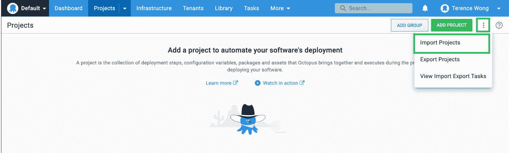
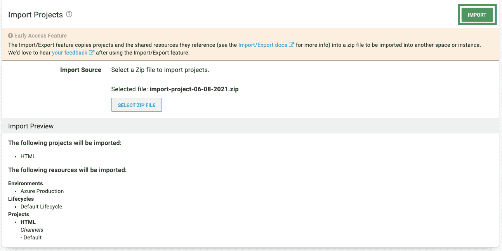
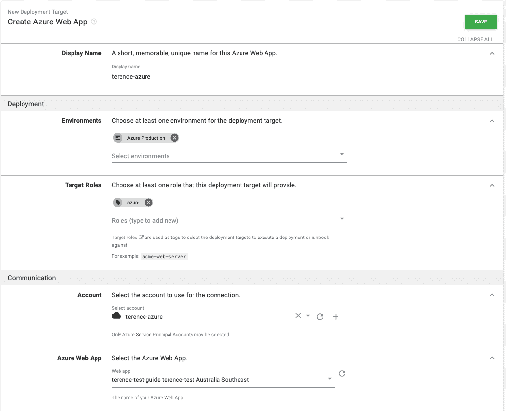

# 导入和部署您的第一个 Octopus 项目- Octopus Deploy

> 原文：<https://octopus.com/blog/importing-deploying-your-first-octopus-project>

设置您的第一个部署可能具有挑战性。有新的系统需要学习，有多种配置需要调整。

在这篇文章中，我将指导您使用 Octopus Deploy 完成第一次部署。

为了简化这个过程，我配置了一个项目，将一个示例应用程序部署到一个 Azure web 应用程序。

使用 Octopus 2021.1 中引入的[导出/导入特性](https://octopus.com/blog/exporting-projects)，我导出了一个 Octopus 项目，并向您展示了如何导入和部署这个项目。

部署后，应用程序将对您可见，并可与您的同事共享。

## 正在设置

这篇文章的惟一先决条件是运行 Octopus Deploy 实例，要么在 Octopus Cloud 中，要么在自托管 Octopus 服务器中。

我将带您通过五个步骤在 Octopus 中部署 web 应用程序:

1.  导入现有项目
2.  配置 Azure 帐户
3.  上传我提供的包
4.  添加您的部署目标
5.  部署到 Azure web 应用程序

如果您还没有设置 Octopus 部署实例，现在需要通过选择以下选项之一来设置:

准备好 Octopus 实例后，第一步是导入一个现有的项目。

## 导入现有项目

导出/导入功能可以将一个或多个项目导出到 zip 文件中，然后可以将其导入到其他空间中。目标空间可以在不同的 Octopus 服务器实例中，甚至可以在自托管和 Octopus 云实例之间移动。

从**项目**页面上的溢出菜单可以访问**导出/导入特性**。

您需要将以下项目导入您的 Octopus 实例:

在 Octopus Web Portal 中，导航到**项目**，然后**导入项目**，点击**选择 zip 文件**，上传项目 ZIP。点击**导入**完成。

这个项目的密码是`html`。

导入项目意味着您不必手动配置项目的环境或部署步骤。这只是一个小项目，但有些项目很大，包括复杂的部署步骤，因此导入项目比重新创建项目容易得多。使用导出/导入功能可以确保您的环境和部署步骤跨空间保持不变。

恭喜您，您成功导入了该项目！

在部署 web 应用程序之前，还有一些其他项目需要配置。导出和导入项目不会捕获项目的部署目标或所需的包。部署目标需要新实例上的新连接。由于包的文件可能很大，因此它们被排除在导出的项目之外。

## 配置 Azure 帐户

您需要配置一个 Azure 帐户和 web 应用程序作为 Octopus 部署的目标。其他目标也是可能的，比如 AWS，或者 Linux 和 Windows 服务器。

通过导航到 [Azure 门户](https://portal.azure.com/)在 Azure 中创建一个帐户。

### 使用 Azure 门户创建 Azure 服务主体

[https://www.youtube.com/embed/QDwDi17Dkfs](https://www.youtube.com/embed/QDwDi17Dkfs)

VIDEO

1.  在 Azure 门户中，打开左上方的菜单，导航到 **Azure Active Directory** ，然后是**属性**。
2.  从**租户 ID** 字段中复制值。这是你的**租户 ID** 。
3.  接下来，您需要您的**应用程序 ID** :
    *   如果你创建了一个 AAD 注册的应用，导航到 **Azure Active Directory** ，然后选择**应用注册**，点击**查看所有应用**，选择应用并复制**应用 ID** 。请注意，Azure UI 默认为**自有应用**标签。点击**所有应用**选项卡查看所有应用注册。
    *   如果您还没有创建注册的应用程序，请导航到 **Azure Active Directory** ，然后选择**应用程序注册**，点击**新注册**并为您的应用程序添加详细信息，然后点击**保存**。记下**应用 ID** 。
4.  通过导航到**证书&机密**，然后导航到**新客户端机密**，生成一次性密码。添加新的**秘密**，输入描述，点击**保存**。记下显示的应用程序密码，以便在 Octopus 中使用。如果您不想接受默认的密码一年到期，您可以更改到期日期。

您现在拥有以下内容:

*   **租户 ID**
*   **应用程序 ID**
*   **应用程序密码/秘密**

接下来，您需要配置您的资源权限。

### 资源权限

资源权限确保您注册的应用程序有权使用您的 Azure 资源。

1.  在 Azure 门户中，导航到**资源组**，并选择您希望注册的应用程序访问的资源组。如果资源组不存在，通过转到**主页**创建一个，然后转到**资源组**，然后选择**创建**。创建之后，记下资源组的 Azure 订阅 ID。
2.  点击**访问控制(IAM)** 选项。在**角色分配**下，如果您的应用未列出，请点击**添加角色分配**。选择适当的角色(**贡献者**是一个常见选项)并搜索您的新应用程序名称。从搜索结果中选择它，然后点击**保存**。

下一步是建立一个 Azure web 应用程序并配置其属性。

### Web 应用程序设置

1.  在您的**资源组**中点击**创建**，然后点击 **Web App**
2.  在**运行时栈**和**操作系统**下创建一个 Windows 节点应用
3.  记下你的 Azure 应用名称，因为这将是你的 web 应用的地址:[your-site].azurewebsites.net
4.  设置 web 应用程序后，通过导航到**配置**，然后**路径映射**，然后**虚拟应用程序和目录**，将 web 应用程序的路径默认路由到主路径
5.  将物理路径设置为`site\wwwroot\guide`并将虚拟路径设置为`/`

### 在八达通上加入服务主账户

使用以下值，您可以将您的帐户添加到 Octopus:

*   应用程序 ID
*   租户 ID
*   应用程序密码/密钥

1.  导航至**基础设施**，然后选择**账户**
2.  选择**添加账号**，然后点击 **Azure 订阅**
3.  在 Octopus 中给帐户起一个你想要的名字
4.  给账户一个描述
5.  添加您的 Azure 订阅 ID -这可以在 Azure 门户网站的**订阅**下找到
6.  添加**应用 ID** 、**租户 ID** 和**应用密码/关键字**

点击**保存并测试**以确认帐户可以与 Azure 交互。Octopus 将尝试使用帐户凭据来访问 Azure 资源管理(ARM) API，并列出该订阅中的资源组。

您可能需要将您针对的 Azure 数据中心的 IP 地址列入安全列表。请参见[通过防火墙部署到 Azure](https://octopus.com/docs/deployments/azure/deploying-to-azure-via-a-firewall)了解更多详细信息。

新创建的服务主体可能需要几分钟才能通过凭据测试。如果您已经仔细检查了您的凭据值，请等待 15 分钟，然后重试。

现在你已经在 Azure 和 Octopus 中设置了 Azure 帐户，你上传了 Azure 的包。

## 上传现有包

您正在部署的 web 应用程序需要一些代码来部署。Octopus 通过包将这些代码提供给部署目标。

包是将部署到目标的代码。在这种情况下，它将是您的 web 应用程序可以显示的可部署教程。

这个包系统可以方便地交换或更新包，以便以后重新部署。以下是您将用于部署 Octopus Deploy 的包:

您可以手动将软件包上传到 Octopus web 门户中的 Octopus 内置存储库。

1.  导航至**库**选项卡
2.  点击**上传包**
3.  选择想要上传的包，点击**上传**

在下一步中，您将设置应用程序将被部署到的部署目标。

## 添加部署目标

1.  转到**基础设施**，然后选择**部署目标**
2.  选择一个 Azure Web 应用
3.  输入一个**显示名称**
4.  填写**环境**和**目标角色**
5.  选择之前创建的 Azure 帐户和 web 应用
6.  点击**保存**

## 部署到 Azure web 应用程序

您可以在导入项目、设置 Azure 帐户、设置部署目标并上传包之后部署应用程序。

*   转到**项目**，然后选择 **HTML** ，然后点击 **CREATE RELEASE** 并逐步将 web 应用从 Azure 生产环境部署到 Azure。

请转到[your-site].azurewebsites.net 检查您的应用程序，在那里您将看到以下页面:

[T31](#)

## 结论

干得好！您已经获得了一个现有的项目，并通过 Octopus Deploy 将一个包部署到一个 Azure web 应用程序。您可以与您的团队分享，教他们如何导入和部署他们的第一个 Octopus 项目。

如果您需要部署方面的帮助或有任何问题，请联系我们位于[customersuccess@octopus.com](mailto:customersuccess@octopus.com)的客户成功团队。

愉快的部署！