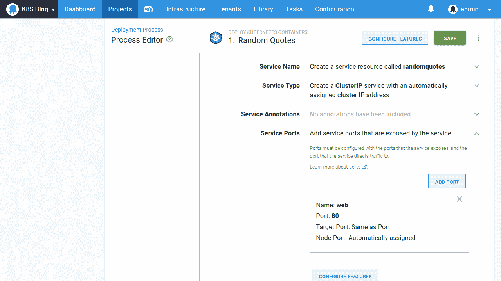

# 在 Octopus - Octopus Deploy 中导入 Kubernetes YAML

> 原文：<https://octopus.com/blog/importing-kubernetes-yaml-in-octopus>

[](#)

如果您在 Octopus 之外使用 Kubernetes 已经有一段时间了，那么您可能已经有了 YAML 资源定义。由于 Octopus 2020.2 中引入的新功能，将此 YAML 迁移到 Octopus 很容易，这为您提供了导入、导出和编辑原始 YAML 的两全其美的能力，同时让您的 Kubernetes 资源由 Octopus 以自以为是的方式进行管理。

在这篇博文中，我将向您展示如何将现有的 YAML 定义迁移到 Octopus 部署中。

## 样本 YAML

下面是 YAML，它定义了一个部署资源和一个服务来公开 Docker 映像包含的 web 应用程序:

```
apiVersion: apps/v1
kind: Deployment
metadata:
  name: randomquotes
spec:
  selector:
    matchLabels:
      app: randomquotes
  replicas: 1
  strategy:
    type: RollingUpdate
  template:
    metadata:
      labels:
        app: randomquotes
    spec:
      containers:
        - name: randomquotes
          image: mcasperson/mywebapp:0.1.7
          ports:
            - name: web
              containerPort: 80
---
apiVersion: v1
kind: Service
metadata:
  name: randomquotes
spec:
  selector:
    app: randomquotes
  ports:
    - name: web
      port: 80 
```

Kubernetes 中的一个常见模式是让服务公开一个部署，然后潜在地让 web 流量通过入口指向它。上面的 YAML 是部署和服务模式的一个简单例子。

Octopus 中的 Kubernetes 步骤提供了一种在单个步骤中捕获这种模式的方法，抽象出了一些将这些资源链接在一起的管道。让我们把我们的原始 YAML，并用它来建立一个章鱼的步骤。

## 创建章鱼步骤

我们将使用**部署 Kubernetes 容器**步骤来定义上面 YAML 中的部署和服务。该步骤是部署与可选服务、入口、秘密和配置映射的自以为是的组合，并处理将所有内容链接在一起所需的管道:

[](#)

因为我们不部署入口、机密或配置映射，所以我们可以从该步骤中删除这些功能。这简化了用户界面，使我们能够专注于正在创建的资源:

[](#)

**编辑 YAML** 部分是 Octopus 2020.2 中的新增功能，它允许将该步骤创建的 Kubernetes 资源编辑为 YAML:

【T2 

点击**编辑 YAML** 按钮显示该步骤中当前设置的 YAML 表示。因为我们刚刚添加了步骤，所以显示的值只是默认值或占位符:

[](#)

我们可以用上面示例中的部署 YAML 覆盖这些值:

[](#)

然后在表单中填充部署属性和容器定义。请注意，映像版本(或标记)已被删除，因为在创建部署时应该选择它:

[](#)

然后我们可以为服务重复这个过程，它有自己的**编辑 YAML** 部分:

[](#)

保存详细信息后，将使用服务属性和端口填充服务:

[](#)

需要注意的一点是，服务标签没有被导入，因为它们没有被步骤公开。这一步的观点之一是所有资源(在我们的例子中是部署和服务)共享部署上定义的标签。通过 Octopus 自动添加的附加标签，在部署时将服务和部署联系起来，使我们无需在服务上维护选择器标签:

[](#)

## 出口 YAML

在前面的部分中，我们使用了**编辑 YAML** 部分来导入我们现有的 YAML。这进而用我们现有资源定义的细节填充了该步骤。

现在该步骤已经填充完毕，可以使用**编辑 YAML** 部分来导出 YAML。单击部署或服务部分中的**编辑 YAML** 按钮，将在表单中显示作为标准 YAML 资源的详细信息。值得注意的是，输出的 YAML 与之前粘贴的并不完全相同。一些名为`octopusexport`的默认标签已被添加到部署和 pod 规范中，以将两者链接在一起:

[](#)

同样，服务 YAML 还包括一些默认标签，用于将服务链接到 pod:

[](#)

但是，除了资源如何相互引用的一些小变化之外，生成的 YAML 保留了最初导入的 YAML 的所有重要细节。这使得在固执己见的 Octopus 步骤中复制 Kubernetes YAML 定义变得很容易，或者如果您发现这比通过 UI 编辑值更容易，就简单地就地编辑 YAML。

## YAML 进口的局限性

需要注意的是，该步骤将仅导入其认可的 YAML 值。如果您的部署 YAML 包含一个无法识别的字段，它将被忽略。此功能不提供将未识别的值与 UI 公开的值合并的方法。

如果您有无法识别的值，您可以利用**部署原始 Kubernetes YAML** 步骤，该步骤将按原样将 YAML 部署到 Kubernetes，并且将仅基于[章鱼变量语法](https://octopus.com/docs/projects/variables/variable-substitutions)执行变量替换。

但是，如果您发现自己遇到了固执己见步骤的限制，复制并粘贴它生成的 YAML 是一种简单的方法，可以转到原始的 YAML 步骤。

## 结论

很容易找到 Kubernetes 资源，比如与服务、入口、秘密和配置图相结合的部署。Octopus 通过**部署 Kubernetes 容器**步骤捕获了这种资源组合。

如果您已经有了现有的 Kubernetes YAML，那么**部署 Kubernetes 容器**步骤允许您通过将 YAML 复制并粘贴到**编辑 YAML** 部分来快速填充其值。

**部署 Kubernetes 容器**步骤不会(也永远不会)暴露底层 Kubernetes 资源可用的每一个可能的值，如果您发现自己已经超越了这个固执己见的步骤，那么**编辑 YAML** 部分提供了一个快速的方法来提取该步骤产生的 YAML，用于一般步骤，如**部署原始 Kubernetes YAML** 。