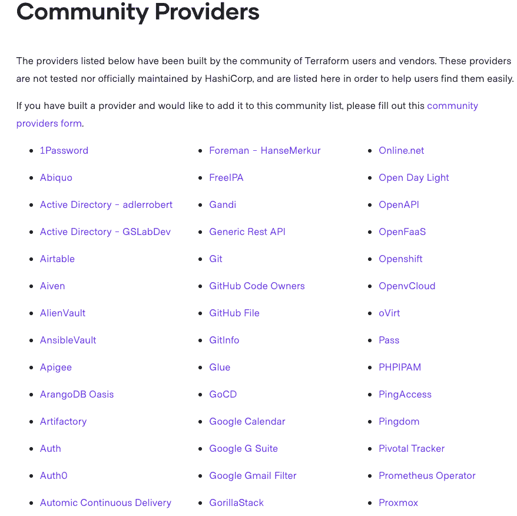
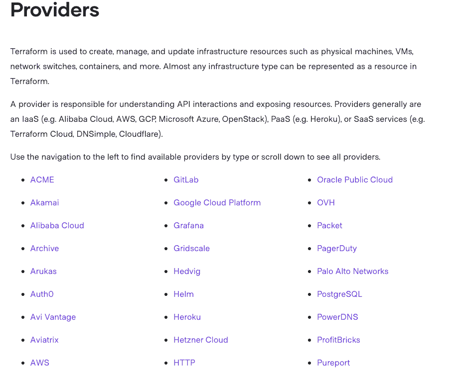

# 基础设施作为代码与开发人员的平台-八达通部署

> 原文：<https://octopus.com/blog/infrastructure-as-code-with-terraform-for-developers>

[](#)

当你认为基础设施是代码或软件定义的基础设施时，通常首先想到的是 *DevOps* 或*基础设施团队*，但 Terraform 并非如此。Terraform 是用 Hashicorp 配置语言( [HCL](https://github.com/hashicorp/hcl) )编写的，这是一种功能齐全且不可变的编程语言。

循环、if 语句、变量以及任何编程语言中的大部分逻辑都存在于 Terraform 中。Terraform 是一款适合所有人的*产品*,非常适合基础设施、开发团队和开发人员。在这篇博文中，你将了解基础设施作为代码对开发者有用的五大原因。

## 先决条件

要跟进这篇博文，您应该具备以下条件:

*   对发展主题的理解。
*   至少用一种编程语言编写过代码。

## 面向开发人员的基础设施

不久前，也许是 10-15 年前，开发和运营之间还存在一些问题。开发人员会编写代码，但他们没有任何基础设施来测试它。甚至有这样的情况，他们不得不等待*个月*来测试他们的代码，不知道它是否实际工作(在某些情况下，它没有)。这有几个原因:

1.  基础设施不可用。
2.  开发人员不知道如何部署基础设施。
3.  没有开发人员可以与之交互来部署基础架构的自动化解决方案。

让我们看一下每个要点，看看问题是从哪里开始的，以及它们是如何被发现的。

1.  基础设施不可用。

这有点困难。基础设施根本不可用。正如我们今天所知，虚拟化刚刚起步，云技术还处于起步阶段。开发人员只需等待运营部门准备好基础设施，在大多数情况下，这不是运营部门的错。服务器必须交付、安装和堆叠、配置，然后最终交付使用。这没有给开发留下太多的回旋余地。幸运的是，那个时代已经离我们很远了，我们现在有像 Azure、AWS 这样的平台和像 [ESXi](https://www.vmware.com/products/esxi-and-esx.html) 这样的虚拟化工具。

2.  开发人员不知道如何部署基础设施。

这就是开发人员开始深入基础设施的能力开始成为现实的地方。虚拟化和云技术已经存在，因此部署基础架构要高效得多。这里唯一的问题是仍然没有一个说开发者语言的*解决方案。开发人员如何以他们理解并适合他们优势的方式部署基础设施？*

3.  没有开发人员可以与之交互来部署基础架构的自动化解决方案。

这就是像 Terraform 这样的工具发挥作用的地方。既然基础设施作为代码和软件定义的基础设施存在，开发人员部署测试环境来帮助他们测试代码就容易多了。

[](#)

来源:[https://unsplash.com/photos/vXInUOv1n84](https://unsplash.com/photos/vXInUOv1n84)

所有的工程师，包括开发人员，都有一种方法来定义对他们有意义的基础设施，那就是用代码。

## 一种可重复的语言

开发人员已经有足够多的代码需要担心。他们正在为应用程序、错误修复、功能请求和清理技术债务构建解决方案。有了 Terraform，开发者就不用担心创建数百个基础设施作为代码环境。相反，他们可以使用相同的代码来部署多个环境。

例如，假设您与多个客户合作。也许你有多个 Azure 订阅或 AWS 账户，这取决于你使用的是什么云。如果你必须在 Azure 上为每个客户端部署容器，比如每个客户端十个，那么你必须为每个客户端编写大量代码。代替这样做，你可以有相同的可重复的代码并且简单地改变变量，这些变量存在于一个单独的文件中。

让我们看一个例子。

下面的代码创建了一个 Azure 容器实例，这是一种在 Azure 中运行 Docker 容器而不使用 Kubernetes 的方法。不要太在意语法，相反，看看那个`var.`关键词。通过使用变量，您可以为每个客户端创建一个变量文件，并在任何 Azure 环境中使用相同的配置。Terraform 背后的理念是尽可能地重复，并且只对不会改变的值进行硬编码:

```
resource "azurerm_container_group" "example" {
  name                = "var.name"
  location            = var.location
  resource_group_name = var.resourceGroup
  ip_address_type     = "public"
  os_type             = "Linux"

  container {
    name   = "nginx-web-app"
    image  = "Nginx:latest"
    cpu    = "0.5"
    memory = "1.5"

    ports {
      port     = 443
      protocol = "TCP"
    }
  } 
```

## 自动化测试

当你写代码时，首先应该想到的是如何测试代码。事实上，有一种开发实践叫做测试驱动开发( [TTD](http://agiledata.org/essays/tdd.html) )，它围绕着这样一个事实:首先编写代码测试，然后根据测试为应用程序定义代码。

在写这篇文章的时候，Terraform 有两个主要的工具来编写测试:

*   地形测试
*   厨房-平台

Terratest 是一个用 Golang 编写的模拟测试框架。因为是用 Go 写的，所以需要懂一点 Go 才能用。

我个人不在 Go 中写代码，但是我得到了一个不错的 Terratest 测试。网上有很多例子，如果你以前用另一种编程语言写过，同样的规则也适用于 Go(方法、函数、库、变量等等)。).

下面是一个 Terratest 示例，它创建了一个 Terraform 环境，然后像标准模拟测试一样删除它。这个包名为`test`，它导入了两个库，Terratest Terraform 模块和`testing` Golang 库。然后，该函数启动并创建(应用)一个地形环境，然后销毁它。`defer`用于运行最后那段代码:

```
package test

import (
  "github.com/gruntwork-io/terratest/modules/terraform"
  "testing"
)

func vnet_test(t *testing.T) {

    terraformOptions := &terraform.Options{
    }

    defer terraform.Destroy(t, terraformOptions)

    terraform.InitAndApply(t, terraformOptions)

} 
```

Kitchen-terraform 是一个用 Ruby 编写的框架。最初，厨房测试套件主要用于 Chef，Chef 是作为代码语言的另一个基础设施，但后来扩展到了其他工具。因为 Ruby 是一种相当流行的编程语言，也是被认为更容易使用的编程语言之一，所以 kitchen-terraform 越来越受欢迎。

下面是一个使用厨房平台的例子。代码通过`/etc/os-release`来确认 Linux 发行版是 Ubuntu:

```
control "operating_system" do
  describe "the operating system" do
    subject do
      command("cat /etc/os-release").stdout
    end

    it "is Ubuntu" do
      is_expected.to match /Ubuntu/
    end
  end
end 
```

## Terraform 供应商开发计划

使用 Terraform 是一回事，但许多开发人员希望创建自己的使用 Terraform 的方式。例如，在其他编程语言中，您可能想要创建自己的模块供工作或社区使用。通过 Terraform 供应商开发计划，Terraform 让您能够做到这一点。该计划允许供应商建立 Terraform 提供商，当提供商建立后，HashiCorp 将亲自测试它，验证它，并将其放在官方提供商网站上。

如果你不想走官方路线，让 Terraform 测试提供者，也有基于社区的 Terraform 提供者，它们是开源的，对全世界开放。这是一个伟大的方式，不仅可以回馈社区，还可以建立自己的艺术作品。

下面是社区提供者的一个小列表。如您所见，从 DNS 到密码认证再到 git，有几个提供者:

[](#)

来源:[https://www . terraform . io/docs/providers/type/community-index . html](https://www.terraform.io/docs/providers/type/community-index.html)

说到官方提供商，你会看到 Azure、AWS、VMWare 等平台的提供商:

[](#)

来源:[https://www.terraform.io/docs/providers/index.html](https://www.terraform.io/docs/providers/index.html)

## 开发人员和运营人员使用相同的语言

既然你已经了解了 Terraform 的一些关键技术方面，那么让我们来谈谈文化方面。任何组织中的文化都是成功的关键。不管代码有多好，应用程序有多受欢迎，或者办公室里的小吃有多棒。如果文化不起作用，整个事情都会崩溃。对于一个应用程序来说，它需要一个托管的地方。对于托管应用程序的操作，他们需要托管应用程序。本质上，开发者和运营需要协同工作。

将基础架构编写为代码和软件定义的基础架构为开发人员和运营人员提供了一种交流方式。基础设施是基础设施，代码是代码。不管它在创建或托管什么是一回事，但基础设施和代码的存在是事实。要做到这两点，像 Terraform 这样的解决方案是前进的道路。

从文化角度来看，另一件大事是运营和开发团队中的每个人都可以学到一些新东西。如果运营团队不是大程序员，他们可以学习编码，这是他们的另一个工具。不仅仅是学习，他们还和开发人员一起工作，并向他们提问。这使纽带更加紧密。同样的规则也适用于将基础设施作为代码编写的开发人员。如果他们试图部署带有代码的虚拟机，而他们不了解网络的某些方面，他们需要坐下来与运营团队合作。

## 结论

在这篇文章中，我谈到了:

*   为什么 Terraform 从技术角度和文化角度对开发者很重要。
*   面向开发人员的基础设施，以及为什么它可以用于不同的阶段，包括部署。
*   HCL 是可重复的，以及如何在任何环境中使用相同的配置。
*   通过实现单元测试和模拟测试来测试 Terraform。
*   不同的平台提供商不仅可以使用，而且可以由社区为社区创造。

为了挑战，尝试一下吧！编写一些 Terraform 代码，在您选择的云平台中创建一个容器。然后使用 Octopus Deploy 或您喜欢的 CICD 平台之一将应用程序部署到容器中。

## 资源

[Terratest 示例](https://github.com/AdminTurnedDevOps/CBTNuggets-Code/blob/master/DevOps-Path/Infrastructure-as-Code-in-Azure/Testing-Terraform-Code-with-TerraTest/vnet_test.go)

[厨房平台示例](https://github.com/newcontext-oss/kitchen-terraform)