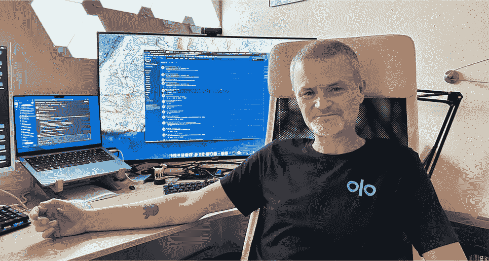

# 与 Olo - Octopus Deploy 的 Jason Dunnivant 一起进入 DevOps

> 原文：<https://octopus.com/blog/inside-devops-jason-olo>

本帖开启了我们的 Inside DevOps 系列，在这里我们分享了从 DevOps 前线学到的经验教训。

[杰森·邓尼万特](https://www.linkedin.com/in/jasondunnivant/)， [Olo](https://www.olo.com/) 的发布工程师，首先出场。Olo 是 SaaS 领先的开放式餐厅平台，让每个接触点都充满热情。

Jason，我向你伸出手来开始我们的博客系列，因为我被你对 DevOps 的奉献所吸引。你甚至有章鱼部署的纹身！

杰森:如你所见，我是你们产品的忠实粉丝。

 

杰森·邓尼凡特和他的章鱼部署纹身

DevOps 对你来说是什么？你是怎么定义的？

Jason :对我来说，DevOps 是一种将尽可能多的事情自动化的方法，所以人们不需要手工去做。有了 DevOps 思维模式，我们可以将软件工程师从日常任务中解放出来，例如提供基础设施，让他们专注于他们喜欢做的事情——开发软件。

**你的 DevOps 之旅是如何开始的？**

杰森:我的职业道路对于一个软件人来说可能并不典型。我在军队服役，有心理学学位。我在一家加油站工作，攻读学位，这时我收到了一份技术支持的工作邀请。然后，我转到了网络管理岗位。我的经理告诉我，我是一个聪明的家伙，所以我开始学习如何编码，并成为一名开发人员。在过去的几年里，我一直是 Olo 的发布工程师。

你的心理学学位有任何帮助吗？

杰森:这让我能够接替他人的位置，这在我的技术支持时期非常重要。这种技能在我目前的工作中仍然适用。

DevOps 最具挑战性的部分是什么？

Jason :我认为 DevOps 最具挑战性的部分是它涵盖了软件操作的许多方面，人们会带着许多不同的请求来找你。然而，我发现最好的方法是保持开放的心态，不要害怕尝试以前没有做过的事情。

你工作中最有回报的部分是什么？

杰森:去帮助别人。开发者只是想开发，我可以让他们的生活更轻松。

您或您的组织实施了哪些 DevOps 最佳实践？

*杰森*:我们公司实施了很多最佳实践。一个是使用微服务，这样我们可以更快地发布，并且独立于我们软件平台的其他组件。我们将我们的系统与 300 多种其他软件技术集成在一起，因此这种方法可以让我们更快地将软件投入生产。我们一天两次甚至更频繁地发布到生产环境，我们努力实现“单个吉拉票证部署”，在这种情况下，我们将修复程序快速推向生产环境，只需关闭一个初始票证。这在很大程度上是可能的，因为我们使用章鱼。我们的部署流程有 100 多个步骤，但我们可以在大约 20 分钟内完成部署，所以对我们来说这几乎不是什么大事，这是一个精心安排的部署流程，没有人会为此感到紧张。

另一个最佳实践是让开发团队参与部署过程。我们通过在 Octopus 中使用配置代码(CAC)来实现这一点。开发团队使用他们熟悉的环境来添加和修改部署步骤，然后与我的团队一起通过审查和批准过程。这样，我们可以更快地扩展和向客户交付功能，同时确保萨班斯-奥克斯利法案(SOX)所要求的职责分离。

**你会给刚开始开发工作的人什么建议？**

Jason :弄脏你的手——创建你的 Azure 环境，下载 Octopus，然后开始玩它。

**有什么 DevOps 的书推荐阅读？**

*杰森*:我其实最近没怎么看书，但是我每天都在和队友一起学习新的东西，所以我是潜移默化的学习。但是对我最有帮助的一本书是 Justin Domingus 和 John Arundel 的[*Cloud Native devo PS with Kubernetes:Building，Deploying，and Scaling Modern Applications in the Cloud*](https://www.amazon.com/Cloud-Native-DevOps-Kubernetes-Applications/dp/1492040762)。

**谢谢推荐；我们会确保将它添加到我们的 [DevOps 阅读清单](https://octopus.com/devops/reading-list/)。最后一个问题:你身上有哪一点会让我们感到惊讶？**

杰森:关于我的一个有趣的事实是，我是佛罗里达州鱼类和野生动物保护委员会的一名讨厌的鳄鱼捕手。

哦，哇——很难打败那个！Jason，再次感谢你花时间陪我，祝你部署愉快！

杰森:随时恭候！

如果你想在我们的系列节目《Inside DevOps》中出镜，请联系 LinkedIn 上的 [Joanna，安排时间进行一次简短的聊天。](https://www.linkedin.com/in/joannawyganowska/)