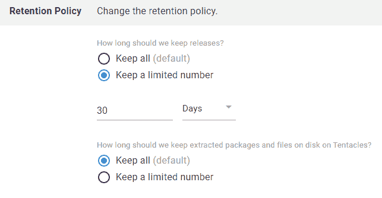

# 来自我们的优化 Octopus 网络研讨会- Octopus Deploy 的见解

> 原文：<https://octopus.com/blog/insights-from-our-optimizing-octopus-webinar>

在我们最近的网络研讨会中，Clear Measure 的 Chris Thomas 与 Derek Campbell 一起讨论了如何优化 Octopus Deploy 以获得最佳体验。

通过一点规划、维护和对其功能的巧妙使用，您可以保持 Octopus 平稳运行，并更容易看到正在发生的事情。

观看下面的网上研讨会或继续滚动查看网上研讨会的主要观点。

[https://www.youtube.com/embed/M5MbNkGkIPo](https://www.youtube.com/embed/M5MbNkGkIPo)

VIDEO

## 数据库维护

正如 Chris 在网上研讨会中指出的，很容易忘记 Octopus 服务器是在 SQL 数据库上运行的。使用像**微软 SQL Server Management Studio(SSMS)**这样的工具进行一些基本的内务处理，可以提高那些与缓慢的实例作斗争的人的速度。

如果你在[章鱼云](https://octopus.com/docs/octopus-cloud)上，数据库维护是你永远不需要担心的事情。直接跳到如何最好的[组织章鱼](#organize-octopus)吧。

### 检查 SQL 报告中的问题

首先，我们建议在 SSMS 运行一个“索引物理统计”报告来查找问题。

要运行该报告，请从列表中右键单击您的数据库，然后选择 **报告➜标准报告➜指数物理统计** 。

打开报告后，检查**操作建议**栏中的建议。

您还可以展开 **# Partitions** 列中的项目来查看碎片信息。

*   如果碎片超过 35%，您应该安排一些时间来整理数据库碎片。
*   低于 30%通常是可以的，但是随着百分比的增加，还有改进的空间。

### 制定维护计划

您可以使用 SSMS 的 **SQL Server 维护计划向导**来优化和维护您的 SQL 数据库。

展开左侧窗格中的**管理**文件夹，右键单击**维护计划**，选择**维护计划向导**。

将计划设置为按适合您业务的时间表运行，并选择以下维护任务:

*   检查数据库完整性
*   重组索引
*   重建索引
*   更新统计数据

如果需要，可以使用其他数据库，尽管我们建议不要因为性能原因而缩小数据库。

随着向导的进行，您可能希望更改每个选定任务的设置。我们发现缺省值已经足够了，但是您可以根据需要进行更改。

开心了就运行维护计划。

如果你喜欢使用脚本，试试 Ola Hallengren 的 SQL Server 维护解决方案，它可以实现我们上面概述的所有功能。

## 整理章鱼

保持 Octopus 井井有条不仅有助于提高性能，还能让团队更容易阅读和导航仪表板。这里有一些建议可以让你的仪表盘保持简洁和易于导航。

### 不要使用超过你需要的环境

虽然您可以创建许多环境，但是您的环境编号应该反映您的开发管道(例如，开发、QA、试运行、UAT 和生产)。

我们建议使用少于 10 个环境来减少:

*   性能问题
*   项目冗余和重叠
*   仪表板上不必要的混乱

我们发现一些客户使用了比管理大量项目或部署目标所需更多的环境。Octopus 包含了更好的选项，比如项目组和租户。

### 将您的项目分组

如果您有许多项目，您可以将它们分组，以帮助减少仪表板上的视觉干扰。

要创建项目组，请执行以下操作:

1.  点击 Octopus 顶部菜单中的**项目**。
2.  点击右上角的**添加组**。
3.  为您的群组命名并描述，然后点击**保存**。

要将现有项目添加到组中:

1.  点击 Octopus 顶部菜单中的**项目**。
2.  点击你需要移动到新组的项目。
3.  点击左侧菜单底部的**设置**。
4.  点击**项目组**，然后从**项目组**下拉菜单中选择目的组。

若要将新项目添加到群组:

1.  点击八达通顶部菜单中的**项目**。
2.  点击右上角的**添加项目**。
3.  为您的新项目命名，然后单击**显示高级**。
4.  从**项目组**下拉菜单中选择一个组。
5.  点击**保存**完成新项目的创建。

### 使用租户

我们设计租户是为了帮助交付软件即服务(SaaS)的客户，但他们也有助于组织以下事项:

*   地理区域或数据中心
*   开发人员、测试人员或团队
*   特征分支

查看我们关于租户的[文档了解更多信息。](https://octopus.com/docs/tenants)

另外，请观看我们与 Adam Close 和 Mark Harrison 的后续网络研讨会，[使用 Octopus Deploy 实现更好的多租户部署](https://octopus.com/events/better-multi-tenancy-deployments-using-octopus-deploy)。

### 删除您的旧版本和构建

从 Octopus 中删除任何你不再需要的东西是一个很好的做法。Octopus Server 默认设置为保留所有内容(Octopus Cloud 默认为 30 天)，但您可以使用生命周期保留策略来自动删除旧版本和构建版本。

要检查您的保留策略:

1.  点击 Octopus 顶部菜单中的**库**。
2.  从左侧菜单中点击**生命周期**。

在这里，您可以更改现有和默认生命周期的保留策略，或者创建新的策略。

通过设置保留策略，Octopus 将在您设置的天数或释放次数后删除文件，为您节省宝贵的磁盘空间。

请参阅我们的文档，了解有关以下内容的更多详细信息:

## 接下来呢？

要获得更多帮助，你可以浏览一下 [Octopus Deploy 文档](https://octopus.com/docs)，或者欢迎你通过我们的[支持渠道](https://octopus.com/support)联系我们。

愉快的部署！