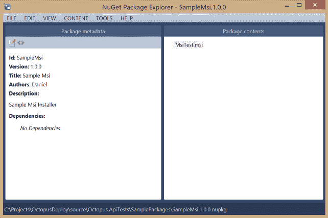
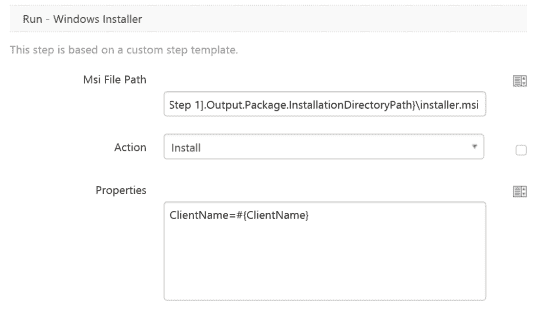

# 使用 Octopus Deploy 安装 MSI-Octopus Deploy

> 原文：<https://octopus.com/blog/install-msi-with-octopus>

Octopus Deploy 允许您部署各种软件。这背后的部分原因是 Octopus 支持脚本作为部署过程的一部分，以允许几乎无限的灵活性。Octopus Deploy 库让我们和社区扩展 Octopus Deploy 的功能。

我们库的最新成员是新的[微软软件安装程序(MSI)步骤模板](https://library.octopusdeploy.com/#!/step-template/actiontemplate-run-windows-installer)。如果您在项目中使用 MSI 安装程序，并且需要部署一个到您的一个触角，这个脚本将帮助您做到这一点。

## 它是如何工作的

MSI 步骤模板步骤将在文件系统上安装、修复或删除 MSI 文件。运行该步骤将构建命令来调用带有适当参数的给定 MSI 的安装程序。安装日志被写入磁盘，然后在安装完成后记录在 Octopus 日志中。为了使用 Step 模板，目标系统上必须安装有 [Windows Installer 3.0](http://www.microsoft.com/en-AU/download/details.aspx?id=16821) 。目标 MSI 还必须支持安静(无用户界面)安装。这个版本的脚本也不支持需要重启机器的 MSI，并且总是运行带有`norestart`标志的安装。

## 部署

如果您的构建过程生成了一个 MSI 安装程序来与 Octopus Deploy 一起使用，那么它必须捆绑在 Octopus Deploy Nuget 包中。要捆绑安装程序，你需要运行[octo.exe 包](http://docs.octopusdeploy.com/pages/viewpage.action?pageId=360596)命令。这个命令将调用 NuGet 并自动生成一个 nuspec。您只需要一个包含您要打包的文件的目录，在本例中只需要 MSI。最终的 NuGet 包看起来会像下面这样。



Octo pack 使用许多命令行参数来避免需要 nuspec 文件。最少可能的用法只需要像这样指定包 id`octo pack --id=MyCompany.MyApp`。参数的完整列表如下所示。

```
Usage: octo pack [<options>]

Where [<options>] is any of:
  --id=VALUE               The ID of the package; e.g. MyCompany.MyApp
  --overwrite              [Optional] Allow an existing package file of the same ID/version to be overwritten
  --include=VALUE          [Optional, Multiple] Add a file pattern to include, relative to the base path e.g. /bin/- *.dll - if none are specified, defaults to **
  --basePath=VALUE         [Optional] The root folder containing files and folders to pack; defaults to '.'
  --outFolder=VALUE        [Optional] The folder into which the generated NUPKG file will be written; defaults to '.'
  --version=VALUE          [Optional] The version of the package; must be a valid SemVer; defaults to a timestamp-based version
  --author=VALUE           [Optional, Multiple] Add an author to the package metadata; defaults to the current user
  --title=VALUE            [Optional] The title of the package
  --description=VALUE      [Optional] A description of the package; defaults to a generic description
  --releaseNotes=VALUE     [Optional] Release notes for this version of the package
  --releaseNotesFile=VALUE [Optional] A file containing release notes for this version of the package 
```

## 配置

要在本地 Octopus 部署实例中使用 step 模板，您需要从 [Octopus 部署库](https://library.octopusdeploy.com/#!/step-template/actiontemplate-run-windows-installer)中导入它。在库中点击绿色的`Copy to clipboard`按钮，并将其粘贴到`Library > Step templates > Import`下的导入窗口。

一旦它在库中，您可以将其添加为项目部署过程中的新步骤。请注意，您仍然需要一个包部署步骤来将 MSI 安装到您的服务器上，然后安装程序步骤可以运行。MSI 步骤有三个自定义属性，MSI 的路径、安装程序操作和任何安装程序属性。通常你只需要指定要安装的 MSI 的位置，它可以使用一个 octopus 变量`#{Octopus.Action[Step 1].Output.Package.InstallationDirectoryPath}\installer.msi`来构建。注意，所使用的变量包括提取安装程序的步骤的名称，所以`Step 1`必须替换为您的步骤名称。



保存步骤后，您的项目就可以部署 MSI 文件了。