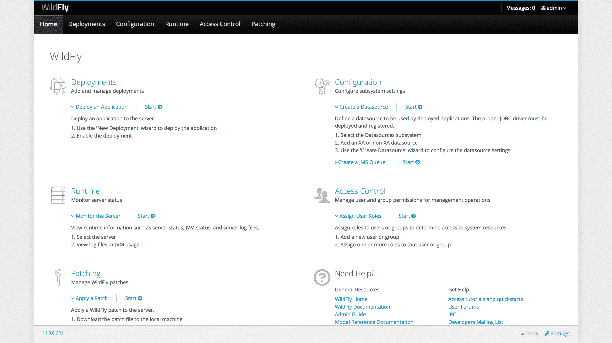

# 从头开始安装 wild fly-Octopus Deploy

> 原文：<https://octopus.com/blog/installing-wildfly-from-scratch>

WildFly 和 Red Hat JBoss Enterprise Application Platform 是目前最流行的 Java EE 应用服务器之一。WildFly 可免费用于开发和生产目的，这篇博客文章介绍了 WildFly 启动和运行所需的步骤。

## WildFly 和 JBoss EAP 的关系

WildFly 和 Red Hat JBoss 企业应用平台(简称 JBoss EAP)都是开源的 Java EE 应用服务器。

WildFly 在 WildFly 网站的社区支持下免费开放。WildFly 相当频繁地发布重大更新，并且发布的支持窗口很短。

JBoss EAP 是作为 Red Hat 订阅的一部分提供的。JBoss EAP 基于与 WildFly 相同的技术，尽管在 JBoss EAP 版本和 WildFly 版本之间没有一对一的映射。JBoss EAP 版本的支持窗口比 WildFly 长得多，并且由 Red Hat 支持。

我还没有找到任何关于 WildFly 支持窗口的官方文档，尽管[这个论坛帖子](https://developer.jboss.org/thread/267585)确实表明只有当前的主要版本是“受支持的”，所有以前的版本都被认为是遗留版本。

## Java EE 术语

围绕企业 Java 平台的术语在过去几年中发生了变化，这是一个非常混乱的来源，尤其是对于非开发人员来说。

Java 2 平台企业版(J2EE)是在 1999 年与 J2EE 1.2 一起推出的，J2EE 的名字一直使用到 2003 年 J2EE 1.4。

在 2005 年，随着 Java EE 5 的发布，这个名称被改为 Java 企业版(Java EE)。Java EE 名称一直使用到 2017 年的 Java EE 8。

2017 年，甲骨文开源了 Java EE 平台，现在由 Eclipse Foundation 以 Eclipse Enterprise for Java (EE4J)的名字管理。

## 纯 Servlet 与 Java EE

WildFly 作为一个纯 Servlet 或完整的 Java EE 应用服务器发行版提供。

对于那些希望部署不依赖于 Java EE 标准的应用程序的人来说，Serlvet-Only 发行版是一个不错的选择。例如，用 Spring 库编写的应用程序只需要一个 servlet 应用服务器就可以运行。

完整的应用服务器发行版包括对完整的 Java EE 规范的支持，并且是纯 Servlet 发行版的超集。

旧的 Java EE 应用服务器会因为加载可能没有被任何已部署的应用程序使用的库而产生内存开销，但是现在 WildFly 只加载所需的库做得很好。因此，尽管完整的应用服务器发行版是一个更大的包，但这并不一定意味着它在运行时会消耗更多的内存。

对于这篇博文，我们将使用完整的应用服务器发行版。

## 安装 Java

作为一个 Java web 服务器，WildFly 需要安装 Java 才能运行。

WildFly 11 至少需要 Java 8 才能运行。

### 杰尔还是 JDK？

Java 安装以 Java 运行时环境(JRE)或 Java 开发工具包(JDK)的形式提供。

JRE 提供了运行 Java 应用程序所需的所有功能，包括 WildFly。JDK 提供了 JRE，以及一些开发人员用来编译和管理 Java 应用程序的附加工具。

野花可以和 JRE 或者 JDK 一起工作。开发人员通常使用 JDK，它是一个较大的软件包，所以如果您有疑问，请安装 JRE。

### OpenJDK 还是甲骨文 JDK？

OpenJDK 是 Java 平台的开源实现。它通常包含在 Linux 包管理器中，包名类似于`openjdk-8-jre`或`openjdk-8-jdk`。

OpenJDK 是项目的名称，虽然它的名称中包含缩写“JDK ”,但 OpenJDK 项目同时提供了 JRE 和 JDK。

Oracle JDK 是 Oracle 提供的 Java 实现。通常，你必须从[甲骨文网站](http://www.oracle.com/technetwork/java/javase/downloads/index.html)手动下载并安装甲骨文 JDK。

使用 OpenJDK 还是 Oracle JDK 是个人的选择。我将在 Linux 发行版中使用 OpenJDK，因为使用包管理器安装很容易。在 Windows 或 MacOS 中，我会安装 Oracle JDK。

## 疯狂下载

野花有 zip 或 tar.gz 包装。对于 Windows 用户来说，两者都可以。对于 Linux 用户来说，tar.gz 包是首选，因为它将保留 shell 脚本的可执行标志。

在写这篇博文的时候，WildFly 11.0.0 是最后一个主要版本，这也是这篇博文将要提到的版本。

## 独立与域

WildFly 可以在两种不同的模式下运行:独立模式或域模式。

当运行管理自己的配置和部署的 WildFly 实例时，使用独立模式。

域模式用于将应用程序配置和部署到多个 WildFly 实例。在域模式下，域控制器将配置和应用程序分发给域从属设备。

不应将域与集群混淆。域的存在只是为了分发设置和应用程序，这些设置可能会也可能不会构建集群环境。同样，如果单独配置了所需的设置，独立实例也可以加入集群。

## 手动运行 WildFly

WildFly 可以在域或独立模式下启动。每种模式都有单独的脚本启动。

要在独立模式下启动 WildFly，请在 Windows 中运行`bin\standalone.bat`脚本，在 Linux 中运行`bin/standalone.sh`脚本。

要在域模式下启动 WildFly，在 Windows 中运行`bin\domain.bat`脚本，在 Linux 中运行`bin/domain.sh`脚本。

## 配置 WildFly 内存设置

WildFly 使用的内存设置在`JAVA_OPTS`环境变量中定义。如果没有这个环境变量，缺省值在 Windows 的`bin/standalone.conf.bat`和`bin/domain.conf.bat`文件中定义，或者在 Linux 的`bin/standalone.conf`和`bin/domain.conf`文件中定义。

在 Windows 配置文件中，您会看到如下命令:

```
if not "x%JAVA_OPTS%" == "x" (
  echo "JAVA_OPTS already set in environment; overriding default settings with values: %JAVA_OPTS%"
  goto JAVA_OPTS_SET
)
rem # ...
set "JAVA_OPTS=-Xms64M -Xmx512M -XX:MetaspaceSize=96M -XX:MaxMetaspaceSize=256m" 
```

在 Linux 配置文件中，您会看到如下命令:

```
if [ "x$JAVA_OPTS" = "x" ]; then
   JAVA_OPTS="-Xms64m -Xmx512m -XX:MetaspaceSize=96M -XX:MaxMetaspaceSize=256m -Djava.net.preferIPv4Stack=true"
   JAVA_OPTS="$JAVA_OPTS -Djboss.modules.system.pkgs=$JBOSS_MODULES_SYSTEM_PKGS -Djava.awt.headless=true"
else
   echo "JAVA_OPTS already set in environment; overriding default settings with values: $JAVA_OPTS"
fi 
```

要覆盖这些配置文件中分配给`JAVA_OPTS`的默认值，您可以定义`JAVA_OPTS`环境变量。环境变量优先于默认值。否则，您可以直接编辑配置文件中的默认值。

通过查看 Oracle 文档，可以找到关于此处显示的设置的更多信息。例如，[这个文档](https://docs.oracle.com/javase/8/docs/technotes/tools/windows/java.html)列出了 Java 8 的选项。

一些 Java 设置是特定于版本的。确保使用特定于你正在运行的 Java 版本的设置。

## 配置管理员用户

为了登录到管理控制台或将 WildFly 配置为 Windows 服务，您首先需要定义一个管理用户。为 Windows 添加了`bin\add-user.bat`脚本，为 Linux 添加了`bin/add-user.sh`脚本。

你可以运行 add-user 脚本 WildFly 正在运行。新用户将被自动挑选。

一旦脚本运行，您将会被询问一些问题:

*   添加什么类型的用户-管理用户
*   用户名
*   密码
*   用户将属于什么组-留空
*   用户是否用于 AS 过程互连-否

我在下面粘贴了`add-user`脚本的输出。请注意，我用新密码更新了现有的禁用用户`admin`。

```
$ ./add-user.sh

What type of user do you wish to add?
 a) Management User (mgmt-users.properties)
 b) Application User (application-users.properties)
(a): a

Enter the details of the new user to add.
Using realm 'ManagementRealm' as discovered from the existing property files.
Username : admin
User 'admin' already exists and is disabled, would you like to...
 a) Update the existing user password and roles
 b) Enable the existing user
 c) Type a new username
(a): a
Password recommendations are listed below. To modify these restrictions edit the add-user.properties configuration file.
 - The password should be different from the username
 - The password should not be one of the following restricted values {root, admin, administrator}
 - The password should contain at least 8 characters, 1 alphabetic character(s), 1 digit(s), 1 non-alphanumeric symbol(s)
Password : <enter password>
Re-enter Password : <enter password>
What groups do you want this user to belong to? (Please enter a comma separated list, or leave blank for none)[  ]:
Updated user 'admin' to file '/Users/matthewcasperson/Downloads/wildfly-11.0.0.CR1/standalone/configuration/mgmt-users.properties'
Updated user 'admin' to file '/Users/matthewcasperson/Downloads/wildfly-11.0.0.CR1/domain/configuration/mgmt-users.properties'
Updated user 'admin' with groups  to file '/Users/matthewcasperson/Downloads/wildfly-11.0.0.CR1/standalone/configuration/mgmt-groups.properties'
Updated user 'admin' with groups  to file '/Users/matthewcasperson/Downloads/wildfly-11.0.0.CR1/domain/configuration/mgmt-groups.properties'
Is this new user going to be used for one AS process to connect to another AS process?
e.g. for a slave host controller connecting to the master or for a Remoting connection for server to server EJB calls.
yes/no? no 
```

该脚本将修改域和独立模式的`mgmt-users.properties`和`mgmt-groups.properties`文件(即`standalone\configuration`和`domain\configuration`目录下的属性文件)。这意味着无论你打算在哪个模式下使用 WildFly，用户都是可用的。

## 将 WildFly 安装为服务

生产 WildFly 实例通常作为服务启动。这允许 WildFly 在操作系统启动时启动，在操作系统关闭时关闭，并使用操作系统内置的服务管理工具进行管理。

### 将 WildFly 安装为 Windows 服务

WildFly 附带了一个名为`service.bat`的脚本，可以用来添加 Windows 服务。这些服务通过 WildFly 管理接口进行管理，默认情况下该接口监听端口`9990`。`jbossuser`和`jbosspass`字段需要匹配用`add-user.bat`脚本创建的凭证。

此命令会将独立实例配置为 Windows 服务。

```
bin\service\service.bat install /jbossuser admin /jbosspass password /controller localhost:9990 /startup /name "WildFly 11 Standalone" 
```

此命令会将域控制器配置为 Windows 服务。

```
bin\service\service.bat install /jbossuser admin /jbosspass password /controller localhost:9990 /startup /host /hostconfig host-master.xml /name "WildFly 11 Domain Controller" 
```

此命令会将域从属配置为 Windows 服务。

```
bin\service\service.bat install /jbossuser admin /jbosspass password /controller localhost:9990 /startup /host /hostconfig host-slave.xml /name "WildFly 11 Domain Slave" 
```

### 将 WildFly 安装为 Linux 服务

WildFly 在`docs/contrib/scripts/init.d`和`docs/contrib/scripts/systemd`目录中附带了 init.d 和 systemd 服务定义文件。

在我们配置任何 Linux 服务之前，我们需要添加一个将运行 WildFly 的用户。这个用户将被称为`wildfly`，可以通过运行命令`sudo useradd wildfly`来创建。

接下来确保野花已经被提取到`/opt/wildfly`。`/opt`目录[是为所有不属于默认安装](http://www.tldp.org/LDP/Linux-Filesystem-Hierarchy/html/opt.html)的软件和附加包保留的，这很好地描述了我们的 WildFly 安装(也是所提供的服务脚本中的默认路径)。

最后，使用命令`sudo chown wildfly:wildfly -R /opt/wildfly`确保`wildfly`用户是`/opt/wildfly`目录的所有者。

#### 配置 systemd 服务

以下步骤将配置 WildFly 由 systemd 管理。

1.  用命令`cp /opt/wildfly/docs/contrib/scripts/systemd/launch.sh /opt/wildfly/bin`将`launch.sh`脚本复制到`bin`目录中。
2.  用命令`sudo cp /opt/wildfly/docs/contrib/scripts/systemd/wildfly.service /etc/systemd/system`将 WildFly systemd 单元复制到`/etc/systemd/system`中。
3.  用命令`sudo mkdir /etc/wildfly`创建`/etc/wildfly`目录。
4.  用命令`sudo cp /opt/wildfly/docs/contrib/scripts/systemd/wildfly.conf /etc/wildfly`将配置文件复制到`/etc/wildfly`中。
5.  使用命令`sudo systemctl enable wildfly`启用 WildFly 服务。
6.  用命令`sudo systemctl start wildfly`启动 WildFly 服务。

此时 WildFly 将会运行，您可以使用命令`sudo systemctl status wildfly`来验证这一点。

```
$sudo systemctl status wildfly
● wildfly.service - The WildFly Application Server
   Loaded: loaded (/etc/systemd/system/wildfly.service; enabled; vendor preset: enabled)
   Active: active (running) since Tue 2017-10-24 16:48:53 AEST; 1min 38s ago
 Main PID: 5448 (launch.sh)
    Tasks: 68 (limit: 4915)
   CGroup: /system.slice/wildfly.service
           ├─5448 /bin/bash /opt/wildfly/bin/launch.sh standalone standalone.xml 0.0.0.0
           ├─5449 /bin/sh /opt/wildfly/bin/standalone.sh -c standalone.xml -b 0.0.0.0
           └─5502 java -D[Standalone] -server -Xms64m -Xmx512m -XX:MetaspaceSize=96M -XX:MaxMetaspaceSize=256m -Djava.net.preferIPv4Stack=true -Djboss.

Oct 24 16:48:53 matthew-VirtualBox systemd[1]: Started The WildFly Application Server. 
```

#### 配置 init.d 服务

以下步骤将配置 WildFly 由 init.d 管理。

1.  将适当的初始化脚本从`wildfly-init-redhat.sh`或`wildfly-init-debian.sh`复制到`/etc/init.d/wildfly`。例如，如果您有一个基于 Red Hat 的发行版，您可以使用命令`sudo cp /opt/wildfly/docs/contrib/scripts/init.d/wildfly-init-redhat.sh /etc/init.d/wildfly`来复制文件。如果你有基于 Debian 的发行版，用命令`sudo cp /opt/wildfly/docs/contrib/scripts/init.d/wildfly-init-debian.sh /etc/init.d/wildfly`复制文件。
2.  用命令`sudo cp /opt/wildfly/docs/contrib/scripts/init.d/wildfly.conf /etc/default`将文件`wildfly.conf`复制到`/etc/default`。
3.  用命令`sudo service wildfly start`启动服务。

此时 WildFly 将会运行，您可以使用命令`sudo service wildfly status`进行验证。在这个取自 Centos 7 的示例中，init.d 脚本由 systemd 管理。

```
$ sudo service wildfly status
● wildfly.service - LSB: WildFly Application Server
   Loaded: loaded (/etc/rc.d/init.d/wildfly; bad; vendor preset: disabled)
   Active: active (running) since Tue 2017-10-24 19:34:44 AEST; 8min ago
     Docs: man:systemd-sysv-generator(8)
  Process: 3071 ExecStart=/etc/rc.d/init.d/wildfly start (code=exited, status=0/SUCCESS)
   CGroup: /system.slice/wildfly.service
           ├─3102 /bin/sh /opt/wildfly/bin/standalone.sh -c standalone.xml
           └─3151 java -D[Standalone] -server -Xms64m -Xmx512m -XX:MetaspaceSize=96M -XX:MaxMetaspaceSize=256...

Oct 24 19:34:40 localhost.localdomain systemd[1]: Starting LSB: WildFly Application Server... 
```

## 打开管理控制台

当 WildFly 被手动或作为服务启动时，可以从 http://localhost:9990 获得管理控制台。

当您第一次加载管理控制台时，您将被要求输入您用`add-user`脚本创建的凭证。

出于我不明白的原因，Chrome 不会提示你保存用来访问管理控制台的凭证，除非你刷新页面。

[](#)

管理控制台提供了部署 web 应用程序、更改设置、监控性能、查看日志文件等功能。

我们之前创建的管理员用户可以访问管理控制台的所有方面。如果你需要细粒度的控制，考虑使用基于角色的访问控制(RBAC)。

## 结论

在这篇文章中，我们已经看到了如何在 Windows 和 Linux 中手动运行 WildFly 和作为一个服务，配置一个管理员用户，并打开管理控制台。

如果您对将 Java 应用程序自动部署到 WildFly 感兴趣，[下载 Octopus Deploy](https://octopus.com/downloads) 的试用版，并查看[我们的文档](https://octopus.com/docs/deployments/java/deploying-java-applications)。

## 了解更多信息