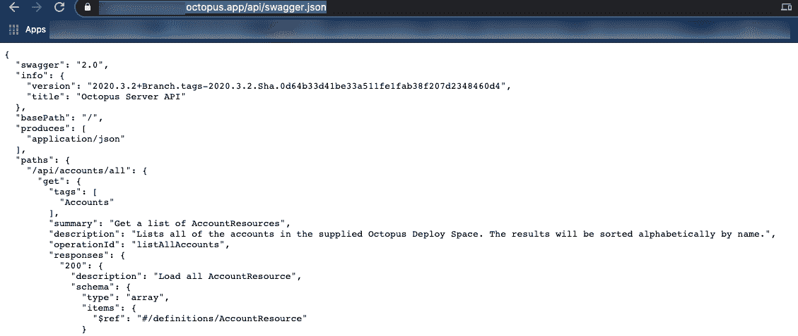
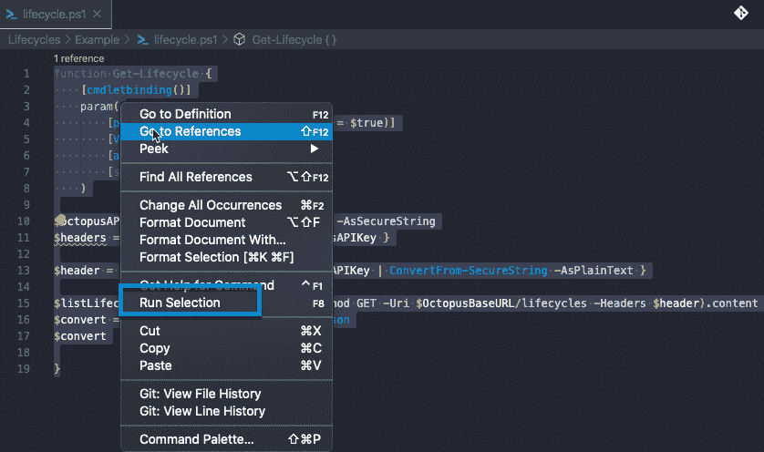
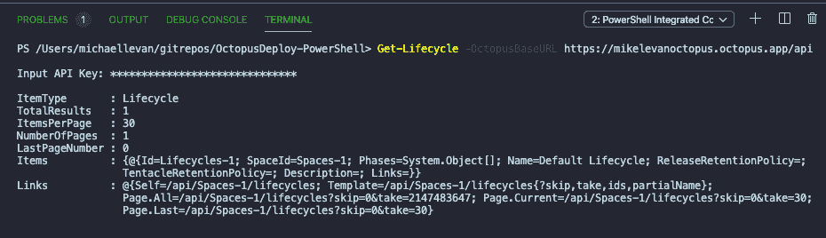

# 使用 PowerShell 与 Octopus Deploy API 交互

> 原文：<https://octopus.com/blog/interacting-with-the-octopus-deploy-api-using-powershell>

[](#)

任何平台或解决方案都需要一个应用编程接口(API)来与之交互，而不需要通过 UI 点击上百万个按钮。API 是引擎盖下的引擎。它是您在编程级别与应用、平台甚至物联网(IoT)设备进行交互的方式。

在这篇博文中，您将学习如何使用微软和 Azure 领域中最流行的编程语言之一 PowerShell 与 Octopus Deploy API 进行交互。

## 先决条件

要跟进这篇博文，您需要以下内容:

*   PowerShell 的中级知识。
*   例如，一个文本编辑器或 IDE，[对代码](https://code.visualstudio.com/download)。
*   Octopus 云实例或本地 Octopus 服务器。

你可以从八达通服务器或八达通云免费开始使用。

## 代码

当您考虑使用 PowerShell 之类的东西与 API 交互时，您通常会选择包装器路线。顾名思义，包装器就是包装 API 调用的代码。

在这篇博文中，我们将看看生命周期 API 的包装器。

下面是您将使用的代码:

```
# The function is created and is called Get-Lifecycle

function Get-Lifecycle {

# The cmdletbinding() attribute to ensure the function is an advanced function, which gives us the ability to use PowerShell features like the $PSCmdlet class, error action preferences, etc.
    [cmdletbinding()]

# The one parameter called is the Octopus Deploy server URL. It's a mandatory parameter.
    param(
        [parameter(Position = 0, Mandatory = $true)]
        [ValidateNotNullOrEmpty()]
        [alias('URL')]
        [string]$OctopusBaseURL
    )
# You're prompted to securely pass in the API key
$octopusAPIKey = Read-Host 'Input API Key' -AsSecureString

# The API key is passed in with the X-Octopus-ApiKey authentication method
$headers = @{ "X-Octopus-ApiKey" = $octopusAPIKey }

# The header is converted to plain test so Octopus can read the API key
$header = @{ "X-Octopus-ApiKey" = $octopusAPIKey | ConvertFrom-SecureString -AsPlainText }

# Invoke-WebRequest occurs, AKA, makes the API call to Octopus Deploy and returns the Lifecycles
$listLifecycles = $(Invoke-WebRequest -Method GET -Uri $OctopusBaseURL/lifecycles -Headers $header).content
$convert = $listLifecycles | ConvertFrom-Json
$convert

} 
```

## API

Octopus Deploy API 可以用一个 swagger 定义来看待，它允许您描述您的 API，以便机器(或编程语言)可以读取它们。因为 Octopus Deploy API 使用了 Swagger，所以它很容易从 Octopus Deploy 服务器上读取:

1.  打开 web 浏览器。
2.  键入您的 Octopus Deploy 服务器 URL。
3.  在服务器 URL 的末尾，添加以下内容:

```
/api/swaggerjson 
```

您将看到一个类似于下面截图的 JSON 输出。

[](#)

大摇大摆输出的好处是，我们不必搜索或猜测 API 上的任何内容。例如，在上面的截图中，我们看到在`paths`下有一个对账户的 API 调用:

```
/api/accounts/all 
```

从一开始，您就知道 API 的前景是什么样的，并且对如何与 API 进行交互有了一个很好的想法。

一旦知道了如何与 API 交互，就该考虑身份验证了。

## 证明

理解与 API 的交互当然是至关重要的，但是如果你不能对它进行认证，你将整天吃着`403 unauthorized`三明治。在这一节中，我们将了解一下在 Octopus 中非常简单的认证过程。

当您使用 PowerShell 与 API 进行交互时，您可能会发现需要以下内容:

*   UTF8 编码
*   Base64 转换身份验证
*   标题哈希表中的多个键/值对
*   不记名代币
*   肯定的。NET 命名空间，如`System.Net.WebClient`或`System.Net.NetworkCredentials`

有了 Octopus，认证相当容易。事实上，您所需要的只是一个可以从 Octopus 服务器生成的 API 密匙。它不需要以任何方式进行转换或操作。

### 检索 API 密钥

1.  登入八达通网站。
2.  在登录名下，进入**个人资料**。
3.  在 **Profile** 下，点击 **My API Keys** 。
4.  点击**新 API 键**按钮。将 API 密钥存储在安全的位置，因为您将在下一节中用到它。

## 进行 API 调用

现在我们已经有了所有的东西，也就是 API 键和代码，是时候通过运行函数来查看 API 调用了。

1.  打开 VS 代码，将上一节中的[代码](#the-code)保存到您选择的位置，例如桌面。
2.  高亮显示代码，点击右键，选择**运行选择**，如下图所示。使用**运行选择**选项将功能存储在内存中。

[](#)

3.  在终端中，运行以下 cmdlet:

```
Get-Lifecycle -OctopusBaseURL server_url/api 
```

4.  出现提示时，输入 API 密钥。
5.  在您为 Octopus 服务器键入一个 API 密钥后，您将看到一个类似于下面截图的输出，其中包含生命周期信息:

[](#)

恭喜你。您已经成功地使用 PowerShell 与 Octopus Deploy API 进行了交互。

## 结论

有几种与 API 交互的方式。简而言之，你可以用任何编程语言与几乎任何 API 进行交互。即使没有包装器或可用的 SDK，您也可以通过使用几个`curls`来制作自己的。如果你不想把时间花在点击 UI 上，你可能想通过编程的方式与一个平台交互，比如 Octopus Deploy。