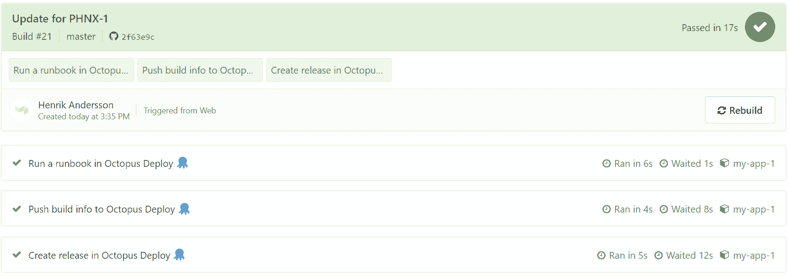
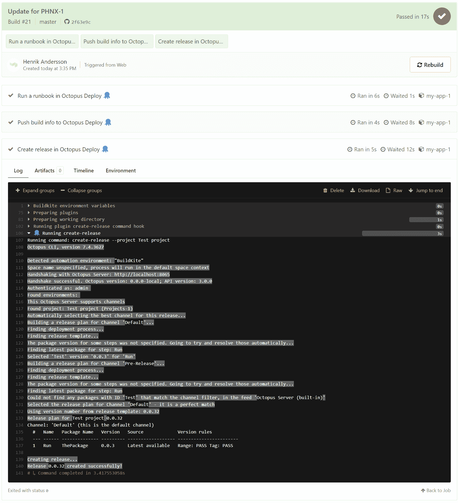

# 介绍 Buildkite 集成- Octopus Deploy

> 原文：<https://octopus.com/blog/introducing-buildkite-integration>

章鱼部署现在与 [Buildkite](https://buildkite.com/) 整合。我们新的 Buildkite 插件将允许您的构建代理创建和部署版本，推送构建信息，并作为管道的一部分运行 runbooks。

这篇文章向您展示了如何使用 Buildkite 插件来执行各种操作，Octopus Deploy 是 Buildkite 中管道的一部分。

## 什么是 Buildkite？

Buildkite 是一个在基础设施上运行持续集成(CI)管道的平台。这使得它快速、安全且可扩展。

构建是通过代理进行的。这些是小型的、可靠的、跨平台的构建运行程序，通过 YAML 定义的工作流来控制。

代理也可以通过插件进行扩展。这些为工作流提供了额外的功能。它们执行 Docker 容器中的步骤，从凭证存储中读取值，并向构建添加测试摘要注释。

## 与 Octopus Deploy 集成 Buildkite

以下插件支持 Buildkite 与 Octopus Deploy 的集成:

这些插件要求在 Buildkite 代理上安装 [Octopus CLI](https://octopus.com/downloads/octopuscli) 。

[](#)

## 创建版本

在 Octopus Deploy 中，一个发布是您的部署过程和相关资产(包、脚本、变量)的快照，因为它们在您的发布创建时就存在。该发行版有一个版本号，您可以根据需要多次部署该发行版，即使自该发行版创建以来部分部署过程已经更改(这些更改将包含在未来的发行版中，但不包含在当前版本中)。

当您部署该版本时，您正在执行带有所有相关细节的部署过程，因为它们在创建该版本时就存在了。

通过 Buildkite 在 Octopus Deploy 中创建一个发布会将[create-release-build kite-plugin](https://github.com/OctopusDeploy/create-release-buildkite-plugin)合并到您的管道中:

```
steps:
  - label: Create a release in Octopus Deploy 🐙
  - plugins: 
    - OctopusDeploy/create-release#v0.0.1:
        api_key: "${MY_OCTOPUS_API_KEY}"
        project: "HelloWorld"
        server: "${MY_OCTOPUS_SERVER}" 
```

我们强烈建议您将环境变量用于敏感值，如 API 键或服务器地址。

[](#)

## 推送构建信息

当部署一个版本时，了解哪个构建产生了工件，它包含什么提交，以及它与哪个工作项相关联是很有用的。构建信息特性允许你从构建服务器上传信息到 Octopus Deploy，手动或者通过插件。

构建信息与包相关联，包括:

*   构建 URL:指向生成包的构建的链接
*   提交:与构建相关的源提交的详细信息
*   问题:从提交消息中解析的问题引用

从 Buildkite 推送构建信息到 Octopus Deploy 可以通过[push-build-information-build kite-plugin](https://github.com/OctopusDeploy/push-build-information-buildkite-plugin)完成:

```
steps:
  - label: Push build info to Octopus Deploy 🐙
    plugins: 
      - OctopusDeploy/push-build-information#v0.0.1:
          api_key: "${MY_OCTOPUS_API_KEY}"
          packages: "HelloWorld"
          package_version: "1.0.0"
          server: "${MY_OCTOPUS_SERVER}" 
```

## 运行操作手册

Runbooks 可自动执行日常维护和紧急操作任务，例如基础设施供应、数据库管理以及网站故障转移和恢复。runbook 包括运行基础设施的所有必要权限，因此团队中的任何人都可以执行 run book，并且因为它们是在 Octopus 中管理的，所以有完整的审计跟踪。Runbooks 可以使用提示变量，因此需要人工交互。

可以使用[run-runbook-Buildkite-plugin](https://github.com/OctopusDeploy/run-runbook-buildkite-plugin)通过 build kite 在 Octopus Deploy 中运行 run book:

```
steps:
  - label: Run runbook in Octopus Deploy 🐙
    plugins: 
      - OctopusDeploy/run-runbook#v0.0.1:
          api_key: "${MY_OCTOPUS_API_KEY}"
          environments: "Test"
          project: "Hello World"
          runbook: "Greeting"
          server: "${MY_OCTOPUS_SERVER}" 
```

## 结论

通过我们新的 Buildkite 插件提供的集成代表了我们最初的设计和发布。我们计划构建额外的插件，并通过 Bash 脚本提供集成来消除对 Octopus CLI 的依赖。

如果您是现有的 Octopus Deploy 客户，请查看作为构建管道一部分的 [Buildkite](https://buildkite.com/) 。如果你是一个现有的 Buildkite 客户，请查看 [Octopus Deploy](https://octopus.com/start) 了解部署情况。如果您还没有尝试过这两种产品，请将它们都视为您 CI/CD 渠道的一部分。

愉快的部署！