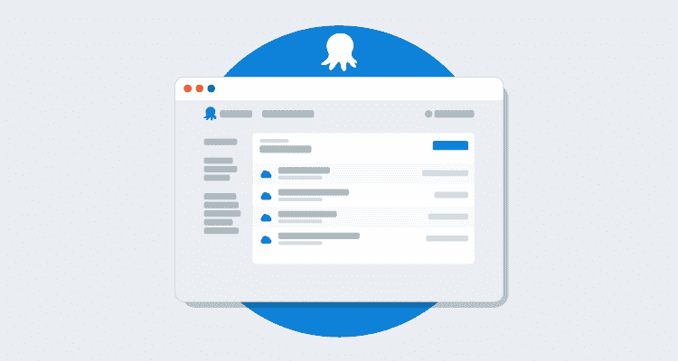
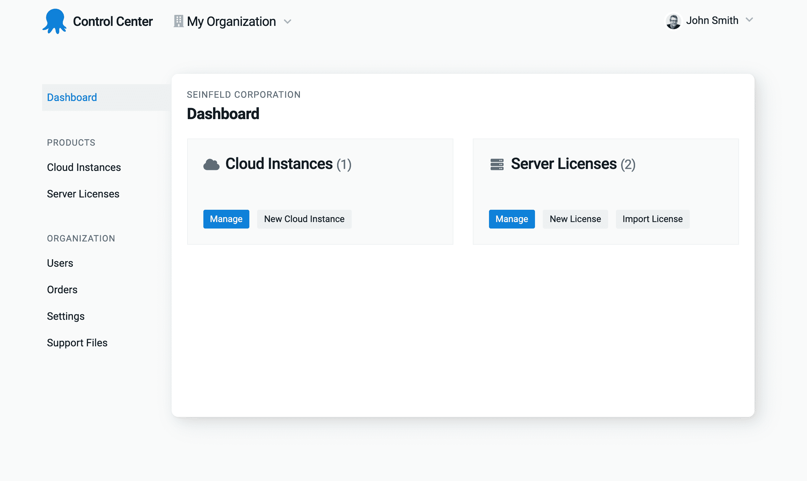

# 介绍八达通控制中心-八达通部署

> 原文：<https://octopus.com/blog/introducing-the-octopus-control-center>

在 Octopus Deploy，我们不只是想打造世界上最好的部署工具；我们希望与我们的每一次互动都是世界级的。

我们知道我们可以用八达通帐户做得更好，所以我们重新设计了它，让它对你更有用，并为我们未来的功能打下坚实的基础。

## 八达通账户是如何演变的

章鱼账户是随着时间的推移拼凑起来的。我们在 2018 年 7 月发布了章鱼云 V1，构建了第一个迭代。

我们需要一个地方来放置账户管理工具，比如账单。接下来是 Octopus ID，然后是服务器许可证管理等自助服务功能，我们继续一次添加一个功能，没有停下来考虑整体体验。

作为客户，你应该享受八达通的每一个接触点，所以现在八达通账户已经建立，我们已经花时间重新设计它，并考虑整个体验。

## 什么变了？

*   它现在被称为控制中心，以便更好地识别它的用途。
*   控制中心有更多的指示器来帮助导航，包括:
    *   描述性的页面标题、嵌套页面的标志以及帮助定位的活动状态。
    *   我们在所有页面上都展示了您正在查看的组织，因此您可以维护上下文。
    *   您的云实例的详细信息在单独的页面上，以便将来提供更强大的用户管理功能。

我们已经在整个控制中心交付了新的设计，所有现有的功能和特性都像以前一样继续工作。

## 结论

控制中心现在是一个独特的空间来管理您的帐户，直观的导航使您更容易找到您需要的东西。这些变化也为我们决定实现的未来特性铺平了道路。

我们希望重新设计能让它使用起来更愉快。如果您有进一步改进的建议，请告诉我们。

愉快的部署！