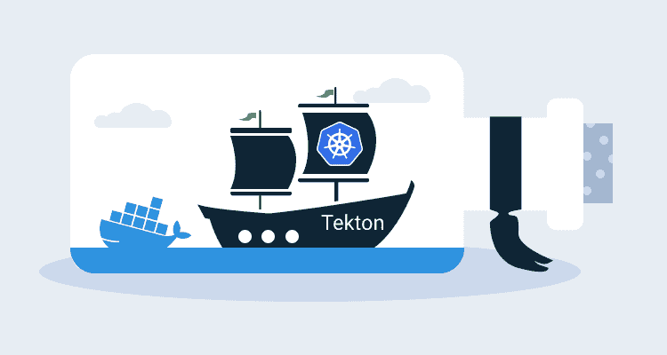

# Tekton 管道初步观察——Octopus 部署

> 原文：<https://octopus.com/blog/introduction-to-tekton-pipelines>

[](#)

Kubernetes 正在迅速从 Docker 编排平台演变为通用云操作系统。通过 [operators](https://octopus.com/blog/operators-with-kotlin) Kubernetes 获得了本地管理高级概念和业务流程的能力，这意味着您不再管理 pod、服务和部署的构建模块，而是描述这些构建模块可以创建的东西，如 web 服务器、数据库、连续部署、证书管理等。

当部署到 Kubernetes 集群时，Tekton 管道能够以简单值或 Docker 图像等复杂对象的形式定义和执行构建任务、输入和输出，并在管道中组合这些资源。这些新的 Kubernetes 资源和管理它们的控制器导致了一个由 Kubernetes 集群托管的无头 CI/CD 平台。

在这篇文章中，我们将看看一个运行在 MicroK8S 上的简单构建管道。

## 准备测试 Kubernetes 集群

在这篇文章中，我使用 [MicroK8S](https://microk8s.io/) 来提供 Kubernetes 集群。MicroK8S 在这里很有用，因为它提供了一系列[官方插件](https://microk8s.io/docs/addons)，其中一个是 Docker 图像注册表。因为我们的管道构建了一个 Docker 映像，所以我们需要一个地方来托管它，而 MicroK8S registry 插件只需一个命令就能为我们提供该功能:

```
microk8s.enable registry 
```

我们还需要从 MicroK8S 集群内部启用 DNS 查找。这是通过启用 DNS 插件来实现的:

```
microk8s.enable dns 
```

## 安装 Tekton 管道

Tekton 管道的安装很简单，只需一个`kubectl`(或本例中的`microk8s.kubectl`)命令:

```
microk8s.kubectl apply --filename https://storage.googleapis.com/tekton-releases/pipeline/latest/release.yaml 
```

我们现在可以在 Kubernetes 集群中创建 Tekton 资源。

## “Hello World”任务

任务包含为完成工作而执行的各个步骤。在下面的例子中，我们有一个单步执行的任务，它在一个从`ubuntu`图像构建的容器中执行带有参数`Hello World`的`echo`命令。

下面的 YAML 显示了我们的`helloworldtask.yml`文件:

```
apiVersion: tekton.dev/v1alpha1
kind: Task
metadata:
  name: echo-hello-world
spec:
  steps:
    - name: echo
      image: ubuntu
      command:
        - echo
      args:
        - "Hello World" 
```

使用以下命令在 Kubernetes 集群中创建任务资源:

```
microk8s.kubectl apply -f helloworldtask.yml 
```

任务描述了如何完成工作，但是创建任务资源并不会导致采取任何操作。任务运行资源引用任务，任务运行资源的创建触发 Tekton 执行被引用任务中的步骤。

下面的 YAML 显示了我们的`helloworldtaskrun.yml`文件:

```
apiVersion: tekton.dev/v1alpha1
kind: TaskRun
metadata:
  name: echo-hello-world-task-run
spec:
  taskRef:
    name: echo-hello-world 
```

使用以下命令在 Kubernetes 集群中创建任务运行资源:

```
microk8s.kubectl apply -f helloworldtaskrun.yml 
```

## 建立码头工人形象

为了超越这个 hello world 示例，我们将看看 Tekton 构建管道的典型用例，即编译和推送 Docker 映像。为了演示这个功能，我们将构建我们的 [RandomQuotes](https://github.com/OctopusSamples/RandomQuotes-Java) 示例应用程序。

我们从管道资源开始管道。管道资源提供了一种为构建过程定义输入的解耦方法。

我们需要的第一个输入是保存代码的 Git 存储库。管道资源有许多已知的类型，这里我们定义了一个`git`管道资源，指定保存代码的 URL 和分支:

```
apiVersion: tekton.dev/v1alpha1
kind: PipelineResource
metadata:
  name: randomquotes-git
spec:
  type: git
  params:
    - name: revision
      value: master
    - name: url
      value: https://github.com/OctopusSamples/RandomQuotes-Java.git 
```

接下来，我们定义存放编译图像的 Docker 注册表。这就是 MicroK8S 注册表插件有用的地方，因为它在 http://registry . container-registry . SVC . cluster . local:5000 公开了一个 Docker 注册表。

下面是类型为`image`的管道资源，它定义了我们将创建为`registry.container-registry.svc.cluster.local:5000/randomquotes`的 Docker 映像:

```
apiVersion: tekton.dev/v1alpha1
kind: PipelineResource
metadata:
  name: randomquotes-image
spec:
  type: image
  params:
    - name: url
      value: registry.container-registry.svc.cluster.local:5000/randomquotes 
```

定义了输入源代码和目的 Docker 映像后，我们可以创建一个任务来创建 Docker 映像并将其推送到存储库。

传统上，Docker 客户机直接在主机操作系统上构建 Docker 映像。然而，在 Kubernetes 中，一切都是在 Docker 内部运行的，这就引出了一个问题:如何在 Docker 内部运行 Docker？

在过去的几年中，出现了大量的工具来执行 Docker CLI 和 daemon 提供的过程，但不依赖于 Docker 本身。这些工具包括用于解包和重新打包 Docker 映像的 [umoci](https://github.com/openSUSE/umoci) ，用于从 Docker 文件构建 Docker 映像的 [Kaniko](https://github.com/GoogleContainerTools/kaniko) 和 [Buildah](https://github.com/containers/buildah) ，以及用于运行 Docker 映像的 [Podman](https://podman.io/) 。

我们将在 Tekton 任务中使用 Kaniko 在 Kubernetes 提供的 Docker 容器中构建 Docker 映像。下面的 YAML 显示了完整的任务:

```
apiVersion: tekton.dev/v1alpha1
kind: Task
metadata:
  name: build-docker-image-from-git-source
spec:
  inputs:
    resources:
      - name: docker-source
        type: git
    params:
      - name: pathToDockerFile
        type: string
        description: The path to the dockerfile to build
        default: /workspace/docker-source/Dockerfile
      - name: pathToContext
        type: string
        description:
          The build context used by Kaniko
          (https://github.com/GoogleContainerTools/kaniko#kaniko-build-contexts)
        default: /workspace/docker-source
  outputs:
    resources:
      - name: builtImage
        type: image
  steps:
    - name: build-and-push
      image: gcr.io/kaniko-project/executor:v0.17.1
      # specifying DOCKER_CONFIG is required to allow kaniko to detect docker credential
      env:
        - name: "DOCKER_CONFIG"
          value: "/tekton/home/.docker/"
      command:
        - /kaniko/executor
      args:
        - --dockerfile=$(inputs.params.pathToDockerFile)
        - --destination=$(outputs.resources.builtImage.url)
        - --context=$(inputs.params.pathToContext) 
```

这项任务有一些重要的方面值得指出。

该任务中有两个属性与我们上面创建的管道资源相关。

`git`类型的输入资源:

```
inputs:
    resources:
      - name: docker-source
        type: git 
```

和类型`image`的输出:

```
outputs:
  resources:
    - name: builtImage
      type: image 
```

有两个额外的输入参数定义 Docker 构建过程使用的路径:

```
spec:
  inputs:
    params:
      - name: pathToDockerFile
        type: string
        description: The path to the dockerfile to build
        default: /workspace/docker-source/Dockerfile
      - name: pathToContext
        type: string
        description:
          The build context used by Kaniko
          (https://github.com/GoogleContainerTools/kaniko#kaniko-build-contexts)
        default: /workspace/docker-source 
```

注意路径`/workspace/docker-source`是`git`资源使用的约定，其中`docker-source`目录匹配输入的名称。

然后我们有一个构建 Docker 映像的单一步骤。构建在从`gcr.io/kaniko-project/executor:v0.17.1`映像创建的容器中执行，该容器提供 Kaniko:

```
spec:
  steps:
    - name: build-and-push
      image: gcr.io/kaniko-project/executor:v0.17.1
      # specifying DOCKER_CONFIG is required to allow kaniko to detect docker credential
      env:
        - name: "DOCKER_CONFIG"
          value: "/tekton/home/.docker/"
      command:
        - /kaniko/executor
      args:
        - --dockerfile=$(inputs.params.pathToDockerFile)
        - --destination=$(outputs.resources.builtImage.url)
        - --context=$(inputs.params.pathToContext) 
```

最后，任务运行用于将任务和管道资源绑定在一起。该资源将任务`docker-source`输入映射到`randomquotes-git`管道资源，将`builtImage`输出映射到`randomquotes-image`管道资源。

创建此资源会触发构建的发生:

```
apiVersion: tekton.dev/v1alpha1
kind: TaskRun
metadata:
  name: build-docker-image-from-git-source-task-run
spec:
  taskRef:
    name: build-docker-image-from-git-source
  inputs:
    resources:
      - name: docker-source
        resourceRef:
          name: randomquotes-git
    params:
      - name: pathToDockerFile
        value: Dockerfile
      - name: pathToContext
        value: /workspace/docker-source
  outputs:
    resources:
      - name: builtImage
        resourceRef:
          name: randomquotes-image 
```

## 与构件交互

Tekton 本身并不提供任何与作业交互的仪表板或 GUI。但是，有一个 [CLI 工具](https://github.com/tektoncd/cli)用于管理 Tekton 作业。

Tekton CLI 工具假设配置了`kubectl`，但是 MicroK8S 维护了一个名为`microk8s.kubectl`的独立工具。配置`kubectl`最简单的方法是使用以下命令，该命令将 MicroK8S 配置文件复制到`kubectl`的标准位置:

```
sudo microk8s.kubectl config view --raw > $HOME/.kube/config 
```

此时，我们可以使用以下命令获得任务的状态:

```
tkn taskrun logs build-docker-image-from-git-source-task-run 
```

[](#)

## 泰克顿适合你吗？

无头构建服务器的想法很有意思。

通过用 Docker 映像构建构建，Tekton 消除了维护一套专用构建代理的开销。如今，每种工具和语言都提供了一个受支持的 Docker 映像，使得跟上主流语言版本六个月发布周期的新常态变得更加容易。

Kubernetes 也是服务于软件构建的弹性和短期需求的天然平台。当您可以有五个节点在它们之间调度构建时，为什么有十个专门的代理处于空闲状态？

但是，我怀疑 Tekton 本身对于大多数工程团队来说太低级了。任何以前使用过`kubectl`的人都会熟悉`tkn` CLI 工具，但是很难从终端理解构建的整体状态。更不用说用`kubectl create -f taskrun.yml`创建的版本很快就过时了。

有一个[仪表板](https://github.com/tektoncd/dashboard)可用，但与现有的 CI 工具相比，它是一个基本的用户界面。

[](#)

也就是说，Tekton 是构建面向开发人员的工具的强大基础。 [Jenkins X](https://jenkins-x.io/) 和 [OpenShift Pipelines](https://www.openshift.com/learn/topics/pipelines) 就是这样两个利用 Tekton 的平台。

## 结论

Kubernetes 解决了运行应用程序的许多需求，如身份验证、授权、CLI 工具、资源管理、健康检查等等。Kubernetes 集群可以通过一个命令托管一个全功能的 CI 服务器，这一事实证明了 Kubernetes 的灵活性。

有了像 [Jenkins X](https://jenkins-x.io/) 和 [OpenShift Pipelines](https://www.openshift.com/learn/topics/pipelines) 这样的项目，Tekton 开始了进入主流开发工作流的旅程。但是作为一个独立的项目，Tekton 有点太接近金属了，以至于大多数开发团队都无法使用，仅仅是因为很少有人有经验来支持它。