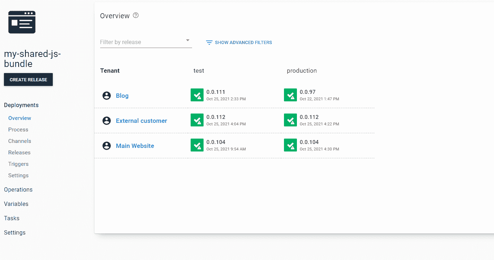
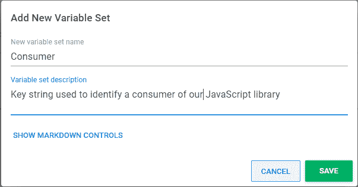
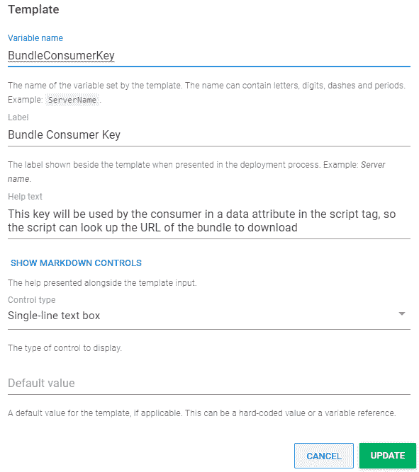
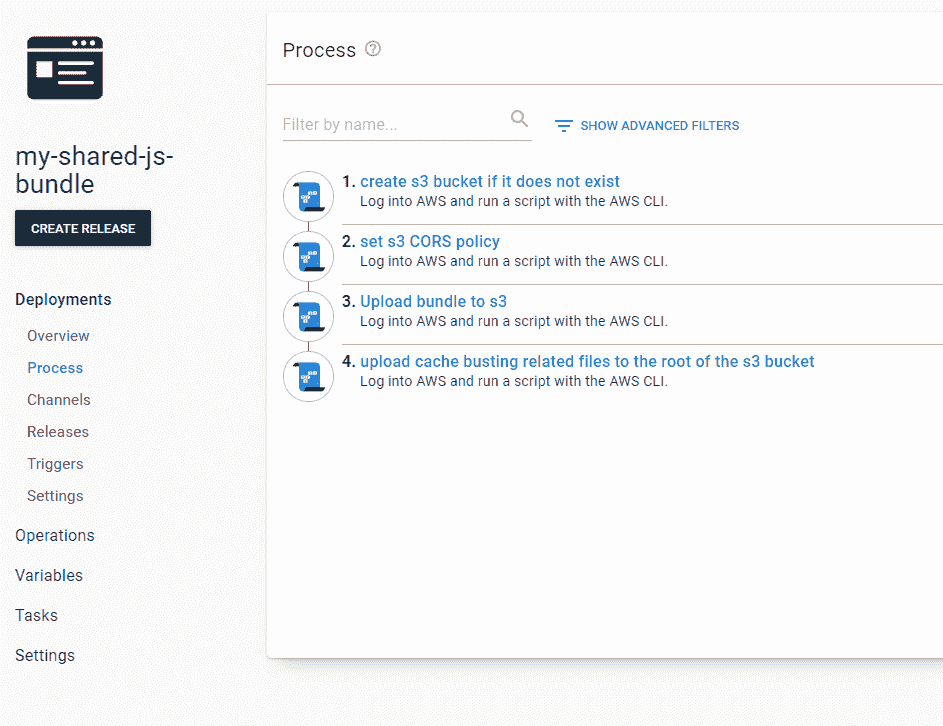
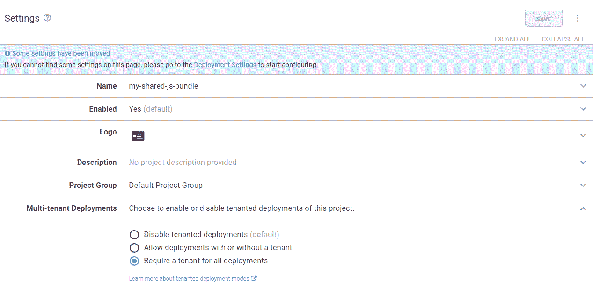
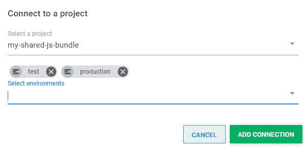
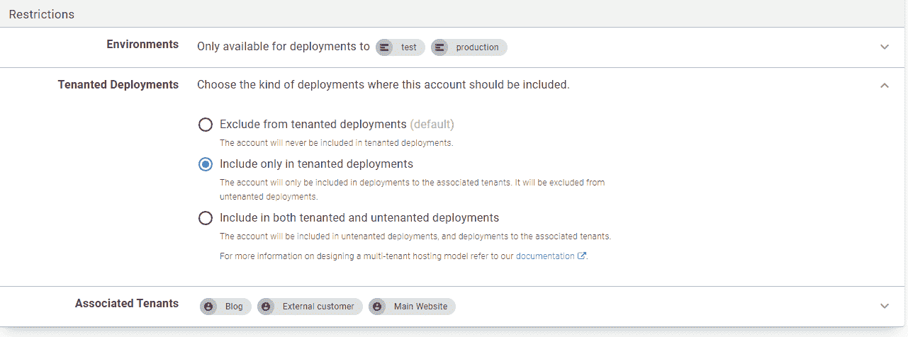

# 作为租户管理 JavaScript 库的所有消费者——Octopus Deploy

> 原文：<https://octopus.com/blog/javacript-library-users-as-tenants>

在我的[上一篇文章](https://octopus.com/blog/deploying-javascript-library-project-with-octopus)中，您学习了如何使用 Octopus 将一个散列命名的 JavaScript 库包部署到云存储中。在云存储中，它通过一个自动更新的[库变量集](https://octopus.com/docs/projects/variables/library-variable-sets)中的变量被其他项目引用。

这是在 Octopus 中管理可重用前端代码的良好开端。当发布发生时，它让你的包的每个消费者保持你的库的最新版本。使用最新版本可能正是您需要的行为，尤其是如果您只有几个引用中小型 JavaScript 库的内部项目。然而，如果随着组织规模的扩大而继续这种模式，某些场景可能会造成困境。

## 激励示例

### 后端版本需要旧的 JS 库

当需要修补程序时，可能会发生这种情况。随着前端库的增长，您不会为了一个不相关的修复而急于升级。您可以在项目级别覆盖库变量。如果这种情况偶尔发生，这将是一个合理的解决方案，但如果这是正常的开发流程，并且多个团队引用您的脚本并希望在方便的时候升级，清楚地了解谁在哪个版本的库是有帮助的。您还希望能够回滚一个破坏了一个消费者的更改，或者升级一个由于旧版本库中的已知错误而失败的不同网站。在这些情况下，您不仅要向特定的环境发布 JavaScript，还要向特定的消费者发布。

### 消费者不是内部的

也许您创建了一个小部件，用户可以通过复制粘贴您网站上的代码片段将其添加到自己的网站上。或者，一个库开始时是一个内部项目，但后来被证明是通用的，足以让你的公司通过 CDN 向全世界提供它。

在这些情况下，您将无法修改脚本的 HTML 引用。您必须将发布 JavaScript 的概念与发布使用它的代码分开，并且您必须以新的方式解决缓存破坏问题。

## 房客们来救援了

租户是代表 JavaScript 库消费者的一个很好的概念。租户通常用来代表应用程序的客户。在这种情况下，您的客户可能是内部客户，但在 Octopus，扩大我们的工程团队表明，将其他团队视为内部客户是有帮助的。

您正在更新不同网站上的脚本依赖关系，而不是将软件部署到不同客户的基础架构中，但是在 Octopus 中如何管理它的所有要求都是一样的，就好像您正在为不同的客户部署适当版本的服务器端应用程序一样。

这里有一个按照本文中的说明操作后你最终得到的仪表板的例子。在这个例子中，假设您正在将您的共享脚本部署到一个公司 WordPress 博客、一个外部客户和您公司的主网站。

[](#)

其中的每一个都被表示为一个租户，您将使用一个[公共变量](https://octopus.com/docs/tenants/tenant-variables#common-variables)为其分配一个惟一的标识符，因为这些都不是按照环境来划分范围的。

## 设置您的消费者密钥变量

在 Octopus 门户网站中，导航至**库**选项卡，然后导航至**变量集**部分。然后点击**添加新变量集**，填写如下对话框:

*   **新变量集名称** - `Consumer`
*   **变量集描述** - `Key string used to identify a consumer of our JavaScript library`

点击**保存**。

[](#)

选择您新创建的变量集，然后点击**变量模板**，然后点击**添加模板**按钮。按如下方式填写详细信息:

*   **变量名** - `BundleConsumerKey`
*   **标签** - `Bundle Consumer Key`
*   **帮助文字** - `This key will be used by the consumer in a data attribute in the script tag, so the script can look up the URL of the bundle to download`
*   **控制类型** - `Single-line text box`
*   **要显示的控件类型** - `Default value`

[](#)

## 为每个租户创建一个消费者

导航到**租户**选项卡，单击**添加租户**按钮，并创建一个名为`Blog`的租户。

单击您新创建的租户，导航到其**变量**部分，然后单击**公共变量**。

将`Bundle Consumer Key`的变量设置为值`Blog`。

[](#)

重复这个过程，创建`Bundle Consumer Key`值为`Customer`的`External customer`租户，以及`Bundle Consumer Key`值为`Mainsite`的`Main Website`租户。

现在你需要一个项目来与这些租户互动。

## 设置您的项目

您可以使用以下过程部署到您的租户。

[](#)

你基本上使用了与前一篇文章相同的过程。但是在更新变量集中的包 URL 之前，您会停下来，因为这个租用部署过程的最后一步是不同的。

根据上一篇文章，在 Octopus Deploy 中创建一个流程，包括以下步骤:

1.  [如果 S3 存储桶不存在，则创建一个](https://octopus.com/blog/deploying-javascript-library-project-with-octopus#creating-an-s3-bucket-if-it-doesnt-exist)
2.  [制定 S3 的 CORS 政策](https://octopus.com/blog/deploying-javascript-library-project-with-octopus#setting-s3-cors-policy)
3.  [将捆绑包上传到 S3](https://octopus.com/blog/deploying-javascript-library-project-with-octopus#uploading-bundle-to-s3)

现在您已经有了上传 JavaScript 包的项目的基础，您需要进行修改以启用租用部署。

### 要求项目的所有部署都有租户

导航到项目的**设置**，并选择要求所有部署都有租户的选项。

[](#)

### 将所有消费者租户连接到您的项目

对于您的每个租户，单击**连接项目**按钮，将您的 JavaScript 项目连接到`test`和`production`环境的租户。

[](#)

### 允许所有租户使用您的亚马逊 S3 帐户

如果您正在使用一个 account 变量，您会发现有一个额外的步骤允许使用它向您的任何租户释放。将帐户限制为租户的能力对于帮助防止错误的客户使用错误的帐户非常重要，但是为了简单起见，假设您正在向所有消费者引用的一个 S3 存储桶发布帐户。

[](#)

### 更新捆绑包 URL 的新部署步骤

为了控制每个租户引用的包 URL，您的新流程为租户和环境的每个组合上传一个小的 JSON 文件到您的 S3 bucket 的根目录。该文件的名称格式为`consumerkey.enivornment.json`。这里有一个`Customer.production.json`的例子:

```
{
  "url": "https://bundle-s3.s3.ap-southeast-2.amazonaws.com/release_0.0.112/js/app.69e902e8.js"
} 
```

要在部署过程的最后一步生成这些 JSON 文件，请添加一个**运行 AWS CLI 脚本**步骤，该步骤引用您的包，并配置为使用您的 S3 帐户。

现在添加以下 PowerShell 脚本:

```
$bundle = Get-ChildItem -Path MyBundle/js/*.js | Select-Object -First 1
$releaseId = $OctopusParameters["Octopus.Release.Number"]
$bundleUrl = $bucketUrl + 'release_' + $releaseId + '/js/' + $bundle.Name
$env = $OctopusParameters["Octopus.Environment.Name"];
echo "{""url"":""$bundleUrl""}" | aws s3 cp - "s3://#{s3-bucket-name}/#{BundleConsumerKey}.$env.json" --acl public-read
aws s3 cp MyBundle/bundle-loader.js s3://#{s3-bucket-name}/bundle-loader.js --acl public-read 
```

这还不能成功运行，因为您必须将`bundle-loader.js`添加到您的包中的代码中。

### 动态缓存破坏

你希望`bundle-loader.js`位于你的包的根部。为了在 Vue JS 中实现这一点，在 Vue 项目中的`public`文件夹的根目录下创建文件。

下面是`bundle-loader.js`的来源:

```
(async () => {
       const { consumerKey, environment } = document.currentScript.dataset;
      const redirectFileUrl = `${document.currentScript.src.substring(0, document.currentScript.src.lastIndexOf('/'))}/${consumerKey}.${environment}.json`;
      const response = await fetch(redirectFileUrl, { cache: "no-store" });
      const bundleInfo = await response.json();
      var script = document.createElement('script');
      script.src = bundleInfo.url
      document.head.appendChild(script);
   }
)(); 
```

消费者现在引用`bundle-loader.js`而不是直接引用捆绑包。它将在不缓存的情况下获取小的 JSON 文件，然后动态添加一个新的`script`标记来引用租户和环境的正确版本。这些在引用`bundle-loader.js`的`script`标签的数据属性中指定。

下面是一个在 ASP.NET 核心 MVC 中实现的消费者页面的例子:

```
@page

@inject BundleSettings bundleSettings

<script src="@bundleSettings.BaseUrl/bundle-loader.js" data-consumer-key="@bundleSettings.ConsumerKey" data-environment="@bundleSettings.EnvironmentName"></script>
<div id="app"></div> 
```

现在，当您发布新版本的库时，不需要对消费者进行任何修改来更新他们的 JavaScript 引用。

## 结论

租户是 Octopus 的一个强大而通用的特性。在这篇文章中，我展示了它们非常适合为共享 JavaScript 库的消费者建模。

租户变量的灵活性为高级场景打开了大门，例如发布 NPM 包或为不同的消费者发布 JavaScript 库的定制版本。这种方法确实增加了一点复杂性，如果您只想让所有用户使用不经常改变的 JavaScript 依赖项的最新版本，那么多租户部署可能是多余的。

我已经证明，当您需要时，采用一个更简单的部署流程来实现多租户并不困难。从一个简单的 JavaScript 库部署过程开始是很好的，但是如果您需要完全控制谁使用哪个版本的库，租户可以满足您的需求。

愉快的部署！