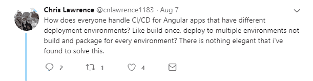
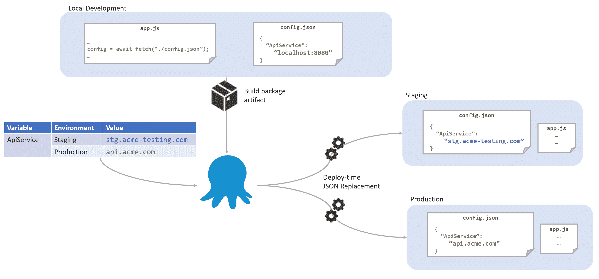
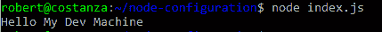
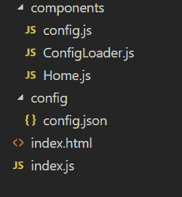
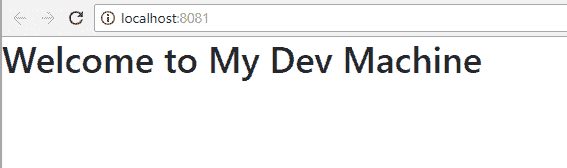

# 为 JavaScript 项目提供环境特定的配置——Octopus Deploy

> 原文：<https://octopus.com/blog/javascript-configuration>

将单页面应用程序(SPA)作为独立的 JavaScript 应用程序进行开发和部署是很常见的，但是，在将这些项目集成到典型的持续部署管道中时，会出现一个常见的问题。

[](#)

作为优秀的 DevOps 实践者，我们知道我们应该构建一次，部署多次，但是我们如何让这适用于我们的前端应用程序呢？

## 来自 JSON 的 JavaScript 配置

一些支持者相信[十二因素应用](https://12factor.net/config)中列出的戒律，并认为应用程序的所有配置都应该从单个环境变量中提取出来。依我的拙见，这种方法非常有限，原因有几个。

*   首先，这对于基于浏览器的运行时来说并不容易，在这种情况下，您有一个静态网站需要服务，并且需要在浏览器中获得该配置。
*   其次，这增加了您的托管环境的复杂性，因此您需要确保运行您的应用程序的每个进程都有自己的环境变量集合，这些环境变量在重启后持续存在，并且不会泄漏到其他实例(例如，您的测试虚拟机托管同一应用程序的多个实例)。
*   最后，当您只有一个需要在不同环境中不同的 URL 时，这可能很简单，但是在许多应用程序中，配置可能包括许多不同的变量，其中一些是深度嵌套的值。试图通过环境变量来管理和整合层次化信息有很多缺点。

最终，不将配置存储在代码中，而是存储在环境变量中的 12 因素应用程序解决方案，有点虚假的困境。我们知道在代码中存储配置既不是提供配置的最灵活也不是最安全的方式，但它是推荐的替代方案。任何好的部署工具都应该能够提供以自包含方式运行应用程序所需的特定于环境的变量。

### 配置为 JSON

创建一个简单的`config.json`文件，包含应用程序所需的配置。这个配置中的值可以是开发时需要的值。不需要在源代码中创建`config.staging.json`或`config.prod.json`文件，环境配置将由 Octopus(或您选择的部署工具)在部署时提供。避免这些*环境*配置文件，使我们的 CD 过程更加灵活，并避免将我们的基础设施阶段泄露到源代码中。在运行时，我们的代码需要做的就是像其他资源一样从服务器检索这个`config.json`文件。

[](#)

对于那些担心从应用程序的根目录获得一个`/config.json`的人来说，请记住，如果这些值被嵌入到您的 javascript 文件中，那么它们就像*一样开放*。如果您担心泄露敏感信息，那么前端可能不是存储这些信息的合适位置。一个好的副作用是，只需自己从浏览器加载配置，就可以非常容易地检查静态内容是否已经成功部署。通过将构建号和发布日期作为属性包含在配置文件中，我可以很容易地检查它们是否被部署到了正确的位置，以及它们是否通过了各种 cdn 和缓存。

## 例子

让我们通过几个例子来说明如何实现这一点。在您使用的任何框架中，有许多方法可以实现这种模式，因此您可能希望修改下面的示例来满足您的需要。

### NodeJs 应用

NodeJs 是一个非常简单的用例。只要我们将配置文件包含在分布式应用程序中，我们就可以像加载任何其他模块一样直接加载它:

```
const config = require("./config");
console.log(`Hello ${config.message}`); 
```

如果你尝试，你不可能得到比这更简单的配置。

[](#)

不需要检测环境，加载`config.prod.json`并与`config.json`中的默认值结合，或者与环境变量合并。

### React 应用

使用 React，我们希望将所有应用程序文件缩小并合并到一个 JavaScript 文件中，以优化运行时体验。我们不希望将配置文件嵌入到单个应用程序文件中，因为这使得我们更难以在部署时使用我们的环境特定值进行更新。相反，我们决定在加载配置文件时显示一个闪屏。这可以通过几个步骤来完成。

[](#)

从应用程序中的一个简单的`config.json`文件开始，我们提供了一个可以在开发和本地测试中使用的值。当我们按原样构建我们的应用程序时，该文件将被复制到我们的分发目录中:

#### `config/config.js`

```
{ "message": "My Dev Machine" } 
```

在这个场景中，我们使用 Webpack 来开发我们的代码，因此，我们包含了一行代码来将我们的`config.json`文件复制到输出目录:

#### `webpack.config.js`

```
const HtmlWebPackPlugin = require("html-webpack-plugin");
const CopyWebpackPlugin = require('copy-webpack-plugin');

module.exports = {
  module: {
    rules: [
      { test: /\.js$/, exclude: /node_modules/, use: { } },
      { test: /\.html$/, use: [ { loader: "html-loader" }] }
    ]
  },
  plugins: [
    new HtmlWebPackPlugin({ template: "./src/index.html", filename: "./index.html" }),
    new CopyWebpackPlugin([ { from: 'src/config/config.json', to: 'config.json', toType: 'file' } ], { })
  ]
}; 
```

我们的入口点`index.js`文件将使用一个`ConfigLoader`组件在运行时加载配置文件，并在完成时显示`Home`组件:

#### `index.js`

```
import React, { Component } from 'react';
import ReactDOM from 'react-dom';
import ConfigLoader from './components/ConfigLoader';
import Home from './components/Home';

class App extends Component {
  render() {
    // When the configuration is loaded, render the Home module
    return <ConfigLoader ready={() => <Home />} />;
  }
}

ReactDOM.render(<App />, document.getElementById('root')); 
```

`Home`组件显示通过配置提供的信息:

#### `components/Home.js`

```
import React, { Component } from 'react';
import config from './config';

export default class Home extends Component {
    render() {        return <div className="App">        
        <header className="App-header">
          <h1 className="App-title">Welcome to {config.message}</h1>
        </header>
      </div>;
    }
} 
```

如您所见，我们正在导入一个`config`模块。这不是上面创建的原始 JSON 文件。这是一个特殊的模块，我将在下面向您展示。由于该组件在`ConfigLoader`组件加载了`config.json`文件后才会呈现，我们可以假设 config 对象拥有我们需要的所有属性，在本例中只有`message`。

`ConfigLoader`组件简单地调用我们的配置模块上的`load`方法，并在配置加载后通过其 props 呈现请求的组件:

#### `components/ConfigLoader.js`

```
import { Component } from 'react';
import {load} from "./config";

export default class ConfigLoader extends Component {
    constructor(props){
        super(props);
        this.state = {isLoaded: false};
    }

  componentDidMount() {
     // Once the configuration is loaded set `isLoaded` to true so we know to render our component
     load().then(config =>  this.setState({isLoaded: true, config}));
  }

  render() {      
    // If we haven't yet loaded the config, show either a "splash" component provided via a `loading` props or return nothing.
    if(!this.state.isLoaded) {
        return this.props.loading ? this.props.loading() : null;
    }

    // The config is loaded so show the component set on the `ready()` props
    return this.props.ready(this.state.config);
  }
} 
```

真正的奇迹发生在我们的`config.json`组件中。我们最初提供一个空对象来代替我们的配置。我们这样做是为了当我们通过 HTTP fetch 命令加载配置时，我们有效地将属性从加载的对象复制到导出的对象上。这是因为导出的对象在第一次加载该模块时被有效地缓存:

#### `components/config.js`

```
const config = {};
export default config;

function load() {
    return fetch('config.json')
    .then(result => result.json())
    .then((newconfig) => {
        for(let prop in config) {
            delete config[prop]
        }
        for(let prop in newconfig) {
            config[prop] = newconfig[prop]
        }
        return config;
    });
}
export {load} 
```

在开发过程中，我们可以修改配置文件，Webpack 将触发刷新，就像我们正在更新任何其他文件一样。

[](#)

在我们的应用程序中，我们希望使用配置的任何地方(如上面的`Home`组件)，我们可以加载并简单地使用`config`模块并直接访问属性，因为所有向下的模块只有在`ConfigLoader`组件检索到配置后才会呈现。只要我们将`config.json`文件作为 CD 管道的一部分进行转换，我们将获得应用程序提供和使用的适当值。

这是一个相当简单的演示，根据您的用例，您可能希望将配置分派到 redux 存储中，或者您可能还希望处理更复杂的场景，如缓存破坏等。

### Angular 应用

我将无耻地插入 Pam Loahoud 关于为 Angular 创建可编辑的[配置文件](https://blogs.msdn.microsoft.com/premier_developer/2018/03/01/angular-how-to-editable-config-files/)的另一篇博客文章，而不是过多地重复上面关于不同框架的相同观点，因为这基本上遵循了与上面例子相同的基本前提。

在 Pam 的例子中，它归结为创建一个服务来检索静态托管的`config.json`文件:

```
import { Injectable } from '@angular/core’;
import { Http, Response } from '@angular/http';
import { environment } from '../environments/environment';
import { IAppConfig } from './models/app-config.model';

@Injectable()
export class AppConfig {

    static settings: IAppConfig;

    constructor(private http: Http) {}

    load() {
        const jsonFile = `assets/config/config.${environment.name}.json`;
        return new Promise<void>((resolve, reject) => {
            this.http.get(jsonFile).toPromise().then((response : Response) => {
               AppConfig.settings = <IAppConfig>response.json();
               resolve();
            }).catch((response: any) => {
               reject(`Could not load file '${jsonFile}': ${JSON.stringify(response)}`);
            });
        });
    }
} 
```

然后更新`app.module.ts`文件以在启动时调用该服务:

```
import { APP_INITIALIZER } from '@angular/core';
import { AppConfig } from './app.config';

export function initializeApp(appConfig: AppConfig) {
  return () => appConfig.load();
}
@NgModule({
    imports: [ , , , ],
    declarations: [ . . . ],
    providers: [
       AppConfig,
       { provide: APP_INITIALIZER,
         useFactory: initializeApp,
         deps: [AppConfig], multi: true }
    ],
    bootstrap: [
      AppComponent
    ]
})
export class AppModule { } 
```

就像 React 示例一样，当它在启动期间运行时，您可以在整个应用程序中使用配置:

```
export class DataService {
    protected apiServer = AppConfig.settings.apiServer;
    . . .
    if (AppConfig.settings.aad.requireAuth) { . . . }
} 
```

我喜欢使用 typescript 在开发时提供配置的类型检查。再说一次，在您构建的包中有了单个配置文件，关键是让您的部署工具执行适当的配置替换和转换。

## JavaScript 配置

套用我之前的一篇博文[中的观点，我们需要开始认真对待 CD 管道中的 JavaScript】，其中一部分涉及到遵循**构建一次，部署多次**的原则。配置不应该与代码共存，但是假设代码本身知道需要什么样的配置似乎是很自然的。让您的 CD 工具(如 Octopus Deploy)在部署时为您的应用程序提供配置，使部署到 50 个不同的环境与部署一个环境一样简单和安全。](https://octopus.com/blog/deploying-nodejs)