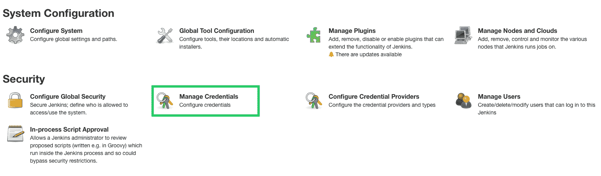
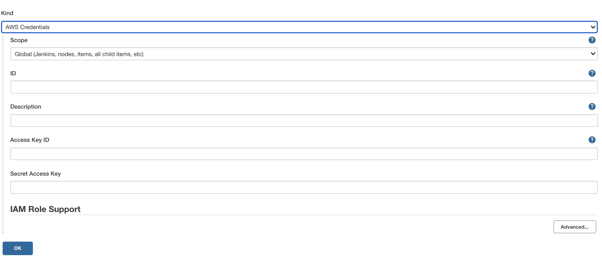
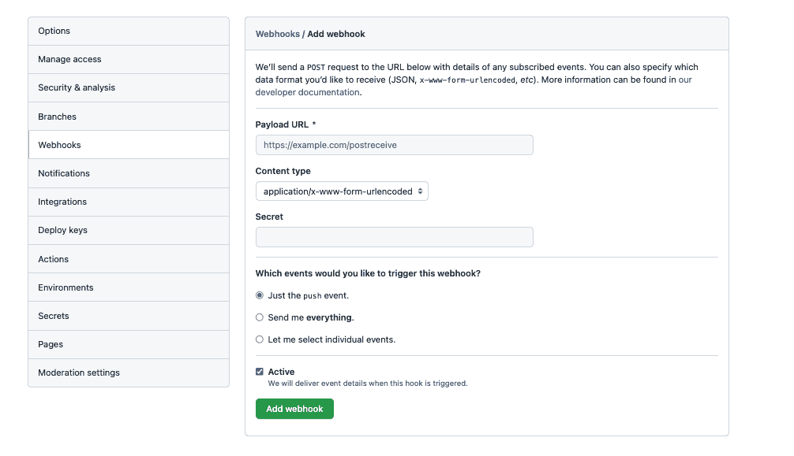
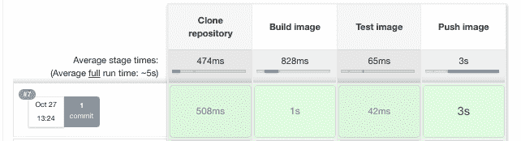

# 在 Jenkinsfile 中构建 Docker 映像并发布到 ECR - Octopus Deploy

> 原文：<https://octopus.com/blog/jenkins-docker-ecr>

在本文中，您将学习如何使用 Jenkins 构建 Octopus Deploy underwater app 并将其推送到 Amazon Elastic Container Registry(ECR)。

## 先决条件

要跟进，您需要:

*   亚马逊网络服务(AWS)帐户
*   詹金斯的例子
*   GitHub 账户

有关在您选择的环境中安装 Jenkins 的说明，您可以参考我们的指南:

这个帖子使用了 [Octopus 水下应用库](https://github.com/OctopusSamples/octopus-underwater-app)。您可以派生存储库并跟随它。

或者，jenkins-ecr 分支包含模板文件来完成本文中的步骤。你需要用你自己的价值观来代替一些价值观。我把我的价值观写在这篇文章里作为参考。

## 亚马逊网络服务设置

要为 Jenkins 设置 AWS，您需要创建一个访问密钥和一个 ECR 存储库来存储图像。

要创建访问密钥，请前往**亚马逊控制台**，然后 **IAM** ，然后**用户**、【你的用户】、**安全凭证**，以及**创建访问密钥**。

您的浏览器将下载一个包含访问密钥 ID 和秘密访问密钥的文件。这些值将在 Jenkins 中用于向 Amazon 认证。

要创建存储库，请转到**亚马逊控制台**，然后是 **ECR** ，然后是**创建存储库**。

您需要为发布的每个图像建立一个图像存储库。给存储库起一个您想让图像起的名字。

你会在**亚马逊 ECR** 下看到你的仓库，然后是**仓库**。记下它所在的区域，在 URI 场。

[](#)

## Jenkins 设置

首先，你需要安装一些插件来与 Docker 和 Amazon 交互。

进入**仪表板**，然后**管理詹金斯**，然后**管理插件**。

您需要以下插件:

你可以在**可用的**标签中搜索这些插件。安装后，它们出现在**已安装**选项卡中。

您使用一个 Jenkinsfile 来编译、构建、测试和推送图像到 Amazon ECR。Jenkinsfile 是定义 Jenkins 管道的配置文件。Jenkins Pipeline 是 Jenkins 对工件执行的一系列步骤，以实现期望的结果。在这种情况下，它是映像到 Amazon ECR 的克隆、构建、测试和推送。

使用 Jenkinsfile 的强大之处在于将它签入源代码控制中，以管理文件的不同版本。

在您的 Jenkins 实例中，转到**管理 Jenkins** ，然后**管理凭证**，然后 **Jenkins 存储**，然后**全局凭证(无限制)**，最后**添加凭证**。

[](#)

填写以下字段，将其他所有内容保留为默认值:

*   **种类** - AWS 凭证
*   **ID**-AWS-凭据，例如
*   **访问密钥 ID** -之前的访问密钥 ID
*   **秘密访问密钥** -之前的秘密访问密钥

点击**确定**保存。

[](#)

转到**詹金斯仪表板**，然后是**新项目**。

给你的管线命名，选择**管线**项，然后**确定**。

[T38](#)

填写管道的以下字段，其他内容保持默认:

*   **GITScm 轮询的 GitHub hook 触发器** -勾选该框
*   **定义** -来自 SCM 的管道脚本
*   **单片机** - Git
*   **存储库 URL**——分叉回购和 jenkins-ecr 分支的 URL
*   **凭证** -存储库的区域
*   **分支说明符** - `*/jenkins-ecr`

点击**保存**。

## GitHub 设置

对于这个示例，您使用一个示例 web 应用程序，该应用程序显示一个带有有用链接的水下动画场景。

您需要设置一个 webhook，以便 Jenkins 知道存储库何时更新。为此，转到**设置**，然后转到 **Webhooks** 。

[](#)

填写以下字段，其他内容保持默认。

*   **有效负载 URL** - `http://[jenkins-url]/github-webhook/`
*   **内容类型** - `application/json`
*   **您希望哪个事件触发此 webhook？** -选择**刚推事件**

点击**添加 webhook** 保存。

将 Jenkins 文件添加到存储库的根级别。您需要参考您的 Amazon ECR 存储库。请注意以下所需的更改:

```
 pipeline {
    agent any
    options {
        skipStagesAfterUnstable()
    }
    stages {
         stage('Clone repository') { 
            steps { 
                script{
                checkout scm
                }
            }
        }

        stage('Build') { 
            steps { 
                script{
                 app = docker.build("underwater")
                }
            }
        }
        stage('Test'){
            steps {
                 echo 'Empty'
            }
        }
        stage('Deploy') {
            steps {
                script{
                        docker.withRegistry('https://720766170633.dkr.ecr.us-east-2.amazonaws.com', 'ecr:us-east-2:aws-credentials') {
                    app.push("${env.BUILD_NUMBER}")
                    app.push("latest")
                    }
                }
            }
        }
    }
} 
```

Jenkinsfile 由不同的阶段组成。Jenkins 将按顺序运行这些阶段，如果构建失败，您将看到哪个阶段失败了。

将您的代码提交给 GitHub。该提交将在 Jenkins 中触发一个构建作业。转到您的 Jenkins 实例 URL 查看构建。

我必须通过点击 **Build now** 按钮来触发 Jenkins 作业。在此之后，webhook 触发器在每次推送时都起作用。

[](#)

构建完成后，转到 Amazon ECR，查看构建并推送到存储库的新映像。它用 Jenkins build 号和`latest`标记最新的推送。

[](#)

## 结论

在本文中，您设置了一个 Jenkins 管道来构建 GitHub 存储库，并将其推送到 Amazon ECR。Jenkinsfile 可以推送到其他容器注册中心，比如 Google 和微软提供的注册中心。根据构建要求，它还可以包括其他阶段。

在映像被推送之后，您可以使用像 Octopus Deploy 这样的工具将映像部署到目标环境。如果你还没有使用 Octopus Deploy，你可以[注册免费试用](https://octopus.com/start)。

查看我们关于使用 Jenkins、Kubernetes 和 Octopus Deploy 进行部署的其他帖子:

[试试我们免费的 Jenkins 管道生成器工具](https://oc.to/JenkinsPipelineGenerator)用 Groovy 语法创建一个管道文件。这是您启动管道项目所需的一切。

## 观看我们的詹金斯管道网络研讨会

[https://www.youtube.com/embed/D_7AHTML_xw](https://www.youtube.com/embed/D_7AHTML_xw)

VIDEO

我们定期举办网络研讨会。请参见[网络研讨会第](https://octopus.com/events)页，了解有关即将举办的活动和实时流媒体录制的详细信息。

阅读我们的[持续集成系列](https://octopus.com/blog/tag/CI%20Series)的其余部分。

愉快的部署！