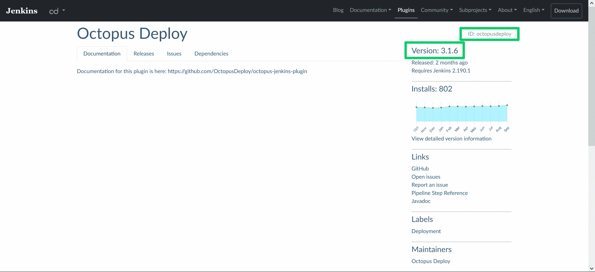

# 如何在 Docker - Octopus 部署上安装 Jenkins

> 原文：<https://octopus.com/blog/jenkins-docker-install-guide>

Docker 在通用应用程序包的竞争中胜出。每个主要的操作系统都支持 Docker 映像，所有的云提供商都支持部署 Docker 映像，每个主要的工具或平台都提供官方的 Docker 映像。詹金斯也不例外，提供图片[詹金斯/詹金斯](https://hub.docker.com/r/jenkins/jenkins)。

在这篇文章中，你将学习如何从 Docker 镜像运行 Jenkins，配置它，定制它，并使用镜像来代替传统的基于包的安装。

## 先决条件

要运行 Docker 映像，您必须安装 Docker。 [Docker 提供了在 Linux、macOS 和 Windows 上安装的详细说明](https://docs.docker.com/get-docker/)。

请注意，虽然最近版本的 Windows 获得了对运行 Docker 映像的本机支持，但 Jenkins 只提供基于 Linux 的 Docker 映像。Windows 和 macOS 可以通过虚拟化运行 Linux Docker 映像，因此这里显示的大多数命令同样适用于所有操作系统，但本文将重点关注 Linux。

## Jenkins Docker 图像入门

安装 Docker 后，可以使用以下命令运行 Jenkins:

```
docker run -p 8080:8080 -p 50000:50000 -v jenkins_home:/var/jenkins_home jenkins/jenkins:lts-jdk11 
```

让我们分解这个命令，以了解它在做什么。

`docker run`用于运行一个 Docker 镜像作为容器。

您可以将 Docker 映像视为一个只读工件，其中包含运行特定应用程序所需的文件。与大多数应用程序工件不同，Docker 映像包含一个完整的操作系统和支持正在运行的核心应用程序所需的所有相关系统工具。在 Jenkins 的例子中，这意味着 Docker 映像包含支持最小 Linux 操作系统所需的文件，以及运行 Jenkins 所需的 Java 版本。

容器是操作系统中的一个隔离环境，Docker 映像在其中执行。尽管 Docker 通常不提供虚拟机所提供的那种隔离保证，但容器确实提供了一种轻松并行运行可信代码的方式。

`-p`参数将本地端口映射到 Docker 容器公开的端口。第一个参数是本地端口，后跟一个冒号，然后是容器端口。

于是参数`-p 8080:8080`将本地端口 8080 映射到容器端口 8080(也就是 [web 端口](https://www.jenkins.io/doc/book/security/services/#web-ui)),`-p 50000:50000`将本地端口 50000 映射到容器端口 50000(也就是[代理端口](https://www.jenkins.io/doc/book/security/services/#tcp-agent-listener-port))。这意味着您可以在本地机器上打开 http://localhost:8080，Docker 将流量定向到容器托管的 web 服务器。

参数`-v jenkins_home:/var/jenkins_home`创建一个名为`jenkins_home`的卷，如果它还不存在的话，并把它挂载到容器内的路径`/var/jenkins_home`下。

虽然 Docker 映像是只读的，但 Docker 容器公开了一个读/写文件系统，允许任何正在运行的应用程序保存更改。但是，这些更改对于容器来说是本地的，如果容器被破坏，这些更改就会丢失。或者，如果您想要使用不同的容器，例如，如果您想要升级到较新版本的 Jenkins，对旧容器的更改也会丢失。

Docker 卷允许容器在容器生命周期之外保存数据，并与不同的容器共享数据。您可以将卷视为登录企业网络时通常会在会话中看到的网络驱动器。通过将可变数据保存到卷中，您可以销毁并重新创建 Jenkins 容器，或者基于较新的 Docker 映像创建新的容器，同时保留您对 Jenkins 配置所做的任何更改。

最后一个参数`jenkins/jenkins:lts-jdk11`是 Docker 图像的名称。这个特殊的图片可以在 Dockerhub 上找到，Dockerhub 是众多 Docker 注册中心中的一个，可以用来存放 Docker 图片。

注意，与 Docker 标签相关联的图像可以随着时间而改变。许多注册中心使用“浮动”标签来表示图像的最新版本。在 Jenkins 图像的情况下，带有标签`lts-jdk11`的图像随着每次 LTS 发布而更新。

为了确保您的本地机器有最新的映像，您必须手动运行`docker pull jenkins/jenkins:lts-jdk11`。但是请注意，任何现有的容器都将继续使用旧的映像，您必须创建一个新的容器来引用任何更新的映像。

更具体的标签，像`2.303.2-lts-jdk11`，一般不会被覆盖，所以没有理由在这些图像上运行`docker pull`。

要查看此命令创建的容器，请运行:

```
docker container ls 
```

您将看到容器的基本细节，以及一个(通常很幽默的)名称，如`nostalgic_tharp`:

```
CONTAINER ID   IMAGE                       COMMAND                  CREATED              STATUS              PORTS                                                                                      NAMES
801f4e834173   jenkins/jenkins:lts-jdk11   "/sbin/tini -- /usr/…"   About a minute ago   Up About a minute   0.0.0.0:8080->8080/tcp, :::8080->8080/tcp, 0.0.0.0:50000->50000/tcp, :::50000->50000/tcp   nostalgic_tharp 
```

要定义容器名，请传递参数`--name`:

```
docker run -d --name jenkins -p 8080:8080 -p 50000:50000 jenkins/jenkins:lts-jdk11 
```

第一次引导 Jenkins 时，Docker 日志将包含如下消息:

```
Jenkins initial setup is required. An admin user has been created and a password generated.
Please use the following password to proceed to installation:

1883c809f01b4ed585fb5c3e0156543a

This may also be found at: /var/jenkins_home/secrets/initialAdminPassword 
```

这个由数字和字母组成的随机字符串是初始管理员密码，是完成 Jenkins 配置所必需的。

当您在日志中看到以下消息时，打开 [http://localhost:8080](http://localhost:8080) :

```
Jenkins is fully up and running 
```

现在您有机会完成 Jenkins 实例的初始配置。请看一下[之前关于传统 Jenkins 安装的帖子](https://octopus.com/blog/jenkins-install-guide-windows-linux)，了解完成初始配置的更多细节。

您可能已经注意到，使用上面的命令运行 Docker 会将您的终端附加到容器输出流。要[在后台运行 Docker 图像](https://docs.docker.com/language/nodejs/run-containers/#run-in-detached-mode)，使用`-d`或`--detach`参数:

```
docker run -d -p 8080:8080 -p 50000:50000 -v jenkins_home:/var/jenkins_home jenkins/jenkins:lts-jdk11 
```

## 向 Jenkins 服务器添加附加软件

因为 Jenkins 是用 Java 编写的，所以通过运行 Jenkins Docker 映像创建的默认服务器拥有编译和测试 Java 应用程序所需的大部分软件。

要构建用其他语言编写的应用程序，您需要将外部 Jenkins 代理与所需的软件连接起来，并在这些软件上运行作业。使用代理是一种可伸缩的解决方案，如果您在生产环境中使用 Jenkins，那么您应该考虑这种解决方案。

对于本地测试，一个更方便的解决方案是构建一个定制的 Docker 映像，其中内置了所需的工具。为此，您需要创建一个名为`Dockerfile`的文件，内容如下:

```
FROM jenkins/jenkins:lts-jdk11
USER root
RUN apt update && \
    apt install -y --no-install-recommends gnupg curl ca-certificates apt-transport-https && \
    curl -sSfL https://apt.octopus.com/public.key | apt-key add - && \
    sh -c "echo deb https://apt.octopus.com/ stable main > /etc/apt/sources.list.d/octopus.com.list" && \
    apt update && apt install -y octopuscli
USER jenkins 
```

`Dockerfile`文件用于构建新的 Docker 映像。你可以从 [Docker 文档](https://docs.docker.com/engine/reference/builder/)中找到`Dockerfile`中可用命令的完整参考。上面的示例使用了一小部分命令，但展示了一个基于 Jenkins 提供的图像的典型自定义图像。

该文件以`FROM`命令开始，该命令指示 Docker 从提供的图像构建新图像。这意味着您的新映像已经安装并配置了 Jenkins 和任何支持工具:

```
FROM jenkins/jenkins:lts-jdk11 
```

为了安装新软件，您必须切换到`root`用户。就像普通的 Linux 操作系统一样，只有特权用户才能从软件包管理器安装新软件:

```
USER root 
```

下一个命令执行软件安装。本示例使用来自 [Octopus 网站](https://octopus.com/downloads/octopuscli#linux)的说明安装 Octopus CLI:

```
RUN apt update && \
    apt install -y --no-install-recommends gnupg curl ca-certificates apt-transport-https && \
    curl -sSfL https://apt.octopus.com/public.key | apt-key add - && \
    sh -c "echo deb https://apt.octopus.com/ stable main > /etc/apt/sources.list.d/octopus.com.list" && \
    apt update && apt install -y octopuscli 
```

让一个普通用户帐户运行 Docker 容器中的应用程序被认为是最佳实践。`jenkins`用户是在基本映像中创建的，因此您可以使用最后一个命令切换回该用户:

```
USER jenkins 
```

要使用`Dockerfile`构建新的 Docker 映像，请运行:

```
docker build . -t myjenkins 
```

该命令构建一个名为`myjenkins`的新映像。要运行新映像，首先使用`jenkins_home`卷停止任何现有容器:

```
docker container stop nostalgic_tharp 
```

然后运行您的新映像，挂载现有的`jenkins_home`卷，以保留您现有的所有 Jenkins 配置:

```
docker run -p 8080:8080 -p 50000:50000 -v jenkins_home:/var/jenkins_home myjenkins 
```

## 安装附加的 Jenkins 插件

安装新插件最简单的方法是使用 Jenkins web UI。任何新插件都存储到外部卷，因此即使您创建、销毁和更新容器，它们也是可用的。

您还可以通过调用包含在基础 Jenkins 映像中的`jenkins-plugin-cli`脚本来自动化安装插件的过程，作为自定义 Docker 映像的一部分。

这里有一个`Dockerfile`安装 [Octopus Jenkins 插件](https://plugins.jenkins.io/octopusdeploy/)的例子:

```
FROM jenkins/jenkins:lts-jdk11
USER root
RUN apt update && \
    apt install -y --no-install-recommends gnupg curl ca-certificates apt-transport-https && \
    curl -sSfL https://apt.octopus.com/public.key | apt-key add - && \
    sh -c "echo deb https://apt.octopus.com/ stable main > /etc/apt/sources.list.d/octopus.com.list" && \
    apt update && apt install -y octopuscli
RUN jenkins-plugin-cli --plugins octopusdeploy:3.1.6
USER jenkins 
```

这个`Dockerfile`类似于前面的例子，但是包括一个新的`RUN`语句来安装 Octopus 插件:

```
RUN jenkins-plugin-cli --plugins octopusdeploy:3.1.6 
```

插件 ID ( `octopusdeploy`)和版本(`3.1.6`)可从 [Jenkins 插件网站](https://plugins.jenkins.io/octopusdeploy/)找到:

[](#)

## 发布自定义 Docker 图像

要发布您的自定义 Docker 图像，您需要一个 Docker 注册表帐户。DockerHub 是一个受欢迎的选择，它提供公共图像的免费托管。

[创建一个免费账户](https://hub.docker.com/signup)，然后使用命令登录:

```
docker login 
```

要构建可以发布到 DockerHub 的映像，运行以下命令，用您的 DockerHub 用户名替换`username`:

```
docker build . -t username/myjenkins 
```

使用以下命令发布图像:

```
docker push username/myjenkins 
```

我的 DockerHub 用户名是`mcasperson`，所以我运行这些命令来构建和发布一个图像:

```
docker build . -t mcasperson/myjenkins
docker push mcasperson/myjenkins 
```

然后我的自定义 Docker 图像就可以从 [DockerHub](https://hub.docker.com/r/mcasperson/myjenkins) 获得了。

## 传递 Java 参数

高级 Jenkins 配置通常通过传递 Java 参数来执行，通常是以系统属性的形式。

Jenkins Docker 映像允许在`JAVA_OPTS`环境变量中定义 Java 参数。这个环境变量由启动 Jenkins 的 [Docker 映像脚本读取，并作为 Java 参数传递。](https://github.com/jenkinsci/docker/blob/master/jenkins.sh)

要定义`JAVA_OPTS`环境变量，请将`--env`参数传递给`docker run`命令:

```
docker run -p 8080:8080 -p 50000:50000 -v jenkins_home:/var/jenkins_home --env JAVA_OPTS=-Dhudson.footerURL=http://mycompany.com jenkins/jenkins:lts-jdk11 
```

Jenkins 系统属性列表可在 [Jenkins 文档](https://www.jenkins.io/doc/book/managing/system-properties/)中找到。

## 传递詹金斯论点

除了系统属性之外，Jenkins 还接受许多应用程序参数。

应用程序参数通过将它们附加到 Docker run 命令的末尾来定义。以下示例传递了配置 Jenkins 监听端口 8081 的参数`--httpPort`:

```
docker run -p 8080:8081 -p 50000:50000 -v jenkins_home:/var/jenkins_home jenkins/jenkins:lts-jdk11 --httpPort=8081 
```

应用程序参数也可以在`JENKINS_OPTS`环境变量中定义:

```
docker run -p 8080:8081 -p 50000:50000 -v jenkins_home:/var/jenkins_home --env JENKINS_OPTS=--httpPort=8081 jenkins/jenkins:lts-jdk11 
```

在 [Winstone GitHub 库](https://github.com/jenkinsci/winstone#command-line-options)中可以找到应用参数列表。Winstone 是 Jenkins 中默认的嵌入式 servlet 容器。

## 备份 Docker 卷

您可以运行以下命令来备份保存在托管`/var/jenkins_home`目录的 Docker 卷中的数据。它将卷挂载到一个新的容器中，将当前工作目录挂载到容器的`/backup`目录中，并创建一个名为`backup.tar`的归档文件，其中包含`/var/jenkins`目录的内容:

```
docker run --rm -v jenkins_home:/var/jenkins_home -v $(pwd):/backup ubuntu tar cvf /backup/backup.tar /var/jenkins_home 
```

这个命令可以在 Jenkins 容器运行时运行，因为 Docker 卷可以在运行的容器之间共享。然而，[建议您在执行备份之前停止 Jenkins](https://docs.cloudbees.com/docs/admin-resources/latest/backup-restore/best-practices):

> 尽管 Jenkins 利用了 COW，但建议您在执行备份之前尽可能停止 Jenkins，因为管道工作流 XML 文件可能会在不一致的状态下被捕获(例如，如果备份没有在该确切时刻拍摄每个文件的“即时快照”)。

## 将 Docker 图像作为服务运行

当底层操作系统重启时，Jenkins 的生产实例必须自动重启。然而，这不是您使用上面显示的 Docker 命令启动的容器的默认行为，因此任何 Jenkins 容器在 OS 重启后都将保持停止状态。

要解决这个问题，您可以将 Docker 容器作为 systemd 服务运行。这允许您管理 Jenkins 容器，就像管理安装了包管理器的 Jenkins 实例一样。

要创建新的 systemd 服务，请将以下内容保存到文件`/etc/systemd/system/docker-jenkins.service`:

```
[Unit]
Description=Jenkins

[Service]
SyslogIdentifier=docker-jenkins
ExecStartPre=-/usr/bin/docker create -m 0b -p 8080:8080 -p 50000:50000 --restart=always --name jenkins jenkins/jenkins:lts-jdk11
ExecStart=/usr/bin/docker start -a jenkins
ExecStop=-/usr/bin/docker stop --time=0 jenkins

[Install]
WantedBy=multi-user.target 
```

要加载新的服务文件，请运行以下命令:

```
sudo systemctl daemon-reload 
```

要启动该服务，请运行命令:

```
sudo systemctl start docker-jenkins 
```

要使服务能够在重启时运行，请运行以下命令:

```
sudo systemctl enable docker-jenkins 
```

要查看服务日志，请运行命令:

```
sudo journalctl -u docker-jenkins -f 
```

## 结论

从 Docker 映像运行 Jenkins 提供了一种在自包含的预配置环境中启动 Jenkins 的便捷方法。

在这篇文章中，你学会了如何:

*   把詹金斯放在码头集装箱里
*   安装附加工具和插件
*   传递 Java 系统属性和 Jenkins 应用程序参数
*   备份 Docker 卷
*   将 Docker 容器配置为 systemd 服务

然而，在工作站或服务器上运行 Docker 镜像仅仅是个开始。在下一篇文章中，您将学习如何将 Jenkins 部署到 Kubernetes 集群中。

[试试我们免费的 Jenkins 管道生成器工具](https://oc.to/JenkinsPipelineGenerator)用 Groovy 语法创建一个管道文件。这是您启动管道项目所需的一切。

## 观看我们的詹金斯管道网络研讨会

[https://www.youtube.com/embed/D_7AHTML_xw](https://www.youtube.com/embed/D_7AHTML_xw)

VIDEO

我们定期举办网络研讨会。请参见[网络研讨会第](https://octopus.com/events)页，了解即将举办的活动和现场直播的详细信息。

阅读我们的[持续集成系列](https://octopus.com/blog/tag/CI%20Series)的其余部分。

愉快的部署！