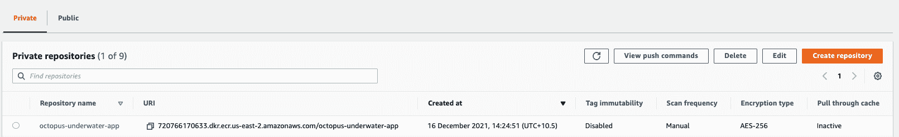
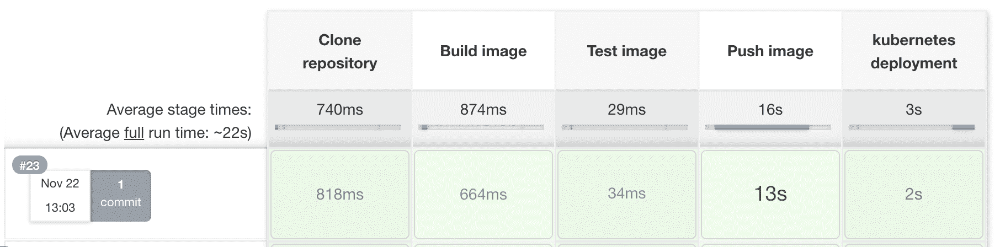

# 使用 Docker 和 Jenkins - Octopus Deploy 部署到亚马逊 EKS

> 原文：<https://octopus.com/blog/jenkins-eks-ecr-deployment>

在本文中，我将向您展示如何使用 Jenkinsfile 工作流构建 Docker 图像，并将图像发布到 Amazon Elastic Container Registry(ECR)。Jenkins 将触发对 Amazon Elastic Kubernetes 服务(EKS)的部署。

Jenkins 是一个构建服务器，可以自动构建您的代码库。Jenkins 通过 Jenkinsfile 实现这一点，Jenkins file 是一个配置文件，它指定了构建、推送和部署应用程序的步骤。

亚马逊 EKS 是一种托管云服务，提供 Kubernetes 集群来处理工作负载应用程序。Kubernetes 集群还接受一个由 YAML 语法指定的配置文件。

此工作流的强大之处在于，可以为流程的所有阶段指定配置文件，并在不同的环境中稍加修改即可重用。

## 先决条件

要跟进，您需要:

对于这个例子，您需要扩展存储库来包含一个部署 YAML 文件。Jenkins 将使用此部署文件部署到 EKS。将此文件添加到存储库的根级别。

这个帖子使用了 [Octopus 水下应用库](https://github.com/OctopusSamples/octopus-underwater-app)。您可以分叉存储库，并使用主分支来跟进。

jenkins-deploy 分支包含完成本文中的步骤所需的模板文件。你必须用你自己的价值观来代替一些价值观，但是我已经在这篇文章中列出了我的价值观作为参考。

因为您正在使用 Kubernetes，所以需要用一个配置文件来配置代理。[亚马逊的文档](https://awscli.amazonaws.com/v2/documentation/api/latest/reference/eks/update-kubeconfig.html)向你展示如何配置你的代理。

AWS 还需要 [aws-iam-authenticator 二进制文件](https://docs.aws.amazon.com/eks/latest/userguide/install-aws-iam-authenticator.html)。

## 亚马逊网络服务设置

要为 Jenkins 设置 AWS，您需要创建一个访问密钥和一个 ECR 存储库来存储图像。

要创建访问密钥，请转到**亚马逊控制台**，然后 **IAM** ，然后**用户**、`[your user]`，然后**安全凭证**，然后**创建访问密钥**。

您的浏览器下载一个包含访问密钥 ID 和秘密访问密钥的文件。Jenkins 使用这些值向 Amazon 认证。

要创建存储库，请转到**亚马逊控制台**，然后转到 **ECR** ，然后转到**创建存储库**。

您需要为发布的每个图像建立一个图像存储库。给存储库起一个您想让图像起的名字。

你会在**亚马逊 ECR** 下看到你的仓库，然后是**仓库**。记下它所在的区域，在 URI 场。

[](#)

### AWS 集群设置

使用我们上一篇文章[中的指南在 AWS 中设置集群，在 AWS 中创建 ESK 集群](https://octopus.com/blog/eks-cluster-aws)。

在存储库的根级别创建一个名为`deployment.yml`的文件。

```
apiVersion: apps/v1
kind: Deployment
metadata:
  name: underwater-app-jenkins 
  labels:
    app: octopus-underwater-app
spec:
  selector:
    matchLabels:
        app: octopus-underwater-app
  replicas: 3
  strategy:
    type: RollingUpdate
  template:
    metadata:
      labels:
        app: octopus-underwater-app
    spec:
      containers:
        - name: octopus-underwater-app
          image: 720766170633.dkr.ecr.us-east-2.amazonaws.com/octopus-underwater-app:latest
          ports:
            - containerPort: 80
              protocol: TCP
          imagePullPolicy: Always 
```

在存储库的根级别创建一个名为`Jenkinsfile`的文件。

```
 pipeline {
    agent any
    options {
        skipStagesAfterUnstable()
    }
    stages {
         stage('Clone repository') { 
            steps { 
                script{
                checkout scm
                }
            }
        }

        stage('Build') { 
            steps { 
                script{
                 app = docker.build("octopus-underwater-app")
                }
            }
        }
        stage('Test'){
            steps {
                 echo 'Empty'
            }
        }
        stage('Push') {
            steps {
                script{
                        docker.withRegistry('https://720766170633.dkr.ecr.us-east-2.amazonaws.com', 'ecr:us-east-2:aws-credentials') {
                    app.push("${env.BUILD_NUMBER}")
                    app.push("latest")
                    }
                }
            }
        }
        stage('Deploy'){
            steps {
                 sh 'kubectl apply -f deployment.yml'
            }
        }

    }
} 
```

Jenkins 将克隆、构建、测试、推送和部署映像到 EKS 集群。Jenkins 通过您之前创建的部署文件来完成这项工作。

Jenkins 是一个持续集成(CI)工具，专注于构建映像并将其推送到远程存储库。使用它作为连续部署(CD)工具是可能的，但是，它不能通过不同的部署阶段跟踪一个版本。

像 Octopus Deploy 这样的连续部署工具可以在部署复杂时帮助您管理发布。Octopus 实现了专用持续部署工具的优势。如果你还没有使用 Octopus Deploy，你可以[注册免费试用](https://octopus.com/start)。

[](#)

## 查看 web 应用程序

您需要本地端口转发来检查服务。使用此命令检查 web 应用程序。端口 28015 是根据 Kubernetes 文档中的示例选择的:

```
kubectl port-forward deployment/underwater-app-jenkins  28015:80 
```

在浏览器中进入 IP 地址`http://127.0.0.1:28015/`查看您的网络应用程序。

[](#)

## 结论

在本文中，您和 Jenkins 一起在 EKS 部署了一个 web 应用程序。这个例子演示了 Jenkins 如何配置部署代码库所需的步骤。亚马逊 EKS 公司提供了 Kubernetes 基础设施来处理 web 应用程序负载。这个过程中的所有步骤都是通过指定配置文件来执行的。这些配置文件提供了跨不同环境的可重用性。

查看我们关于使用 Jenkins、Kubernetes 和 Octopus Deploy 进行部署的其他帖子:

试试我们免费的 Jenkins 管道生成器工具用 Groovy 语法创建一个管道文件。这是您启动管道项目所需的一切。

阅读我们的[持续集成系列](https://octopus.com/blog/tag/CI%20Series)的其余部分。

愉快的部署！