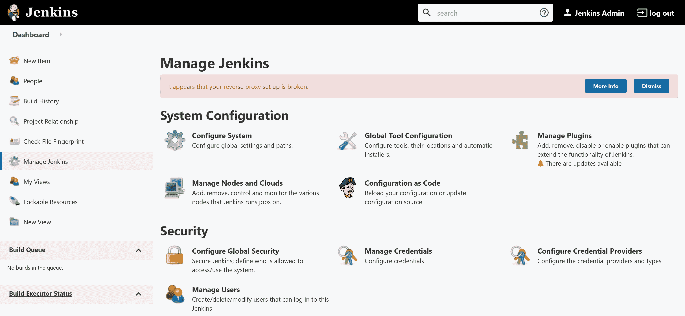
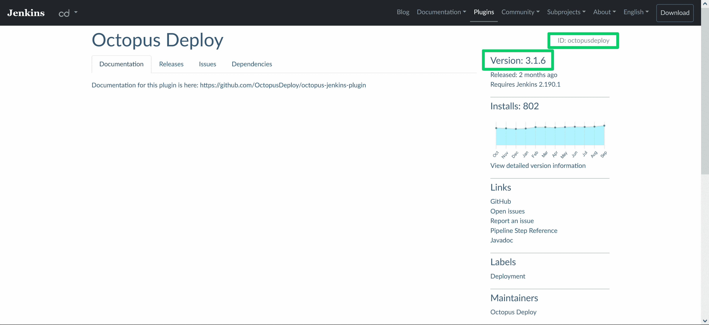
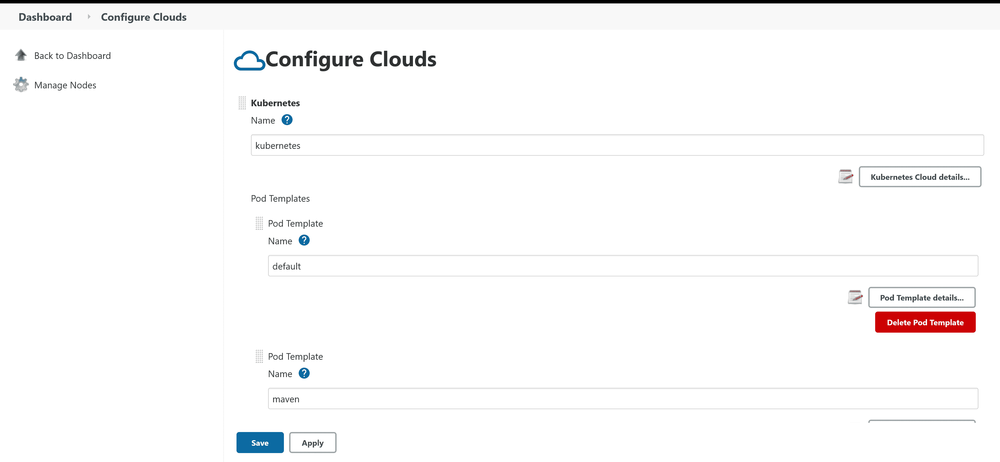

# 如何使用 Helm - Octopus Deploy 安装 Jenkins 实例

> 原文：<https://octopus.com/blog/jenkins-helm-install-guide>

Kubernetes (K8s)已经成为托管 Docker 容器的最广泛使用的平台之一。Kubernetes 提供高级编排功能、网络功能、集成安全性、用户管理、高可用性、卷管理、广泛的支持工具生态系统等等。

一个支持工具是 [Helm](https://helm.sh/) ，它为 Kubernetes 提供包管理功能。Helm 部署的应用程序在图表中定义，Jenkins [提供了一个 Helm 图表](https://github.com/jenkinsci/helm-charts/blob/main/charts/jenkins/README.md)来将 Jenkins 实例部署到 Kubernetes。

在本文中，您将学习如何使用 Helm 和 connect 代理安装 Jenkins 实例来执行构建任务。

## 先决条件

要阅读这篇文章，您需要一个 Kubernetes 集群和 Helm 客户端。

所有主要的云提供商都提供托管的 Kubernetes 集群:

*   AWS 有 [EKS](https://aws.amazon.com/eks/)
*   Azure 有[个 AK](https://azure.microsoft.com/en-au/services/kubernetes-service/)
*   谷歌云有 [GKE](https://cloud.google.com/kubernetes-engine)

如果您想在本地 PC 上运行一个开发 Kubernetes 集群， [kind](https://kind.sigs.k8s.io/docs/user/quick-start/) 允许您创建和销毁用于测试的集群。帖子[用种类](https://octopus.com/blog/testing-with-kind)创建测试 Kubernetes 集群提供了在本地运行 Kubernetes 的指导。

您还必须安装 Helm 客户端。[舵文档](https://helm.sh/docs/intro/install/)提供安装说明。

## 添加 Jenkins 图表存储库

詹金斯掌舵图由[https://charts . Jenkins . io](https://charts.jenkins.io)提供。要使此图表存储库可用，请运行以下命令:

```
helm repo add jenkins https://charts.jenkins.io
helm repo update 
```

## 部署简单的 Jenkins 实例

要使用默认设置部署 Jenkins 实例，请运行命令:

```
helm upgrade --install myjenkins jenkins/jenkins 
```

`helm upgrade`命令通常用于升级现有版本。然而,`--install`参数确保了如果发布不存在，它就会被创建。这意味着`helm upgrade --install`创建*和*更新一个版本，消除了根据该版本是否存在而修改安装和升级命令的需要。

发布的名称是`myjenkins`，最后一个参数`jenkins/jenkins`定义了要安装的图表。

输出如下所示:

```
$ helm upgrade --install myjenkins jenkins/jenkins

Release "myjenkins" does not exist. Installing it now.
NAME: myjenkins
LAST DEPLOYED: Tue Oct 19 08:13:11 2021
NAMESPACE: default
STATUS: deployed
REVISION: 1
NOTES:
1\. Get your 'admin' user password by running:
  kubectl exec --namespace default -it svc/myjenkins -c jenkins -- /bin/cat /run/secrets/chart-admin-password && echo
2\. Get the Jenkins URL to visit by running these commands in the same shell:
  echo http://127.0.0.1:8080
  kubectl --namespace default port-forward svc/myjenkins 8080:8080

3\. Login with the password from step 1 and the username: admin
4\. Configure security realm and authorization strategy
5\. Use Jenkins Configuration as Code by specifying configScripts in your values.yaml file, see documentation: http:///configuration-as-code and examples: https://github.com/jenkinsci/configuration-as-code-plugin/tree/master/demos

For more information on running Jenkins on Kubernetes, visit:
https://cloud.google.com/solutions/jenkins-on-container-engine

For more information about Jenkins Configuration as Code, visit:
https://jenkins.io/projects/jcasc/

NOTE: Consider using a custom image with pre-installed plugins 
```

注释中列出的第一个命令返回用户`admin`的密码:

```
$ kubectl exec --namespace default -it svc/myjenkins -c jenkins -- /bin/cat /run/secrets/chart-admin-password && echo 
```

notes 中列出的第二个命令建立了到 Kubernetes 集群中服务的隧道。

在 Kubernetes 中，服务是配置集群网络以公开一个或多个 pod 的资源。默认的服务类型是`ClusterIP`，它通过私有 IP 地址公开 pod。我们就是通过这个私有 IP 地址来访问 Jenkins web UI 的。

Kubernetes pod 是托管一个或多个容器的资源。这意味着 Jenkins 实例作为 pod 中的一个容器运行:

```
$ kubectl --namespace default port-forward svc/myjenkins 8080:8080
Forwarding from 127.0.0.1:8080 -> 8080
Forwarding from [::1]:8080 -> 8080 
```

建立隧道后，在本地 PC 上打开 [http://localhost:8080](http://localhost:8080) ，您将被定向到 Kubernetes 集群中的 Jenkins 实例。使用用户名`admin`和第一个命令返回的密码登录。

现在，您已经有了一个运行在 Kubernetes 中的功能性的(如果是基本的)Jenkins 实例。

## 通过公共 IP 地址暴露詹金斯

通过隧道访问 Jenkins 对于调试很有用，但对于生产服务器来说不是很好的体验。要通过公开可用的 IP 地址访问 Jenkins，您必须覆盖图表中定义的默认配置。可以定义数百个值，通过运行以下命令可以获得完整的列表:

```
helm show values jenkins/jenkins 
```

配置将 Jenkins pod 公开为`LoadBalancer`的服务是公开访问 Jenkins 的最简单的方法。

类型为`LoadBalancer`的服务通过公共 IP 地址公开 pod。如何创建公共 IP 地址的问题留给集群来解决。例如，EKS、AKS 和 GKE 等托管的 Kubernetes 平台创建了一个网络负载平衡器，将流量导入 K8s 集群。

注意，`LoadBalancer`服务在使用本地测试 Kubernetes 集群时需要额外的配置，比如 kind 创建的集群。更多信息请参考[种类文档](https://kind.sigs.k8s.io/docs/user/loadbalancer/)。

要将服务配置为`LoadBalancer`，您需要创建一个名为`values.yaml`的文件，其内容如下:

```
controller:
  serviceType: LoadBalancer 
```

然后，使用命令`values.yaml`中定义的值升级 Helm 版本:

```
helm upgrade --install -f values.yaml myjenkins jenkins/jenkins 
```

通过添加新的指令来返回服务的公共 IP，输出有了细微的变化:

```
$ helm upgrade --install -f values.yaml myjenkins jenkins/jenkins
Release "myjenkins" has been upgraded. Happy Helming!
NAME: myjenkins
LAST DEPLOYED: Tue Oct 19 08:45:23 2021
NAMESPACE: default
STATUS: deployed
REVISION: 4
NOTES:
1\. Get your 'admin' user password by running:
  kubectl exec --namespace default -it svc/myjenkins -c jenkins -- /bin/cat /run/secrets/chart-admin-password && echo
2\. Get the Jenkins URL to visit by running these commands in the same shell:
  NOTE: It may take a few minutes for the LoadBalancer IP to be available.
        You can watch the status of by running 'kubectl get svc --namespace default -w myjenkins'
  export SERVICE_IP=$(kubectl get svc --namespace default myjenkins --template "{{ range (index .status.loadBalancer.ingress 0) }}{{ . }}{{ end }}")
  echo http://$SERVICE_IP:8080/login

3\. Login with the password from step 1 and the username: admin
4\. Configure security realm and authorization strategy
5\. Use Jenkins Configuration as Code by specifying configScripts in your values.yaml file, see documentation: http:///configuration-as-code and examples: https://github.com/jenkinsci/configuration-as-code-plugin/tree/master/demos

For more information on running Jenkins on Kubernetes, visit:
https://cloud.google.com/solutions/jenkins-on-container-engine

For more information about Jenkins Configuration as Code, visit:
https://jenkins.io/projects/jcasc/

NOTE: Consider using a custom image with pre-installed plugins 
```

使用步骤 2 中的新说明，运行以下命令获取服务的公共 IP 地址或主机名:

```
kubectl get svc --namespace default myjenkins --template "{{ range (index .status.loadBalancer.ingress 0) }}{{ . }}{{ end }}" 
```

我已将 Jenkins 部署到 EKS 集群，这是我的基础架构命令的结果:

```
$ kubectl get svc --namespace default myjenkins --template "{{ range (index .status.loadBalancer.ingress 0) }}{{ . }}{{ end }}"
a84aa6226d6e5496882cfafdd6564a35-901117307.us-west-1.elb.amazonaws.com 
```

要访问 Jenkins，打开[http://service _ IP _ or _ hostname:8080](http://service_ip_or_hostname:8080)。

您可能会注意到，当您通过 Jenkins 的公共 IP 地址访问它时，它会报告以下错误:

```
It appears that your reverse proxy set up is broken. 
```

[](#)

这可以通过在`controller.jenkinsUrl`属性中定义公共 URL 来解决，用 Jenkins 实例的 IP 地址或主机名替换`a84aa6226d6e5496882cfafdd6564a35-901117307.us-west-1.elb.amazonaws.com`:

```
controller:
  jenkinsUrl: http://a84aa6226d6e5496882cfafdd6564a35-901117307.us-west-1.elb.amazonaws.com:8080/ 
```

## 安装附加插件

列出要安装在`controller.additionalPlugins`阵列中的任何附加插件:

```
controller:
    additionalPlugins:
    - octopusdeploy:3.1.6 
```

插件 ID 和版本可在 [Jenkins 插件网站](https://plugins.jenkins.io/octopusdeploy/)上找到:

[](#)

这种方法很方便，但是缺点是 Jenkins 实例需要联系 Jenkins 更新站点来检索它们，作为第一次引导的一部分。

一种更健壮的方法是下载插件作为定制映像的一部分，这可以确保插件被嵌入到 Docker 映像中。它还允许在 Jenkins 控制器上安装额外的工具。[上一篇文章](https://octopus.com/blog/jenkins-docker-install-guide)详细介绍了构建和发布自定义 Docker 图像。

请注意，除了任何自定义插件之外，自定义 Docker 映像还必须安装以下插件。这些插件是舵图正常工作所必需的:

*   库伯内特斯
*   工作流聚合器
*   饭桶
*   代码配置

下面是一个包含强制插件的示例`Dockerfile`:

```
FROM jenkins/jenkins:lts-jdk11
USER root
RUN apt update && \
    apt install -y --no-install-recommends gnupg curl ca-certificates apt-transport-https && \
    curl -sSfL https://apt.octopus.com/public.key | apt-key add - && \
    sh -c "echo deb https://apt.octopus.com/ stable main > /etc/apt/sources.list.d/octopus.com.list" && \
    apt update && apt install -y octopuscli
RUN jenkins-plugin-cli --plugins octopusdeploy:3.1.6 kubernetes:1.29.2 workflow-aggregator:2.6 git:4.7.1 configuration-as-code:1.52
USER jenkins 
```

要使用自定义图像，您可以在`values.yml`中用以下属性定义它。此示例使用了推送到我的 DockerHub 帐户的自定义 Jenkins 图像[:](https://hub.docker.com/r/mcasperson/myjenkins)

```
controller:
  image: "docker.io/mcasperson/myjenkins"
  tag: "latest"
  installPlugins: false 
```

你可以在[Jenkins-complete-image repository](https://github.com/OctopusSamples/jenkins-complete-image)中找到一个为 Java、DotNET Core、PHP、Python、Ruby 安装工具的例子`Dockerfile`。

## 詹金斯配置代码

Jenkins Configuration as Code(JC ASC)是一个[插件](https://plugins.jenkins.io/configuration-as-code/)，它提供了一种通过 YAML 文件配置 Jenkins 的自以为是的方法。这为直接引用 Jenkins API 编写 [Groovy 脚本提供了一种替代方法，这种方法功能强大，但要求管理员能够熟练地编写代码。](https://www.jenkins.io/doc/book/managing/groovy-hook-scripts/)

JCasC 是在`controller.JCasC.configScript`属性下定义的。`configScript`下的子键有您选择的由小写字母、数字和连字符组成的名称，并作为一种总结它们定义的文本块的方式。

分配给这些键的值是多行字符串，它们反过来定义了一个 JCasC YAML 文件。竖线(`|`)字符为定义多行字符串提供了一种方便的方法，但在其他方面并不重要。

最终结果给出了连续的 YAML 文档的外观。请记住，管道字符后面出现的内容只是一个多行文本值，碰巧也是 YAML。

以下示例配置了 Jenkins 控制器可用的执行器数量，JCasC YAML 定义在一个名为`this-is-where-i-configure-the-executors`的夸张键下，以强调这些键可以有任何名称:

```
controller:
  JCasC:
    configScripts:
      this-is-where-i-configure-the-executors: |
        jenkins:
          numExecutors: 5 
```

作为比较，同样的配置也可以用下面的 Groovy 脚本来实现，该脚本在一个定制的 Docker 映像中保存为`/usr/share/jenkins/ref/init.groovy.d/executors.groovy`:

```
import jenkins.model.*
Jenkins.instance.setNumExecutors(5) 
```

甚至这个简单的例子也强调了 JCasC 的好处:

*   每个 JCasC 属性都记录在 http://Jenkins host/configuration-as-code/reference 中(用您自己的 Jenkins 实例的主机名替换`jenkinshost`，而编写 Groovy 脚本需要了解 [Jenkins API](https://javadoc.jenkins-ci.org/jenkins/model/Jenkins.html) 。
*   JCasC 配置是普通的 YAML，比用 Groovy 编写的脚本更容易理解。
*   JCasC 坚持己见，为通用配置提供了一致的方法。Groovy 脚本可以用多种方式解决同一个问题，这意味着包含多行代码的脚本需要软件工程师的专业知识才能理解。

尽管有这么多好处，JCasC 并不能完全替代设置系统属性或运行 Groovy 脚本。例如， [JCasC 将不支持禁用 CSRF](https://github.com/jenkinsci/configuration-as-code-plugin/issues/1184) 的功能，这意味着该选项只能通过系统属性公开。

## 备份 Jenkins 卷

Kubernetes 中的卷比常规 Docker 中的卷稍微复杂一些，因为 K8s 卷倾向于托管在运行 pod 的节点之外。这是因为 pod 可以在节点之间重新定位，因此需要从任何节点访问卷。

更复杂的是，与 Docker 卷不同，只有专门的 Kubernetes 卷可以在 pod 之间共享。这些共享卷被称为`ReadWriteMany`卷。不过，通常情况下，Kubernetes 卷仅由单个 pod 使用，被称为`ReadWriteOnce`卷。

Jenkins Helm 图表配置了一个`ReadWriteOnce`卷来托管 Jenkins 主目录。因为该卷只能由装入该卷的 pod 访问，所以所有备份操作都必须由该 pod 执行。

幸运的是，Helm chart 提供了[全面的备份选项](https://github.com/jenkinsci/helm-charts/blob/main/charts/jenkins/README.md#backup)，能够执行备份并将它们保存到云存储提供商。

但是，您可以使用两个命令来编排简单的、与云无关的备份。

第一个命令在 pod 内部执行`tar`，将`/var/jenkins_home`目录备份到`/tmp/backup.tar.gz`档案中。注意，吊舱名称`myjenkins-0`来源于舵释放名称`myjenkins`:

```
kubectl exec -c jenkins myjenkins-0 -- tar czf /tmp/backup.tar.gz /var/jenkins_home 
```

第二个命令将备份归档文件从 pod 复制到您的本地计算机:

```
kubectl cp -c jenkins myjenkins-0:/tmp/backup.tar.gz ./backup.tar.gz 
```

此时`backup.tar.gz`可以被复制到一个更永久的位置。

## 添加 Jenkins 代理

除了在 Kubernetes 集群上安装 Jenkins 之外，还可以在集群中动态创建 Jenkins 代理。这些代理是在 Jenkins 中安排新任务时创建的，并在任务完成后自动清理。

代理的默认设置在`values.yaml`文件中的`agent`属性下定义。以下示例定义了一个带有 Jenkins 标签`default`的代理，该代理是在以名称`default`为前缀的 pod 中创建的，并且具有 CPU 和内存限制:

```
agent:
  podName: default
  customJenkinsLabels: default
  resources:
    limits:
      cpu: "1"
      memory: "2048Mi" 
```

在`additionalAgents`属性下定义了更多的专业代理。这些 pod 模板继承了在`agent`属性中定义的值。

以下示例定义了第二个 pod 模板，将 pod 名称和 Jenkins 标签更改为`maven`，并指定新的 Docker 图像`jenkins/jnlp-agent-maven:latest`:

```
agent:
  podName: default
  customJenkinsLabels: default
  resources:
    limits:
      cpu: "1"
      memory: "2048Mi"
additionalAgents:
  maven:
    podName: maven
    customJenkinsLabels: maven
    image: jenkins/jnlp-agent-maven
    tag: latest 
```

要找到代理定义，导航到**管理 Jenkins** ，然后**管理节点和云**，最后**配置云**。

[](#)

要使用代理来执行管道，请如下定义`agent`块:

```
pipeline {
  agent {
      kubernetes {
          inheritFrom 'maven'
      }
  }
  // ...
} 
```

例如，Java 应用程序的管道使用`maven`代理模板:

```
pipeline {
  // This pipeline requires the following plugins:
  // * Pipeline Utility Steps Plugin: https://wiki.jenkins.io/display/JENKINS/Pipeline+Utility+Steps+Plugin
  // * Git: https://plugins.jenkins.io/git/
  // * Workflow Aggregator: https://plugins.jenkins.io/workflow-aggregator/
  // * Octopus Deploy: https://plugins.jenkins.io/octopusdeploy/
  // * JUnit: https://plugins.jenkins.io/junit/
  // * Maven Integration: https://plugins.jenkins.io/maven-plugin/
  parameters {
    string(defaultValue: 'Spaces-1', description: '', name: 'SpaceId', trim: true)
    string(defaultValue: 'SampleMavenProject-SpringBoot', description: '', name: 'ProjectName', trim: true)
    string(defaultValue: 'Dev', description: '', name: 'EnvironmentName', trim: true)
    string(defaultValue: 'Octopus', description: '', name: 'ServerId', trim: true)
  }
  tools {
    jdk 'Java'
  }
  agent {
      kubernetes {
          inheritFrom 'maven'
      }
  }
  stages {
    stage('Environment') {
      steps {
          echo "PATH = ${PATH}"
      }
    }
    stage('Checkout') {
      steps {
        // If this pipeline is saved as a Jenkinsfile in a git repo, the checkout stage can be deleted as
        // Jenkins will check out the code for you.
        script {
            /*
              This is from the Jenkins "Global Variable Reference" documentation:
              SCM-specific variables such as GIT_COMMIT are not automatically defined as environment variables; rather you can use the return value of the checkout step.
            */
            def checkoutVars = checkout([$class: 'GitSCM', branches: [[name: '*/master']], userRemoteConfigs: [[url: 'https://github.com/mcasperson/SampleMavenProject-SpringBoot.git']]])
            env.GIT_URL = checkoutVars.GIT_URL
            env.GIT_COMMIT = checkoutVars.GIT_COMMIT
            env.GIT_BRANCH = checkoutVars.GIT_BRANCH
        }
      }
    }
    stage('Dependencies') {
      steps {
        // Download the dependencies and plugins before we attempt to do any further actions
        sh(script: './mvnw --batch-mode dependency:resolve-plugins dependency:go-offline')
        // Save the dependencies that went into this build into an artifact. This allows you to review any builds for vulnerabilities later on.
        sh(script: './mvnw --batch-mode dependency:tree > dependencies.txt')
        archiveArtifacts(artifacts: 'dependencies.txt', fingerprint: true)
        // List any dependency updates.
        sh(script: './mvnw --batch-mode versions:display-dependency-updates > dependencieupdates.txt')
        archiveArtifacts(artifacts: 'dependencieupdates.txt', fingerprint: true)
      }
    }
    stage('Build') {
      steps {
        // Set the build number on the generated artifact.
        sh '''
          ./mvnw --batch-mode build-helper:parse-version versions:set \
          -DnewVersion=\\${parsedVersion.majorVersion}.\\${parsedVersion.minorVersion}.\\${parsedVersion.incrementalVersion}.${BUILD_NUMBER}
        '''
        sh(script: './mvnw --batch-mode clean compile', returnStdout: true)
        script {
            env.VERSION_SEMVER = sh (script: './mvnw -q -Dexec.executable=echo -Dexec.args=\'${project.version}\' --non-recursive exec:exec', returnStdout: true)
            env.VERSION_SEMVER = env.VERSION_SEMVER.trim()
        }
      }
    }
    stage('Test') {
      steps {
        sh(script: './mvnw --batch-mode -Dmaven.test.failure.ignore=true test')
        junit(testResults: 'target/surefire-reports/*.xml', allowEmptyResults : true)
      }
    }
    stage('Package') {
      steps {
        sh(script: './mvnw --batch-mode package -DskipTests')
      }
    }
    stage('Repackage') {
      steps {
        // This scans through the build tool output directory and find the largest file, which we assume is the artifact that was intended to be deployed.
        // The path to this file is saved in and environment variable called JAVA_ARTIFACT, which can be consumed by subsequent custom deployment steps.
        script {
            // Find the matching artifacts
            def extensions = ['jar', 'war']
            def files = []
            for(extension in extensions){
                findFiles(glob: 'target/**.' + extension).each{files << it}
            }
            echo 'Found ' + files.size() + ' potential artifacts'
            // Assume the largest file is the artifact we intend to deploy
            def largestFile = null
            for (i = 0; i < files.size(); ++i) {
                if (largestFile == null || files[i].length > largestFile.length) { 
                    largestFile = files[i]
                }
            }
            if (largestFile != null) {
                env.ORIGINAL_ARTIFACT = largestFile.path
                // Create a filename based on the repository name, the new version, and the original file extension. 
                env.ARTIFACTS = "SampleMavenProject-SpringBoot." + env.VERSION_SEMVER + largestFile.path.substring(largestFile.path.lastIndexOf("."), largestFile.path.length())
                echo 'Found artifact at ' + largestFile.path
                echo 'This path is available from the ARTIFACTS environment variable.'
            }
        }
        // Octopus requires files to have a specific naming format. So copy the original artifact into a file with the correct name.
        sh(script: 'cp ${ORIGINAL_ARTIFACT} ${ARTIFACTS}')
      }
    }
    stage('Deployment') {
      steps {
        octopusPushPackage(additionalArgs: '', packagePaths: env.ARTIFACTS.split(":").join("\n"), overwriteMode: 'OverwriteExisting', serverId: params.ServerId, spaceId: params.SpaceId, toolId: 'Default')
        octopusPushBuildInformation(additionalArgs: '', commentParser: 'GitHub', overwriteMode: 'OverwriteExisting', packageId: env.ARTIFACTS.split(":")[0].substring(env.ARTIFACTS.split(":")[0].lastIndexOf("/") + 1, env.ARTIFACTS.split(":")[0].length()).replace("." + env.VERSION_SEMVER + ".zip", ""), packageVersion: env.VERSION_SEMVER, serverId: params.ServerId, spaceId: params.SpaceId, toolId: 'Default', verboseLogging: false, gitUrl: env.GIT_URL, gitCommit: env.GIT_COMMIT, gitBranch: env.GIT_BRANCH)
        octopusCreateRelease(additionalArgs: '', cancelOnTimeout: false, channel: '', defaultPackageVersion: '', deployThisRelease: false, deploymentTimeout: '', environment: params.EnvironmentName, jenkinsUrlLinkback: false, project: params.ProjectName, releaseNotes: false, releaseNotesFile: '', releaseVersion: env.VERSION_SEMVER, serverId: params.ServerId, spaceId: params.SpaceId, tenant: '', tenantTag: '', toolId: 'Default', verboseLogging: false, waitForDeployment: false)
        octopusDeployRelease(cancelOnTimeout: false, deploymentTimeout: '', environment: params.EnvironmentName, project: params.ProjectName, releaseVersion: env.VERSION_SEMVER, serverId: params.ServerId, spaceId: params.SpaceId, tenant: '', tenantTag: '', toolId: 'Default', variables: '', verboseLogging: false, waitForDeployment: true)
      }
    }
  }
} 
```

通过运行以下命令，您可以确认在任务执行期间在集群中创建了代理:

```
kubectl get pods 
```

在下面的示例中，pod `java-9-k0hmj-vcvdz-wknh4`正在被创建以执行上面的示例管道:

```
$ kubectl get pods
NAME                                     READY   STATUS              RESTARTS   AGE
java-9-k0hmj-vcvdz-wknh4                 0/1     ContainerCreating   0          1s
myjenkins-0                              2/2     Running             0          49m 
```

## 结论

在 Kubernetes 集群中托管 Jenkins 及其代理允许您创建一个可伸缩且响应迅速的构建平台，动态地创建和销毁代理以处理弹性工作负载。多亏了 Jenkins Helm 图表，安装 Jenkins 和配置节点只需要几行 YAML。

在这篇文章中，你学会了如何:

*   将詹金斯部署到库伯内特斯
*   将詹金斯暴露在公共 IP 地址上
*   在安装过程中安装附加插件
*   通过 JCasC 配置 Jenkins
*   备份 Jenkins 主目录
*   创建 Kubernetes 代理，根据需要创建和销毁这些代理

查看我们关于安装 Jenkins 的其他帖子:

[试试我们免费的 Jenkins 管道生成器工具](https://oc.to/JenkinsPipelineGenerator)，用 Groovy 语法创建一个管道文件。这是您启动管道项目所需的一切。

## 观看我们的詹金斯管道网络研讨会

[https://www.youtube.com/embed/D_7AHTML_xw](https://www.youtube.com/embed/D_7AHTML_xw)

VIDEO

我们定期举办网络研讨会。请参见[网络研讨会页面](https://octopus.com/events)，了解关于即将举办的活动和实时流录制的详细信息。

阅读我们的[持续集成系列](https://octopus.com/blog/tag/CI%20Series)的其余部分。

愉快的部署！