# 如何在 Windows 和 Linux 上安装 Jenkins-Octopus Deploy

> 原文：<https://octopus.com/blog/jenkins-install-guide-windows-linux>

传统的 Jenkins 安装方法是使用在 [Jenkins 网站](https://www.jenkins.io/download/)上提供的安装程序，或者通过您本地操作系统的软件包管理器。安装过程通常很简单，但是需要注意一些技巧。

在这篇文章中，我们将介绍 Jenkins 在 Windows 和 Linux 上的安装，以及如何定制安装。

## 詹金斯 LTS 和每周发行之间的选择

Jenkins 提供了两种发布渠道:

*   长期支持(LTS)
*   每周发布

LTS 版本往往更加稳定和可预测，每个次要版本中的功能更少，但包括任何重要的错误和安全修复。

每周发布的版本包含了所有最新的特性，但是在社区中用于查找 bug 的“烘烤时间”更少。

如果你喜欢稳定性，并且不需要所有的最新功能，那么就选择 LTS 版本。如果你想尽快获得最新的特性，并且不介意偶尔的小故障，那就选择每周发布。

## 如何在 Windows 上安装 Jenkins

Jenkins 提供了 MSI 下载，允许它通过传统的 Windows 向导式安装过程作为 Windows 服务安装。但是在开始安装之前，您必须满足一些先决条件。

### 正在安装 OpenJDK

Jenkins 需要 Java 来运行，OpenJDK 项目提供了一个免费的开源发行版，您可以使用它来运行 Jenkins。

有许多 OpenJDK 发行版可供选择，包括:

我通常使用 Azul Zulu 发行版，但任何发行版都可以。

从您选择的 OpenJDK 发行版下载并安装 JDK 11，并记下它的安装目录，因为在 Jenkins 安装期间您将需要该路径。

### 添加 Jenkins Windows 服务帐户

Jenkins 作为 Windows 服务运行，并且需要一个 Windows 帐户来运行该服务。安装程序提供了使用现有的 [LocalService](https://docs.microsoft.com/en-us/windows/win32/services/localservice-account) 帐户的选项，但是指出不推荐使用该选项。建议的解决方案是创建一个专门用于运行 Jenkins 的新帐户。

要从命令行执行此任务，您必须首先安装 [Carbon PowerShell 模块](http://get-carbon.org/)。Carbon 为管理 Windows 提供了许多有用的 CMDLets，您将使用其中的一个来授予新的 Jenkins 用户作为服务登录的权限。

运行以下 PowerShell 命令从 PowerShell Gallery 安装 Carbon:

```
Install-Module -Name 'Carbon' -AllowClobber 
```

默认情况下，PowerShell 会阻止您从外部来源运行代码。若要删除此警告，请运行以下命令:

```
Set-ExecutionPolicy -ExecutionPolicy RemoteSigned -Scope CurrentUser 
```

然后你进口碳:

```
Import-Module 'Carbon' 
```

下一步是创建一个名为`jenkins`的用户来运行 Jenkins Windows 服务:

```
net user jenkins Password01! /ADD 
```

最后，您必须授予`jenkins`用户作为服务登录的权限:

```
Grant-CPrivilege -Identity "jenkins" -Privilege SeServiceLogonRight 
```

### 安装 Jenkins

从 [Jenkins 下载页面](https://www.jenkins.io/download/)下载 MSI，双击 MSI 文件开始安装 Jenkins，点击**下一步**按钮:

[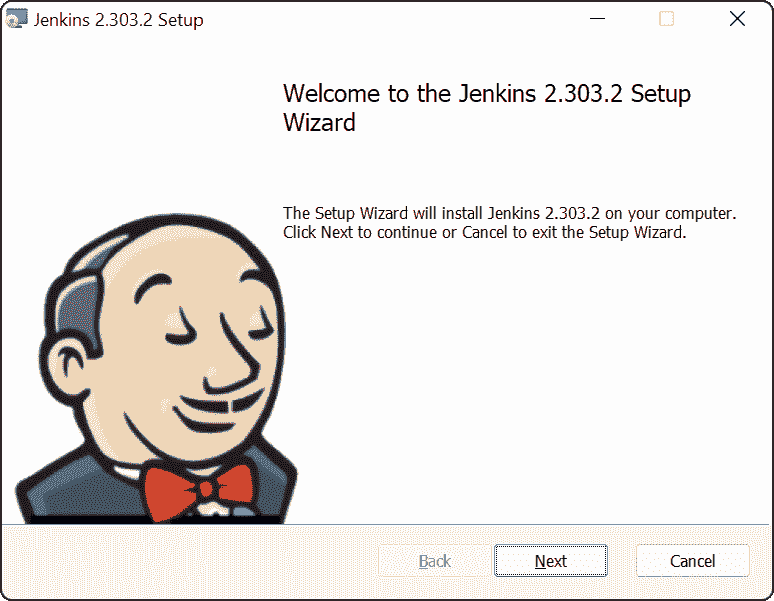](#)

默认安装目录就可以了，所以点击**下一个**按钮:

[](#)

现在会提示您提供运行 Windows 服务的用户的详细信息。输入您之前创建的用户的凭证，并点击**测试凭证**按钮。测试通过后，点击**下一个**按钮:

[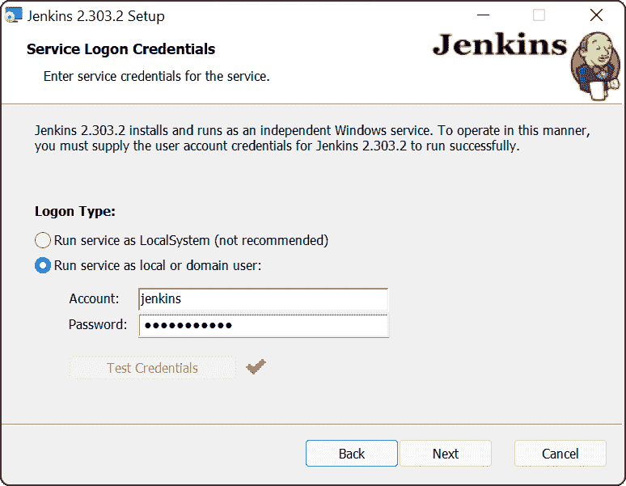](#)

**8080** 默认端口没问题。点击**测试端口**按钮，确保端口可用，然后点击**下一个**按钮:

[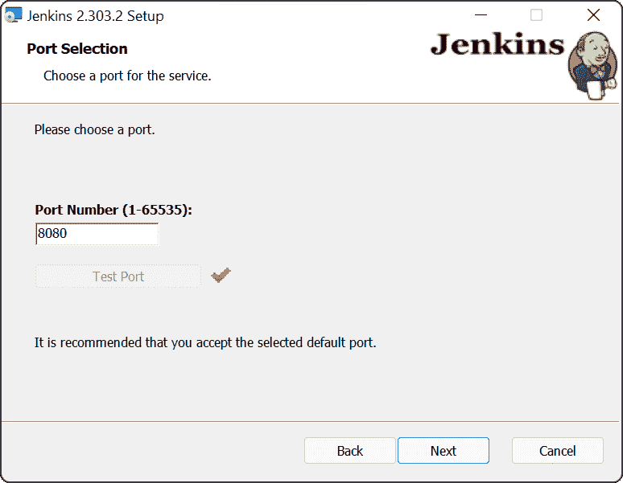](#)

现在提示您输入先前安装的 Java 发行版的路径。祖鲁 11 发行版的默认路径是`C:\Program Files\Zulu\zulu-11`。为您选择的发行版输入适当的路径，然后单击下一个**按钮**:

[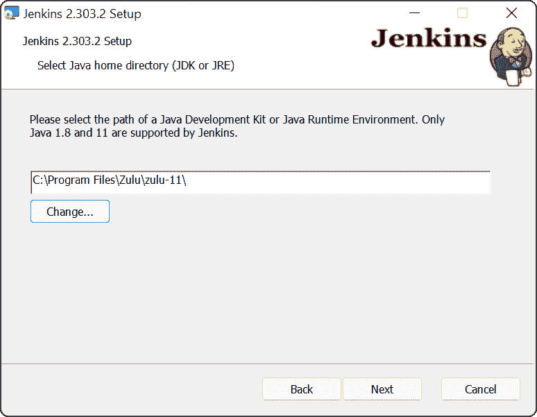](#)

您可能希望通过 Windows 防火墙暴露 Jenkins，以允许外部客户端访问它。更改要安装的**防火墙例外**特性，点击**下一步**按钮:

[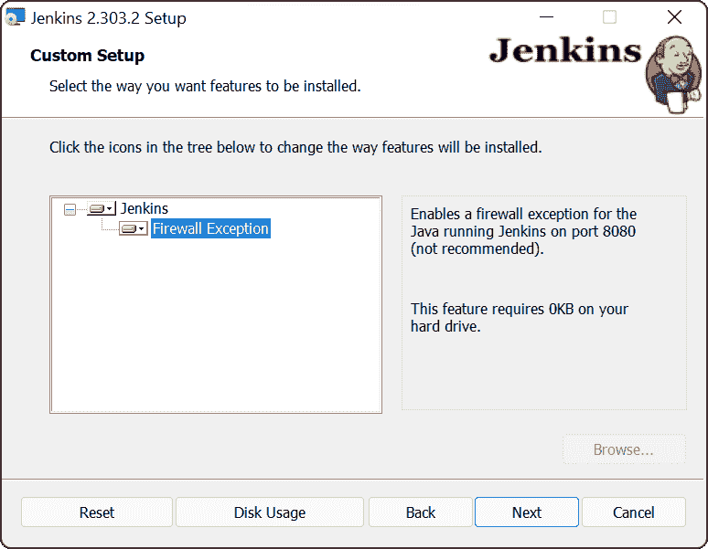](#)

现在所有的安装值都已配置好，所以点击**安装**按钮:

[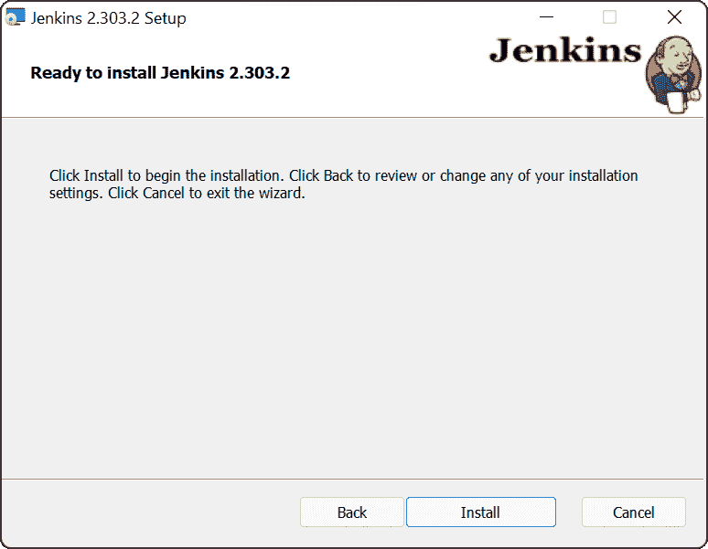](#)

安装完成后，点击**完成**按钮:

[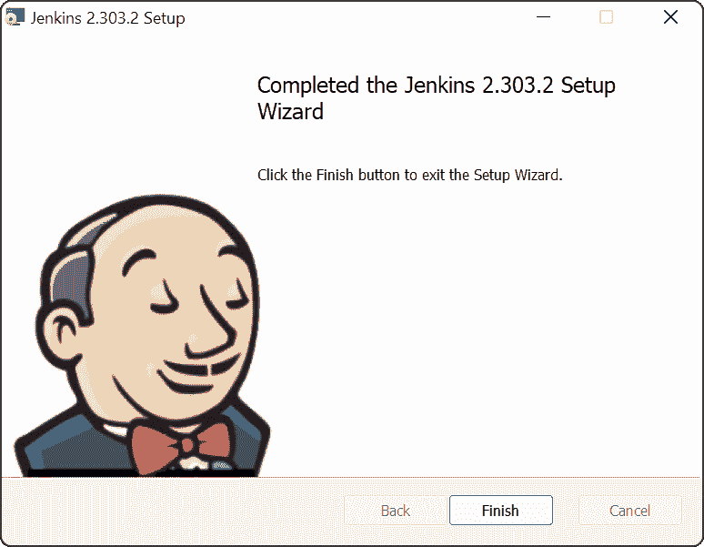](#)

## 关于巧克力的一个注记

Chocolatey 是一个 Windows 包管理器，它[提供了一个安装詹金斯](https://community.chocolatey.org/packages/jenkins)的选项。然而，在撰写本文时，Chocolatey 上可用的 Jenkins 的最新版本是 2.222.4，这已经是一年前的事了。事实上，该版本太旧了，以至于在最初的 Jenkins 配置中出现的大多数推荐插件都无法安装！

当你读到这篇文章的时候，Jenkins 可能已经更新了 Chocolatey，但是我警告不要使用 Chocolatey 来安装 Jenkins，因为它确实有过不被维护的历史。

## Windows 服务配置

Windows 服务有一个[唯一入口点](https://docs.microsoft.com/en-au/windows/win32/api/winsvc/nc-winsvc-lpservice_main_functiona?redirectedfrom=MSDN)来响应服务控制管理器(SCM)命令。像 Jenkins 这样的 Java 应用程序不公开这个接口。这意味着 Java 应用程序必须在包装器中运行，才能作为 Windows 服务进行管理。

默认情况下，该包装器位于`C:\Program Files\Jenkins\jenkins.exe`位置，由`C:\Program Files\Jenkins\jenkins.xml`文件配置:

[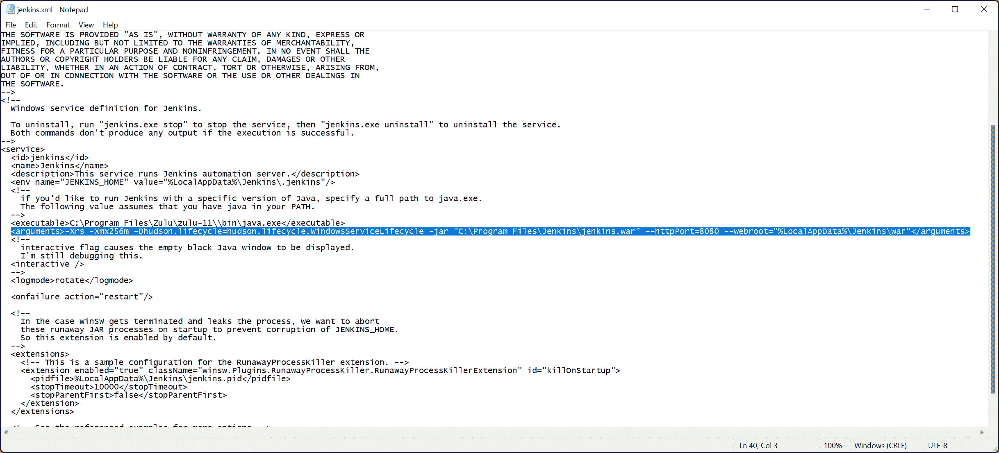](#)

这个 XML 文件包含`service/arguments`元素，它定义了执行时传递给 Jenkins 的命令行参数。它还包括`service/env`元素来定义 Jenkins 可用的环境变量。

高级 Jenkins 配置选项通常需要传递参数或定义环境变量。例如，[在 Jenkins 中禁用跨站点请求伪造(CSRF)保护](https://www.jenkins.io/doc/book/security/csrf-protection/)需要传递`-Dhudson.security.csrf.GlobalCrumbIssuerConfiguration.DISABLE_CSRF_PROTECTION=true`参数，该参数在`service/arguments`元素中配置:

[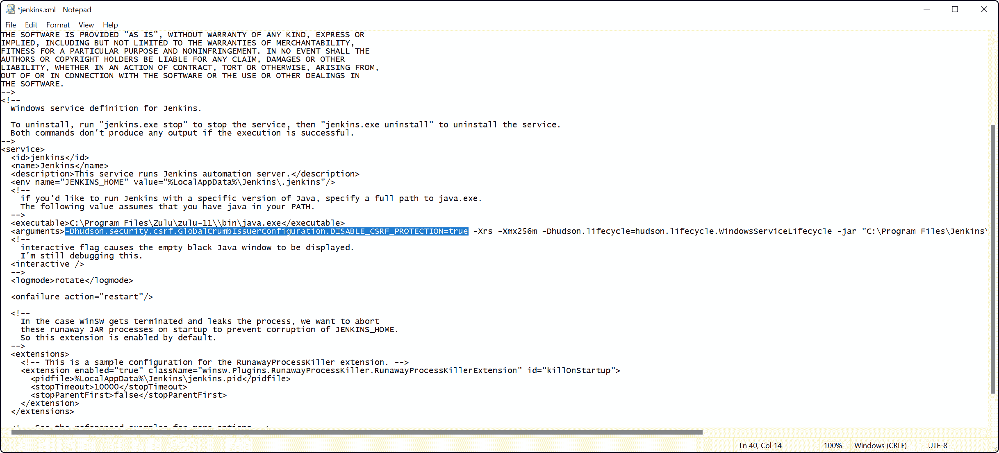](#)

詹金斯系统属性列表可以在[詹金斯文档](https://www.jenkins.io/doc/book/managing/system-properties/)中找到。

## Windows 上的 JENKINS_HOME 目录

`JENKINS_HOME`目录包括所有的配置、插件和在 Jenkins 服务器上执行的任何构建的工作目录。在 Windows 上，该目录默认位于`%LocalAppData%\Jenkins\.jenkins`，当使用上面创建的`jenkins`用户运行 Jenkins 服务时，该目录将解析为`C:\Users\jenkins\AppData\Local\Jenkins\.jenkins`。

## 如何在 Ubuntu 和 Debian 上安装 Jenkins

Jenkins 提供了一个[包存储库，用于在 Debian 和 Ubuntu](https://pkg.jenkins.io/debian-stable/) 上安装软件。

首先，安装存储库密钥:

```
wget -q -O - https://pkg.jenkins.io/debian-stable/jenkins.io.key | sudo apt-key add - 
```

然后添加一个 Jenkins apt 存储库条目:

```
sudo sh -c 'echo deb https://pkg.jenkins.io/debian-stable binary/ > /etc/apt/sources.list.d/jenkins.list' 
```

更新您的本地包索引，然后最后安装 Jenkins:

```
sudo apt-get update
sudo apt-get install openjdk-11-jdk
sudo apt-get install jenkins 
```

## 如何在 RHEL 和 Fedora 上安装 Jenkins

Jenkins 提供了一个[包存储库，用于在 Red Hat Enterprise Linux (RHEL)和 Fedora](https://pkg.jenkins.io/redhat-stable/) 上安装软件。

首先，安装存储库密钥:

```
sudo wget -O /etc/yum.repos.d/jenkins.repo https://pkg.jenkins.io/redhat-stable/jenkins.repo
sudo rpm --import https://pkg.jenkins.io/redhat-stable/jenkins.io.key 
```

然后安装 OpenJDK 和 Jenkins:

```
sudo yum install epel-release
sudo yum install java-11-openjdk-devel
sudo yum install jenkins 
```

## Linux 服务配置

虽然 Ubuntu、Debian、RHEL 和 Fedora 的所有现代版本都使用 [systemd](https://systemd.io/) ，但 Jenkins 服务仍然作为旧的 init 脚本在`/etc/init.d/jenkins`下提供。

为了启动服务，我们运行`service`命令:

```
sudo service jenkins start 
```

init 脚本`/etc/init.d/jenkins`包含了相当多的 Bash 脚本，但是从管理员的角度来看，这是最有趣的一行:

```
eval "daemonize -u \"$JENKINS_USER\" -p \"$JENKINS_PID_FILE\" \"$JENKINS_JAVA_CMD\" $JENKINS_JAVA_OPTIONS \"-DJENKINS_HOME=$JENKINS_HOME\" -jar \"$JENKINS_WAR\" $PARAMS" 
```

您可以从上面的代码中确定要传递给 Jenkins 的 Java 选项包含在`JENKINS_JAVA_OPTIONS`变量中。要填充这个变量，在`### END INIT INFO`后添加一行如下所示的代码。本例[禁用 CSRF 保护](https://www.jenkins.io/doc/book/security/csrf-protection/):

```
###############################################################################
#
# chkconfig: 35 99 01
# description: Jenkins Automation Server
#
###############################################################################
### BEGIN INIT INFO
# Provides:          jenkins
# Required-Start:    $local_fs $remote_fs $network $time $named
# Should-Start: $time sendmail
# Required-Stop:     $local_fs $remote_fs $network $time $named
# Should-Stop: $time sendmail
# Default-Start:     3 5
# Default-Stop:      0 1 2 6
# Short-Description: Jenkins Automation Server
# Description:       Jenkins Automation Server
### END INIT INFO

[ -n "$JENKINS_JAVA_OPTIONS" ] && JENKINS_JAVA_OPTIONS="-Dhudson.security.csrf.GlobalCrumbIssuerConfiguration.DISABLE_CSRF_PROTECTION=true"

# Rest of the init script 
```

Jenkins 系统属性列表可在 [Jenkins 文档](https://www.jenkins.io/doc/book/managing/system-properties/)中找到。

## 如何在其他 Linux 发行版和 macOS 上安装 Jenkins

Jenkins 网站[包括其他 Linux 发行版和 macOS 的说明。](https://www.jenkins.io/download/)

## 完成 Jenkins 安装

安装完 Jenkins 后，您需要进行第一次配置。

打开 [http://localhost:8080](http://localhost:8080) 查看 Jenkins web 控制台。系统会提示您输入随机生成的密码，该密码保存在本地计算机上的一个文件中。

打开该文件，复制密码，粘贴到**管理员密码**文本框中，点击**继续**按钮:

[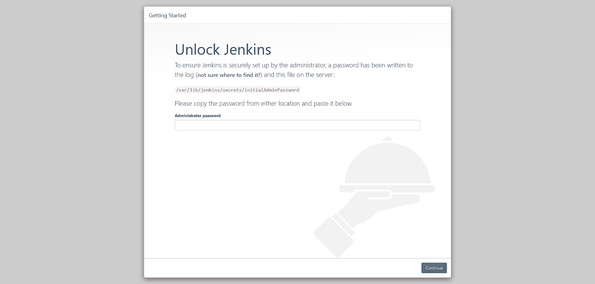](#)

大多数 Jenkins 功能由[插件](https://plugins.jenkins.io/)提供。作为初始配置的一部分，系统会提示您选择安装公共插件的精选列表。这些插件通常是有用的，所以点击**安装建议插件**按钮:

[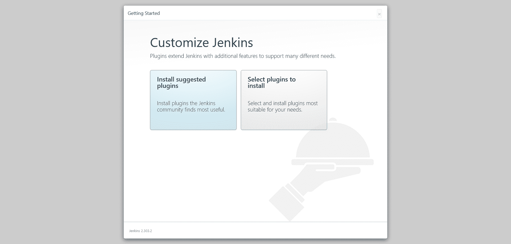](#)

安装插件需要几分钟时间:

[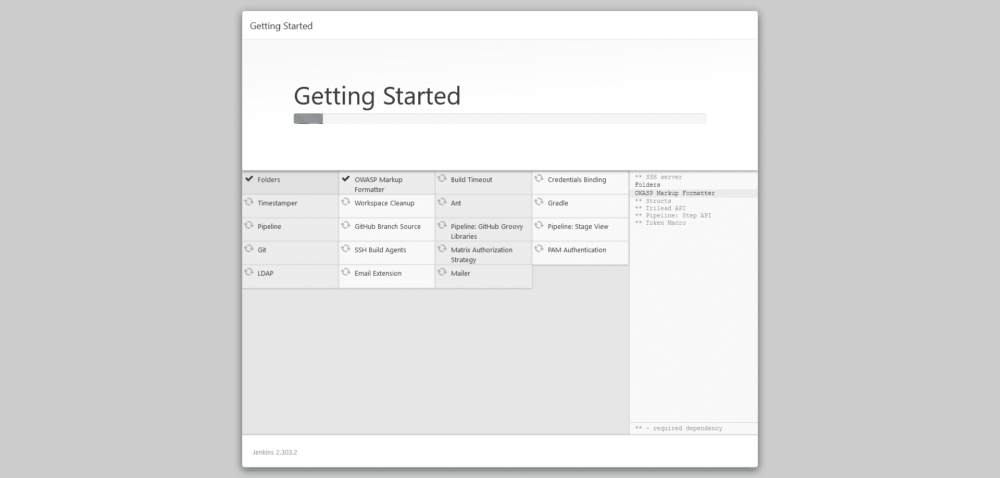](#)

系统会提示您提供 Jenkins 管理员的详细信息。填充字段，并点击**保存并继续**按钮:

[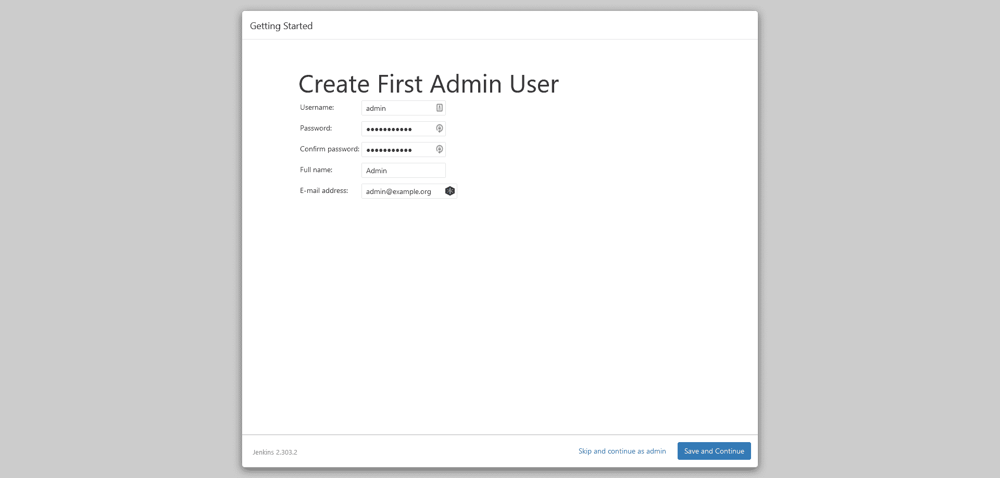](#)

默认网址是好的，所以点击**保存并完成**按钮:

[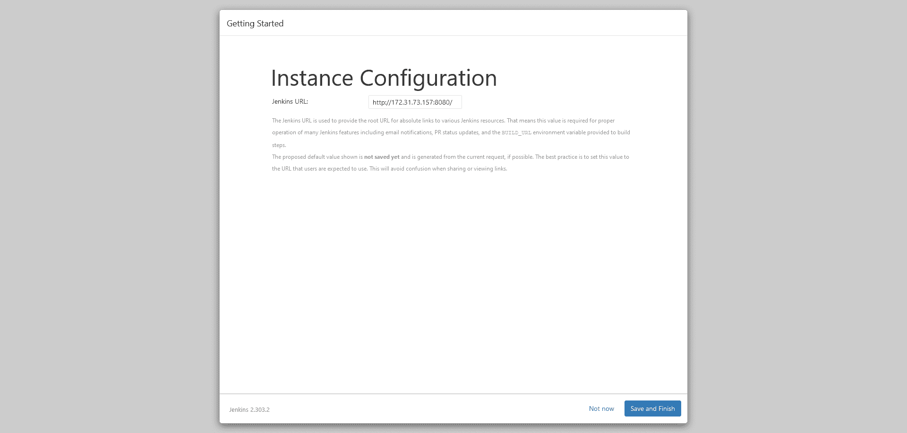](#)

Jenkins 现在已经配置好，可以使用了。点击**开始使用詹金斯**按钮:

[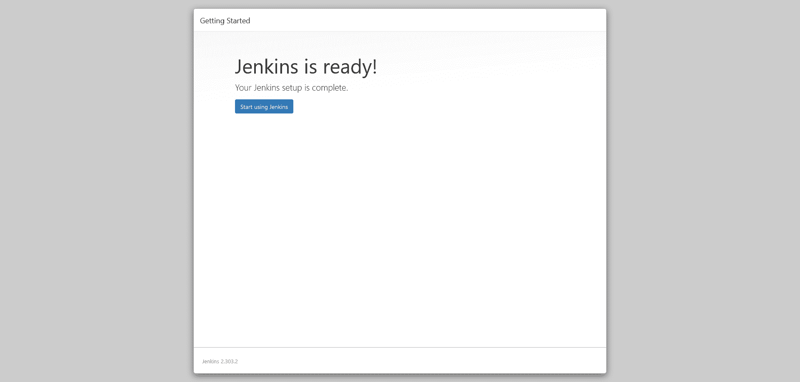](#)

## 结论

这篇文章分析了 Jenkins 在 Windows 和主要 Linux 发行版中的安装过程，并提供了管理 Jenkins 服务的技巧。

传统安装只是让 Jenkins 服务器启动并运行的一种方法。在下一篇文章中，你将学习[如何用 Docker](https://octopus.com/blog/jenkins-docker-install-guide) 安装 Jenkins。

试试我们免费的 Jenkins 管道生成器工具用 Groovy 语法创建一个管道文件。这是您启动管道项目所需的一切。

## 观看我们的詹金斯管道网络研讨会

[https://www.youtube.com/embed/D_7AHTML_xw](https://www.youtube.com/embed/D_7AHTML_xw)

VIDEO

我们定期举办网络研讨会。请参见[网络研讨会第](https://octopus.com/events)页，了解关于即将举办的活动和实时流媒体录制的详细信息。

阅读我们的[持续集成系列](https://octopus.com/blog/tag/CI%20Series)的其余部分。

愉快的部署！