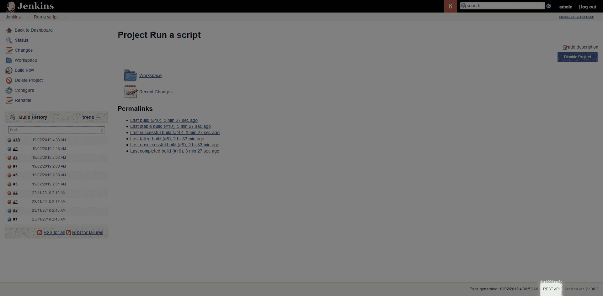

# 了解如何从 PowerShell - Octopus Deploy 调用 Jenkins REST API

> 原文：<https://octopus.com/blog/jenkins-rest-api>

虽然典型的部署工作流会看到像 Jenkins 这样的 CI 系统在 Octopus 中触发部署，但有时让 Octopus trigger 在 Jenkins 中构建是有用的。在这篇博文中，我们将看看如何使用 REST API 和 PowerShell 来触发 Jenkins 部署。

## 詹金斯·CSRF 保安公司

詹金斯有一个安全功能，防止[跨站点请求伪造](https://support.cloudbees.com/hc/en-us/articles/219257077-CSRF-Protection-Explained)攻击，这是在詹金斯➜管理詹金斯➜配置全球安全➜防止跨站点请求伪造利用下发现的。

[](#)

实际上，这意味着对 Jenkins API 的每个请求都需要在头中定义一个称为 crumb 的东西。要生成这个面包屑，我们需要向 http://Jenkins server/Jenkins/crumbIssuer/API/JSON 发出请求。

下面的 PowerShell 向您展示了如何生成面包屑:

```
$user = 'user'
$pass = 'password'

# The header is the username and password concatenated together
$pair = "$($user):$($pass)"
# The combined credentials are converted to Base 64
$encodedCreds = [System.Convert]::ToBase64String([System.Text.Encoding]::ASCII.GetBytes($pair))
# The base 64 credentials are then prefixed with "Basic"
$basicAuthValue = "Basic $encodedCreds"
# This is passed in the "Authorization" header
$Headers = @{
    Authorization = $basicAuthValue
}
# Make a request to get a crumb. This will be returned as JSON
$json = Invoke-WebRequest -Uri 'http://jenkinsserver/jenkins/crumbIssuer/api/json' -Headers $Headers
# Parse the JSON so we can get the value we need
$parsedJson = $json | ConvertFrom-Json
# See the value of the crumb
Write-Host "The Jenkins crumb is $($parsedJson.crumb)" 
```

## REST API 链接

现在我们有了一个 crumb，我们可以用它来调用 Jenkins REST API。您可以通过每个屏幕右下角的`REST API`链接找到与 Jenkins 系统交互的 URL:

[](#)

在这个例子中，我们想要触发一个 Jenkins 项目的构建，所以我们打开这个项目，发现`REST API`链接指向一个 URL，比如 http://Jenkins server/Jenkins/job/Run % 20a % 20 script/API/。如果我们打开此链接，我们会看到描述可用的常见操作的文档页面。我们特别感兴趣的是嵌入在句子`to programmatically schedule a new build, post to this URL.`中的链接，该链接将我们带到一个 URL，如 http://Jenkins server/Jenkins/job/Run % 20a % 20 script/build。

[](#)

## 触发构建

我们现在有了触发构建所需的链接和 Jenkins 在每个 API 请求中需要的信息。让我们完成 PowerShell 脚本，该脚本发出在 Jenkins 中开始构建的最后一个请求:

```
$user = 'user'
$pass = 'password'

# The header is the username and password concatenated together
$pair = "$($user):$($pass)"
# The combined credentials are converted to Base 64
$encodedCreds = [System.Convert]::ToBase64String([System.Text.Encoding]::ASCII.GetBytes($pair))
# The base 64 credentials are then prefixed with "Basic"
$basicAuthValue = "Basic $encodedCreds"
# This is passed in the "Authorization" header
$Headers = @{
    Authorization = $basicAuthValue
}
# Make a request to get a crumb. This will be returned as JSON
$json = Invoke-WebRequest -Uri 'http://jenkinsserver/jenkins/crumbIssuer/api/json' -Headers $Headers
# Parse the JSON so we can get the value we need
$parsedJson = $json | ConvertFrom-Json
# See the value of the crumb
Write-Host "The Jenkins crumb is $($parsedJson.crumb)"
# Extract the crumb filed from the returned json, and assign it to the "Jenkins-Crumb" header
$BuildHeaders = @{
    "Jenkins-Crumb" = $parsedJson.crumb
    Authorization = $basicAuthValue
}
Invoke-WebRequest -Uri "http://jenkinsserver/jenkins/job/Run%20a%20script/build" -Headers $BuildHeaders -Method Post 
```

运行该脚本将显示 crumb 值，以及启动作业的 API 调用的结果。注意，结果是一个 HTTP 201 代码。此代码表示在 Jenkins 服务器上创建了一个作业:

```
PS C:\Users\Matthew\Desktop> .\jenkins.ps1
The Jenkins crumb is 574608b1e95315787b2fa0b74fce2441

StatusCode        : 201
StatusDescription : Created
Content           : {}
RawContent        : HTTP/1.1 201 Created
                    Date: Tue, 19 Feb 2019 04:46:46 GMT
                    Server: Apache
                    X-Frame-Options: SAMEORIGIN
                    X-Content-Type-Options: nosniff
                    Location: http://jenkinsserver/jenkins/queue/item/11/
                    Content-L...
Headers           : {[Date, System.String[]], [Server, System.String[]], [X-Frame-Options, System.String[]], [X-Content-Type-Options, System.String[]]...}
RawContentLength  : 0
RelationLink      : {} 
```