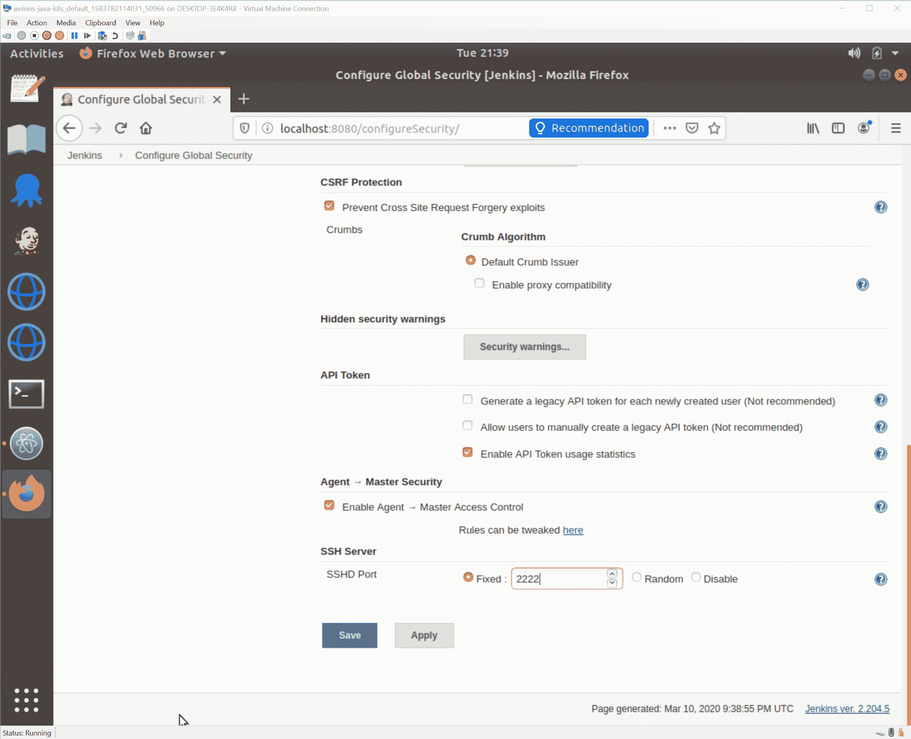
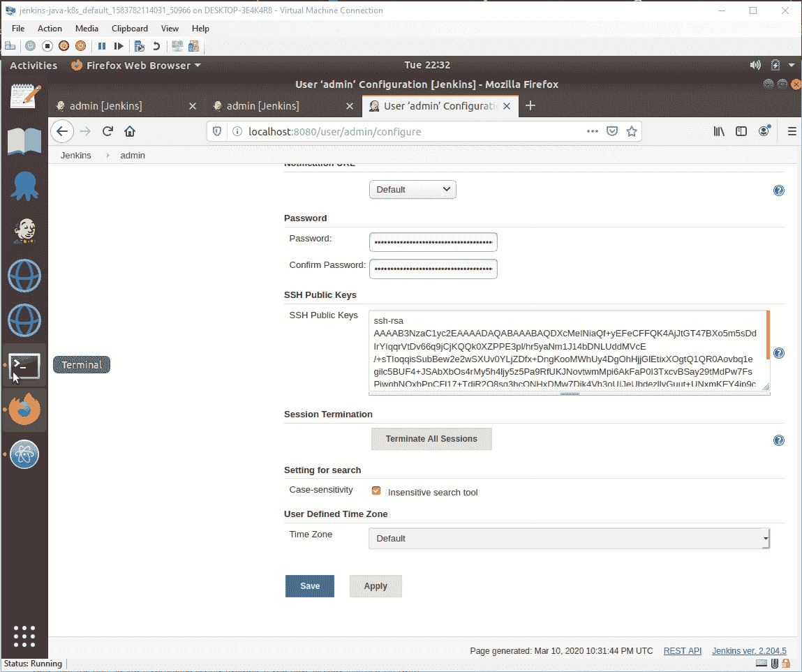
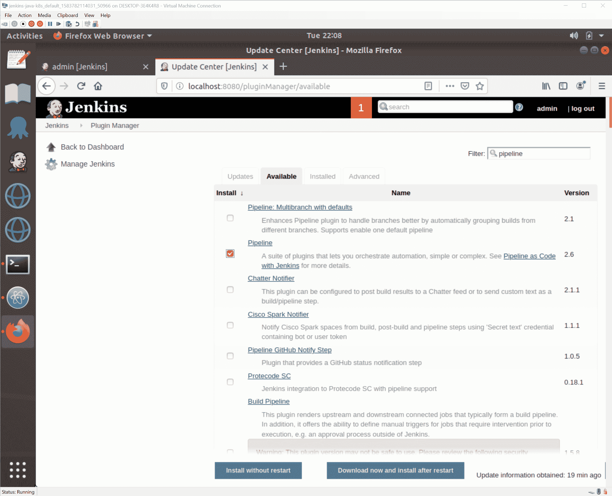
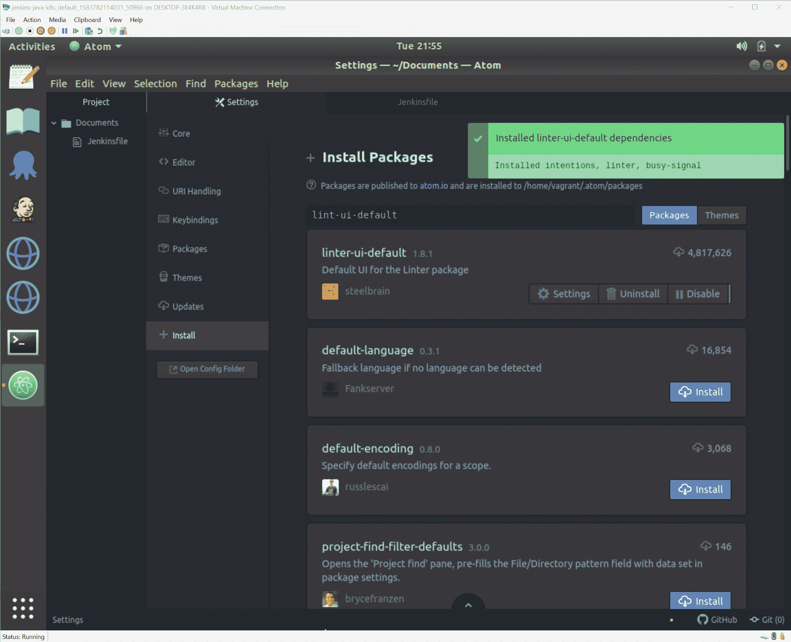
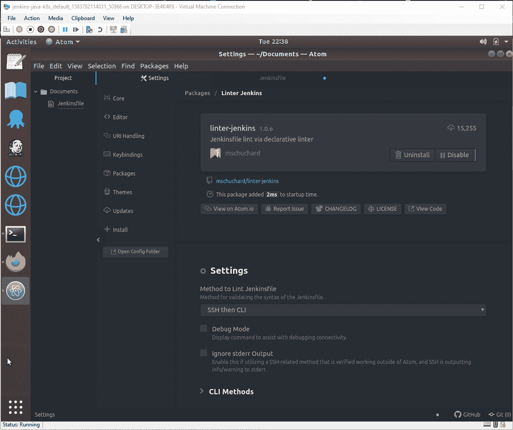
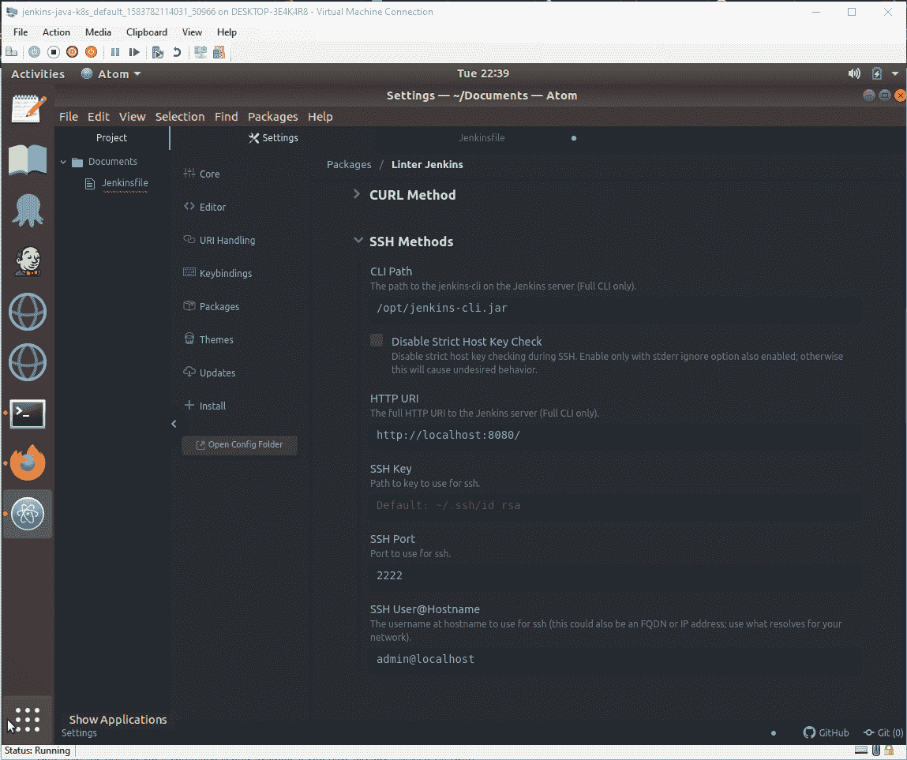
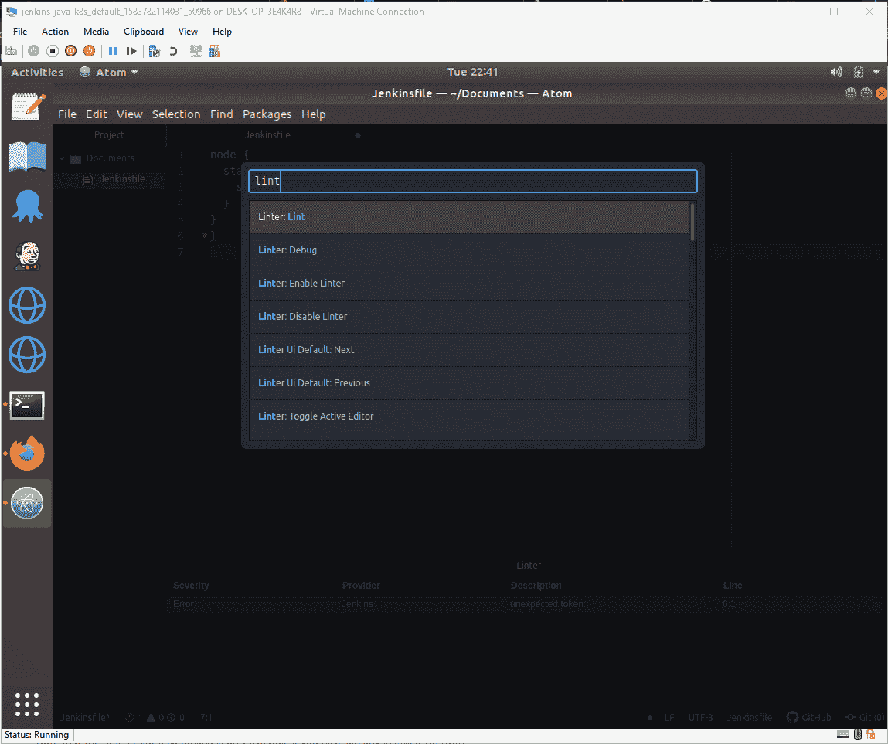
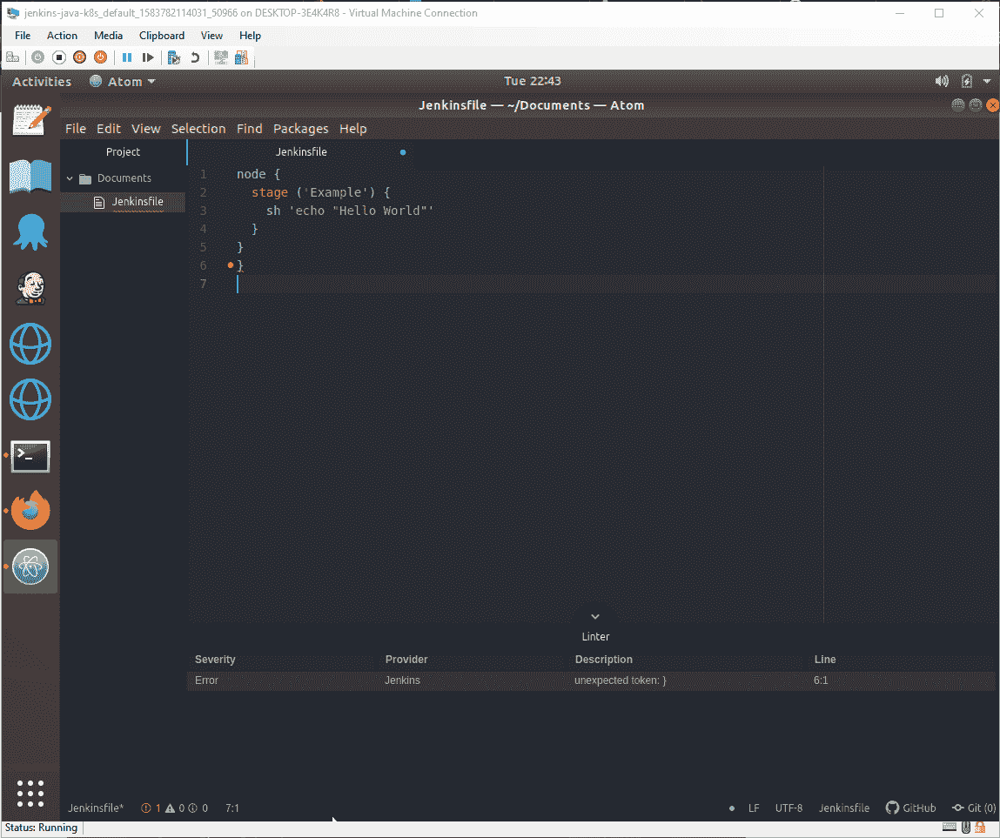

# 使用 Atom - Octopus 部署编写和林挺 Jenkins 文件

> 原文：<https://octopus.com/blog/jenkinsfiles-with-atom>

[](#)

声明性管道是 Jenkins 中的一个流行特性，允许构建过程与正在构建的代码一起提交。Jenkinsfiles 本质上是 Groovy 语法；然而，对于习惯于依赖本地编译来确保其代码有效的开发人员来说，在发现语法错误之前不得不等待 Jenkins 尝试执行他们的 Jenkinsfile 可能会令人沮丧。

Jenkins 提供了一个解决方案，它使得在执行 Jenkinsfile 之前对其进行验证成为可能。这可以从命令行手动执行[，或者使用 IDE 插件来提供更加集成的体验。](https://jenkins.io/doc/book/pipeline/development/#linter)

在这篇博文中，我们将看看 Atom 编辑器中可用的 Jenkinsfile 林挺工具。

## 准备詹金斯

林挺一个 Jenkins 文件涉及到一个对 Jenkins 服务器的网络请求。有多种方法可以建立这些网络连接，但是 Jenkins 通常推荐通过 SSH 访问服务器。

这里需要注意的是，我们不是在讨论对 Jenkins 运行的操作系统的 SSH 访问。相反，Jenkins 公开了自己的 SSH 服务器。SSH 服务器在`SSH Server`部分下的 Jenkins 安全配置屏幕中启用。在下面的截图中，我已经在端口`2222`上启动了 SSH 服务器:

[](#)

下一步是添加用户的公钥，这样他们就可以通过 SSH 进行身份验证。该密钥是使用以下命令创建的:

```
ssh-keygen -t rsa -C "your_email@example.com" 
```

这将在默认文件`~/.ssh/id_rsa.pub`中创建公钥。然后，通过打开用户的详细信息，点击`Configure`选项，并将公钥的内容粘贴到`SSH Public Keys`字段，将该文件的内容分配给一个 Jenkins 用户:

[](#)

Jenkins 还要求安装`Pipeline`插件:

[](#)

完成这些更改后，我们就可以配置 Atom 了。

## 准备原子

Atom 中需要安装三个包:

*   语言-jenkinsfile
*   林特-詹金斯公司
*   linter-ui-默认

linter-ui-default 包将要求安装许多依赖项。这些是必需的，所以允许安装它们:

[](#)

linter 包需要额外的配置才能与 Jenkins 建立网络连接。

我们将使用`SSH then CLI`连接选项:

[](#)

必须更新`SSH Port`和`SSH User@Hostname`选项，以反映我们在其上公开 Jenkins SSH 服务器的自定义端口(端口`2222`)和我们将 Linux 用户的公共 SSH 密钥添加到的 Jenkins 用户名:

[](#)

## 林挺·詹金斯费尔

打开 Jenkinsfile，用 cmd-shift-p (macOS)或 ctrl-shift-p (Linux/Windows)显示命令面板，选择`Linter: Lint`命令:

[](#)

然后，Jenkinsfile 的内容被发送到 Jenkins 服务器进行验证，并返回任何错误:

[](#)

## 结论

Jenkins IDE 插件，就像我们在 Atom 中演示的那样，减少了 Jenkinsfile 中错误的反馈时间，使您能够更快地完成成功的构建。因为验证 Jenkinsfiles 需要连接到 Jenkins 服务器，所以需要做一些工作来配置一个安全的连接并定义所需的凭证，但是当这个初始配置完成时，只需一个命令就可以验证您的代码。