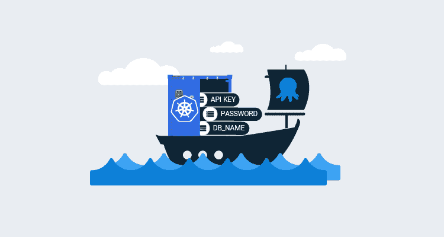
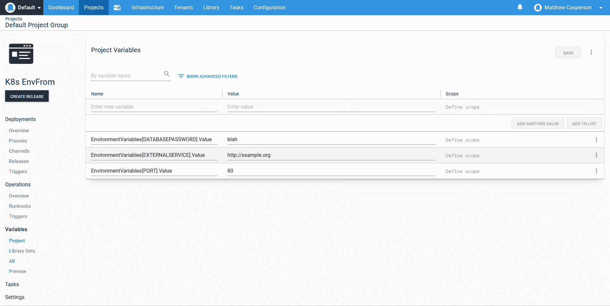
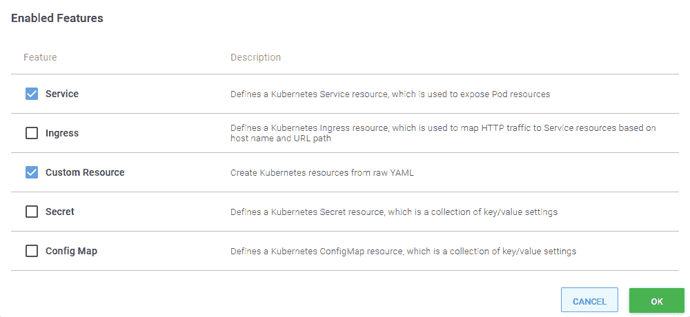
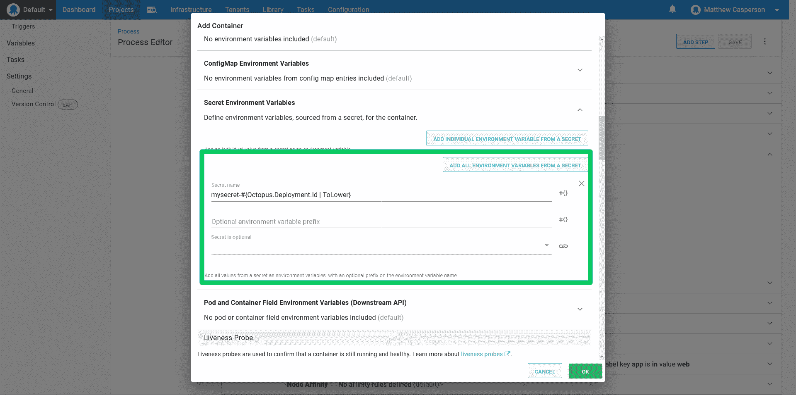
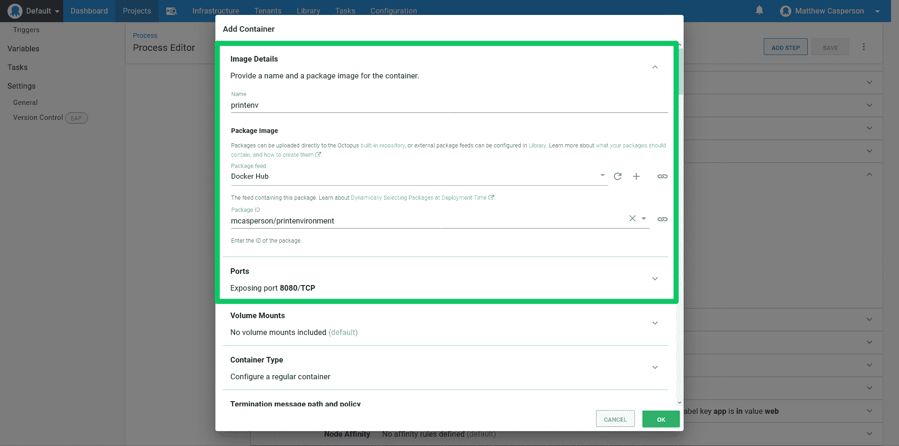
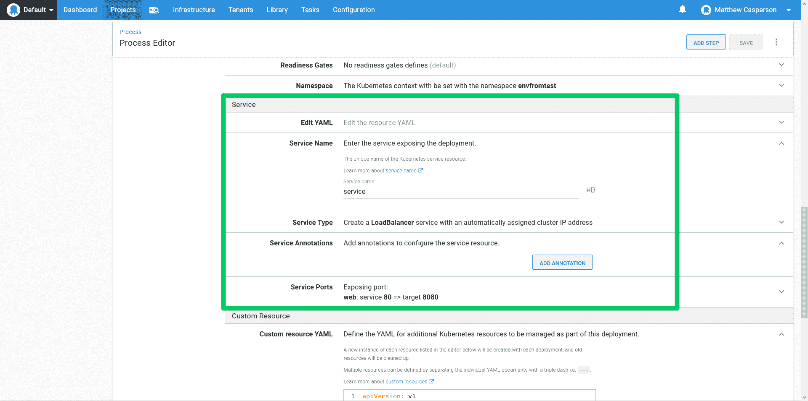
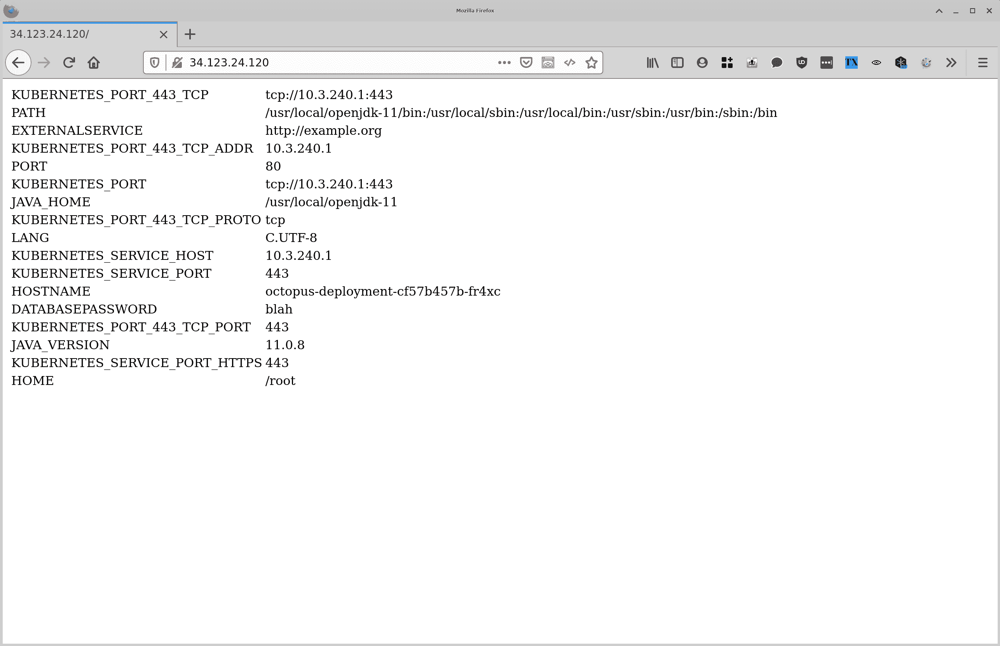

# 向 Kubernetes 容器公开 Octopus 变量——Octopus 部署

> 原文：<https://octopus.com/blog/k8s-envfrom>

[](#)

如果您遵循最佳实践指南，如[十二因素应用](https://12factor.net/)，您的 Kubernetes 应用程序可能会使用环境变量将配置值具体化。在 pods 中有许多方法来定义这些环境变量，但是直到最近，它们都涉及到逐个显式地定义每个环境变量。

Kubernetes 1.16 的新特性是[将配置映射或秘密的所有值作为环境变量暴露在 pod](https://kubernetes.io/docs/tasks/configure-pod-container/configure-pod-configmap/#configure-all-key-value-pairs-in-a-configmap-as-container-environment-variables) 中的能力。在 Octopus 2020.5 中，这些新的`envFrom`字段已经通过**部署 Kubernetes 容器**步骤公开。当与从原始 YAML 部署资源的能力相结合时，我们可以创建一个工作流，在这个工作流中，多组 Octopus 变量被暴露给一个容器，而不需要繁琐地将它们一一映射。

在这篇博文中，我们将看看如何以一种简化的方式将多组 Octopus 变量直接传递给容器。

## 定义环境变量

对于这个例子，我们将定义三个环境变量:`DATABASEPASSWORD`、`EXTERNALSERVICE`和`PORT`。

在 Octopus 中，我们以一种格式捕获这些变量，这种格式允许我们用一个模板循环访问它们，看起来像`GroupName[VariableName].Property`。这意味着我们最终有三个章鱼变量，称为:

*   `EnvironmentVariables[DATABASEPASSWORD].Value`
*   `EnvironmentVariables[EXTERNALSERVICE].Value`
*   `EnvironmentVariables[PORT].Value`:

[](#)

## 启用自定义资源

在**部署 Kubernetes 容器**步骤中的一个特性叫做**定制资源**。我们将使用这个特性来创建保存环境变量的秘密。

**自定义资源**功能默认不启用，所以我们必须先通过点击**配置功能**按钮将其启用:

[](#)

## 使资源不可变

**部署 Kubernetes 容器**步骤是一种自以为是的部署 Kubernetes 资源的方式，其中一种观点是支持主部署的资源，如秘密和配置映射，被视为不可变的。

您可以想象这样一种情况，新部署更改了它在配置映射或密码中预期的数据，如果新部署覆盖了现有的支持资源，那么任何旧部署都将处于未定义状态。使用重新创建策略时，这通常不是问题，因为在创建新的 pod 之前，所有旧的 pod 都会被删除。但是对于滚动部署或蓝/绿部署，新旧部署必须并行运行一段时间，因此它们的支持资源也应该并行运行。

在实践中，支持资源被视为不可变的这一观点意味着由**Deploy Kubernetes containers**步骤创建的配置映射、秘密或定制资源在每个 Octopus 部署中都被赋予了唯一的名称。这是由 Octopus 自动完成的，但是重要的是要理解分配给定制资源的名称并不是资源部署时的最终名称。

## 创造秘密

自定义资源是用原始 YAML 创建的。我们还可以使用 Octopus 模板特性，我们将使用它来循环前面定义的每个变量。生成的自定义资源如下所示:

```
apiVersion: v1
data:
#{each var in EnvironmentVariables}
  #{var}: "#{var.Value | ToBase64}"
#{/each}
kind: Secret
metadata:  
  name: mysecret
type: Opaque 
```

## 定义容器

为了将秘密公开为环境变量，我们展开容器定义的**秘密环境变量**部分，并单击**从秘密**按钮添加所有环境变量。

为了引用作为定制资源创建的秘密，我们采用在 YAML 定义的资源名称，并在它后面附加`-#{Octopus.Deployment.Id | ToLower}`。在我们的例子中，最后的秘密名是`mysecret-#{Octopus.Deployment.Id | ToLower}`:

[](#)

为了证明环境变量已经正确配置，我们将部署 Docker image[mcasperson/print environment](https://hub.docker.com/r/mcasperson/printenvironment)(源代码在 [GitHub](https://github.com/mcasperson/PrintEnvironment) 上)，这是一个简单的 web 应用程序，它将环境变量打印到网页上。此图像显示端口 8080:

[](#)

## 露出容器

为了方便起见，我们将创建一个负载平衡器服务来公开我们的容器。这将为我们提供一个公共 IP，让我们的浏览器指向这个 IP 来测试示例 web 应用程序:

[](#)

## 验证结果

在 web 浏览器中打开负载平衡器 IP 地址会显示通过秘密暴露的三个环境变量:

[](#)

## 结论

通过精心设计我们的 Octopus 变量，使我们能够在创建自定义资源时循环访问它们，并利用 2020.5 中的**部署 Kubernetes 容器**步骤所公开的新的`envFrom`字段，我们有了一个工作流，使我们能够直接将任意数量的 Octopus 变量映射为 Kubernetes 容器中的环境变量。

由于**Deploy Kubernetes containers**步骤确保了每个定制资源都有一个惟一的名称，因此基本上是不可变的(至少就部署过程而言)，我们还可以确信，滚动或蓝/绿部署等更高级的策略不会使旧的 Kubernetes 部署处于未定义的状态。

这种组合对于外部化许多变量的常见问题是一个强大而方便的解决方案，我们希望它将在部署 Kubernetes 应用程序时增强团队的能力。

愉快的部署！