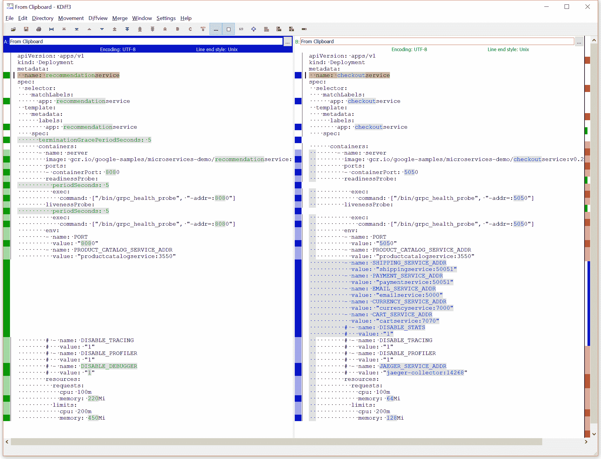
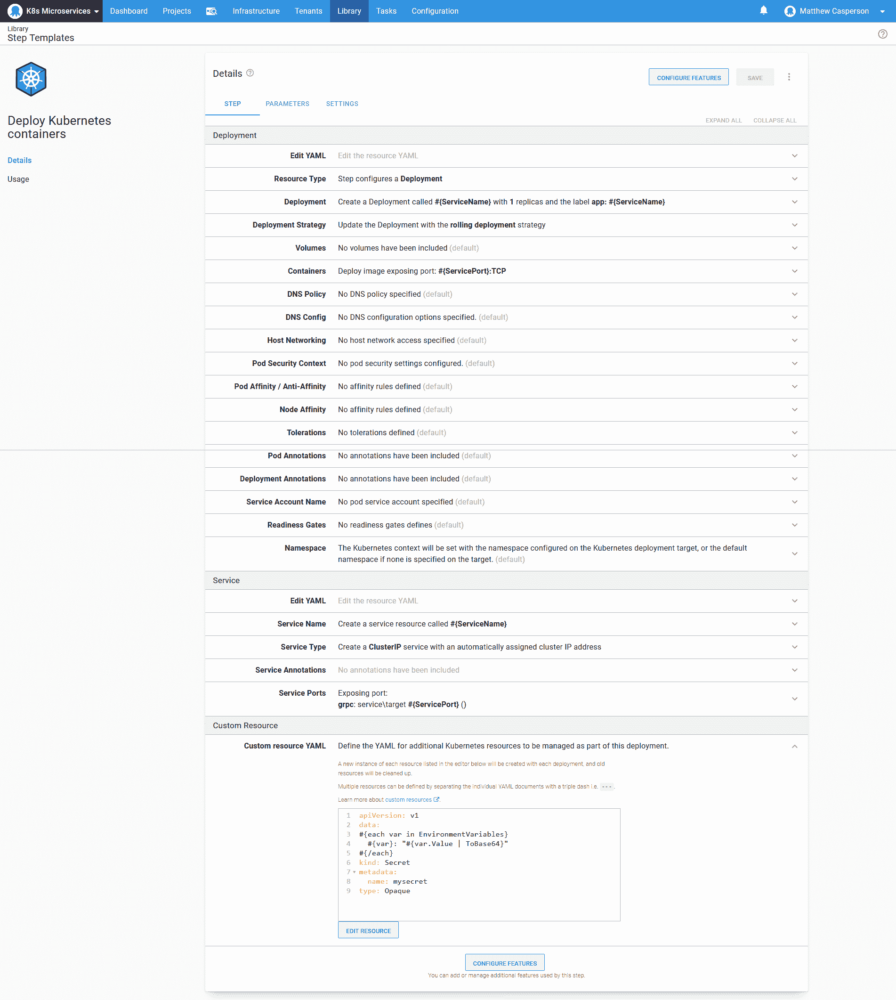
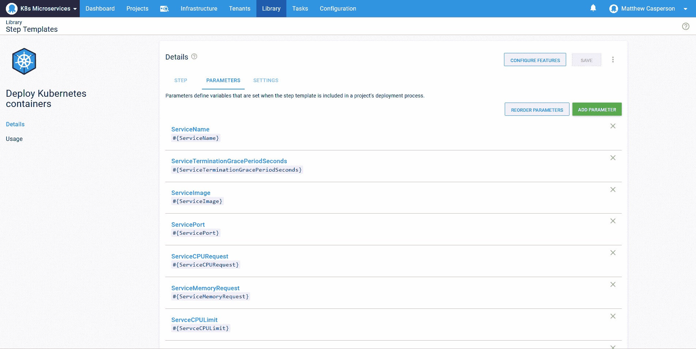
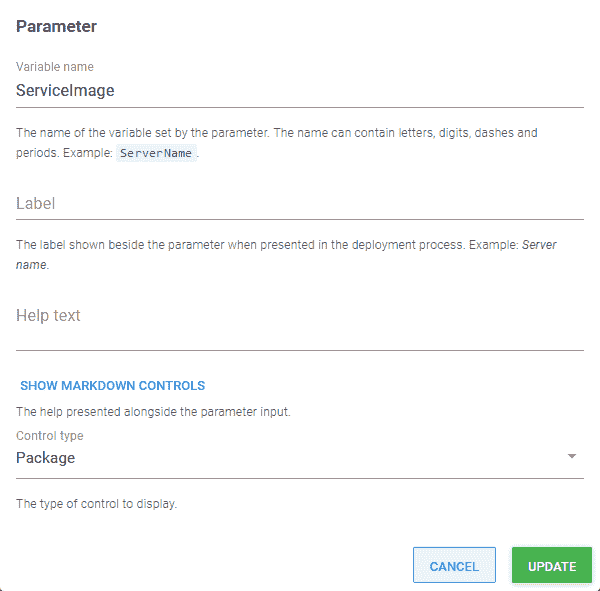
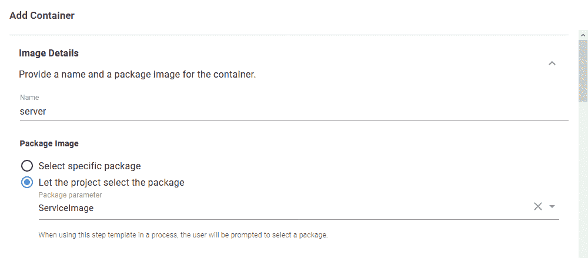
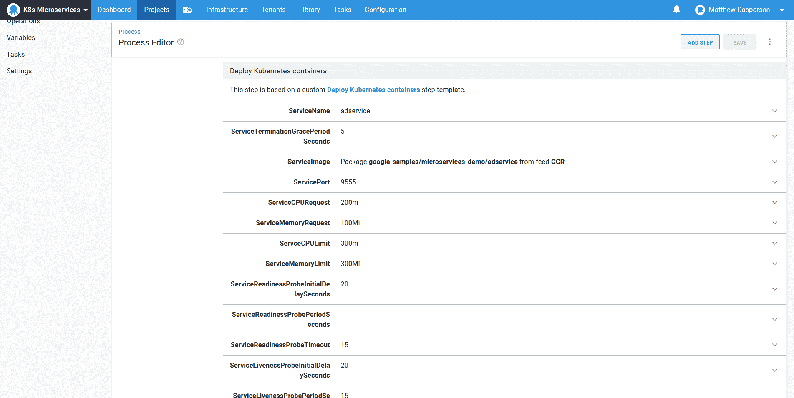
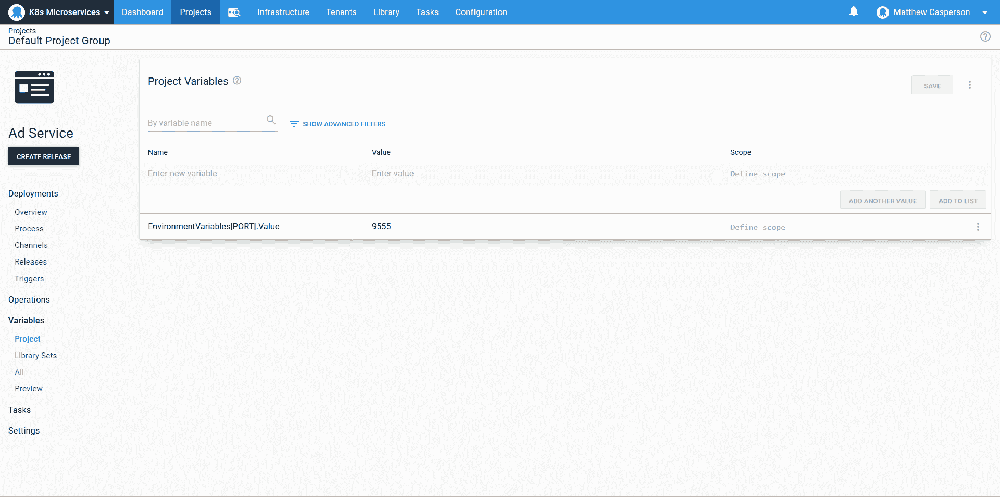
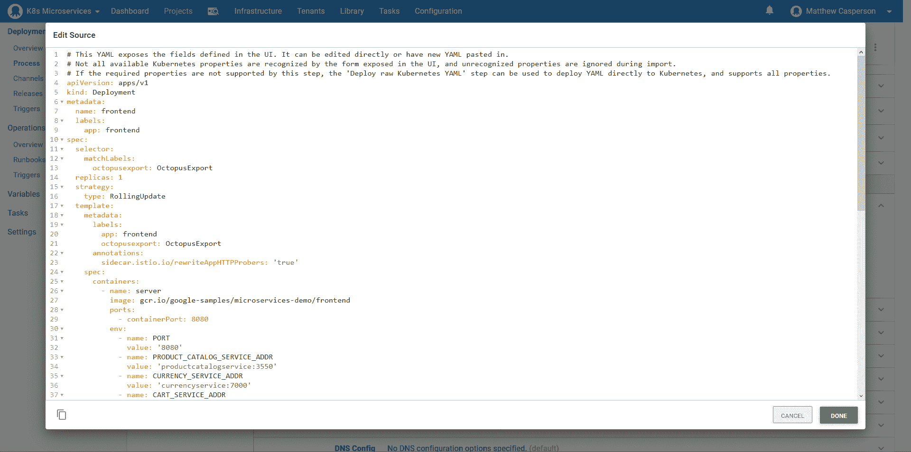
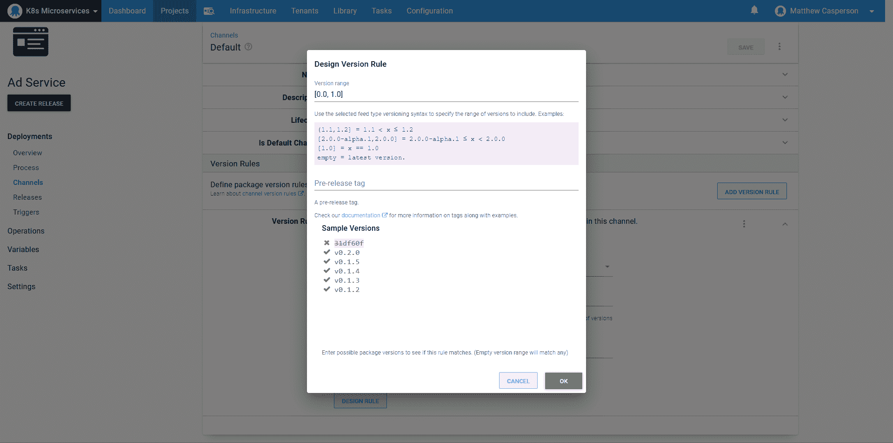
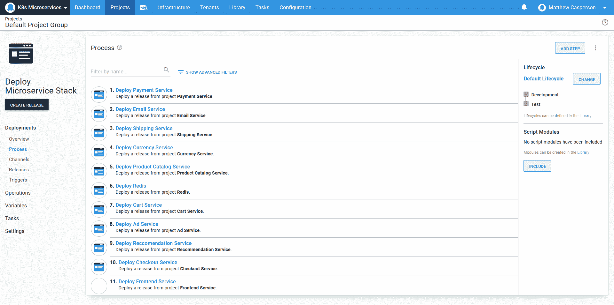

# 使用 Octopus - Octopus Deploy 将微服务部署到 Kubernetes

> 原文：<https://octopus.com/blog/k8s-microservices-demo>

[](#)

微服务可以是一种强大的设计模式，它允许大型开发团队将代码交付到生产环境中，而不需要代码在单个代码库中进行协调，并按照通用的时间表发布。然而，部署这些微服务可能是一个挑战，因为协调 Kubernetes 资源和在环境之间推广的成本是由每个单独的微服务支付的。

Octopus 有许多有用的功能来帮助简化和管理微服务部署。在这篇文章和截屏中，我们将介绍由 Google 创建的示例微服务应用程序[在线精品店](https://github.com/GoogleCloudPlatform/microservices-demo)的部署过程。

## 截屏

[https://www.youtube.com/embed/pJjriVVLWQ0](https://www.youtube.com/embed/pJjriVVLWQ0)

VIDEO

## 创建部署模板

如果您查看包含所有 Kubernetes 资源定义的 [YAML，您会注意到一个模式，其中每个部署都由一个匹配的服务公开。像这样将部署和服务配对是 Kubernetes 部署中的常见做法，这种模式被 Octopus 中的**部署 Kubernetes 容器**步骤捕获。](https://github.com/GoogleCloudPlatform/microservices-demo/blob/master/release/kubernetes-manifests.yaml)

您还会注意到，大多数微服务的部署定义非常相似。它们都定义了:

*   一个容器
*   集装箱暴露的端口
*   资源请求和限制
*   GRPC 活跃度和就绪性探测
*   环境变量

使用 diff 工具很容易看出部署资源之间的相似性:

[](#)

为了删除定义部署及其相关服务所需的样板代码，我们利用了 Octopus 中一个名为[步骤模板](https://octopus.com/docs/deployment-process/steps/custom-step-templates)的特性。下面的 YAML 可以通过部署部分的**编辑 YAML** 选项添加到**部署 Kubernetes 容器**步骤中，它捕获了大多数微服务应用程序在其部署中使用的字段，应用程序特定的值由变量替换:

```
apiVersion: apps/v1
kind: Deployment
metadata:
  name: "#{ServiceName}"
spec:
  template:
    metadata:
      labels:
        app: "#{ServiceName}"
    spec:
      terminationGracePeriodSeconds: "#{if ServiceTerminationGracePeriodSeconds}#{ServiceTerminationGracePeriodSeconds}#{/if}"
      containers:
      - name: server
        image: "#{ServiceImage}"
        ports:
        - containerPort: "#{ServicePort}"
        envFrom:
        - secretRef:
            name: "mysecret-#{Octopus.Deployment.Id | ToLower}"
        resources:
          requests:
            cpu: "#{ServiceCPURequest}"
            memory: "#{ServiceMemoryRequest}"
          limits:
            cpu: "#{ServceCPULimit}"
            memory: "#{ServiceMemoryLimit}"
        readinessProbe:
          initialDelaySeconds: "#{if ServiceReadinessProbeInitialDelaySeconds}#{ServiceReadinessProbeInitialDelaySeconds}#{/if}"
          periodSeconds: "#{if ServiceReadinessProbePeriodSeconds}#{ServiceReadinessProbePeriodSeconds}#{/if}"
          exec:
            command: ["/bin/grpc_health_probe", "-addr=:#{ServicePort}", "#{if ServiceReadinessProbeTimeout}-rpc-timeout=#{ServiceReadinessProbeTimeout}s#{/if}"]
        livenessProbe:
          initialDelaySeconds: "#{if ServiceLivenessProbeInitialDelaySeconds}#{ServiceLivenessProbeInitialDelaySeconds}#{/if}"
          periodSeconds: "#{if ServiceLivenessProbePeriodSeconds}#{ServiceLivenessProbePeriodSeconds}#{/if}"
          exec:
            command: ["/bin/grpc_health_probe", "-addr=:#{ServicePort}", "#{if ServiceLivenessProbeTimeout}-rpc-timeout=#{ServiceLivenessProbeTimeout}s#{/if}"] 
```

这个 YAML 有几个有趣的方面值得一提。

`if`语法(例如`#{if ServiceTerminationGracePeriodSeconds}#{ServiceTerminationGracePeriodSeconds}#{/if}`)提供了一种方法来返回变量值(如果已经定义了的话),或者返回一个空字符串(如果变量还没有定义的话)。Octopus 将在适当的情况下忽略空的 YAML 属性，以避免在部署最终资源时出现验证错误。

单个环境变量列表已被`envFrom.secretRef`所取代。这允许 Kubernetes 根据保存在外部秘密中的值注入环境变量。

我们在这里引用的秘密被称为`mysecret-#{Octopus.Deployment.Id | ToLower}`，将在稍后的步骤中作为定制资源创建。

接下来，我们有服务模板。与部署模板不同，服务模板对于所有微服务都是相同的。

该 YAML 也可以通过服务部分的**编辑 YAML** 选项添加到步骤中:

```
apiVersion: v1
kind: Service
metadata:
  name: "#{ServiceName}"
spec:
  type: ClusterIP
  selector:
    app: "#{ServiceName}"
  ports:
  - name: grpc
    port: "#{ServicePort}"
    targetPort: "#{ServicePort}" 
```

最后，我们创建一个秘密，将暴露给 pod 的环境变量保存为定制资源。

该资源使用 [Octopus 变量重复语法](https://octopus.com/docs/projects/variables/variable-substitutions#VariableSubstitutionSyntax-Repetition)将所有匹配的 Octopus 变量作为字段添加到秘密资源中:

```
apiVersion: v1
data:
#{each var in EnvironmentVariables}
  #{var}: "#{var.Value | ToBase64}"
#{/each}
kind: Secret
metadata:  
  name: mysecret
type: Opaque 
```

在部署期间，Octopus 将字符串`-#{Octopus.Deployment.Id | ToLower}`附加到每个定制资源的名称上。这确保了每个资源都是不可变的，并且紧密耦合到与之配对的部署资源。这个秘密的最终名字将是`mysecret-#{Octopus.Deployment.Id | ToLower}`。这与部署`envFrom.secretRef`属性中的秘密名称相匹配。

[](#)

注入秘密的变量采取`GroupName[VariableName].VariableProperty`的形式，例如`EnvironmentVariables[REDIS_ADDR].Value`、`EnvironmentVariables[PORT].Value`或`EnvironmentVariables[LISTEN_ADDR].Value`。这些变量应该由项目使用 step 模板来定义。

组成部署的变量随后作为参数公开:

[](#)

容器映像名称被定义为一个包，允许在版本创建期间选择映像版本:

[](#)

该参数在容器定义中被引用，使用**让项目为 Docker 图像字段选择包**选项:

[](#)

## 部署模板

随着模板的部署，我们现在创建那些最初共享公共部署模式的微服务。由于所有常见的样板代码都已抽象出来，我们所要做的就是填充由步骤模板定义的参数:

[](#)

然后使用上面提到的组语法定义环境变量:

[](#)

对于那些不遵循标准模板的微服务(例如，前端应用和 redis 数据库)，我们可以简单地将部署和服务 YAML 复制到适当的**编辑 YAML** 部分，这将为我们填充 UI:

[](#)

## 渠道规则

不管出于什么原因，当谷歌发布组成这个样本微服务应用程序的 Docker 图像时，它们包括了一个标记有类似`31df60f`的散列的图像。

我们希望我们的部署忽略这个散列，而是允许选择更典型的版本标签，如`v0.2.0`。为此，我们需要使用通道规则。

该规则定义了`[0.0,1.0]`的版本范围，包括 Google 发布的所有 zero based point 版本，忽略了带有 hash 的图片:

[](#)

带有纯文本标签的 Docker 图像，像`redis:alpine`，也可以利用频道规则。标签`alpine`被认为是版本`0.0.0-alpine`，可以匹配版本规则`(,0.0)`和一个预发布正则表达式`^alpine$`。

整个微服务堆栈由十几个单独的服务组成。这些可以从一个环境单独提升到另一个环境。如果微服务是真正独立的实体，由不同的团队管理，并按照他们自己的时间线发布，那么单独地提升服务可能是可取的。

在有些情况下，微服务仍然是紧密耦合的，并且必须以特定的顺序发布，或者在某些情况下，随时了解环境的状态至关重要。为此，Octopus 提供了**部署释放**步骤。

**部署一个发布**步骤将一个 Octopus 发布视为一个工件，在一个*元项目*的发布的创建过程中被选择。在我们的例子中，元项目包含一个**为每个微服务部署一个发布**步骤，允许一个环境中的整个微服务栈以正确的顺序和众所周知的发布版本升级到另一个环境。元项目中**部署发布**步骤的顺序捕获了服务之间的依赖关系，发布经理可以使用这些元项目发布的细节来准确理解在任何给定时间部署了哪个应用程序组合。

以下是我们用于将所有微服务部署到给定环境的元项目示例:

[](#)

## 结论

在本次演示中，我们利用 Octopus 的多项功能部署了一个微服务应用堆栈:

*   我们使用 step 模板抽象出微服务的通用样板定义。
*   原始 YAML 编辑使我们能够快速定义那些不符合大多数堆栈使用的模式的少数独特微服务的部署。
*   频道规则允许我们将可用的 Docker 图像标签限制在特定的范围内。
*   **部署发布**步骤允许我们创建一个元项目，在一个新的环境中以正确的顺序部署所有的微服务。

这意味着，一旦定义了初始模板，我们就可以快速可靠地定义新的微服务部署，并通过部署单个元项目来填充整个环境。

愉快的部署！