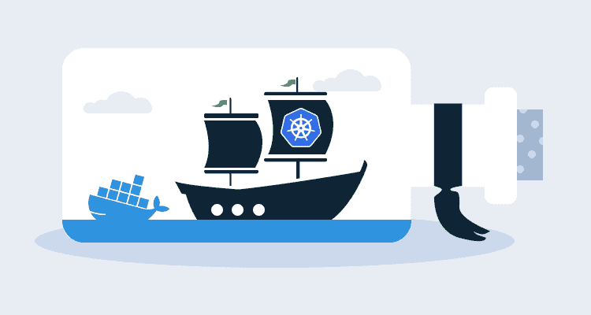

# Kubernetes 1.20 正在贬低 Docker 运行时:这是什么意思？-章鱼部署

> 原文：<https://octopus.com/blog/kubernetes-1-20-deprecating-docker-runtime>

在 11 月 11 日至 12 月 4 日的一周时间里，有很多关于 Kubernetes 放弃支持 Docker 的问题和担忧。

问题是，事实并非如此。Kubernetes 不会放弃对 Docker 的支持。他们放弃了对 Docker 运行时的运行时支持。你要记住，Docker 是一个完整的栈，而不仅仅是一个容器或者一个容器运行时。Docker 包含几个组件。

## 不要惊慌

我向你保证这并不像听起来那么疯狂。事实上，这整件事已经计划了好几年了。如果你是 Kubernetes 的用户，比如 Azure Kubernetes Service (AKS)或 Elastic Kubernetes Service (EKS ),对你来说没什么变化。这几乎会像以前一样继续下去。例如，如果您将 AKS 中的 Kubernetes API 版本升级到 1.19，您已经在运行 [Containerd](https://containerd.io/) ，这是一个运行时，就像 Docker 运行时一样。

您当前用来构建容器和映像的所有东西都将继续工作，包括:

*   [Dockerfiles](https://docs.docker.com/engine/reference/builder/) :你仍然可以在 Kubernetes 中构建 **Docker** 映像并运行容器。
*   Docker 编写:它仍然可以在你的本地 Docker 实例上工作。
*   [Dockerhub](https://hub.docker.com/) : Dockerhub 还会存在。记住，Docker 是一个巨大的堆栈。Docker 图像只是该堆栈的一部分。
*   其他 Docker 注册表:它们仍然可以工作。构建、存储和维护 Docker 映像的方式保持不变。

## Kubernetes 1.20 正在贬低 Docker——实际上发生了什么？

让我们来看看发生了什么，为什么会发生。

Docker 是作为一个整体构建的，但事情正在向更现代的应用程序方法转变。运行时由 [Dockershim](https://godoc.org/k8s.io/kubernetes/pkg/kubelet/dockershim) 提供，这是正在改变的事情之一，它导致了许多混乱。

Dockershim 使用 Kubernetes 为 Docker 集成实现了一个容器运行时接口。然而，远离 Dockershim 始终是一个目标(因此，名称中有“shim”)。最初创建它是为了帮助实现与 Kubernetes 的集成，但最终它只是一个额外的跳跃。正因为如此，Docker 开始开发 Containerd。

Containerd 很像 [CRI-O](https://www.redhat.com/en/blog/introducing-cri-o-10#:%7E:text=CRI%2DO%3A%20A%20Lightweight%20Container%20Runtime%20for%20Kubernetes&text=The%20name%20derives%20from%20CRI,support%20any%20OCI%2Dconformant%20runtime.) ，是一个容器运行时，是开放容器倡议的一部分( [OCI](https://opencontainers.org/) )。

Kubernetes 维护 Dockershim 成为他们肩上的一个巨大负担，因为 Dockershim 是到达 Kubernetes 运行时的额外一跳。正因为如此，Kubernetes 决定使用 CRI，这使得容器运行时的互操作性可以非常平稳地过渡。这意味着，不再需要*跳*。

现在，问题来了。Docker 不实现 CRI，这就是 Docker 运行时被弃用的原因。

## Kubernetes 是不赞成 Dockershim -这是有计划的

除掉多克西姆一直是我的计划。因为 Dockershim 需要额外的一跳，这根本不是有效的，而且在他们开发 Containerd 时，它实际上只是一个占位符。

## Kubernetes 1.20 中发生了什么

从 Kubernetes API 版本 1.20 开始，Docker 运行时将被正式弃用。如果你还有 Docker 运行时，那也没关系。但是，您应该开始考虑迁移到另一个运行时。

从 1.20 开始，如果你还在使用 Docker 运行时，kubelet 启动时会打印一个警告日志。仅此而已，只是一个警告信息。

截至目前，Kubernetes 不带 Dockershim 的最早版本是 2021 年末的 1.23 版本。简而言之，你大概有一年左右的时间来准备。

## 谁受到了影响

随着所有变革的进行，让我们来分析一下谁受到了影响。

首先，如果你正在编写代码，将代码容器化，然后运输，你不会受到影响。事实上，你可能根本看不出或感觉不到有什么不同。你一切都一帆风顺。

如果您是 Kubernetes 集群管理员，您会受到影响，但不会很严重。您所要做的就是用 CRI-O、Containerd 或其他符合 CRI 的运行时替换 Docker 运行时。

这里有一个关于如何实现 Containerd 的很棒的帖子和分解:[https://kubernetes . io/docs/setup/production-environment/container-runtimes/# CRI-o](https://kubernetes.io/docs/setup/production-environment/container-runtimes/#cri-o)。

## 结束语

幸运的是，这种变化远没有大家最初预期的那么严重。作为一名开发人员，您几乎不会注意到区别。作为一名操作人员，您必须更新到一个容器运行时，而不是 Docker 运行时。这一改变是朝着正确方向迈出的一步，消除了与 Dockershim 之间的额外跳跃。现在，Kubernetes 少了一件需要维护的事情，而且产品速度也更快了。