# 在 Kubernetes - Octopus Deploy 中执行金丝雀部署

> 原文：<https://octopus.com/blog/kubernetes-canary-deployments>

当推出应用程序的新版本时，将少量流量导向新版本并观察任何错误可能是有用的。这种策略被称为金丝雀部署，意味着新版本中出现的任何错误只会影响一小部分用户。不断增加新版本的流量可以提高对没有问题的信心，如果出现任何问题，部署可以回滚到以前的版本。

Kubernetes 特别适合 canary 部署，因为它提供了管理部署和引导流量的灵活性。在这篇博文中，我们将看看如何使用 [Voyager 入口控制器](https://appscode.com/products/voyager)和 Octopus 实现金丝雀部署。

## 先决条件

要阅读这篇博文，您需要有一个 Kubernetes 集群，以及一个配置了管理凭证的 Octopus 中的 Kubernetes 目标。我将使用一个 Google Cloud Kubernetes 集群和一个具有`Google Cloud Kubernetes Admin`角色的管理 Kubernetes 目标。

Kubernetes 集群也需要安装 Helm。Google 提供了将 Helm 安装到他们的 Kubernetes 集群中的这些指令。

## 安装 Voyager

在开始将任何应用程序部署到 Kubernetes 之前，我们需要将 Voyager 安装到我们的集群中。Voyager 提供了许多不同的安装方法，但是我发现 Helm 对于这种情况是最方便的。

我们将利用 Octopus 本身的舵步骤来部署 Voyager 舵图。

### 外部供给

第一步是创建一个指向 [AppsCode 图表库](https://github.com/appscode/charts)的外部提要。外部提要位于➜图书馆外部提要下。

[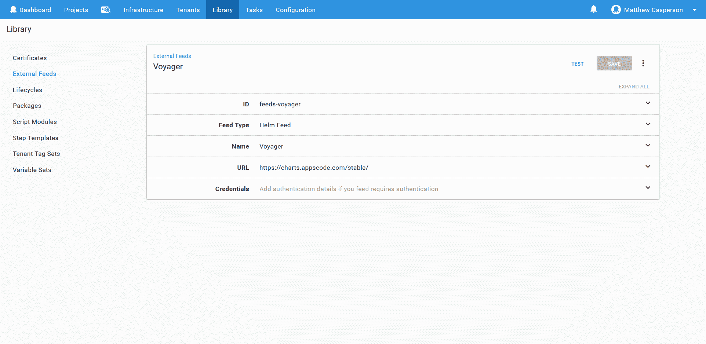](#)

### 舵可执行文件

Helm 对于什么版本的客户端可以与服务器上的特定版本协同工作的要求非常严格。因此，与类似于`kubectl`的工具不同，您经常被迫使用与安装在服务器上的`helm`可执行文件完全相同的客户端版本。

为了满足精确匹配的需要，Octopus 中的 Helm 步骤允许在部署图表时使用包中的可执行文件。

要获得`helm`可执行文件的打包版本，请前往 [Helm GitHub 发布页面](https://github.com/helm/helm/releases)并下载适用于您平台的二进制文件。除非你用的是 workers，否则你的平台很可能是 Windows。

[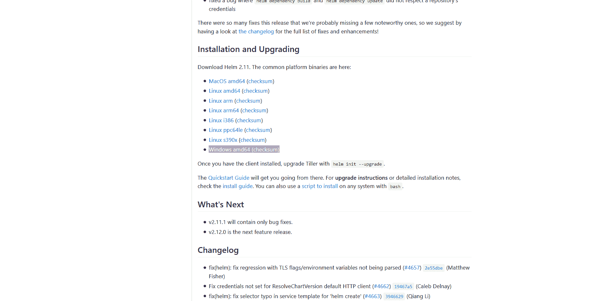](#)

这将下载一个类似于`helm-v2.11.0-windows-amd64.zip`的文件。将其重命名为类似于`helm-windows-amd64.2.11.0.zip`的名称，因为这种文件格式更适合 Octopus 内置的提要。

然后将文件上传到内置提要，可以通过库➜包访问。在下面的截图中，你可以看到我已经上传了 Windows 和 Linux 的`helm`二进制文件。

[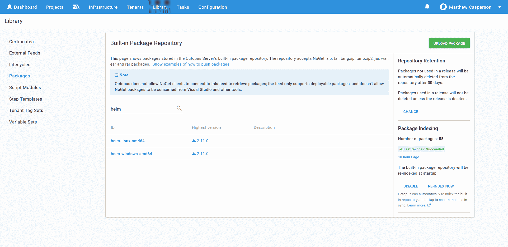](#)

### 展开舵图

为了部署航海家掌舵图，我们使用 Octopus 中的`Run a Helm Update`步骤。

[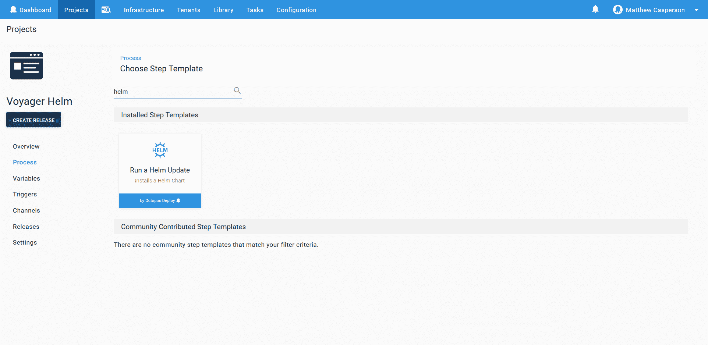](#)

下面的屏幕截图显示了填充的步骤。

[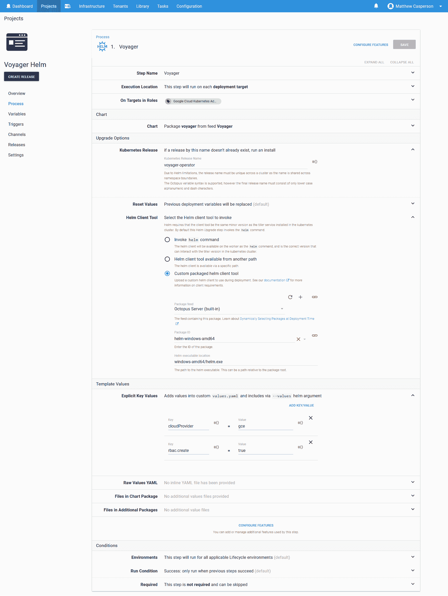](#)

这一步中有几个有趣的设置。首先是`Helm Client Tool`配置。我已经使用了`Custom packaged helm client tool`选项，并将其指向我们之前上传到内置提要的 Helm 二进制包。`windows-amd64/helm.exe`中的`Helm executable location`是指档案中的`helm.exe`文件。在下面的截图中，您可以看到归档的目录结构。

[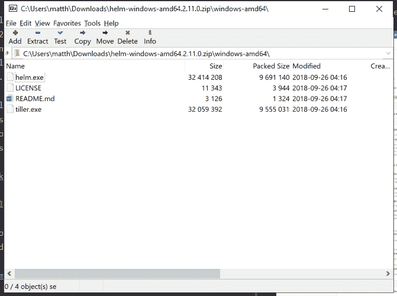](#)

我们还在`Explicit Key Values`部分的舵图上设置了两个值。`cloudProvider`设置被设置为`gce`,因为我正在部署到谷歌云环境。其他选项包括:

*   美国化学学会
*   美国焊接协会
*   蔚蓝的
*   裸机
*   炮控设备
*   gke
*   迷你库贝
*   openstack

`rbac.create`值被设置为`true`,因为我的 Kubernetes 集群启用了 RBAC。

来自部署的日志为我们提供了一个命令，我们可以运行该命令来验证安装。我的命令是`kubectl --namespace=default get deployments -l "release=voyager-operator, app=voyager"`。

[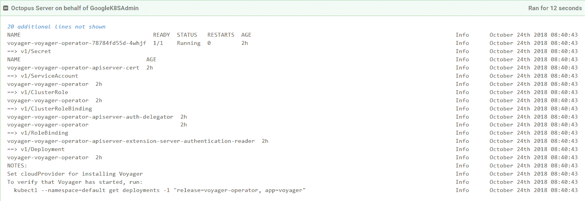](#)

我们可以通过 Octopus 脚本控制台运行这些特别的命令，该控制台可以通过任务➜脚本控制台访问。

在这里，我对名为`GoogleK8SAdmin`的 Kubernetes 管理目标运行了命令。

[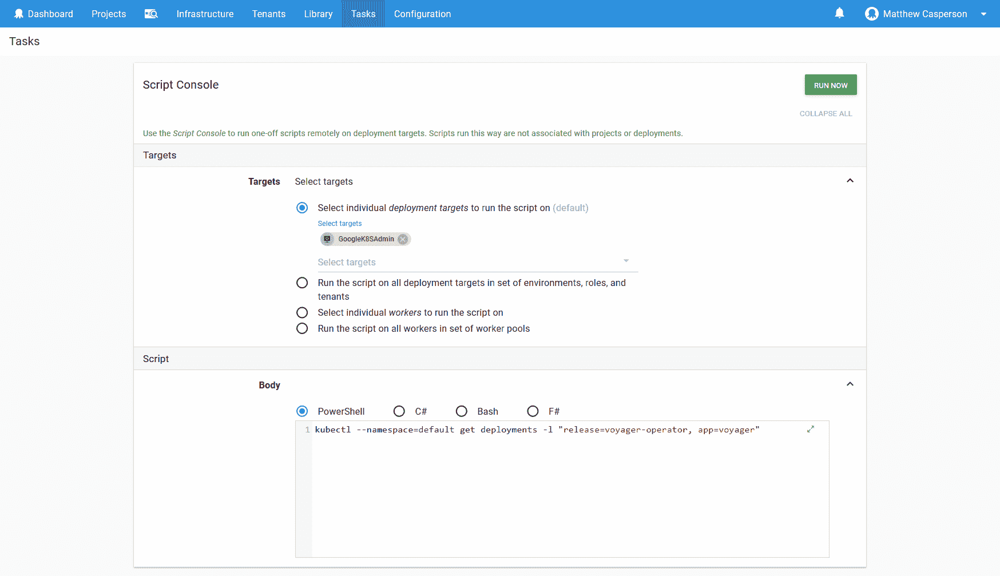](#)

结果显示航海家号已经安装就绪。

[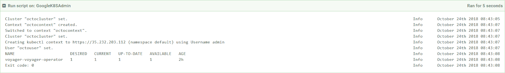](#)

通过 Octopus 运行专门的脚本有很多优点，比如能够针对不同的目标运行命令，而无需在本地配置上下文，以及提供已经运行的脚本的历史记录。

### 金丝雀环境

我们将把 canary 部署的进展建模为 Octopus 环境。这样做有很多好处，比如在仪表板上显示当前进度，并允许轻松地回滚到以前的状态。

环境可以在基础设施➜环境下找到。

对于这个博客，我们将有三个环境:`Canary 25%`、`Canary 75%`和`Canary 100%`。每一个都代表将被定向到 canary 部署的不断增加的流量。

[](#)

重要的是，这些环境允许`Dynamic Infrastructure`，我们将利用这一点来创建我们的受限 Kubernetes 目标，而不是将管理目标用于所有部署。

[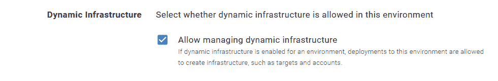](#)

为了在这些环境中推进我们的应用程序，我们将创建一个包含三个阶段的生命周期，每个阶段对应一个 canary 环境。

生命周期可以在➜图书馆生命周期中找到。

[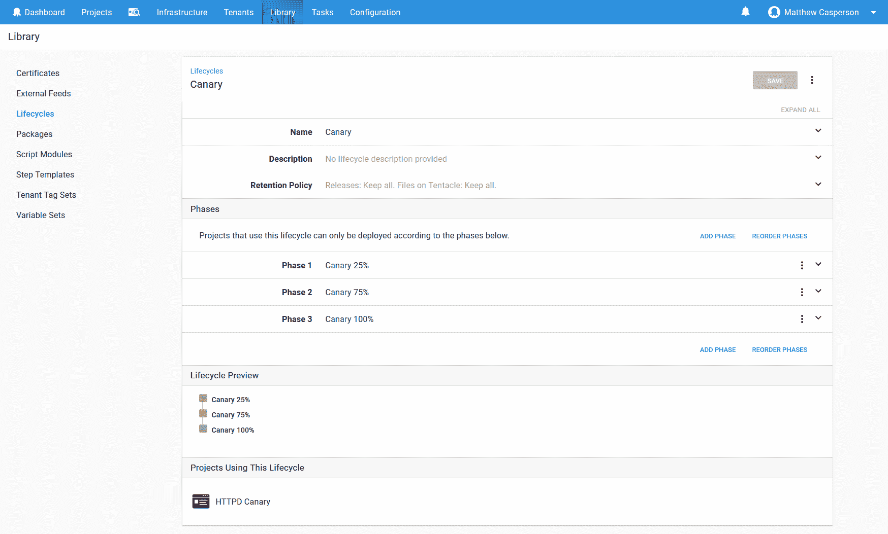](#)

最后，通过将它们添加到`Environments`字段，确保 Kubernetes 管理目标可以访问 canary 环境。

[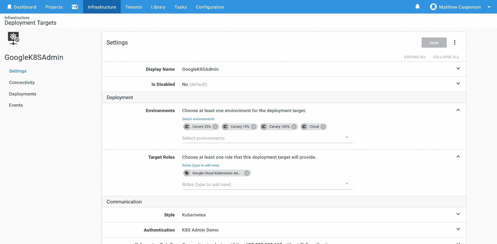](#)

### 部署项目

我们现在已经有了开始部署应用程序的所有基础设施。下一步是创建一个新的部署项目，将应用程序容器推送到 Kubernetes。

对于这个例子，我们将使用 HTTPD 映像，这是一个 web 服务器，我们将配置它来显示一个定制的 web 页面，该页面显示已部署映像的版本。通过将版本显示为网页，我们可以观察到被导向 canary 版本的 web 流量的百分比在增加。

#### 变量

我们将从定义一些将被部署过程使用的变量开始。

| 可变的 | 目的 | 价值 |
| --- | --- | --- |
| 部署命名新 | 新(或金丝雀)部署资源的名称 | httpd-新 |
| 部署名称前一个 | 先前部署资源的名称 | httpd-以前的 |
| 新交通 | 要定向到新部署资源的流量 | 100(作用于`Canary 100%`环境)，75(作用于`Canary 75%`环境)，25(作用于`Canary 25%`环境) |
| 以前的交通 | 新交通的对立面 | 0(作用于`Canary 100%`环境)、25(作用于`Canary 75%`环境)、75(作用于`Canary 25%`环境) |
| 章鱼。action . kubernetescontainers . configmapname template | 生成使用部署资源创建的 ConfigMap 资源名称的自定义模板 | #-http canary |
| previousreplicaccount | 上一次部署的 pod 计数 | 1，0(作用于`Canary 100%`环境) |
| 章鱼打印评估变量 | 允许在日志中显示变量 | False(但是如果需要额外的调试，可以设置为 True) |

[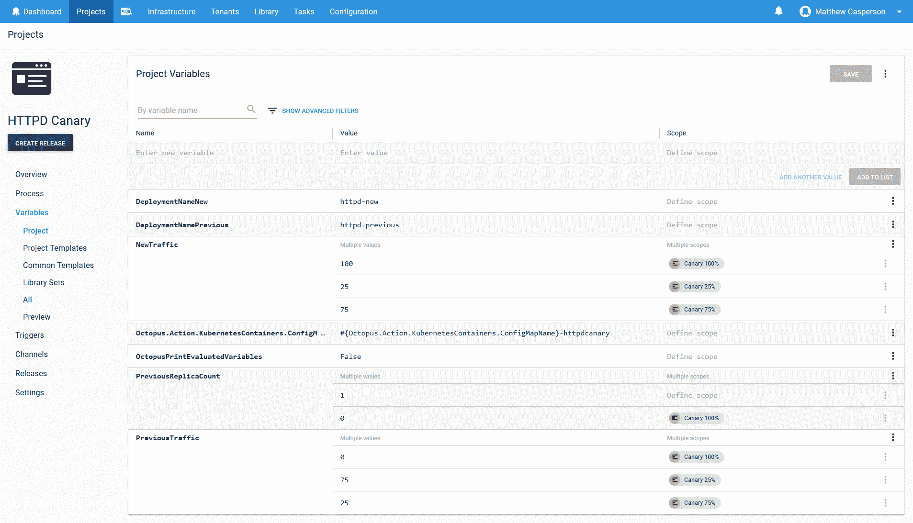](#)

#### 创建目标

流程的第一步是`Run a kubectl CLI Script`步骤。

[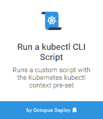](#)

这一步的目的是创建一个 Kubernetes 目标，其权限仅限于单个名称空间。我们将使用这个新的 Kubernetes 目标来部署组成应用程序的资源，而不是总是使用管理帐户来部署资源。使用受限帐户给了我们一定程度的安全性，并限制了错误配置的步骤可能在我们的集群中造成的潜在损害。

话虽如此，这一步是与管理 Kubernetes 目标一起运行的，因为我们必须从某个地方开始。

下面的 PowerShell 代码用于创建 Kubernetes 服务帐户，提取用帐户创建的令牌，使用令牌创建 Octopus 令牌帐户，并使用令牌帐户创建 Kubernetes 目标。

```
# The account name is the project and tenant
$projectNameSafe = $($OctopusParameters["Octopus.Project.Name"] -replace "[^A-Za-z0-9]","")
$accountName = if (![string]::IsNullOrEmpty($OctopusParameters["Octopus.Deployment.Tenant.Id"])) {
    $projectNameSafe + "-" + `
    $($OctopusParameters["Octopus.Deployment.Tenant.Name"] -replace "[^A-Za-z0-9]","")
} else {
    $projectNameSafe
}

# The namespace is the account name, but lowercase
$namespace = $accountName.ToLower()
# The project name is used for a number of k8s names, which must be lowercase
$projectNameSafeLower = $projectNameSafe.ToLower()
#Save the namespace for other steps
Set-OctopusVariable -name "Namespace" -value $namespace
Set-OctopusVariable -name "AccountName" -value $accountName

Set-Content -Path serviceaccount.yml -Value @"
---
kind: Namespace
apiVersion: v1
metadata:
  name: $namespace
---
apiVersion: v1
kind: ServiceAccount
metadata:
  name: $projectNameSafeLower-deployer
  namespace: $namespace
---
kind: Role
apiVersion: rbac.authorization.k8s.io/v1
metadata:
  namespace: $namespace
  name: $projectNameSafeLower-deployer-role
rules:
- apiGroups: ["", "extensions", "apps"]
  resources: ["deployments", "replicasets", "pods", "services", "ingresses", "secrets", "configmaps", "namespaces"]
  verbs: ["get", "list", "watch", "create", "update", "patch", "delete"]
- apiGroups: ["voyager.appscode.com"]
  resources: ["ingresses"]
  verbs: ["get", "list", "watch", "create", "update", "patch", "delete"]
---
kind: RoleBinding
apiVersion: rbac.authorization.k8s.io/v1
metadata:
  name: $projectNameSafeLower-deployer-binding
  namespace: $namespace
subjects:
- kind: ServiceAccount
  name: $projectNameSafeLower-deployer
  apiGroup: ""
roleRef:
  kind: Role
  name: $projectNameSafeLower-deployer-role
  apiGroup: ""
"@

kubectl apply -f serviceaccount.yml

$data = kubectl get secret $(kubectl get serviceaccount "$projectNameSafeLower-deployer" -o jsonpath="{.secrets[0].name}" --namespace=$namespace) -o jsonpath="{.data.token}" --namespace=$namespace
$Token = [System.Text.Encoding]::ASCII.GetString([System.Convert]::FromBase64String($data))

New-OctopusTokenAccount `
    -name $accountName `
    -token $Token `
    -updateIfExisting

New-OctopusKubernetesTarget `
    -name $accountName `
    -clusterUrl #{Octopus.Action.Kubernetes.ClusterUrl} `
    -octopusRoles "HTTPD" `
    -octopusAccountIdOrName $accountName `
    -namespace $namespace `
    -updateIfExisting `
    -skipTlsVerification True 
```

运行该脚本的结果是一个名为`HTTPDCanary`(在项目名称之后)的新 Kubernetes 目标，其角色`HTTPD`定位于 Kubernetes 名称空间`httpdcanary`(也在项目名称之后，但是小写，因为 Kubernetes 在其名称中只允许小写字符)。

[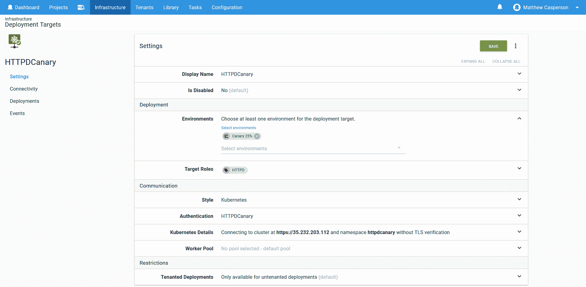](#)

PowerShell 函数`New-OctopusKubernetesTarget`只有在运行它的环境允许动态目标时才起作用，这就是为什么我们的`Canary ##%`环境被配置为允许动态目标。

#### 创建以前的部署资源

第二步是`Deploy Kubernetes containers`步骤。

[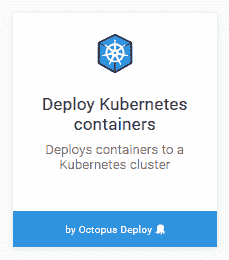](#)

我们将使用这一步来部署应用程序的“稳定”版本。这是金丝雀版本最终将取代的版本。

这一步将代表角色为`HTTPD`的任何目标运行，正如您在上一步中回忆的那样，这是我们分配给新 Kubernetes 目标的角色。通过在有限的 Kubernetes 目标的上下文中执行部署，我们可以确保我们的部署步骤不能删除或修改名称空间`httpdcanary`之外的任何内容。

[](#)

`Deployment`部分为部署资源配置一些高级细节。

`Deployment name`字段引用了我们之前配置的`DeploymentNamePrevious`变量。

`Replica`字段引用了`PreviousReplicaCount`变量。默认情况下，`PreviousReplicaCount`变量设置为 1，当部署到`Canary 100%`环境时，设置为 0。这是因为`Canary 100%`环境会将所有流量导向新版本的应用程序，而以前的版本不再需要任何 Pod 资源，因为它们不会接收任何流量。

我们还定义了一个标签，键为`app`，值为`httpd`。此处定义的标签将应用于部署资源和部署资源创建的 Pod 资源。稍后将使用这些标签从服务资源中选择 pod。

[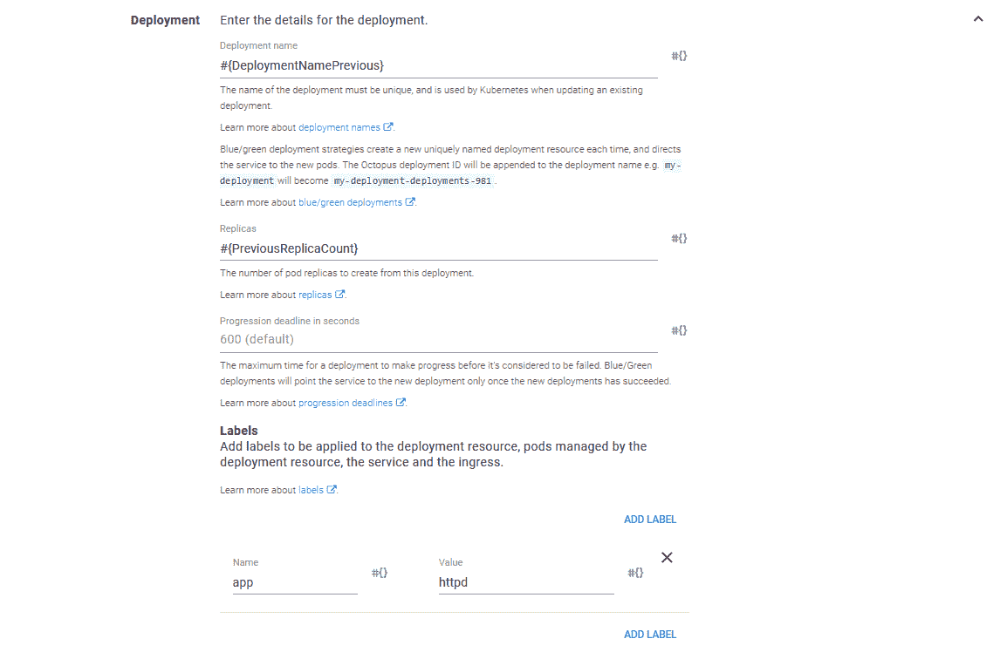](#)

`Deployment strategy`部分保留了默认选项`Recreate deployments`。

实际上，部署策略的选择在我们的部署中不起作用，因为我们不是就地更新部署资源，而是并排部署两个资源。我们正在自己实现 canary 部署模式，而不是使用 Kubernetes 提供的标准模式。

[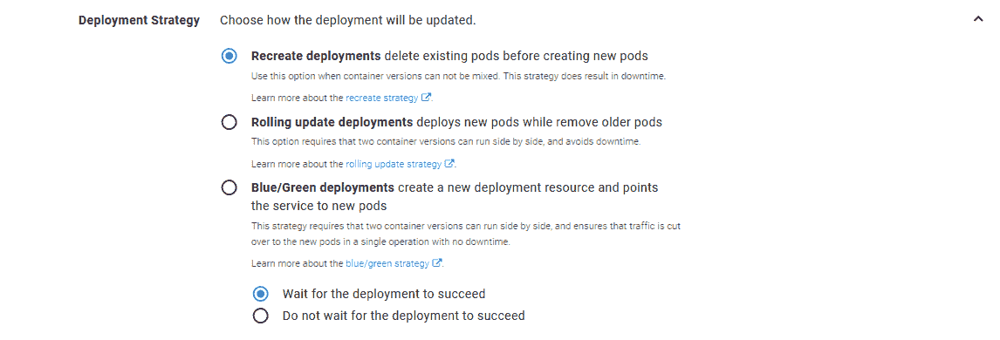](#)

在`Volumes`部分，我们需要将一个项目从我们稍后将创建的名为`index`的配置映射映射到一个名为`index.html`的文件。ConfigMap 将保存一些自定义内容，这些内容作为一个名为`index.html`的文件暴露给我们的容器，这个文件将由 HTTPD 提供。

[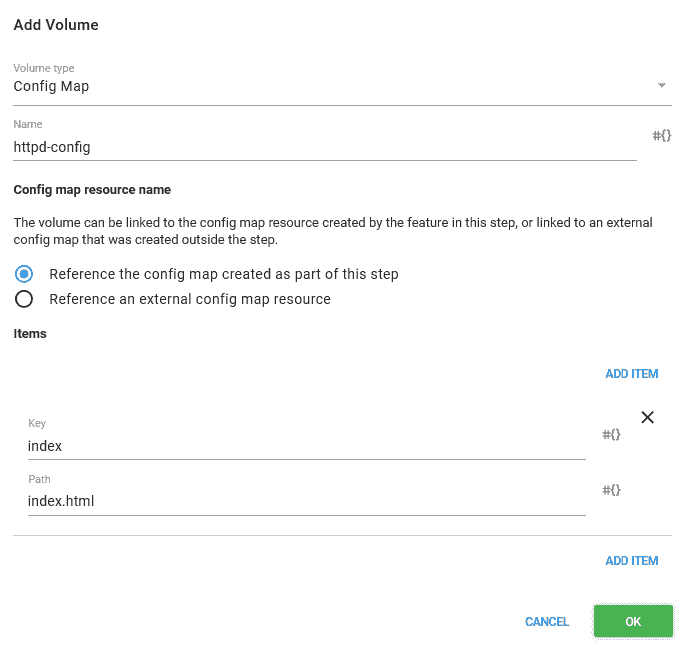](#)

[](#)

接下来是`Containers`部分，我们在这里添加一个容器。

容器和映像部署都被称为`httpd`。

[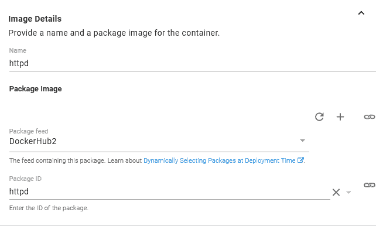](#)

作为 web 服务器，HTTPD 公开了 80 端口。

[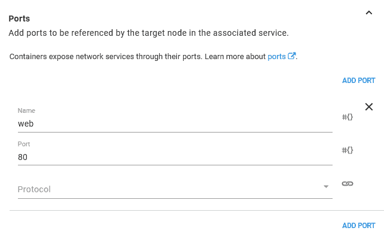](#)

在容器内部，我们将前面定义的卷挂载到路径`/usr/local/apache2/htdocs`。这条路就是 HTTPD 寻找内容的地方。因为我们将名为`index`的 ConfigMap 项公开为名为`index.html`的文件，所以我们最终在容器中装载了一个名为`/usr/local/apache2/htdocs/index.html`的文件。

[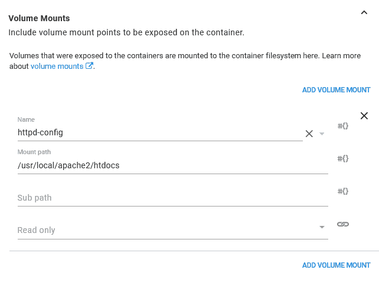](#)

设置好这些值后，我们将看到如下所示的容器摘要。

[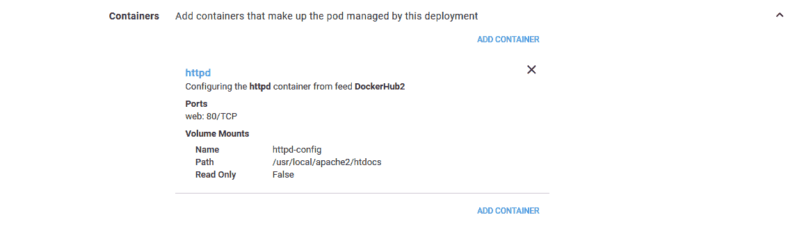](#)

在`Pod Annotations`部分，我们用变量`PreviousTraffic`的值定义了一个名为`ingress.appscode.com/backend-weight`的注释。`PreviousTraffic`变量可以是`0`、`25`或`75`，这取决于我们要部署到的环境。

Voyager 入口控制器将该注释[识别为定义发送给 Pod 资源的流量。](https://appscode.com/products/voyager/5.0.0/guides/ingress/http/blue-green-deployment/)

因此，当部署到`Canary 25%`环境时，`PreviousTraffic`被设置为`75`，这意味着先前的部署将接收 75%的流量。

[](#)

在 ConfigMap 特性中，我们构建了最终将为`index.html`文件提供内容的 ConfigMap 资源。

ConfigMap 的名称被设置为`#{DeploymentNamePrevious}-configmap`，我们添加一个名为`index`的条目，其值为`#{Octopus.Action[HTTPD Old].Package[httpd].PackageVersion}`。

变量`Octopus.Action[HTTPD Old].Package[httpd].PackageVersion`将保存这个容器正在部署的 httpd 映像的版本。因此，如果 HTTPD 提供的文件包含 Docker 映像的版本，我们将会看到什么。这篇[博客](https://octopus.com/blog/octopus-release-2018.8)文章有更多关于这些变量的信息。

[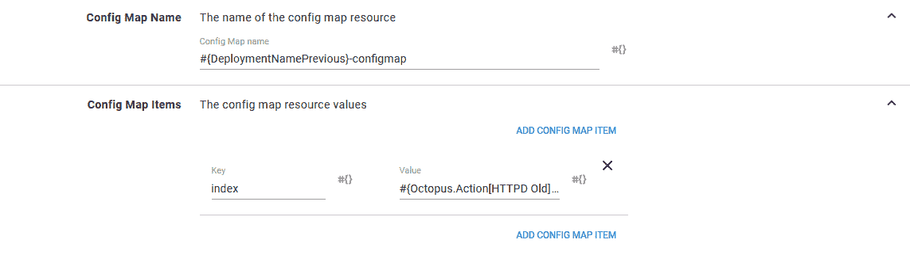](#)

#### 配置映射名称模板

如果你回头看看我们添加到这个项目中的变量，你会注意到我们定义了一个名为`Octopus.Action.KubernetesContainers.ConfigMapNameTemplate`的变量。此变量会影响部署期间管理此配置图的方式。

通常 Octopus 环境是独立的，用于表示从测试到生产的不同过程。也就是说，部署到测试环境不会影响生产环境，反之亦然。

我们在这里使用的环境略有不同。我们的环境代表的不是截然不同的独立环境，而是被导向新版本或金丝雀版本的流量的逐渐变化。

这是一个微妙但重要的区别，因为这意味着`Canary 25%`环境和`Canary 75%`环境是同一个逻辑环境。这意味着对`Canary 75%`环境的部署会覆盖对`Canary 25%`环境的部署。

然而，Kubernetes 的步骤是在假设环境各不相同的情况下配置的。这个假设的一个含义是，当我们将 ConfigMap 资源作为容器步骤的一部分部署到`Canary 25%`环境时，它将具有唯一的名称，当我们再次将 ConfigMap 部署到`Canary 75%`环境时，该名称不会被覆盖。当您从测试转移到生产时，不覆盖资源通常是有意义的，但是在我们的例子中，我们确实希望覆盖资源。

通过为每个部署提供一个唯一的名称，可以防止覆盖 ConfigMap 资源。默认情况下，这个惟一的名称是通过在名称末尾附加 Octopus 部署 ID 生成的。

例如，我们给配置映射命名为`#{DeploymentNamePrevious}-configmap`，它将解析为名称`http-previous-configmap`。在部署过程中，这个名称与部署 ID 结合起来产生一个唯一的名称，如`http-previous-configmap-deployment-1234`。

然而，我们不需要唯一的名称。我们希望名称在我们的 canary 环境之间是相同的，因此资源将被覆盖。

这就是我们将`Octopus.Action.KubernetesContainers.ConfigMapNameTemplate`变量设置为`#{Octopus.Action.KubernetesContainers.ConfigMapName}-httpdcanary`的原因。这将覆盖附加部署 ID 的默认行为，而是附加固定字符串`httpdcanary`。

这意味着我们的 canary 环境每次都会部署一个名为`http-previous-configmap-httpdcanary`的 ConfigMap 资源。而且因为名称不再唯一，所以在每个环境中都会被覆盖。

我们这样做是为了防止旧的未使用的 ConfigMap 资源填满我们的名称空间。通过在环境之间使用公共名称，我们最终为每个部署资源提供一个配置图。

#### 创建 Canary 部署资源

第三步几乎是第二步的完全复制。在这里，我们部署了代表 canary 版本的部署资源。

由于这一步与上一步非常相似，所以我将在这里强调不同之处。

将`Deployment name`设置为`#{DeploymentNameNew}`，将`Replicas`设置为固定值`1`。

[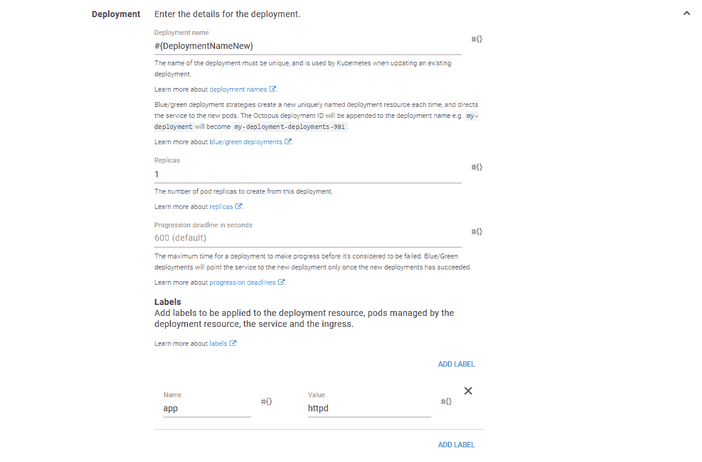](#)

`Pod Annotations`值被设置为`#{NewTraffic}`。

[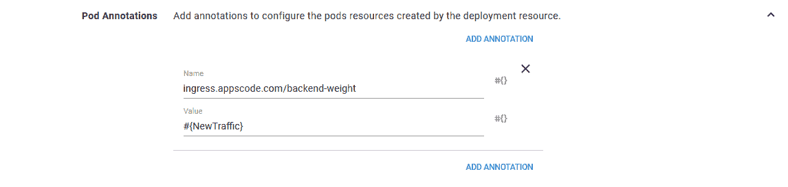](#)

配置图名称设置为`#{DeploymentNameNew}-configmap`，项目值设置为`#{Octopus.Action[HTTPD New].Package[httpd].PackageVersion}`。

[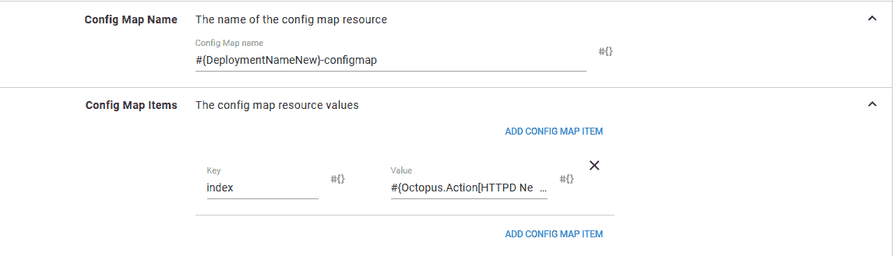](#)

否则，容器、卷和部署策略的配置与上一步相同。

#### 服务

第四步是用`Deploy Kubernetes service resource`步骤创建一个服务资源。

[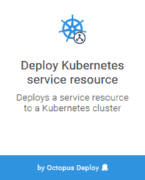](#)

与之前的容器步骤一样，这个步骤部署在具有`HTTPD`角色的目标的上下文中。

[](#)

我们将该服务命名为`httpd-service`。

[](#)

将`Service Type`设置为`Cluster IP`。

[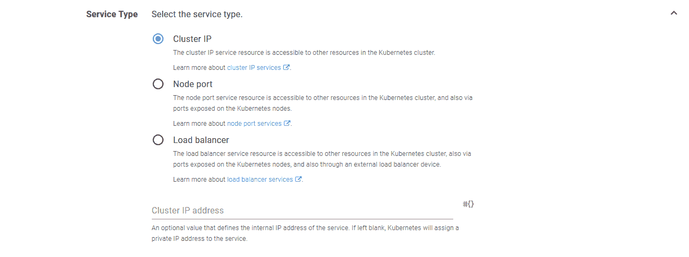](#)

该服务接受流量并将流量定向到端口 80。

[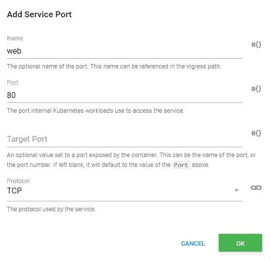](#)

[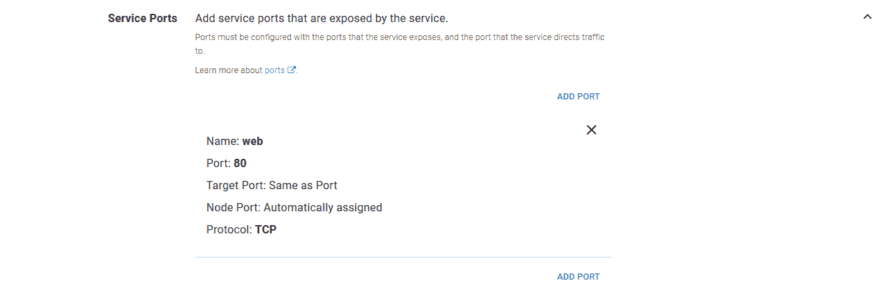](#)

该服务通过将`Service Selector Labels`设置为名称`app`和值`httpd`来选择它将流量导向的 Pod 资源。这些是我们在前面的容器步骤中定义的相同标签。

[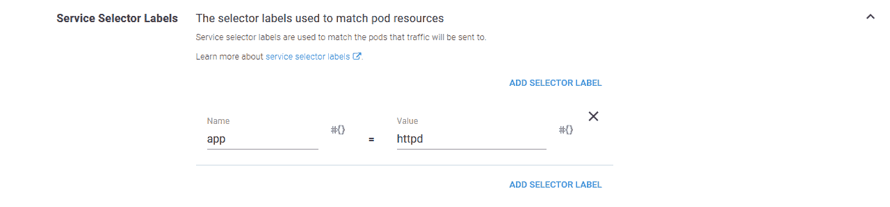](#)

#### 旅行者号入口资源

第五步也是最后一步是定义航海家号的入口资源。这个资源不是标准的 Kubernetes 资源，所以我们不能使用 Octopus 中的标准入口步骤来部署它。相反，我们再次使用`Run a kubectl CLI Script`步骤保存一个 YAML 文件，并用`kubectl`命令应用它。

```
Set-Content -Path "ingress.yaml" -Value @"
apiVersion: voyager.appscode.com/v1beta1
kind: Ingress
metadata:
  name: httpd-ingress
spec:
  backend:
    serviceName: httpd-service
    servicePort: "80"
"@

kubectl apply -f ingress.yaml 
```

## 部署项目

让我们创建这个项目的部署。作为部署的一部分，我们有机会选择将作为部署资源的一部分进行部署的 Docker 映像的版本。

这里我把旧的或者以前的版本设置为`2.4.18`。在本例中，该版本代表部署的最后一个稳定版本。

然后我将新的或淡黄色的版本设置为`2.4.20`。这代表了我想要逐步推出的应用程序的新版本，以检查任何可能的问题。

[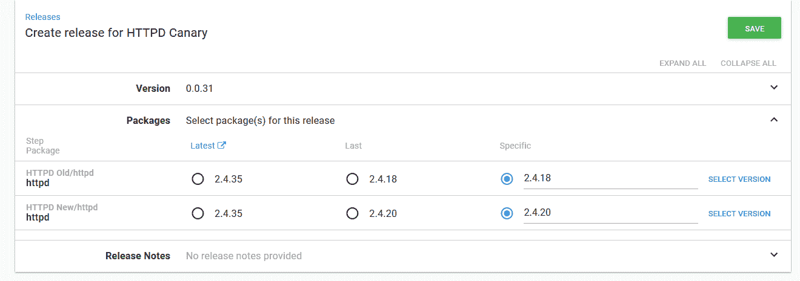](#)

然后，我们将把它部署到`Canary 25%`环境中。

## 我们刚刚部署了什么？

仅仅配置这些步骤，就很难理解我们到底在部署什么。一旦我们将这个项目部署到`Canary 25%`环境中，我们将得到这样的结果:

[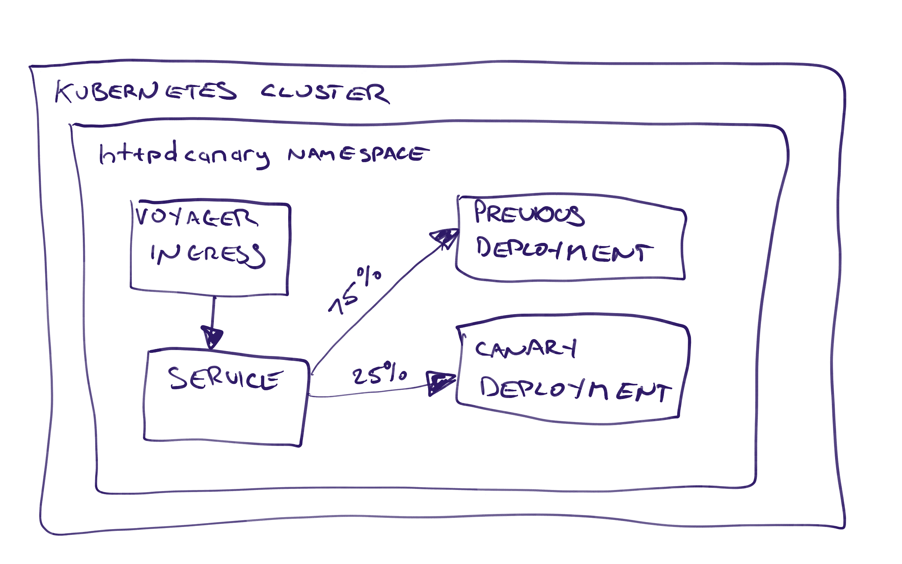](#)

Voyager 入口资源将流量定向到服务资源，服务资源又将流量定向到两个部署资源(或者从技术上讲，由部署资源创建的 Pod 资源)。

由于 Pod 资源上的`ingress.appscode.com/backend-weight`注释，Voyager 知道将 25%的流量导向金丝雀 Pod 资源，75%导向先前的 Pod 资源。

一旦部署，每个 Voyager 入口资源创建一个相关的负载平衡器服务资源。这个负载平衡器有一个公共 IP 地址，我们可以从浏览器访问它。在我的情况下，公共 IP 是 35.194.2.130。

[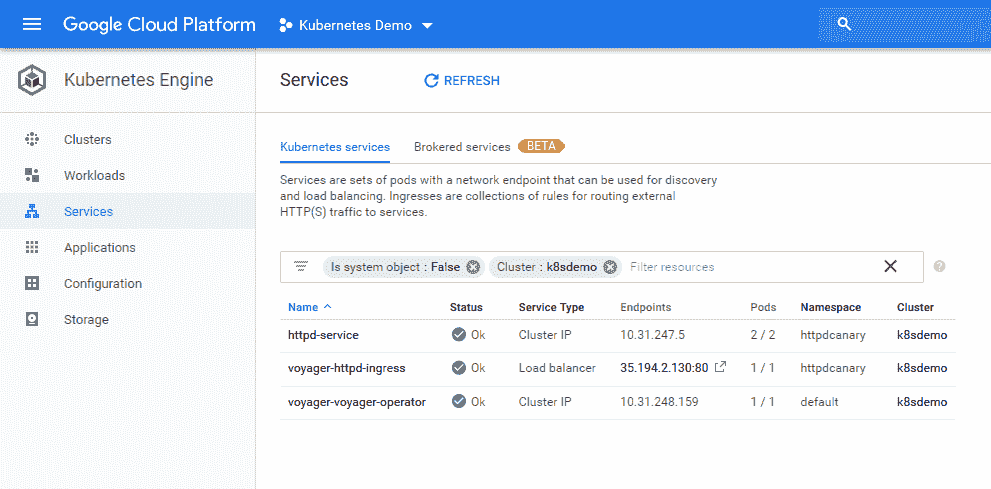](#)

在浏览器中打开此页面会显示为该页面提供服务的 HTTPD 版本。

我的第一个页面显示的是版本`2.4.20`。这意味着我被引导到金丝雀豆荚资源。

[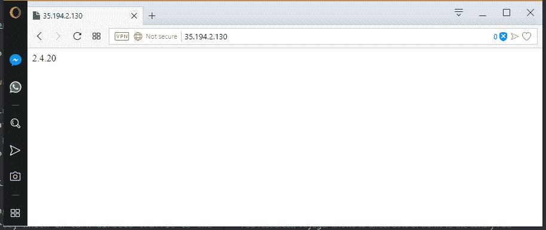](#)

刷新后，我看到了版本`2.4.18`。这意味着我被引导到以前的 Pod 资源。

[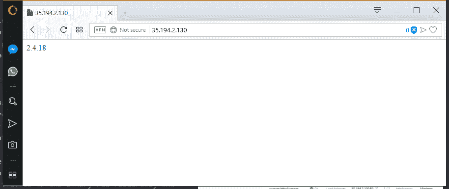](#)

当我一次又一次刷新页面时，我看到的版本`2.4.18`比看到的`2.4.20`多。这证实了大部分的流量都被导向以前版本的 HTTPD，只有 25%被导向金丝雀豆荚。

如您所料，将部署提升到`Canary 75%`环境会逆转流量比例。现在 75%的流量被导向金丝雀豆荚资源。

提升到`Canary 100%`环境就完成了我们的部署。所有流量都被发送到 canary Pods，并且之前的 Pod 资源已被移除，因为在`Canary 100%`环境中`Replicas`值为 0。

## 恢复部署

将 canary 部署表示为 Octopus 环境的好处是，我们可以恢复到以前的状态。比方说，在部署到`Canary 75%`环境之后，您开始看到在部署到`Canary 25%`环境时不存在的网络中断。

要回滚到`Canary 25%`环境，在 Octopus 中打开部署并从垂直菜单中选择`Deploy to`选项。

[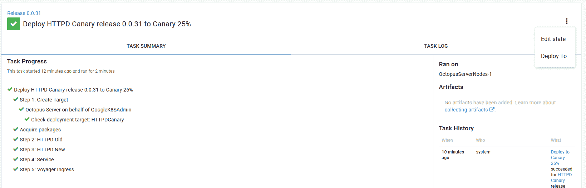](#)

选择`Canary 25%`环境并点击`Deploy`按钮。

[](#)

Octopus 然后将重新运行部署，这又会将 canary 部署恢复到 25%的流量被定向到新版本的状态。

## 开始下一次金丝雀部署

一旦我们部署到`Canary 100%`环境，我们的 Kubernetes 集群看起来就像这样:

[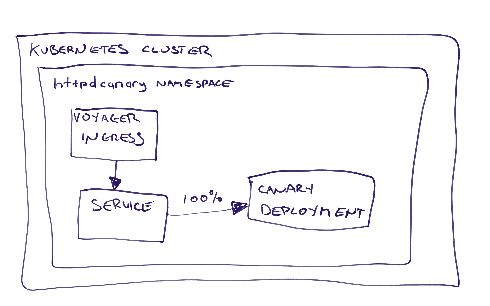](#)

100%的流量被发送到 canary Pod 资源，而之前的 Pod 资源已缩减为 0。

让我们开始部署新版本。现在我们的老版本或者以前的版本就是`2.4.20`的最后一个金丝雀版本。新的或金丝雀版本是`2.4.23`。

[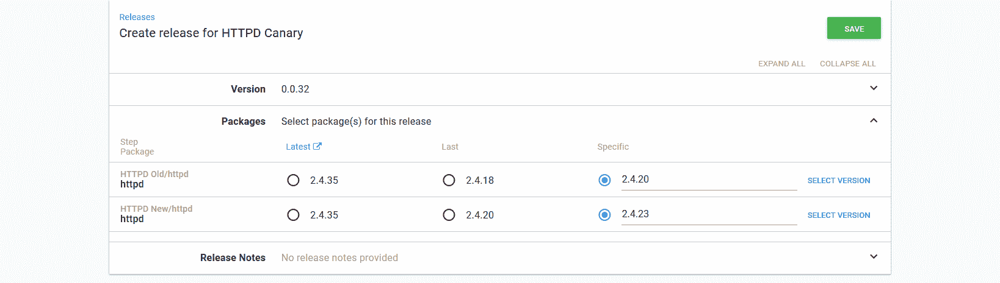](#)

这一新部署将:

1.  使用版本`2.4.20`部署先前的部署资源(目前缩减为 0)。注释将此部署配置为接收 75%的流量。
2.  用新版本的`2.4.23`部署当前配置有版本`2.4.20`的 canary 部署资源。注释将此部署配置为接收 25%的流量。
3.  服务和航海家号入口资源在这一点上保持不变。

第二次部署的好处是没有太多的停机时间。在进行步骤 1 中的部署时，旧的 canary 部署仍在为流量提供服务。在进行步骤 2 的部署时，步骤 1 中的部署正在为流量提供服务。在步骤 3 之后，所有流量都根据分配的百分比进行路由。

## 摘要

在这篇文章中，我们看了如何配置 Octopus 和 Voyager Ingress 控制器，以在 Kubernetes 中提供金丝雀部署。

通过将 canary 部署的进展建模为环境，我们创建了一个解决方案，可以将流量增量增加到 canary 版本，同时提供回滚到以前状态的可能性。