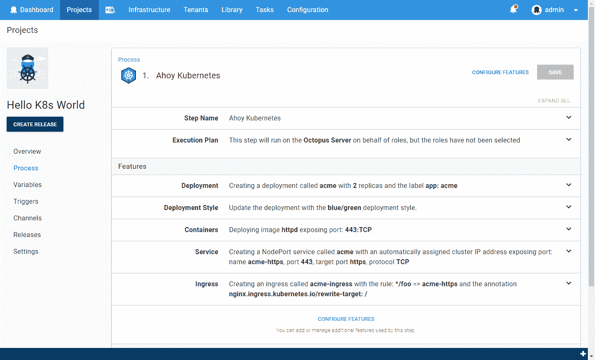

# Kubernetes、容器和 Octopus -更新- Octopus 部署

> 原文：<https://octopus.com/blog/kubernetes-containers-update>

几个月前，我们问章鱼社区他们是否能抽出几分钟和大脑周期来提供一些关于我们 Kubernetes 计划第一稿的反馈。你确实做到了。首先，谢谢你！我们真诚地感谢每一个分享他们想法的人。产品肯定会从中受益。

反馈中有一些共同的主题，这使我们稍微改变了方向。我们会稍微谈一下那些，然后最后给出一个总结和进度更新。

## #1 更友好的库伯内特人

Octopus 的优势之一一直是用户友好。它允许您部署到 ASP.NET 网站，而不是一个 100 级的 IIS 向导。

有人指出，我们可能错过了为 Kubernetes 提供类似体验的机会；可能会让学习曲线变得平滑一点。我们同意了。

作为第一步的一部分，我们将包括一个*将容器部署到 Kubernetes* 的部署步骤。这一步将有一个丰富的用户界面，并将经历以下过程:

*   创建 Kubernetes 部署，包括选择部署样式和容器映像:

*   创建(或更新)Kubernetes 服务，包括映射端口:

*   配置入口规则:

最终结果(包含折叠的部分)将类似于:

Octopus 的另一个优势是管理[变量](https://octopus.com/docs/deployment-process/variables)，包括[转换配置文件](https://octopus.com/docs/deployment-process/configuration-features)。但是如果你不能把这些文件放进你的 Kubernetes 豆荚里，这就是多余的。

Kubernetes 有配置图(和机密，用于敏感数据)的概念。我们将提供一种简单的方法来利用 Octopus 变量和配置文件的能力，并将结果推送到 ConfigMap 或 Secret。

我们对将容器部署到 Kubernetes 的步骤感到兴奋。从一个空的 YAML 文件开始，Kubernetes 的学习曲线可能会令人生畏，我们觉得 Octopus 在这方面有帮助的余地。我们对选择`Blue\Green`作为部署风格的能力特别感兴趣。这有望使一些复杂的场景更容易配置。我们将在以后的文章中详细讨论这一点。

## 2 号舵手

很多人真的喜欢赫尔姆，是吧？

似乎很大一部分 Kubernetes 用户正在使用 Helm，许多人明确表示，没有 Helm 集成会导致他们拆除 Octopus 安装并破坏托管它的服务器😉幸运的是，一旦我们调查，Helm 实际上非常适合 Octopus 架构。

所以我们也致力于增加头盔的整合。这将采用以下形式:

*   一种舵图库馈送类型

*   舵部署释放步骤

无论你是否使用头盔，我们都想提供一个很好的体验。好吧，说实话，我们有点害怕赫尔姆民兵😛

## #3 不仅仅是 Kubernetes

我们还被提醒说，有许多容器场景不涉及 Kubernetes，而 Octopus 目前对这些场景有一些粗糙的边缘。例如，部署到 ECS。

为了帮助解锁目前我们不会添加一流支持的所有场景，我们对*运行脚本*步骤做了一些更改，使处理容器图像变得更好。

以前，从脚本步骤引用包的唯一方法是将脚本嵌入包中。这甚至不支持容器图像。这意味着在定制脚本步骤中处理容器图像通常需要将图像标签作为常规变量添加，并在创建发布之前修改它。这是可行的，但是它失去了版本控制的传统优势，例如:

*   创建发行版时选择软件包版本。
*   能够将发布版本绑定到包版本。
*   查看发行版中包含哪些包版本。

客户甚至通过在他们的部署过程中包含虚拟包(例如 NuGet 或 Zip)来模拟这些，以表示他们的容器映像，因为这些将在发布中被捕获。这很聪明，但也让我们难过。它不应该需要那种程度的独创性。

现在，您将能够从脚本步骤中引用包(包括容器映像)。这些包的版本将在创建发布时选择，然后将从您的自定义脚本中可用，作为一组变量和包本身，取决于所选的采集选项(更多详细信息，请参见[规范](https://github.com/OctopusDeploy/Specs/blob/master/Script-Step-Packages/index.md))。

此更改将应用于以下步骤:

*   `Run a script`
*   `Run an Azure PowerShell Script`
*   `Run an AWS CLI Script`
*   新的`Run a kubectl Script`步骤(见下文)

我们还添加了一个`AWS Elastic Container Registry`提要类型。目前[可以在 Octopus 中将 AWS ECR 配置为 feed](https://octopus.com/docs/packaging-applications/package-repositories/registries/amazon-ec2-container-services#amazon-ec2-container-service) ，但这相当复杂，并且有一个明显的缺点，即凭证会在 12 小时后超时。新的饲料将避免这个问题。

我们希望这些变化会让容器场景感觉更加自然，并且能够更好地利用 Octopus 的能力。

## 摘要

制作章鱼爱心容器行动的第一步将包括以下内容:

### 什么时候？

上面的大部分功能都已经构建好了。我们计划在 8 月份的发行版中推出这款产品。Kubernetes 的功能最初会隐藏在一个功能开关后面，因为我们认为这是一个 alpha 版本。我们有许多志愿者 K8s 实验室大鼠，我们将在未来几周内与您联系，邀请您试用它并提供反馈。

一旦我们满意我们的早期采用者喜欢它，我们将删除功能切换，并宣布它为生产就绪。

### 第 1 步，共 N 步

这仅仅是开始。如果我们遗漏了一些您希望得到支持的内容，请告诉我们。我们关注的问题包括:

*   一个`Docker Compose`部署步骤
*   Kubernetes 应用了我们最初提出的步骤
*   ECS 支持

和往常一样，欢迎对这篇文章发表评论。我们还在[Octopus Deploy community Slack](https://join.slack.com/t/octopususergroup/shared_invite/MjMxOTEzMTE2NjcyLTE1MDM5MTc1MTUtZmVlYjBjMmZhMA)中创建了一个`#containers`频道，所以你也可以来那里和我们聊天。