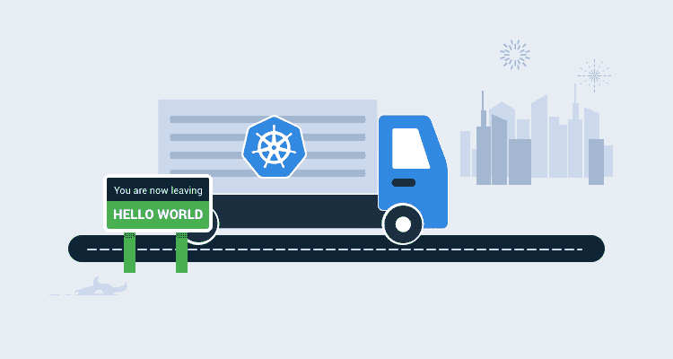
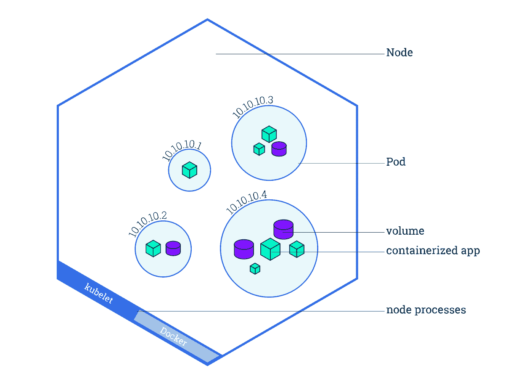
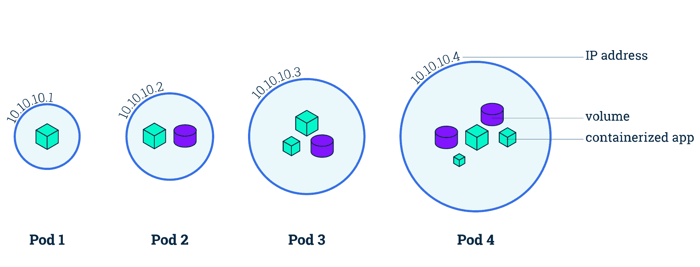
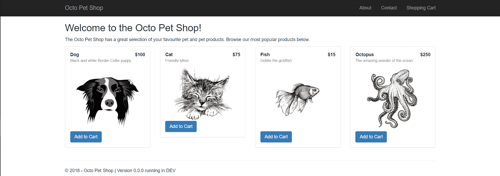

# 超越 Hello World:面向门外汉的 Kubernetes 章鱼部署

> 原文：<https://octopus.com/blog/kubernetes-for-the-uninitiated>

[](#)

Docker 容器和 Kubernetes 是您 DevOps 工具箱中的优秀技术。这个**超越 Hello World** 博客系列涵盖了如何在现实应用中使用它们。

* * *

到目前为止，你肯定听说过 Kubernetes 这个词，但它是最新的流行词还是有更多含义？在这篇文章中，我将介绍 Kubernetes(或简称 k8s)是什么，并演示如何在 k8s 上运行真实世界的 web 应用程序 [OctoPetShop](https://github.com/OctopusSamples/OctoPetShop) 。

在 Kubernetes 的 K 和 S 之间有八个字母，因此是 k8s。

## What is Kubernetes?

Kubernetes 是一种容器编排技术。从概念上讲，Kubernetes 架构非常简单。运行 Kubernetes 的机器被称为`nodes`。节点组成了一个 Kubernetes `cluster`，尽管一个集群也可能只有一个节点。节点在所谓的`pod`中运行容器。

[](#)

## 桌面对接器和库比特

我的[上一篇文章](/blog/containerize-a-real-world-web-app)使用 Docker Desktop 进行 Docker 容器的本地开发，但 Docker Desktop 也包含 Kubernetes 的一个实现，这使得本地开发和测试变得轻而易举。

## 创建 OctoPetShop Kubernetes 组件

为了在 Kubernetes 上运行 OctoPetShop 容器图像，我们需要创建 YAML 文件来定义应用程序所需的不同资源。资源类型称为`kind`，容器类型称为`deployment`。

OctoPetShop 应用程序有三个主要组件:

*   一个 web 前端。
*   产品服务。
*   购物车服务。

除了这些组件，OctoPetShop 还需要一个数据库服务器和数据库来运行。对于 OctoPetShop，我们需要创建以下部署:

*   Web 前端。
*   产品服务。
*   购物车服务。
*   Microsoft SQL Server。

### Kubernetes 部署

以下是前端的部署 YAML 文件:

```
apiVersion: apps/v1
kind: Deployment
metadata:
  name: octopetshop-web-deployment
spec:
  replicas: 1
  selector:
    matchLabels:
      component: web
  template:
    metadata:
      labels:
        component: web
    spec:
      containers:
        - name: web
          image: octopussamples/octopetshop-web
          ports:
            - containerPort: 5000
              name: http-port
            - containerPort: 5001
              name: https-port
          env:
            - name: ProductServiceBaseUrl
              value: http://octopetshop-productservice-cluster-ip-service:5011/
            - name: ShoppingCartServiceBaseUrl
              value: http://octopetshop-shoppingcart-cluster-ip-service:5012 
```

### 库贝内特斯·YAML 档案剖析

*   **apiVersion** : Kubernetes 提供了一个 [API 参考](https://kubernetes.io/docs/reference/#api-reference)来帮助决定选择哪个版本。对于种类*部署*，`apps/v1`是正确的选择。
*   种类:这告诉 Kubernetes 我们正在部署什么类型的资源。
*   **元数据名称**:这是我们部署的唯一名称。
*   **spec - replicas** :要运行的容器实例的数量。
*   **规格选择器-匹配标签**:
    *   **选择器**:选择器字段定义 Kubernetes 对象如何找到要管理的窗格。
    *   **标签**:标签是附在对象上的键/值对，用于指定识别属性。
*   **模板**:pod 的模板规格。
*   **template-spec-containers**:这个部分是这个部署将运行的容器的数组。

每个容器获得:

*   **名称**:我们给容器起的名字。
*   **图像**:用于容器的 Docker Hub 图像。
*   **Ports** :容器将向 pod 网络公开的一组端口。
*   **Env** :容器的环境变量数组。

其余的部署 YAML 文件见 [OctoPetShop](https://github.com/OctopusSamples/OctoPetShop/tree/master/k8s) 。

部署将为我们的应用程序创建 pod，但是我们仍然需要一种方法让它们进行通信。

[【](#)

节点上的每个 pod 都有一个由该节点分配的内部 IP 地址。在我们的容器中，我们已经指定了向 pod 公开的端口，但是这些端口仍然只在 pod 中，而没有向节点公开。为了允许节点上的 pod 之间的连接，我们需要为每个 pod 创建一个`service`。

### Kubernetes 服务

通过 API 可以获得许多不同的服务，但是我们将把重点放在允许我们的 OctoPetShop 应用程序运行的特定服务上。我们的 web 前端 pod 需要能够与产品服务和购物车服务 pod 对话。产品服务和购物车服务窗格需要能够与 SQL Server 窗格通信。为了实现这一点，我们需要为产品服务、购物车服务和 SQL Server pods 创建一个`ClusterIP`服务。下面是为产品服务创建 ClustIP 服务的 YAML:

```
apiVersion: v1
kind: Service
metadata:
  name: octopetshop-productservice-cluster-ip-service
spec:
  type: ClusterIP
  selector:
    component: productservice
  ports:
    - port: 5011
      targetPort: 5011
      name: http-port
    - port: 5014
      targetPort: 5014
      name: https-port 
```

在上面的 Kubernetes YAML 中，我们创建了一个服务，将一个 pod 端口映射到一个容器端口，以允许节点内的 pod 到容器通信。此服务不在节点级别公开端口，因此不可能进行外部访问。记录元数据名称很重要，因为该名称将创建一个 DNS 条目，以便可以通过 DNS 名称引用该服务。在之前的 web 前端 YAML 中，我们为产品服务 URL 声明了一个环境变量，其中包含 octopet shop-product service-cluster-IP-service 作为 DNS 条目。产品服务的 ClusterIP 服务就是其来源。

### 允许外部访问

为了允许外部访问节点，我们需要定义一个`Ingress`或`LoadBalancer`服务。在我们的例子中，我们选择了一个负载平衡器服务来允许对 web 前端的访问:

```
apiVersion: v1
kind: Service
metadata:
  name: web-loadbalancer
spec:
  selector:
    component: web
  ports:
    - port: 80
      targetPort: 5000
      name: http-port
    - port: 5001
      targetPort: 5001
      name: https-port
  type: LoadBalancer
  externalIP: <IPAddress> 
```

**警告**

### Kubernetes 乔布斯

我们的 OctoPetShop 解决方案中包括一个 DbUp 项目，它包含创建和播种数据库的脚本。DbUp 是一个控制台应用程序，它会执行然后停止，所以我们不想使用`kind: Deployment`，因为 Kubernetes 会试图让它保持运行。为此，我们想使用`kind: Job`，它专门用于在完成以下操作后终止:

```
apiVersion: batch/v1
kind: Job
metadata:
  name: octopetshop-dbup
spec:
  template:
    spec:
      containers:
        - name: dbup
          image: octopussamples/octopetshop-database
          env:
            - name: DbUpConnectionString
              value: Data Source=octopetshop-sqlserver-cluster-ip-service;Initial Catalog=OctoPetShop; User ID=sa; Password=SomePassword
      restartPolicy: Never 
```

## 库贝特尔

Kubectl 是用于 Kubernetes 的命令行程序。

### 在 Kubernetes 开始 OctoPetShop

要运行 Kubernetes YAML 文件，您可以运行命令`kubectl apply -f <YAMLFile>`。但是，可以指定一个文件夹，而不是单个文件。这是 OctoPetShop repo 将所有 Kubernetes YAML 文件存储在 k8s 文件夹中的主要原因。如果您已经克隆了 repo，您可以运行`kubectl apply -f k8s`让整个集群运行，只需一个命令:

```
PS C:\GitHub\OctoPetShop> kubectl apply -f k8s
job.batch/octopetshop-dbup created
service/web-loadbalancer created
service/octopetshop-productservice-cluster-ip-service created
deployment.apps/octopetshop-productservice-deployment created
service/octopetshop-shoppingcart-cluster-ip-service created
deployment.apps/octopetshop-shoppingcartservice-deployment created
deployment.apps/sqlserver-deployment created
service/octopetshop-sqlserver-cluster-ip-service created
service/octopetshop-web-cluster-ip-service created
deployment.apps/octopetshop-web-deployment created 
```

### 检查 Kubernetes pod 状态

apply 命令向我们显示，它运行了 YAML 文件，但没有运行其他文件。为了检查 pod 的状态，我们运行命令`kubectl get pods`:

```
PS C:\GitHub\blog> kubectl get pods
NAME                                                         READY   STATUS      RESTARTS   AGE
octopetshop-dbup-9kt54                                       0/1     Completed   0          2m55s
octopetshop-productservice-deployment-6f955ff576-4nwtw       1/1     Running     0          2m55s
octopetshop-shoppingcartservice-deployment-9f94574f9-t96ck   1/1     Running     0          2m55s
octopetshop-web-deployment-7b6d499d69-f9jsp                  1/1     Running     0          2m55s
sqlserver-deployment-784d755db-8vbwk                         1/1     Running     0          2m55s 
```

该命令向我们显示有多少 pod 正在运行，以及应该有多少 pod 正在运行。在我们的例子中，我们将副本指定为 1，因此在我们的 pod 中应该只有 1 个实例。您会注意到 octopetshop-dbup pod 已准备好 0/1 个 pod。因为我们用`kind: Job`定义了 octopershop-dbup，这是正常的，因为它应该在运行后终止。

### 显示日志

与 docker compose 不同，运行 kubectl apply 命令不会显示来自 pod 或容器的任何输出。当一个 pod 出现故障时，知道原因是很有用的。让我们更改 octopetshop-dbup 作业的密码，使其失败:

```
apiVersion: batch/v1
kind: Job
metadata:
  name: octopetshop-dbup
spec:
  template:
    spec:
      containers:
        - name: dbup
          image: octopussamples/octopetshop-database
          command: [ "dotnet", "run", "--no-launch-profile" ]
          env:
            - name: DbUpConnectionString
              value: Data Source=octopetshop-sqlserver-cluster-ip-service;Initial Catalog=OctoPetShop; User ID=sa; Password=ThisPasswordIsWrong
      restartPolicy: Never 
```

如果我们运行`kubectl apply -f k8s`命令，我们将看到如下所示:

```
PS C:\GitHub\OctoPetShop> kubectl get pods
NAME                                                         READY   STATUS    RESTARTS   AGE
octopetshop-dbup-76cxk                                       1/1     Running   0          5s
octopetshop-dbup-bjsj8                                       0/1     Error     0          35s
octopetshop-dbup-mt9lk                                       0/1     Error     0          25s
octopetshop-dbup-rm97t                                       0/1     Error     0          49s
octopetshop-productservice-deployment-6f955ff576-bvc88       1/1     Running   0          49s
octopetshop-shoppingcartservice-deployment-9f94574f9-mkr7h   1/1     Running   0          49s
octopetshop-web-deployment-7b6d499d69-975kg                  1/1     Running   0          49s
sqlserver-deployment-784d755db-7dh95                         1/1     Running   0          49s 
```

Kubernetes 三次尝试运行 octopetshop-dbup 作业，但都失败了。重试三次后，Kubernetes 将停止尝试运行 pod。为了解决这个问题，我们可以运行`kubectl logs jobs/octopetshop-dbup`来显示容器的输出:

```
PS C:\GitHub\OctoPetShop> kubectl logs job/octopetshop-dbup
Found 3 pods, using pod/octopetshop-dbup-rm97t
Master ConnectionString => Data Source=octopetshop-sqlserver-cluster-ip-service;Initial Catalog=master;User ID=sa;Password=*********************

Unhandled Exception: System.Data.SqlClient.SqlException: A connection was successfully established with the server, but then an error occurred during the pre-login handshake. (provider: TCP Provider, error: 0 - Success)
   at System.Data.SqlClient.SqlInternalConnectionTds..ctor(DbConnectionPoolIdentity identity, SqlConnectionString connectionOptions, Object providerInfo, Boolean redirectedUserInstance, SqlConnectionString userConnectionOptions, SessionData reconnectSessionData, Boolean applyTransientFaultHandling)
   at System.Data.SqlClient.SqlConnectionFactory.CreateConnection(DbConnectionOptions options, DbConnectionPoolKey poolKey, Object poolGroupProviderInfo, DbConnectionPool pool, DbConnection owningConnection, DbConnectionOptions userOptions)
   at System.Data.ProviderBase.DbConnectionFactory.CreatePooledConnection(DbConnectionPool pool, DbConnection owningObject, DbConnectionOptions options, DbConnectionPoolKey poolKey, DbConnectionOptio   at System.Data.ProviderBase.DbConnectionPool.CreateObject(DbConnection owningObject, DbConnectionOptions userOptions, DbConnectionInternal oldConnection)
   at System.Data.ProviderBase.DbConnectionPool.UserCreateRequest(DbConnection owningObject, DbConnectionOptions userOptions, DbConnectionInternal oldConnection)
   at System.Data.ProviderBase.DbConnectionPool.TryGetConnection(DbConnection owningObject, UInt32 waitForMultipleObjectsTimeout, Boolean allowCreate, Boolean onlyOneCheckConnection, DbConnectionOptions userOptions, DbConnectionInternal& connection)
   at System.Data.ProviderBase.DbConnectionPool.TryGetConnection(DbConnection owningObject, TaskCompletionSource`1 retry, DbConnectionOptions userOptions, DbConnectionInternal& connection)
   at System.Data.ProviderBase.DbConnectionFactory.TryGetConnection(DbConnection owningConnection, TaskCompletionSource`1 retry, DbConnectionOptions userOptions, DbConnectionInternal oldConnection, DbConnectionInternal& connection)
   at System.Data.ProviderBase.DbConnectionInternal.TryOpenConnectionInternal(DbConnection outerConnection, DbConnectionFactory connectionFactory, TaskCompletionSource`1 retry, DbConnectionOptions userOptions)
   at System.Data.SqlClient.SqlConnection.TryOpen(TaskCompletionSource`1 retry)
   at System.Data.SqlClient.SqlConnection.Open()
   at SqlServerExtensions.SqlDatabase(SupportedDatabasesForEnsureDatabase supported, String connectionString, IUpgradeLog logger, Int32 timeout, AzureDatabaseEdition azureDatabaseEdition, String collation)
   at OctopusSamples.OctoPetShopDatabase.Program.Main(String[] args) in /src/Program.cs:line 16 
```

## 在 Kubernetes 经营 OctoPetShop

YAML 成功运行后，OctoPetShop 应用程序应该正在运行。导航到 http://localhost:5000。

OctoPetShop 被编写为重定向到 https，您很可能会收到关于该站点不安全的警告。这是正常的，继续操作是安全的，因为我们没有在过程中配置证书。

[](#)

## 结论

在踏上将 OctoPetShop 容器化的旅程，最终目标是让它在 Kubernetes 上运行之前，我将 Kubernetes 视为一个复杂的怪物。现在我已经完成了将应用程序容器化并让它运行的过程，我仍然这样认为，但是让应用程序在其上运行并没有那么难。

[OctoPetShop](https://github.com/OctopusSamples/OctoPetShop) GitHub repo 包含 OctoPetShop 应用程序的所有 docker、docker-compose 和 Kubernetes YAML 文件。