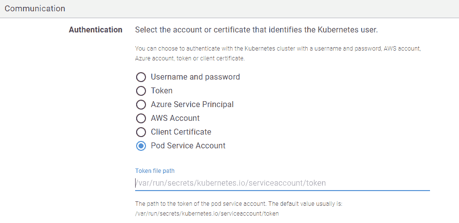
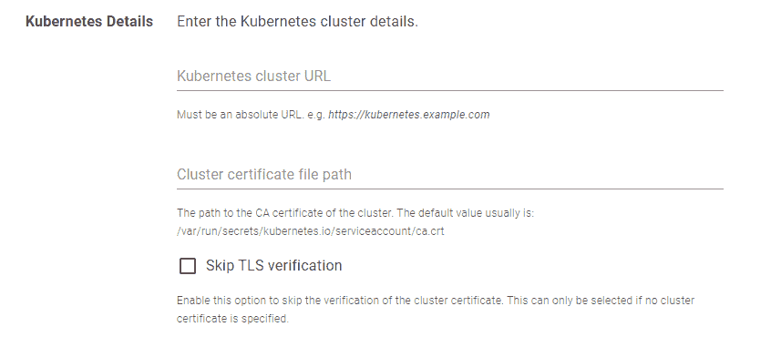
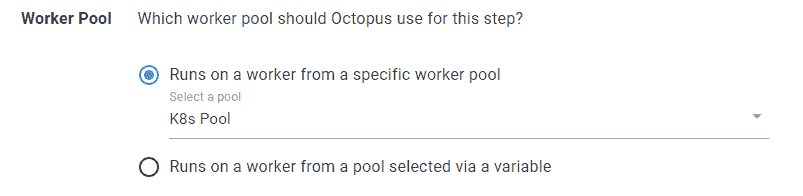

# Kubernetes Pod 服务帐户验证- Octopus 部署

> 原文：<https://octopus.com/blog/kubernetes-pod-service-accounts>

我们正在为在 Kubernetes 集群中运行的 Octopus 工作人员引入更简单的身份验证，使用 Kubernetes Pod 服务帐户的凭证。

在这篇文章中，我将介绍新的支持，并演示如何利用这一更新。

Octopus 引入了工人将部署工作从 Octopus 服务器转移到机器池。工作人员在几种情况下对团队有帮助，例如:

*   备份数据库
*   执行数据库模式迁移
*   配置负载平衡器

团队也可以创建一个工人池，作为在 Kubernetes 集群中运行的容器。

当在 Kubernetes 集群中将一个工作线程池作为一个容器运行时，工作线程现在可以连接回父集群，使用 pod 服务帐户令牌和在 Pod 中作为文件挂载的集群证书文件。这允许工作人员管理他们部署到的集群，而不需要从 Octopus 服务器向他们发送额外的凭证。

## 创建一个在 Kubernetes 集群中运行的工人池

你可以在一个 Kubernetes 集群中运行一群章鱼工人。你想这么做有两个原因:

*   为该集群创建一个专用的工作线程
*   创建一群工作程序来使用 Octopus Deploy

这可以通过部署 Docker Hub 中托管的[触手映像](https://hub.docker.com/r/octopusdeploy/tentacle)或者使用[章鱼部署操作手册](https://octopus.com/docs/runbooks)来完成。请参考我们关于[在 Kubernetes 集群上创建工人](https://octopus.com/blog/kubernetes-workers)的帖子，获得关于使用 Octopus Deploy 将工人池部署到 Kubernetes 集群的全面说明。

在 Kubernetes 集群中运行了一组健康的工人之后，您需要在每个 Octopus 工人中安装`kubectl`。`kubectl`是 [Kubernetes 命令行工具](https://kubernetes.io/docs/tasks/tools/)，它允许您对 Kubernetes 集群运行命令。

为此，导航到每个工作机的目录并运行以下命令:

```
$ curl -LO "https://dl.k8s.io/release/$(curl -L -s https://dl.k8s.io/release/stable.txt)/bin/linux/amd64/kubectl"
$ chmod +x ./kubectl
$ mv ./kubectl /usr/local/bin 
```

您现在可以通过检查版本来确认`kubectl`已经成功安装。

```
$ kubectl version 
```

## 使用 Pod 服务帐户身份验证添加 Kubernetes 目标

我们现在有一群健康的工人在 Kubernetes 集群中运行。

下一步是使用新的身份验证模式 Pod Service Account 添加部署目标。

1.  导航到**基础设施** ➜ **部署目标**，点击**添加部署目标**。
2.  选择 **KUBERNETES 集群**，点击 KUBERNETES 集群卡片上的**添加**。
3.  输入 Kubernetes 群集的显示名称。
4.  为目标选择至少一个[环境](https://octopus.com/docs/infrastructure/environments)。
5.  为目标选择至少一个[目标角色](https://octopus.com/docs/infrastructure/deployment-targets#target-roles)。
6.  选择 **Pod 服务帐户**作为认证模式。
7.  输入 **Pod 服务帐户**的令牌文件的路径。默认路径通常是`/var/run/secrets/kubernetes.io/serviceaccount/token`。请注意，该路径是相对于 pod 目录的。

[](#)

8.  输入 Kubernetes 集群的 URL。Octopus Deploy 中的每个 Kubernetes 目标都需要集群 URL，这可以通过检索集群信息来定位(在 Kubernetes 集群中运行`kubectl cluster-info`)。
9.  或者，输入群集证书的路径。默认路径通常是`/var/run/secrets/kubernetes.io/serviceaccount/ca.crt`。请注意，该路径是相对于 pod 目录的。如果您选择**跳过 TSL 验证**，您不需要输入此详细信息。 [](#)
10.  *重要提示*:选择包含 Kubernetes 集群内部运行的工作线程的工作线程池。否则，部署目标的运行状况检查将会失败。 [](#)

## 创建部署流程

部署目标现在已经可以在 Kubernetes 部署流程中使用了。

您可以创建一个[部署 Kubernetes 容器](https://octopus.com/docs/deployments/kubernetes/deploy-container)步骤来定位这个部署目标的[目标角色](https://octopus.com/docs/infrastructure/deployment-targets#target-roles)。

与前面创建的部署目标相似，部署步骤需要在 Kubernetes 集群中运行一个工作池。请确保为您的步骤选择有效的**工作池**。

【T2 

## 结论

这篇文章演示了在创建一个 **Kubernetes 部署目标**时，如何使用 **Pod 服务帐户**认证模式。

这种身份验证模式的一个好处是让工作人员能够自己连接回父集群。这意味着您不需要将集群的证书数据存储在 Octopus 服务器中。

愉快的部署！