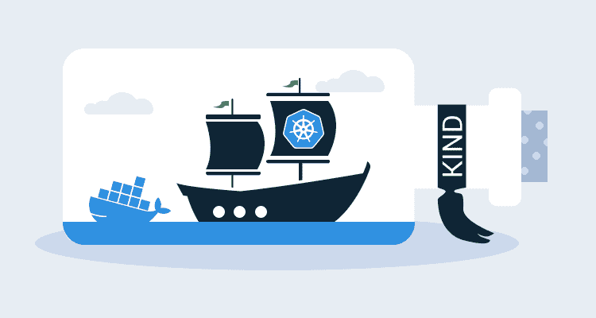

# Kubernetes 使用 KIND - Octopus 部署进行测试

> 原文：<https://octopus.com/blog/kubernetes-with-kind>

[](#)

有许多创建本地测试 Kubernetes 环境的解决方案，如 [minikube](https://github.com/kubernetes/minikube) 或 [MicroK8s](https://microk8s.io/) ，但一个名为 [KIND](https://github.com/kubernetes-sigs/kind) 的新项目提供了一种可能会引起 Kubernetes 开发人员和管理员兴趣的新方法。

KIND 在 Docker 中代表 Kubernetes，顾名思义，它使用 Docker 创建一个 Kubernetes 集群来托管节点。这是一种新颖的方法，它利用 Docker 简单、独立的部署和清理来创建测试 Kubernetes 基础设施。

## 实物安装

确保已经安装了 [Docker](https://docs.docker.com/install/) 和 [Go](https://golang.org/doc/install) ，然后使用命令安装 KIND:

```
GO111MODULE="on" go get sigs.k8s.io/kind@v0.6.1 
```

这将把`kind`可执行文件放在目录`$GOPATH/bin/kind`中，默认情况下这个目录是`~/go/bin/kind`。

假设 Go `bin`目录在`PATH`中，使用以下命令构建一个测试集群:

```
kind create cluster --name mycluster 
```

第一个集群需要一点时间来下载 KIND Docker 映像，尽管后续集群的创建不到一分钟。

KIND 会将新的集群细节作为上下文添加到您的`~/.kube/config`文件中，因此您可以使用以下命令测试集群是否启动并运行:

```
kubectl cluster-info --context kind-mycluster 
```

您可以使用以下命令将此上下文设置为默认上下文:

```
kubectl config use-context kind-mycluster 
```

## 使用 Kubernetes 星团

我在使用 KIND 时遇到的最直接的问题是访问部署到集群的服务。

默认情况下，KIND 只公开 Kubernetes API 服务器。这意味着`kubectl`将按预期工作。因此您可以部署到集群并查询资源，但是访问您的服务需要一些额外的工作。

一个解决方案是使用`kubectl`作为代理:

```
kubectl proxy --port=8080 
```

Kubernetes 服务可以通过一个特殊的 URL 获得，比如 http://localhost:8080/API/v1/namespaces/default/services/web server:http-web/proxy/。

Kubernetes 文档有关于这些代理 URL 的更多细节:

> 要创建包含服务端点、后缀和参数的代理 URL，只需在服务的代理 URL 后面追加:http://kubernetes _ master _ address/API/v1/namespaces/namespace _ name/services/[https:]service _ name[:port _ name]/proxy

端口转发消除了构建特殊 URL 的需要。使用如下命令启动端口转发:

```
kubectl port-forward svc/webserver 8081:80 
```

该服务现在在本地端口 8081 上可用，将流量定向到服务端口 80。这意味着 URL http://localhost:8081 可以用来访问服务。

您也可以在入口控制器上使用端口转发:

```
kubectl port-forward svc/nginx-release-nginx-ingress 8081:80 
```

此命令允许您通过已配置的任何入口规则访问服务。

KIND 文档还提供了一些关于如何[暴露入口控制器](https://kind.sigs.k8s.io/docs/user/ingress/)的附加细节，以获得更持久的解决方案。

## 第一印象

一旦我解决了访问我的服务的问题，KIND 在测试版中表现得非常好。Helm 等外部工具运行良好，我可以向集群部署定制的仪表板。

我很欣赏这种类型如此独立的事实。因为所有东西都是 Docker 容器，所以创建集群很快，当它被清理后，系统上就没有任何东西在运行了。

## 结论

如今，让 Kubernetes 集群在本地运行并不困难，但是 KIND 让创建集群变得特别容易。诚然，Kubernetes 在 Docker 上运行来编排 Docker 有点弯脑子，但为了方便也不能打。

KIND 的真正价值是能够将它作为自动化测试的一部分来运行。我个人没有这方面的用例，但我确信它会兑现承诺。

我会认真考虑从现在开始使用 KIND over minikube 进行本地测试。