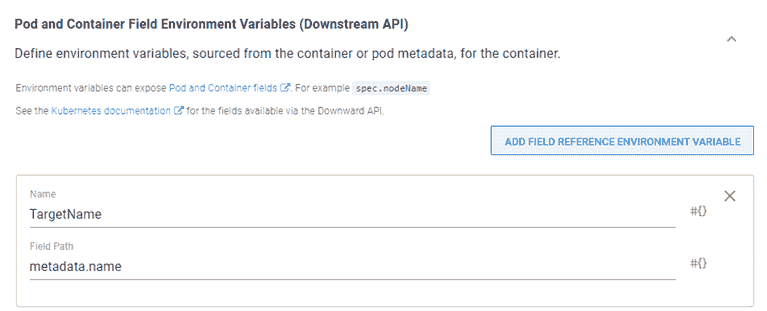

# 在 Kubernetes 集群- Octopus 部署上创建工人

> 原文：<https://octopus.com/blog/kubernetes-workers>

客户经常问他们是否可以在 Kubernetes (K8s)集群中运行一个 Octopus worker。你想这么做有几个原因:为该集群创建一个专用的 worker，或者简单地创建一组 worker 来与 Octopus Deploy 一起使用。使用[触手图像](https://hub.docker.com/r/octopusdeploy/tentacle)，这是可能的，但是你甚至可以用它来部署 Octopus 本身。

在这篇文章中，我演示了如何部署触手容器作为 Octopus 实例上的工作器。

## 创建工人池

首先，我们需要为我们的容器工人创建一个新的工人池:

1.  在 Octopus 门户网站中，导航至**基础设施**选项卡。
2.  选择**工人池**。
3.  然后点击**添加工人池**。
4.  为该池命名，然后单击**保存**。

创建好我们的池后，我们可以继续操作手册了。

## 创建外部源

要配置 Octopus Deploy 来部署映像，我们首先需要创建一个[外部提要](https://octopus.com/docs/packaging-applications/package-repositories)，因为内置的存储库只是一个 NuGet 提要类型。

在这篇文章中，我创建了一个指向 Docker Hub 的外部提要。还支持其他 docker 提要，如 Artifactory 和 Nexus。

## 创建一本操作手册

应使用[操作手册](https://octopus.com/docs/runbooks)开展基础设施活动。这篇文章假设你熟悉在 Octopus 中创建[项目](https://octopus.com/docs/projects)，所以我们将跳过这一部分。

1.  在您的项目中创建一个操作手册。我叫矿**创造 K8s 的工人**。
2.  向您的流程添加一个**部署 Kubernetes 容器**步骤。

这个步骤模板很大，所以我们将检查最少的组件来使它工作。

### 部署科

至少要填写以下内容:

*   **部署名称**:K8s 内部署的名称。
*   **副本**:要运行的容器数量。我把我的设置为 3，所以我有三个工人。

### Containers section

点击**添加容器**，填写以下组件:

*   **名称**:容器的名称
*   **包装图像**
    *   **Package feed** :选择您为图像配置的 feed(在我的例子中是 Docker Hub)
    *   **包 ID** : `octopusdeploy/tentacle`
*   **环境变量**:点击**添加环境变量**，添加如下:
    *   **ServerApiKey** :注册工人的 API 键
    *   服务器 Url :你的 Octopus 实例的 Url
    *   **接受 _EULA** : `Y`
    *   **TargetWorkerPool** :要添加的池的名称
    *   **ServerPort** : `10943`(设置这个环境变量为轮询模式配置 worker)
    *   **空间**:要添加工作者的空间的名称(变量`#{Octopus.Space.Name}`的八进制数将获取当前空间的名称)

Windows K8s 群集将主机名限制为 16 个字符。如果您使用的是 Windows K8s，请使用下游 API 特性并添加一个额外的环境变量，**target name**:metadata . name

上面没有列出的任何内容都使用表单默认值。

## 执行操作手册

点击**运行**在您选择的环境中运行操作手册。

[T39](#)

运行手册成功完成后，选择**基础设施**选项卡，您将看到工人已被添加到**工人池**。

[T46【](#)

我们可以通过在员工身上升级 Calamari 来验证功能。使用省略号菜单选择**升级 3 名工人的鱿鱼**选项。

## 结论

在本文中，我演示了如何使用 Octopus Deploy 将 workers 部署到 Kubernetes 集群。

愉快的部署！