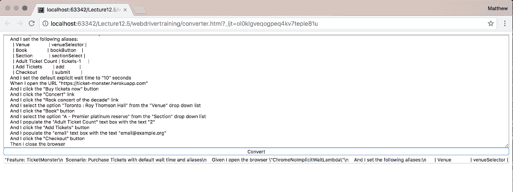
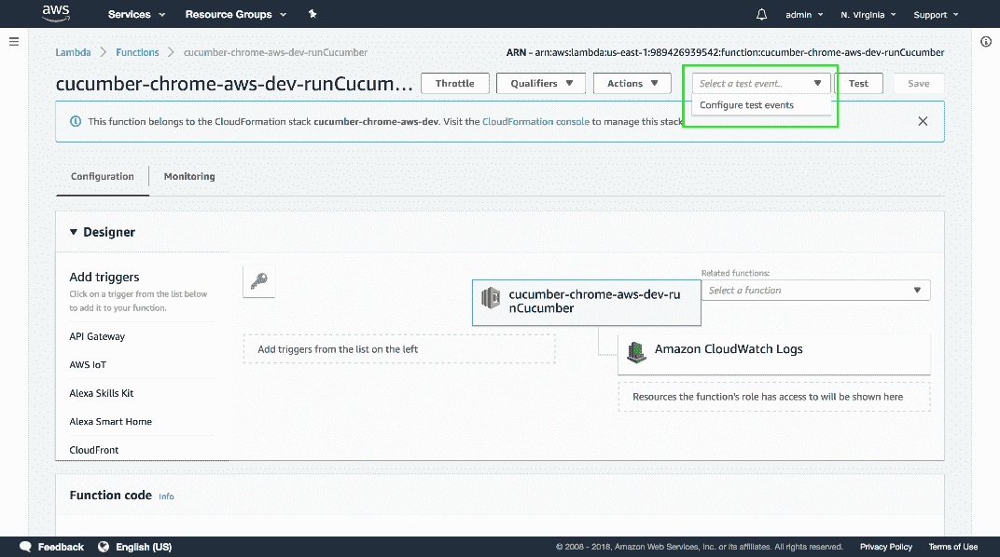
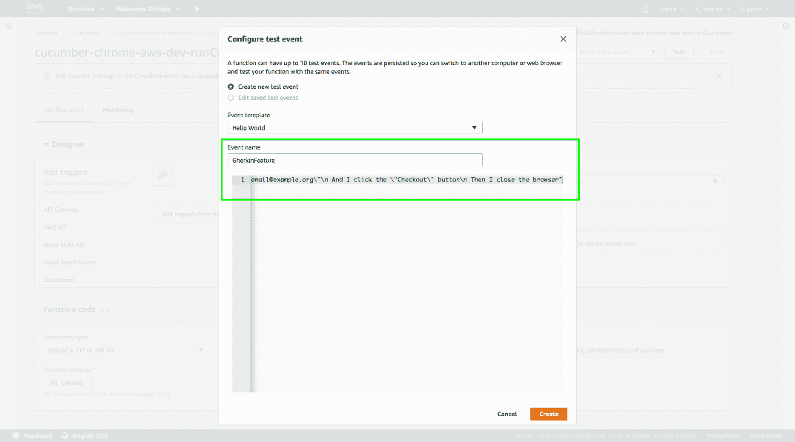
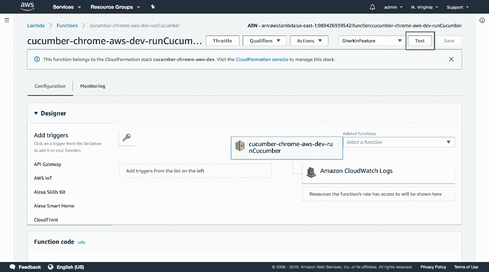
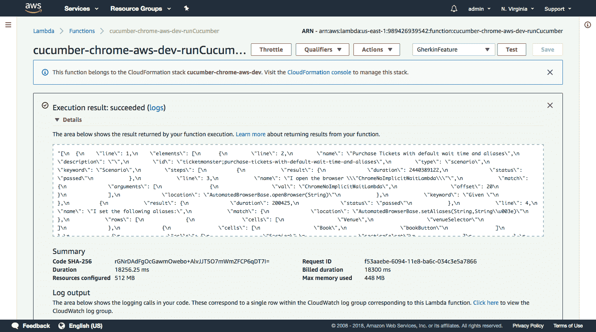

# 硒系列:启动黄瓜测试-章鱼部署

> 原文：<https://octopus.com/blog/selenium/32-launching-cucumber-tests/launching-cucumber-tests>

这篇文章是关于[创建 Selenium WebDriver 测试框架](/blog/selenium/0-toc/webdriver-toc)的系列文章的一部分。

现在我们有了一个可以运行的简单 Lambda 函数，以及一个部署应用程序的无服务器配置，我们可以创建一个启动 WebDriver 测试的 Lambda 函数。

下面是`LambdaEntry`类的新代码，它将从一个小黄瓜特性文件启动一个 WebDriver 测试:

```
package com.octopus;

import org.apache.commons.io.FileUtils;
import java.io.*;
import java.net.MalformedURLException;
import java.net.URL;
import java.nio.charset.Charset;
import java.nio.file.Files;
import java.util.zip.ZipEntry;
import java.util.zip.ZipInputStream;

public class LambdaEntry {
  private static final String CHROME_HEADLESS_PACKAGE =
  "https://s3.amazonaws.com/webdriver-testing-resources/stable-headless-chromium-amazonlinux-2017-03.zip";
  private static final String CHROME_DRIVER =
  "https://s3.amazonaws.com/webdriver-testing-resources/chromedriver_linux64.zip";

  public String runCucumber(final String feature) throws Throwable {

    File driverDirectory = null;
    File chromeDirectory = null;
    File outputFile = null;
    File featureFile = null;

    try {

      driverDirectory = downloadChromeDriver();
      chromeDirectory = downloadChromeHeadless();
      outputFile = Files.createTempFile("output", ".json").toFile();
      featureFile = writeFeatureToFile(feature);

      cucumber.api.cli.Main.run(
        new String[]{
          "--monochrome",
          "--glue", "com.octopus.decoratorbase",
          "--format", "json:" + outputFile.toString(),
          featureFile.getAbsolutePath()},
      Thread.currentThread().getContextClassLoader());

      return FileUtils.readFileToString(outputFile, Charset.defaultCharset());
    } finally {
      FileUtils.deleteQuietly(driverDirectory);
      FileUtils.deleteQuietly(chromeDirectory);
      FileUtils.deleteQuietly(outputFile);
      FileUtils.deleteQuietly(featureFile);
    }
  }

  private File downloadChromeDriver() throws IOException {
    final File extractedDir = downloadAndExtractFile(CHROME_DRIVER, "chrome_driver");
    final String driver = extractedDir.getAbsolutePath() + "/chromedriver";
    System.setProperty("webdriver.chrome.driver", driver);
    new File(driver).setExecutable(true);
    return extractedDir;
  }

  private File downloadChromeHeadless() throws IOException {
    final File extractedDir = downloadAndExtractFile(CHROME_HEADLESS_PACKAGE, "chrome_headless");
    final String chrome = extractedDir.getAbsolutePath() + "/headless-chromium";
    System.setProperty("chrome.binary", chrome);
    new File(chrome).setExecutable(true);
    return extractedDir;
  }

  private File downloadAndExtractFile(final String download, final String tempDirPrefix) throws IOException {
    File downloadedFile = null;
    try {
      downloadedFile = File.createTempFile("download", ".zip");
      FileUtils.copyURLToFile(new URL(download), downloadedFile);
      final File extractedDir = Files.createTempDirectory(tempDirPrefix).toFile();
      unzipFile(downloadedFile.getAbsolutePath(), extractedDir.getAbsolutePath());
      return extractedDir;
    } finally {
      FileUtils.deleteQuietly(downloadedFile);
    }

  }

  private void unzipFile(final String fileZip, final String outputDirectory) throws IOException {

    final byte[] buffer = new byte[1024];

    try (final ZipInputStream zis = new ZipInputStream(new FileInputStream(fileZip))) {
      ZipEntry zipEntry = zis.getNextEntry();
      while (zipEntry != null) {
        final String fileName = zipEntry.getName();
        final File newFile = new File(outputDirectory + "/" + fileName);
        try (final FileOutputStream fos = new FileOutputStream(newFile)) {
          int len;
          while ((len = zis.read(buffer)) > 0) {
            fos.write(buffer, 0, len);
          }
        }
        zipEntry = zis.getNextEntry();
      }
      zis.closeEntry();
    }
  }

  private File writeFeatureToFile(final String feature) throws IOException {
    final File featureFile = File.createTempFile("cucumber", ".feature");
    try {
      final URL url = new URL(feature);
      FileUtils.copyURLToFile(url, featureFile);
    } catch (final MalformedURLException ex) {
      try (PrintWriter out = new PrintWriter(featureFile)) {
        out.println(feature);
      }
    }
    return featureFile;
  }
} 
```

让我们来分解这个类。

以下常量是我们上传到 S3 的 Chrome Lambda 发行版和 Linux 二进制驱动程序的 URL。这些网址对你来说是不同的，因为你将它们上传到一个不同的 S3 桶。

不要在你自己的测试中使用这些 URL，但是总是使用你控制的 S3 桶的 URL。使用指向您自己的 S3 存储桶的 URL 可以确保您的代码只依赖于您拥有和管理的资源。

```
private static final String CHROME_HEADLESS_PACKAGE =
"https://s3.amazonaws.com/webdriver-testing-resources/stable-headless-chromium-amazonlinux-2017-03.zip";
private static final String CHROME_DRIVER =
"https://s3.amazonaws.com/webdriver-testing-resources/chromedriver_linux64.zip"; 
```

我们仍然使用`runCucumber()`方法作为 Lambda 入口点:

```
public String runCucumber(String feature) throws Throwable { 
```

这四个文件将在 Lambda 每次运行时创建。我们需要跟踪我们创建的所有资源，以便它们可以在事后被清理，因为 Lambda 可能会重用底层的 Linux 实例来进行连续的函数调用。如果我们要创建文件而不清理它们，我们可能会耗尽分配给 Lambda 函数的所有可用空间，代码将无法正常工作:

```
File driverDirectory = null;
File chromeDirectory = null;
File outputFile = null;
File featureFile = null; 
```

每次调用`runCucumber()`方法时，我们下载 Linux 二进制驱动程序和 Chrome Lambda 发行版。这些文件太大，无法与 Lambda 代码捆绑在一起分发，所以我们必须在运行时下载它们。通过将这些文件上传到 S3，我们利用了 S3 和 Lambda 都是 AWS 提供的服务，Lambda 可以快速可靠地访问 S3 的文件:

```
try {
  driverDirectory = downloadChromeDriver();
  chromeDirectory = downloadChromeHeadless(); 
```

Cucumber 可以用特性文件执行的结果生成一个 JSON 报告文件。我们将使用这个文件作为 Lambda 的返回值。这里我们创建一个临时文件，可以用来保存 JSON 结果:

```
outputFile = Files.createTempFile("output", ".json").toFile(); 
```

我们创建的最后一个文件是 Gherkin 特征文件。该文件的内容是在功能参数中传递给方法的字符串:

```
featureFile = writeFeatureToFile(feature); 
```

现在我们已经有了所有的文件，我们可以运行黄瓜。

以前，我们利用 Cucumber 提供的 JUnit 集成来启动特性文件，作为测试类的一部分。但是我们不是从 Lambda 运行 JUnit，所以我们需要一种新的方式来启动 Cucumber。

幸运的是，Cucumber 还提供了一种在命令行中使用传统的`cucumber.api.cli.Main`类中的`static void main()`方法来运行它的方法。这个`main()`方法然后调用`run()`方法。我们使用这个`run()`方法作为启动 Cucumber 的一种方式，就好像它是从命令行直接运行的一样。

传递给`run()`方法的第一个参数是一个字符串数组，它保存通常在命令行上提供的参数。我们使用了许多选项来定制输出，链接到我们的 glue 类，并保存一个报告文件。

*   `--monochrome`选项从打印到控制台的消息中删除彩色文本。在日志文件中查看时，这些彩色消息翻译得不好。
*   `--glue`选项将 Cucumber 链接到保存我们的注释类的包。这与我们之前传递给 JUnit 注释的选项相同。
*   `--format`选项定义了 Cucumber 生成的报告文件。它被设置为值`json:<output file>`，输出文件是我们之前创建的临时文件。
*   最后一个参数是特征文件本身。

第二个参数是 Cucumber 使用的类加载器。我们传递`Thread.currentThread().getContextClassLoader()`的值，就像`cucumber.api.cli.Main.main()`方法一样:

```
cucumber.api.cli.Main.run(
  new String[]{
    "--monochrome",
    "--glue", "com.octopus.decoratorbase",
    "--format", "json:" + outputFile.toString(),
    featureFile.getAbsolutePath()},
  Thread.currentThread().getContextClassLoader()); 
```

一旦运行了 Gherkin 特征文件，我们就读取报告文件的内容并返回它:

```
return `FileUtils.readFileToString(outputFile, Charset.defaultCharset());` 
```

我们创建的所有文件都使用`FileUtils.deleteQuietly()`方法从 Apache Commons IO 库中删除。这个方法不抛出任何异常，这意味着我们试图删除每个文件，忽略任何错误。

由于运行我们代码的 Linux 实例最终将被销毁，并为下一次 Lambda 调用分配一个新的实例，因此无法删除的临时文件可能不会造成任何持久的危害:

```
 } finally {
    FileUtils.deleteQuietly(driverDirectory);
    FileUtils.deleteQuietly(chromeDirectory);
    FileUtils.deleteQuietly(outputFile);
    FileUtils.deleteQuietly(featureFile);
  }
} 
```

`downloadChromeDriver()`方法是我们下载和配置 Linux Chrome 二进制驱动程序的地方。

我们首先调用`downloadAndExtractFile()`方法，传入驱动程序 URL 和用于存放提取文件的临时目录的前缀:

```
private File downloadChromeDriver() throws IOException {
final File extractedDir = downloadAndExtractFile(CHROME_DRIVER, "chrome_driver"); 
```

然后，我们获取驱动程序的路径，将`webdriver.chrome.driver`系统属性设置为驱动程序路径，并确保驱动程序文件的可执行标志设置为 true。

要在 Linux 中执行一个文件，该文件必须将可执行标志设置为`true`。这不同于像 Windows 这样的操作系统，它使用像`.exe`这样的扩展名来表示可执行文件。

```
final String driver = extractedDir.getAbsolutePath() + "/chromedriver";
System.setProperty("webdriver.chrome.driver", driver);
new File(driver).setExecutable(true); 
```

然后返回存放 Chrome 驱动程序的目录，以便在测试完成后可以清理它:

```
 return extractedDir;
} 
```

`downloadChromeHeadless()`方法遵循与`downloadChromeDriver()`方法相同的模式，只是这次我们下载的是 Chrome Lambda 发行版。

它首先将 Chrome 发行版下载到一个前缀为`chrome_headless`的临时目录中:

```
private File downloadChromeHeadless() throws IOException {
  final File extractedDir = downloadAndExtractFile(CHROME_HEADLESS_PACKAGE, "chrome_headless"); 
```

我们获取 Chrome 可执行文件的路径，将`chrome.binary`系统属性设置为该路径，并确保该文件启用了可执行标志。

`chrome.binary`系统属性不是一个被 WebDriver 识别的属性，但它是一个我们将在稍后发布 Chrome 时访问的属性:

```
final String chrome = extractedDir.getAbsolutePath() + "/headless-chromium";
System.setProperty("chrome.binary", chrome);
new File(chrome).setExecutable(true); 
```

然后返回临时目录，以便在测试完成后可以清理它:

```
 return extractedDir;
} 
```

前面的方法都调用了`downloadAndExtractFile()`方法来下载和解压一个 ZIP 文件。

我们首先创建一个指向临时文件的变量，我们将把远程文件下载到这个临时文件中:

```
private File downloadAndExtractFile(final String download, final String tempDirPrefix) throws IOException {
  File downloadedFile = null; 
```

然后，我们创建临时文件，并使用 Apache Commons IO 库中的`FileUtils.copyURLToFile()`方法将远程文件下载到其中:

```
try {
  downloadedFile = File.createTempFile("download", ".zip");
  FileUtils.copyURLToFile(new URL(download), downloadedFile); 
```

然后，我们创建一个临时目录，将下载的文件提取到该目录中，并将该目录返回给调用方法:

```
final File extractedDir = Files.createTempDirectory(tempDirPrefix).toFile();
unzipFile(downloadedFile.getAbsolutePath(), extractedDir.getAbsolutePath());
return extractedDir; 
```

不再需要下载的文件，因此将其删除:

```
 } finally {
    FileUtils.deleteQuietly(downloadedFile);
  }
} 
```

为了提取 ZIP 文件，我们使用了`unzipFile()`方法:

```
private void unzipFile(final String fileZip, final String outputDirectory) throws IOException { 
```

我们首先创建一个可以读取 ZIP 文件内容的缓冲区:

```
final byte[] buffer = new byte[1024]; 
```

然后，我们从 ZIP 文件中创建一个`ZipInputStream`实例。`ZipInputStream`类是标准 Java 库的一部分，我们将使用这个类来读取 ZIP 文件的内容:

```
try (final ZipInputStream zis = new ZipInputStream(new
FileInputStream(fileZip))) { 
```

ZIP 文件中的文件由`ZipEntry`类表示。这里我们从`ZipInputStream`得到第一个`ZipEntry`:

```
ZipEntry zipEntry = zis.getNextEntry(); 
```

然后，当我们有一个`ZipEntry`对象要处理时，我们进入一个循环:

```
while (zipEntry != null) { 
```

`ZipEntry`的名称是文件名:

```
final String fileName = zipEntry.getName(); 
```

`ZipEntry`名称与输出目录相结合，创建提取文件的路径:

```
final File newFile = new File(outputDirectory + "/" + fileName); 
```

然后，我们用提取的文件创建一个输出流:

```
try (final FileOutputStream fos = new FileOutputStream(newFile)) { 
```

然后将`ZipEntry`的内容读入我们之前创建的缓冲区，然后将缓冲区写入输出文件。这就是我们如何将`ZipEntry`文件的压缩内容转换成输出文件的未压缩内容:

```
int len;
while ((len = zis.read(buffer)) > 0) {
  fos.write(buffer, 0, len);
} 
```

对来自`ZipInputStream`的每个`ZipEntry`对象重复该过程:

```
 }
  zipEntry = zis.getNextEntry();
} 
```

一旦我们完成，关闭`ZipInputStream`:

```
 zis.closeEntry();
  }
} 
```

这个类中的最后一个方法是`writeFeatureToFile()`，我们用它来编写小黄瓜特征文件:

```
private File writeFeatureToFile(final String feature) throws IOException
{ 
```

我们创建一个临时文件来保存特征文件的内容:

```
final File featureFile = File.createTempFile("cucumber", ".feature"); 
```

然后，我们尝试下载文件，就好像特性参数是一个 URL 一样:

```
try {
  final URL url = new URL(feature);
  FileUtils.copyURLToFile(url, featureFile); 
```

如果下载文件失败，我们假设这是因为特征参数不是 URL，而是组成特征文件的原始文本。这意味着我们可以向特性参数提供 URL 或原始文本，而`writeFeatureToFile()`方法可以检测该做什么:

```
} catch (final MalformedURLException ex) {
  try (PrintWriter out = new PrintWriter(featureFile)) {
    out.println(feature);
  }
} 
```

然后返回结果文件:

```
 return featureFile;
} 
```

要在 Lambda 中运行 Chrome，我们需要传递一些参数，允许 Chrome 在受限的 Lambda 环境中工作。

为了传递参数，我们将创建一个名为`ChromeHeadlessLambdaDecorator`的新装饰类:

```
package com.octopus.decorators;

import com.octopus.AutomatedBrowser;
import com.octopus.decoratorbase.AutomatedBrowserBase;
import org.openqa.selenium.WebDriver;
import org.openqa.selenium.chrome.ChromeDriver;
import org.openqa.selenium.chrome.ChromeOptions;

public class ChromeHeadlessLambdaDecorator extends AutomatedBrowserBase
{
    public ChromeHeadlessLambdaDecorator(final AutomatedBrowser automatedBrowser) {
        super(automatedBrowser);
    }

    @Override
    public void init() {
        final ChromeOptions options = new ChromeOptions();
        options.addArguments("--disable-gpu");
        options.addArguments("--headless");
        options.addArguments("--window-size=1366,768");
        options.addArguments("--single-process");
        options.addArguments("--no-sandbox");
        options.addArguments("--user-data-dir=/tmp/user-data");
        options.addArguments("--data-path=/tmp/data-path");
        options.addArguments("--homedir=/tmp");
        options.addArguments("--disk-cache-dir=/tmp/cache-dir");

        if (System.getProperty("chrome.binary") != null) {
            options.setBinary(System.getProperty("chrome.binary"));
        }

        options.merge(getDesiredCapabilities());
        final WebDriver webDriver = new ChromeDriver(options);
        getAutomatedBrowser().setWebDriver(webDriver);
        getAutomatedBrowser().init();
    }
} 
```

`--disable-gpu`和`--headless`参数配置 Chrome 在无头模式下运行。

我们也可以在`ChromeOptions`类上调用`setHeadless()`方法。直接传递参数或调用`setHeadless()`会获得相同的结果:

```
options.addArguments("--disable-gpu");
options.addArguments("--headless"); 
```

`--window-size`参数定义了浏览器窗口的大小:

```
options.addArguments("--window-size=1366,768"); 
```

在 Lambda 环境中运行 Chrome 需要`--single-process`和`--no-sandbox`参数。你可以在[https://github.com/adieuadieu/serverless-chrome/issues/15](https://github.com/adieuadieu/serverless-chrome/issues/15)找到更多关于为什么需要这些论证的信息。

```
options.addArguments("--single-process");
options.addArguments("--no-sandbox"); 
```

`--user-data-dir`、`--data-path`、`--homedir`和`--disk-cache-dir`参数确保 Chrome 只尝试写入`/tmp`目录。目录是 Lambda 环境中少数几个进程可以写文件的地方之一。

```
options.addArguments("--user-data-dir=/tmp/user-data");
options.addArguments("--data-path=/tmp/data-path");
options.addArguments("--homedir=/tmp");
options.addArguments("--disk-cache-dir=/tmp/cache-dir"); 
```

如果定义了`chrome.binary`系统属性(它是在`LambdaEntry.downloadChromeHeadless()`方法中设置的)，那么我们获取系统属性的值，并用它来设置 Chrome 二进制文件的位置。这就是我们的代码如何找到自定义的 Chrome 可执行文件:

```
if (System.getProperty("chrome.binary") != null) {
  options.setBinary(System.getProperty("chrome.binary"));
} 
```

为了利用这个新的装饰器，我们通过`AutomatedBrowserFactory`类公开它。

我们在这里不使用`BrowserMobDecorator`,因为 Chrome 64 在无头模式下使用代理有一个已知的问题。你可以在这里找到更多关于这个问题的细节。

```
package com.octopus;

import com.octopus.decorators.*;

public class AutomatedBrowserFactory {
  public AutomatedBrowser getAutomatedBrowser(String browser) {
    // ...
    if ("ChromeNoImplicitWaitLambda".equalsIgnoreCase(browser)) {
      return getChromeBrowserNoImplicitWaitLambda();
    }
    // ...
  }

  // ...

  private AutomatedBrowser getChromeBrowserNoImplicitWaitLambda() {
    return new ChromeHeadlessLambdaDecorator(
      new WebDriverDecorator()
    );
  }

  // ...

} 
```

要部署新的 Lambda 功能，运行`package` Maven 生命周期，并运行`serverless deploy`将代码上传到 AWS。

我们现在准备通过传递一个小黄瓜特征文件来测试 Lambda 函数。然而，如果你还记得在上一篇文章中我们说过 Lambda 函数的每个输入都必须是有效的 JSON。我们的小黄瓜特性文件肯定不是用 JSON 编写的，所以我们需要某种方法将文本转换成 JSON 字符串。

下面的 web 页面提供了一个非常简单的表单，它接受原始文本并将其转换为 JSON 字符串:

```
<html>
<head>
    <script>
            function convert() {
                var output = document.getElementById("input")
                    .value
                    .replace(/\\/g, "\\\\")
                    .replace(/"/g, "\\\"")
                    .split("\n")
                    .join("\\n");

                document.getElementById("output").value = "\"" + output + "\"";
            }
        </script>
</head>
<body>
<textarea id="input" style="width: 100%;" rows="20"></textarea>
<br/>
<input type="button" onclick="convert()" value="Convert" style="width: 100%">
<br/>
<input type="text" id="output" style="width: 100%">
</body>
</html> 
```

这是进行转换的代码。它取`<textarea>`中文本的值，并:

1.  用双反斜杠替换任何反斜杠(即转义任何反斜杠)。
2.  用反斜杠和双引号替换任何双引号(即转义双引号)。
3.  在换行符上拆分字符串。
4.  用字符串`\n`重新连接结果数组。

```
var output = document.getElementById("input")
                    .value
                    .replace(/\\/g, "\\\\")
                    .replace(/"/g, "\\\"")
                    .split("\n")
                    .join("\\n"); 
```

此代码将转换以下文本:

```
Feature: TicketMonster
  Scenario: Purchase Tickets with default wait time and aliases
    Given I open the browser "ChromeNoImplicitWaitLambda"
    And I set the following aliases:
    | Venue | venueSelector |
    | Book | bookButton |
    | Section | sectionSelect |
    | Adult Ticket Count | tickets-1 |
    | Add Tickets | add |
    | Checkout | submit |

    And I set the default explicit wait time to "10" seconds
    When I open the URL "https://ticket-monster.herokuapp.com"
    And I click the "Buy tickets now" button
    And I click the "Concert" link
    And I click the "Rock concert of the decade" link
    And I select the option "Toronto : Roy Thomson Hall" from the "Venue" drop-down list
    And I click the "Book" button
    And I select the option "A - Premier platinum reserve" from the "Section" drop-down list
    And I populate the "Adult Ticket Count" text box with the text "2"
    And I click the "Add Tickets" button
    And I populate the "email" text box with the text "email@example.org"
    And I click the "Checkout" button
    Then I close the browser 
```

到这个字符串中:

```
"Feature: TicketMonster\n Scenario: Purchase Tickets with default wait
time and aliases\n Given I open the browser
\"ChromeNoImplicitWaitLambda\"\n And I set the following
aliases:\n | Venue | venueSelector |\n | Book | bookButton |\n
| Section | sectionSelect |\n | Adult Ticket Count | tickets-1
|\n | Add Tickets | add |\n | Checkout | submit |\n And I set
the default explicit wait time to \"10\" seconds\n When I open the
URL \"https://ticket-monster.herokuapp.com\"\n And I click the
\"Buy tickets now\" button\n And I click the \"Concert\"
link\n And I click the \"Rock concert of the decade\" link\n And I
select the option \"Toronto : Roy Thomson Hall\" from the
\"Venue\" drop-down list\n And I click the \"Book\" button\n
And I select the option \"A - Premier platinum reserve\" from the
\"Section\" drop-down list\n And I populate the \"Adult Ticket
Count\" text box with the text \"2\"\n And I click the \"Add
Tickets\" button\n And I populate the \"email\" text box with the
text \"email@example.org\"\n And I click the \"Checkout\"
button\n Then I close the browser" 
```

这是执行转换后的网页截图。

[](#)

这个 JSON 字符串可以在测试 Lambda 时作为输入传递。

打开 Lambda 控制台，打开`cucumber-chrome-aws-dev-runCucumber`功能。然后点击下拉列表旁边的`Test`按钮可以点击`Configure`测试事件。

[](#)

给测试事件命名，粘贴 JSON 字符串，并点击`Create`按钮。

[](#)

然后点击`Test`按钮。

[](#)

Gherkin 特性在没有 Lambda 函数的情况下运行，结果被传回。

[](#)

我们现在能够在 Chrome 的一个无头实例中作为 Lambda 函数运行 Cucumber 测试，因为 Lambda 函数将扩展以适应本质上无限数量的请求(您的预算不会受到影响),我们现在有了一个解决方案，允许我们并行运行大量的测试。

然而，必须通过 Lambda web 控制台运行测试并不理想。如果我们可以用 HTTP 请求直接启动这些测试，那就方便多了，这是我们将在下一篇文章中实现的。

这篇文章是关于[创建 Selenium WebDriver 测试框架](/blog/selenium/0-toc/webdriver-toc)的系列文章的一部分。