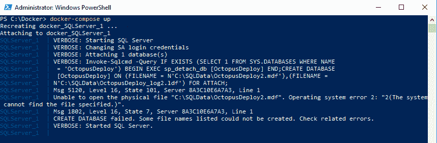

# 在 Windows - Octopus Deploy 上使用 Docker 进行开发和测试的经验教训

> 原文：<https://octopus.com/blog/lessons-learned-using-docker-for-development-and-testing>

[](#)

在 Windows 开发者机器上使用 Docker 进行开发和测试有多难？Docker 有我想的那么大那么吓人吗？几周前，我挑战自己回答这些问题。事实证明，Windows 上的 Docker 既没有我想象的那么大，也没有我想象的那么可怕。也就是说，有一点学习曲线，我想与你分享我学到的一些教训。

## 场景

我本质上是一个. NET 开发者。我喜欢使用 Visual Studio。Visual Studio 内置的 Docker 功能非常好用。这几乎太容易了。右键单击一个项目，并配置它在 Docker 中运行。启动调试器，我要去比赛了。

我想后退一步，学习 Docker 实际上是如何工作的，尤其是在 Windows 上，而我正好有一个完美的场景来完成这个任务。我演示了许多 CI/CD 管道，无论是在会议上还是与客户的一对一交流中。虽然我不是每天都在会议上发言或做演示，但是一直运行 CI/CD 管道会消耗资源。我可以在 Docker 中运行 CI/CD 管道吗？

我的 CI/CD 管道使用 GitHub 进行源代码控制，TeamCity 作为构建服务器，Octopus Deploy 作为部署服务器(大惊喜，我知道)，SQL Server 作为数据库后端。当我写这篇文章的时候，CI/CD 管道的核心与我过去从事的应用程序没有太大的不同。您可以用托管在 [NGINX](https://nginx.com) 中的 Angular 应用程序、托管在 IIS 中的 ASP.NET Web API 或使用 SQL Server 作为数据库的 Windows 服务来替换所有 CI/CD 组件。

通过学习如何在 Docker 中托管 CI/CD 管道，我还学习了如何在 Docker 中托管几乎任何其他应用程序。

## 第一课:使用 Docker Compose 很难引导一个有状态的应用程序

[Docker Compose](https://docs.docker.com/compose/) 通过将应用程序定义为 YAML 文件，可以轻松配置多个容器。当所有容器都是无状态的时候，Docker Compose 工作得很好，但是添加一个有状态的容器会使事情变得棘手。在我的 CI/CD 管道中，我在配置 SQL Server 容器时直接遇到了这个问题。SQL Server 容器包含 Octopus Deploy 的数据库。简而言之，我想要一个引导脚本来:

*   如果 Octopus 部署数据库不存在，则创建它。
*   将 Octopus Deploy 数据库挂载到容器中(如果存在的话)。

当数据库不存在时，Docker 合成文件为:

```
 SQLServer:
   image: microsoft/mssql-server-windows-developer
   environment:
     - ACCEPT_EULA=Y
     - SA_PASSWORD=Password_01
   ports:
     - '1433:1433'   
   volumes:
     - c:\Docker\Volumes\SQLServer\Databases:c:\SQLData 
```

但是，创建数据库后，Docker 合成文件会发生变化:

```
 SQLServer:
   image: microsoft/mssql-server-windows-developer
   environment:
     - ACCEPT_EULA=Y
     - SA_PASSWORD=Password_01
     - attach_dbs=[{'dbName':'OctopusDeploy','dbFiles':['C:\\SQLData\\OctopusDeploy.mdf','C:\\SQLData\\OctopusDeploy_log.ldf']}]
   ports:
     - '1433:1433'   
   volumes:
     - c:\Docker\Volumes\SQLServer\Databases:c:\SQLData 
```

可以从包含 attach_dbs 环境变量的 Docker 合成文件开始。如果指定了找不到的数据库文件，容器将继续运行。

【T2 

如果这是我需要运行的唯一容器，那没什么大不了的。打开 SSMS，添加数据库，我就可以走了。然而，我在 Docker 组合文件中有另一个容器 Octopus Deploy，它要求数据库在那里。且章鱼部署容器需要在那里，以便章鱼触须工作。对于完全托管在 Docker 容器中的 Octopus Deploy，Docker 合成文件必须:

1.  在 Docker 容器中启动 SQL Server。
2.  如果 Octopus 部署数据库不存在，则创建它。
3.  启动 Octopus 部署 Docker 容器。
4.  配置 Octopus Deploy，并创建触须可以注册的 API 密钥。
5.  启动 Octopus 部署触手 Docker 容器。

Octopus Deploy 服务器和 Octopus Deploy 触手容器都需要延迟它们的启动，直到它们的依赖容器*就绪*。在每种情况下， *ready* 意味着不同的东西，但是 Docker Compose 怎么知道呢？简单的事实是，它不能。如果你看看 Docker 网站上提供的例子，你会发现处理重试和等待是代码的责任。

我用的是预建的 Docker 图像，所以我没有那个闲心。对于 Octopus Deploy 和 Octopus Deploy 触手容器，我可以利用 Docker Compose 文件中的[命令](https://docs.docker.com/compose/compose-file/#command)选项，但是这会覆盖默认命令并阻止服务在容器中安装和启动。

最后，我选择遍历 Docker Compose 文件。为了保持重启次数最少，我决定同时进行 TeamCity 和 Octopus 部署。

1.  将 SQL Server 添加到 Docker Compose，并使用`docker-compose up`启动它。
2.  创建数据库，并更新 Docker 合成文件，以确保它们在重新启动时附加到 SQL Server。
3.  跑`docker-compose down`把所有东西都拆了。
4.  将 TeamCity 和 Octopus Deploy 添加到 Docker Compose 并启动它。
5.  配置团队城市和八达通部署。
6.  使用与之前相同的命令拆除所有东西。
7.  将 TeamCity 构建代理和 Octopus Deploy 触手添加到 Docker Compose 文件并启动它。

Docker Compose 是应用程序配置的理想状态。如果我想让我的 CI/CD 管道具有可移植性，我会包含一个引导脚本来下载映像并配置一切。Docker 合成文件将是最终状态。如果我想让我正在开发的应用程序在 Docker 中运行，我会添加必要的代码，让它知道等待。

## 经验 2:基于 Windows 的容器比基于 Linux 的容器消耗更多的资源，运行方式也不同

基于 Linux 的容器运行在 Hyper-V 虚拟机`Docker Desktop VM`上。该虚拟机被分配了 vCPUs 并分配了内存。

[](#)

每个基于 Windows 的容器都在自己的进程中运行，在任务管理器中显示为`Vnmem`。他们可以根据需要消耗任意多的资源，特别是 CPU。

[](#)

我在 CI/CD 管道中的第一次尝试就启动了 11 个 Docker 容器。不用说，它消耗了大量资源。在启动后的大约 10 分钟内，当这些容器运行它们的引导脚本时，笔记本电脑的 CPU 跳到 100%。当我了解到每个容器都是一个独立的进程时，我将容器的数量缩减为 5 个。

此外，基于 Windows 的映像会消耗更多的磁盘空间。以下是我笔记本电脑上基于 Linux 的 Docker 图片。记下 SQL Server 映像，`mcr.microsoft.com/mssql/server`。它包括映像的所有依赖项。

[](#)

与基于 Windows 的图像相比。当包含所有依赖项时，SQL Server 映像的大小是它的 10 倍。

[](#)

## 第 3 课:容器比只读映像更接近无头虚拟机

当我读到短语`Docker Image`时，我想象了一个 ISO 文件，它是不可更改的。Docker 容器就不是这样了。图像是容器的基础。事实上，许多 Docker 映像都包含一个配置脚本来启动任何必要的配置。Octopus 部署图像做到了这一点。当您第一次使用 Octopus Deploy 映像启动一个容器时，它会运行几个`Octopus.Server.exe`命令，比如`configure`、`admin`、`license`和`metrics`。这里可以看到章鱼运行[的脚本。](https://github.com/OctopusDeploy/Octopus-Docker/blob/master/Server/Scripts/configure.ps1)

当 Docker 容器运行时，可以对其进行更改。可以在上面安装新的软件，但是重要的是要注意，当容器被销毁时，这些更改会丢失。容器通常会因为配置的更新或更改而被销毁和重新创建。

## 第四课:。NET Framework 连接字符串要求在使用 Docker Compose 时通过 IP 地址引用 SQL Server

让 SQL Server 在容器中运行很容易。下一个问题是，我如何让 Octopus Deploy 看到 SQL Server。Docker Compose 提供了命名 Docker 容器的能力，它做了大量的幕后工作，因此其他容器可以通过名称相互引用。我以为那会有用。网络连接字符串。例如:

```
Server=SQLServer,1433;Initial Catalog=OctopusDeploy;Persist Security Info=False;User ID=sa;Password=Password_01;MultipleActiveResultSets=False;Connection Timeout=30; 
```

它没有工作。网络连接字符串。Octopus Deploy 是一个. NET Framework 应用程序，它在同一个 Docker 网络上无法通过容器名称找到 SQL Server。只有当连接字符串使用服务器的 IP 地址时，它才起作用。但是，每次运行`docker-compose up`时，IP 地址都会改变。我通过在 Docker Compose 文件中创建新网络解决了这个问题:

```
networks:
  cicd_net:
    ipam:
      driver: default
      config:
        - subnet: 172.28.0.0/16 
```

使用这个网络，我硬编码了每个容器的 IP 地址:

```
 SQLServer:
   image: microsoft/mssql-server-windows-developer
   environment:
     - ACCEPT_EULA=Y
     - SA_PASSWORD=Password_01
     - attach_dbs=[{'dbName':'OctopusDeploy','dbFiles':['C:\\SQLData\\OctopusDeploy.mdf','C:\\SQLData\\OctopusDeploy_log.ldf']}]
   ports:
     - '1433:1433'   
   volumes:
     - c:\Docker\Volumes\SQLServer\Databases:c:\SQLData
     - c:\Docker\Volumes\SQLServer\Backups:c:\Backups
   networks:
    cicd_net:
      ipv4_address: 172.28.1.1 
```

产生的连接字符串是:

```
Server=172.28.1.1,1433;Initial Catalog=OctopusDeploy;Persist Security Info=False;User ID=sa;Password=Password_01;MultipleActiveResultSets=False;Connection Timeout=30; 
```

Octopus Deploy 的 Docker 合成文件如下所示:

```
version: '3.7'
services:
  SQLServer:
   image: microsoft/mssql-server-windows-developer
   environment:
     - ACCEPT_EULA=Y
     - SA_PASSWORD=Password_01
     - attach_dbs=[{'dbName':'OctopusDeploy','dbFiles':['C:\\SQLData\\OctopusDeploy.mdf','C:\\SQLData\\OctopusDeploy_log.ldf']}]
   ports:
     - '1433:1433'   
   volumes:
     - c:\Docker\Volumes\SQLServer\Databases:c:\SQLData
     - c:\Docker\Volumes\SQLServer\Backups:c:\Backups
   networks:
    cicd_net:
      ipv4_address: 172.28.1.1   
  OctopusDeploy:
   image: octopusdeploy/octopusdeploy    
   ports:
     - '81:81'
     - '10943:10943'
   depends_on:
     - SQLServer       
   environment:
     - sqlDbConnectionString=Server=172.28.1.1,1433;Initial Catalog=OctopusDeploy;Persist Security Info=False;User ID=sa;Password=Password_01;MultipleActiveResultSets=False;Connection Timeout=30;
     - masterKey=YtnHskuInxiyH5MUIFEdVA==
   volumes:
     - c:\Docker\Volumes\Octopus\Server:c:\Octopus
     - c:\Docker\Volumes\Octopus\Server\Artifacts:c:\Artifacts
     - c:\Docker\Volumes\Octopus\Server\Repository:c:\Repository
     - c:\Docker\Volumes\Octopus\Server\TaskLogs:c:\TaskLogs
   links:
     - SQLServer
   networks:
    cicd_net:
      ipv4_address: 172.28.1.2  
  OctopusDeploy_Worker01:
   image: octopusdeploy/tentacle    
   ports:     
     - '85:80'
   depends_on:
     - OctopusDeploy       
   environment:
     - serverApiKey=API-JSZTATMYECVBOY9CPWARAANHM0
     - serverUrl="http://172.28.1.2:81"
     - targetWorkerPool=DatabaseWorker     
     - serverPort=10943
     - targetName=DockerTentacle-DatabaseWorker01
   volumes:
     - C:\Docker\Volumes\Octopus\Worker01:c:\Applications
     - c:\Docker\Volumes\SQLServer\Backups:c:\Backups     
   links:
     - OctopusDeploy
   networks:
    cicd_net:
      ipv4_address: 172.28.1.3
networks:
  cicd_net:
    ipam:
      driver: default
      config:
        - subnet: 172.28.0.0/16 
```

## 第 5 课:将 Docker 容器卷指向不同的文件夹使得本地开发和测试更加容易

了解 Docker 的工作原理打开了一个可能性的世界。对于这个例子，我在笔记本电脑上使用 SQL Server 开发一个. NET 应用程序。过去，我在笔记本电脑上运行 SQL Server 作为 Windows 服务。

想象一下，我正在开发一个有大量数据库变更的特性，QA 设法在测试环境中造成了一个错误，它阻塞了测试环境，他们需要立即修复这个错误以发布一个版本。在 Docker 之前，当这种情况发生时，我会做以下事情:

*   将所有挂起的更改提交到分支。
*   检查测试中的提交。
*   将代码指向测试数据库并开始调试。

QA 是天生好奇的人，当我还在调试的时候，他们会在 UI 周围转一转，这样会运行正确的代码来修复错误。事后看来，我不应该将笔记本电脑上运行的代码指向测试数据库。我这样做是因为通常坏数据发生在数据模型的一部分。要将这一个坏数据放到我的笔记本电脑上，我必须克隆整个数据模型。

我可以使用像 Redgate 的 SQL 数据比较工具来解决这个问题。或者我可以为我的应用程序编写一个定制的克隆工具。但是为了让它们正常工作，我会在我的本地数据库上恢复任何挂起的数据库更改。这非常烦人，因为我可能会删除我正在开发的特性的一堆测试数据。我可以将测试数据库备份并恢复到我的本地机器上，但是我不想覆盖我现有的数据库，这意味着要进入并更改连接字符串。

如果我将 SQL Server 作为 Docker 容器运行，我可以编写一个脚本来:

1.  停止当前的 SQL Server Docker 容器。
2.  将数据库从测试服务器备份到共享位置。
3.  启动新的 SQL Server Docker 容器。
4.  将备份还原到该容器中。
5.  数据库名(MyAppDatabase)和服务器名(localhost)将和以前一样，所以不需要更改连接字符串。

这只是一个例子。想象一下这对 QA 也有什么帮助。不是每个 QA 人员都必须连接一个中央数据库，而是给他们几个脚本来让应用程序在本地运行。他们可能有一个原始的数据库，可以克隆并用于测试运行。

## 结论

Docker 并不是一个又大又吓人的工具。它有一点学习曲线，特别是如果你想在生产中使用它。但是在本地使用它却出奇的顺利。当我开始构建我的 CI/CD 管道时，我理解了 Docker 的核心概念。我运行了一个容器，但是从来没有多个容器互相通信。总而言之，我用了不到一周的时间就在 Docker 容器中建立并运行了 CI/CD 管道。正如你在上面看到的，一路上我确实碰到了一些砖墙。我的希望是，当你遇到同样的困境时，这篇文章能减轻打击。