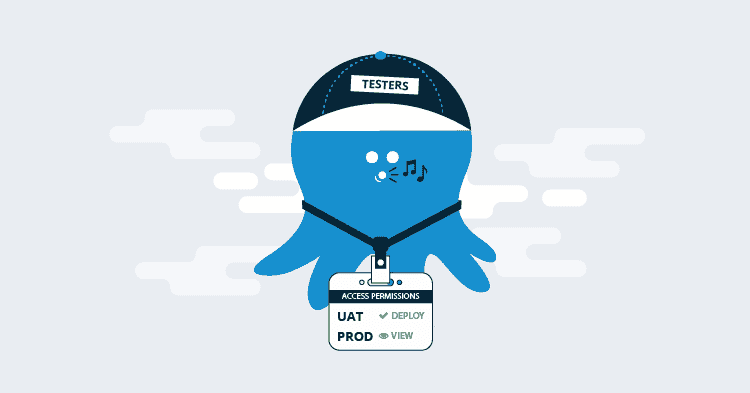
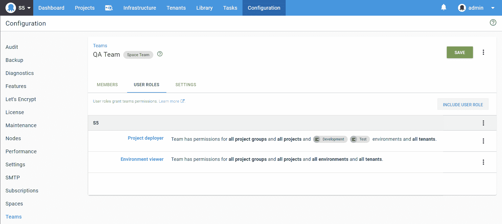
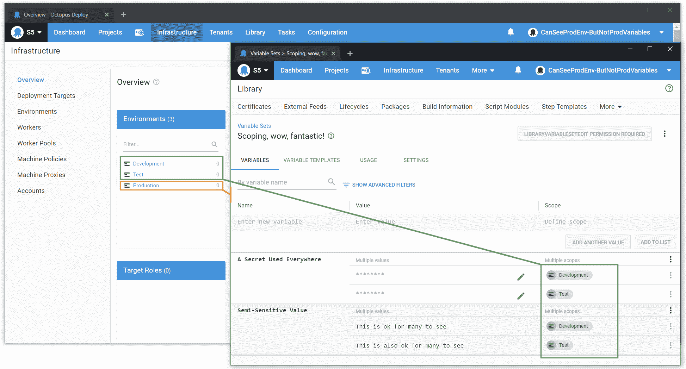
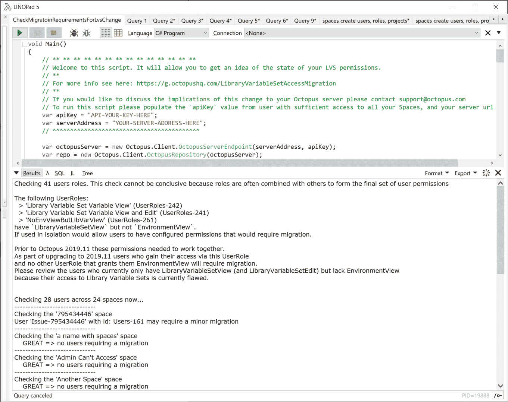

# 库变量集权限更改- Octopus 部署

> 原文：<https://octopus.com/blog/libraryvariableset-permission-changes>

Octopus 中的库变量集是一个非常受欢迎和有用的特性，它们使得定义用于多个项目的变量成为可能。

它们总是被设计成全球性的，随着许多客户使用八达通的增长，这就出现了一些我们正在解决的复杂问题。

为了对库变量集中的变量进行一致且可配置的访问，我们需要对两个权限(`LibraryVariableSetView`和`LibraryVariableSetEdit`)的工作和行为方式进行突破性的改变。

## TL；速度三角形定位法(dead reckoning)

*   您将能够将库变量集查看和编辑权限的范围扩大到环境和租户
*   将引入对`LibraryVariableSetView`和`LibraryVariableSetEdit`的断路行为改变。如果您有自动配置权限，这可能会影响您，请继续阅读以了解更多信息。

## 背景

当引入库变量集以及权限`LibraryVariableSetView`和`LibraryVariableSetEdit`时，Octopus 的世界变得更加简单。选择将这两个权限的行为紧密耦合到第三个权限`EnvironmentView`。

这一决定限制了对这两种权限进行一致粒度控制的能力，许多客户要求我们在这方面进行改进。

但是更改权限一直是一个挑战。Octopus 看不到客户是如何配置权限的。我们也尽最大努力不在章鱼身上做突破性的改变。因此，我们对这种类型的变化格外谨慎。

## 改进可变集合访问

随着 Octopus Server 版本 2020.1.2 中这一变化的引入，您将能够对用户在库变量集中可以查看和编辑的内容授予粒度访问权限，而与他们可以查看的环境无关。这一变化为增加库变量集的功能向前迈出了一大步。

`LibraryVariableSetView`和`LibraryVariableSetEdit`与`EnvironmentView`的分离赋予了这些权限类似于`VariableView`和`VariableEdit`的能力(它们现在都长大了)。

在`LibraryVariableSetView`和`LibraryVariableSetEdit`上支持的作用域是`Environments`和`Tenants`。接下来，您可以将一个库变量集中的变量范围设置为[部署目标](https://octopus.com/docs/infrastructure/deployment-targets)，如果这些目标被租用，那么访问权限也将对租户范围为`LibraryVariableSetView`和`LibraryVariableSetEdit`的用户强制执行。环境范围将像以前视图一样工作，但是这个变化将环境范围扩展到了`LibraryVariableSetEdit`。

### 例子

`LibraryVariableSetView`和`LibraryVariableSetEdit`权限将响应类似于`VariableView`和`VariableEdit`的作用域。现在，您可以更好地控制库变量集中的变量，与用户可以看到的环境无关。

假设我们在“QA 团队”中有一个用户，他有能力看到所有当前的环境:开发、测试和生产。这是通过没有应用范围的“环境查看者”角色授予他们的。他们还被授予“项目部署者”角色，该角色包含`LibraryVariableSetView`这限制了他们查看任何集合中的库变量的能力，只能查看开发和测试范围内的库变量，不包括生产:

通过库变量集中的一整套变量，可以在所有环境中使用:

我们可以在应用程序的其他区域看到有权访问名为生产环境的用户，但现在看不到为其定义的变量:

## 影响和迁移

为了保持此类用户的当前访问级别，Octopus 需要调整用户角色并在您的设备上引入新的团队。

我们相信大多数客户不会因此受到负面影响。作为开发和测试的一部分，我们与一些拥有大型实例的客户进行了交谈。

这一变化突出了一些不希望的错误配置(见下文，看看这是否影响你)。这些客户已经针对他们权限中的缺口采取了行动，并对他们的团队设置进行了适当的更改。这种迁移不会给他们带来变化，因为他们采取了较早的访问权限调整步骤。

### 这对我有影响吗？

如果您配置了自定义用户角色，并且这些角色包含`LibraryVariableSetView`和`LibraryVariableSetEdit`但不包含`EnvironmentView`，您可能会受到影响。

这里有一些例子来说明这是否会影响到你。

#### 受影响的示例

我们将在以下情况下迁移用户访问权限:

1.  您已经定义了一个`Custom User Role`，它包含`LibraryVariableSetView`或`LibraryVariableSetEdit`，您已经使用这个角色为一组用户定义了权限，并且没有其他角色授予这些用户访问权限。在这种情况下，在 Octopus Server 2020.1.2 的这一变化之前，`LibraryVariableSetView`并没有像预期的那样工作，因为用户缺少`EnvironmentView`。
2.  您正在使用具有`LibraryVariableSetView`或`LibraryVariableSetEdit`的用户角色，其作用域与用户在`EnvironmentView`权限上的作用域不同。在这种情况下，我们必须将他们当前在`EnvironmentView`上的相同范围应用到`LibraryVariableSetView`和`LibraryVariableSetEdit`。

#### 不受影响的示例

如果满足以下条件，将不会发生权限迁移更改:

1.  您已经定义了许多自定义用户角色(或者修改了的内置角色)，但是在您选择了`LibraryVariableSetView`或`LibraryVariableSetEdit`的地方，您也选择了`EnvironmentView`。
2.  您已经定义了一个带有`LibraryVariableSetView`或`LibraryVariableSetEdit`的自定义用户角色(或修改了一个内置角色),它缺少`EnvironmentView`,但是对于所有使用第一个用户角色的团队，您还选择了另一个用户角色来授予`EnvironmentView`,并且范围选择在两者之间匹配。

### 如何检查我的实例？

如果您怀疑您的用户可能配置了这样的访问权限，请使用配置➜测试权限页面来验证用户拥有`LibraryVariableSetView`但没有`EnvironmentView`。

您还可以在我们的 API repo 中运行这个 [LinqPad](https://www.linqpad.net/) [脚本来帮助确定所需的迁移级别。](https://github.com/OctopusDeploy/OctopusDeploy-Api/blob/master/Octopus.Client/LINQPad/CheckMigratoinRequirementsForLvsChange.linq)

### 这种迁移将如何进行？

该迁移将在 Octopus 服务器启动期间进行。如果您想查看发生了什么变化，请查看[服务器日志文件](https://octopus.com/docs/support/log-files)。

## 突破性变化

这是一个突破性的变化。

如果您依赖于`LibraryVariableSetView`和`LibraryVariableSetEdit`如何工作的现有行为，它们的行为会有所不同，并且您需要修改授予这种访问权限的任何自动化。

如果您对此有疑问，请联系八达通支持。我们可以满怀信心地帮助您确定这是否会对您产生任何影响，以及在您升级到此版本之前，您可以采取哪些步骤来改进您的权限配置。