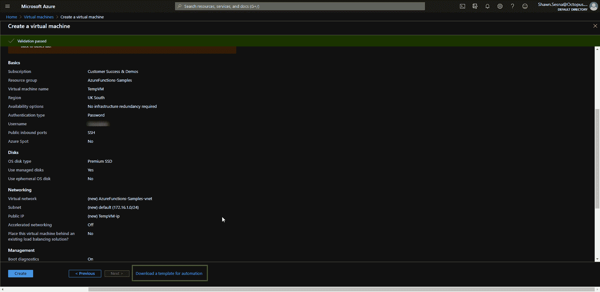
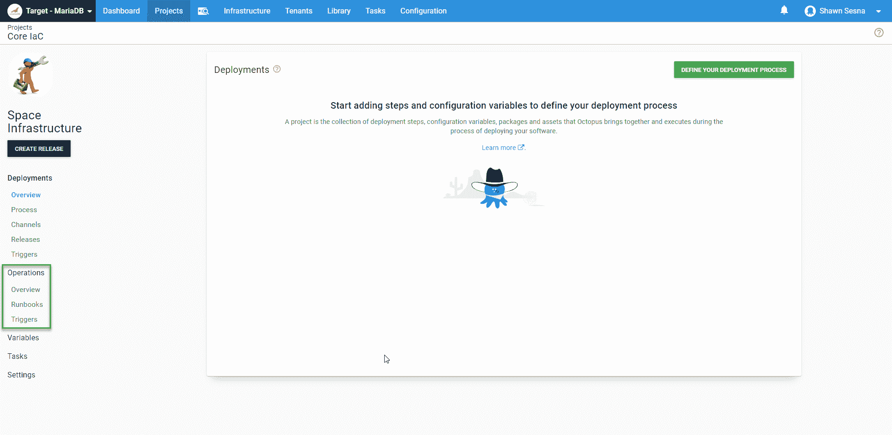
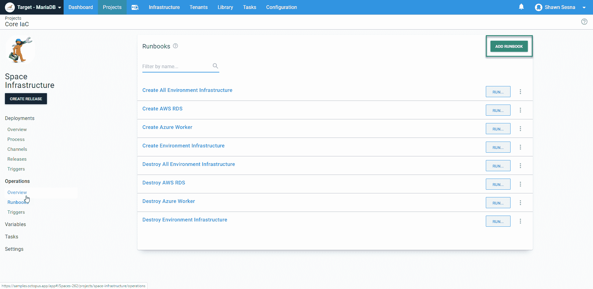
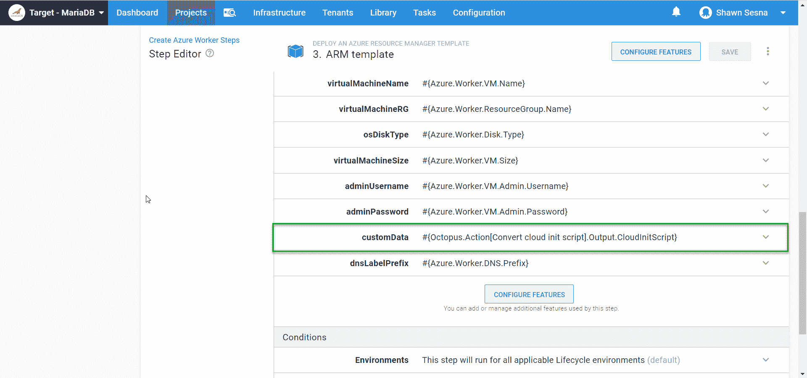
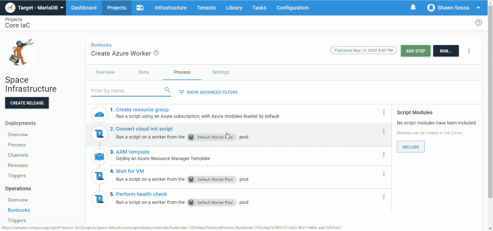
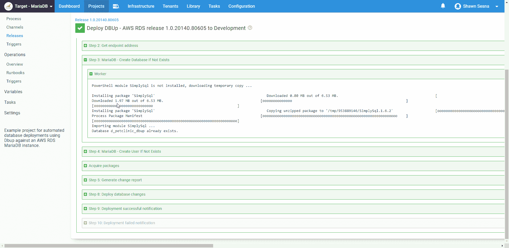

# PowerShell 模板的 Linux worker-Octopus 部署

> 原文：<https://octopus.com/blog/linux-worker-powershell-core>

[](#)

Octopus Deploy 有 400 多个步骤模板，您可以在部署中使用。这些模板中有许多是用 PowerShell 编写的，随着 [Linux 触手](https://octopus.com/docs/infrastructure/deployment-targets/linux/tentacle)的引入，一些 step 模板已经被转换成 Bash 版本，然而，使用 PowerShell Core，将现有模板转换成 Bash 是不必要的。

在本文中，我演示了如何在带有 PowerShell Core 的 Linux Worker 上使用现有的 Octopus Deploy 步骤模板。

## 创建手臂模板

为此，我首先需要一台 Linux 机器。我在 Azure 中使用的是从 Runbook 升级而来的 Ubuntu Linux 虚拟机。

### Azure 资源管理器(ARM)模板

使用 ARM 模板在 Azure 中创建 VM 非常简单。微软做了一件了不起的工作，让这一代 ARM 模板变得快速而简单。完成定义虚拟机配置方式的过程，并在完成后导出模板。

[](#)

### ARM 模板参数

您在生成 ARM 模板时所做的具体选择并不重要，因为您可以参数化一切并使用 Octopus Deploy 变量来控制它们。在上图中，像`Virtual machine name`、`Username`和`OS disk type`这样的项目都将是我们模板中的参数，以使它更加通用。这在创建我们的 Runbook 时更有意义。

## 八达通部署手册

[操作手册](https://octopus.com/docs/operations-runbooks)是 Octopus 部署的最新功能之一。Runbooks 允许您利用 Octopus Deploy 的强大功能来执行操作任务，如恢复数据库或回收 IIS 应用程序池。与部署不同，runbooks 被设计为可以在任何时间任何环境中运行，并且不受生命周期的限制(除了它们只能在您的应用程序使用的环境中执行之外)。在这种情况下，我们将使用 runbooks 来加速我们的 Linux 虚拟机。

### 创建操作手册

在您的 Octopus Deploy 项目中有一个操作手册，位于 Operations:

[](#)

点击 **Runbooks** ，然后点击**添加 RUNBOOK** :

[](#)

为了加速我们的 Linux Worker VM，我们的 Runbook 将包括:

*   创建新的 Azure 资源组
*   将我们的云初始化脚本转换为 Base64 字符串(稍后将详细介绍)
*   运行 ARM 模板
*   等待虚拟机可用
*   执行健康检查

这篇文章更侧重于演示带有 PowerShell core 的 Linux，所以我们不会对 runbooks 进行过多的描述。

#### 创建资源组

创建一个新的资源组是可选的，主要是为了整洁和方便删除在执行 ARM 模板时创建的资源。使用现有的资源组完全没问题。使用一个**运行一个 Azure 脚本**的步骤，你可以用一个脚本快速创建一个资源组:

```
$resourceGroupName = $OctopusParameters["Azure.Worker.ResourceGroup.Name"]
$resourceGroupLocation = $OctopusParameters["Azure.Location.Abbr"]

Try {
    Get-AzureRmResourceGroup -Name $resourceGroupName
    $createResourceGroup = $false
} Catch {
    $createResourceGroup = $true
}

if ($createResourceGroup -eq $true){
    New-AzureRmResourceGroup -Name $resourceGroupName -Location $resourceGroupLocation
} 
```

#### 将云初始化脚本转换为 Base64 字符串

ARM 模板有两种不同的方式来执行 init 脚本:

*   [自定义脚本扩展](https://docs.microsoft.com/en-us/azure/virtual-machines/extensions/custom-script-windows):使用自定义脚本扩展，您可以为包含脚本的文件(如 [Gist](https://gist.github.com/discover) )提供一个 URI。这种方法的优点是对脚本文件使用源代码控制。
*   CustomData 参数(本文使用该方法):CustomData 参数允许我们将脚本作为字符串包含进来，并作为参数传递。调配 Windows 虚拟机时，该值可以是一个字符串。对于 Linux，这个值必须首先经过 Base64 编码，这可以在运行脚本任务中轻松完成

对于本例，我希望我的 init 脚本执行以下操作:

*   安装 Linux 触手
*   安装 PowerShell 核心
*   配置触手并将其自身注册到我的云实例

##### 安装 Linux 触手

脚本的这一部分将涵盖触手的安装。如果你读过我们关于 Linux 触手的其他博客文章，它应该看起来很熟悉:

```
serverUrl="#{Global.Base.Url}"   # The url of your Octous server
thumbprint="#{Global.Server.Thumbprint}"       # The thumbprint of your Octopus Server
apiKey="#{Global.Api.Key}"           # An Octopus Server api key with permission to add machines
name="#{Octopus.Space.Name}-#{Octopus.Environment.Name}"      # The name of the Tentacle at is will appear in the Octopus portal
publicHostName="#{Azure.Worker.DNS.Prefix}.centralus.cloudapp.azure.com"      # The url to the tentacle
workerPoolName="#{Azure.Worker.Pool.Name}"
configFilePath="/etc/octopus/default/tentacle-default.config"
applicationPath="/home/Octopus/Applications/"
spaceName="#{Octopus.Space.Name}"

sudo apt install --no-install-recommends gnupg curl ca-certificates apt-transport-https && \
curl -sSfL https://apt.octopus.com/public.key | sudo apt-key add - && \
sudo sh -c "echo deb https://apt.octopus.com/ stable main > /etc/apt/sources.list.d/octopus.com.list" && \
sudo apt update && sudo apt install tentacle -y 
```

##### 安装 PowerShell 核心

这个位将会把 PowerShell 核心安装到 Ubuntu 上(更多信息参见[微软的文档](https://docs.microsoft.com/en-us/powershell/scripting/install/installing-powershell-core-on-linux?view=powershell-7)):

```
# Download the Microsoft repository GPG keys
wget -q https://packages.microsoft.com/config/ubuntu/18.04/packages-microsoft-prod.deb

# Register the Microsoft repository GPG keys
sudo dpkg -i packages-microsoft-prod.deb

# Update the list of products
sudo apt-get update

# Enable the "universe" repositories
sudo add-apt-repository universe

# Install PowerShell
sudo apt-get install -y powershell 
```

##### 配置触手并将其自身注册到我的云实例

最后，我们需要脚本来配置触手，然后将它注册到我们的实例中。该脚本使用在上面的安装部分中定义的变量:

```
sudo /opt/octopus/tentacle/Tentacle create-instance --config "$configFilePath"
sudo /opt/octopus/tentacle/Tentacle new-certificate --if-blank
sudo /opt/octopus/tentacle/Tentacle configure --port 10933 --noListen False --reset-trust --app "$applicationPath"
sudo /opt/octopus/tentacle/Tentacle configure --trust $thumbprint
echo "Registering the Tentacle $name as a worker with server $serverUrl in $workerPoolName"
sudo /opt/octopus/tentacle/Tentacle register-worker --server "$serverUrl" --apiKey "$apiKey" --name "$name" --space "$spaceName" --publicHostName "$publicHostName" --workerpool "$workerPoolName"
# Install and start the service
sudo /opt/octopus/tentacle/Tentacle service --install --start 
```

设置好脚本后，我们需要将它转换为 Base64 字符串，然后将其分配给一个输出变量，以便可以在 ARM 模板中使用。下面是在一个**运行脚本**的步骤中调用的`Convert cloud init script`:

```
# Define cloud init script
$cloudInitScript = @'
#!/bin/bash

# Install Octopus listening tentacle
serverUrl="#{Global.Base.Url}"   # The URL of your Octopus server
thumbprint="#{Global.Server.Thumbprint}"       # The thumbprint of your Octopus Server
apiKey="#{Global.Api.Key}"           # An Octopus Server api key with permission to add machines
name="#{Octopus.Space.Name}-#{Octopus.Environment.Name}"      # The name of the Tentacle at is will appear in the Octopus portal
publicHostName="#{Azure.Worker.DNS.Prefix}.centralus.cloudapp.azure.com"      # The url to the tentacle
workerPoolName="#{Azure.Worker.Pool.Name}"
configFilePath="/etc/octopus/default/tentacle-default.config"
applicationPath="/home/Octopus/Applications/"
spaceName="#{Octopus.Space.Name}"

sudo apt install --no-install-recommends gnupg curl ca-certificates apt-transport-https && \
curl -sSfL https://apt.octopus.com/public.key | sudo apt-key add - && \
sudo sh -c "echo deb https://apt.octopus.com/ stable main > /etc/apt/sources.list.d/octopus.com.list" && \
sudo apt update && sudo apt install tentacle -y

sudo /opt/octopus/tentacle/Tentacle create-instance --config "$configFilePath"
sudo /opt/octopus/tentacle/Tentacle new-certificate --if-blank
sudo /opt/octopus/tentacle/Tentacle configure --port 10933 --noListen False --reset-trust --app "$applicationPath"
sudo /opt/octopus/tentacle/Tentacle configure --trust $thumbprint
echo "Registering the Tentacle $name as a worker with server $serverUrl in $workerPoolName"
sudo /opt/octopus/tentacle/Tentacle register-worker --server "$serverUrl" --apiKey "$apiKey" --name "$name" --space "$spaceName" --publicHostName "$publicHostName" --workerpool "$workerPoolName"

# Download the Microsoft repository GPG keys
wget -q https://packages.microsoft.com/config/ubuntu/18.04/packages-microsoft-prod.deb

# Register the Microsoft repository GPG keys
sudo dpkg -i packages-microsoft-prod.deb

# Update the list of products
sudo apt-get update

# Enable the "universe" repositories
sudo add-apt-repository universe

# Install PowerShell
sudo apt-get install -y powershell

# Install and start the Tentacle service
sudo /opt/octopus/tentacle/Tentacle service --install --start
'@

Write-Output "Converting cloudInitScript to base64"

# Convert to Base64
$cloudInitScript = [System.Convert]::ToBase64String([system.Text.Encoding]::UTF8.GetBytes($cloudInitScript))

# Set output variable
Set-OctopusVariable -name "CloudInitScript" -value $cloudInitScript 
```

将我们的脚本转换为 Base64 字符串后，我们可以将其传递给我们的 ARM 模板:

[](#)

#### 等待虚拟机

这一步是另一个**运行脚本**的步骤，它等待新创建的虚拟机响应，并让我们知道它可供使用。下面是脚本(`Test-NetConnect`如果目的地不可达则返回警告，这在我们等待虚拟机可用时是正常的):

```
# Define variables
$publicDNS = "#{Azure.Worker.DNS.Prefix}.#{Azure.Region.Name}.cloudapp.azure.com"

$connectionTest = Test-NetConnection -ComputerName $publicDNS -Port 10933 -WarningAction SilentlyContinue -InformationLevel Quiet

while ($connectionTest -eq $false)
{
  # Give it five seconds
  Start-Sleep -Seconds 5

  # Server not quite ready
  $connectionTest = Test-NetConnection -ComputerName $publicDNS -Port 10933 -WarningAction SilentlyContinue -InformationLevel Quiet
} 
```

#### 执行健康检查

我们运行手册的最后一步是对新创建的工人执行健康检查。**健康检查**内置步骤模板在这里对我们不起作用，因为它是针对部署目标而不是工作人员设计的。这个步骤是另一个**运行脚本**的步骤，它调用 Octopus Deploy API 来启动对一个工人的健康检查:

```
# Define parameters
$baseUrl = $OctopusParameters['Global.Base.Url']
$apiKey = $OctopusParameters['Global.Api.Key']
$spaceId = $OctopusParameters['Octopus.Space.Id']
$spaceName = $OctopusParameters['Octopus.Space.Name']
$environmentName = $OctopusParameters['Octopus.Environment.Name']

# Get worker pool
$workerPool = (Invoke-RestMethod -Method Get -Uri "$baseUrl/api/$spaceId/workerpools/all" -Headers @{"X-Octopus-ApiKey"="$apiKey"}) | Where-Object {$_.Name -eq "#{PoolName}"}

# Get worker
$worker = (Invoke-RestMethod -Method Get -Uri "$baseUrl/api/$spaceId/workerpools/$($workerPool.Id)/workers" -Headers @{"X-Octopus-ApiKey"="$apiKey"}).Items | Where-Object {$_.Name -eq "$spaceName-$environmentName"}

# Build payload
$jsonPayload = @{
    Name = "Health"
    Description = "Check $spaceName-$environmentName health"
    Arguments = @{
        Timeout = "00:05:00"
        MachineIds = @(
            $worker.Id
        )
    OnlyTestConnection = "false"
    }
    SpaceId = "$spaceId"
}

# Execute health check
Invoke-RestMethod -Method Post -Uri "$baseUrl/api/tasks" -Body ($jsonPayload | ConvertTo-Json -Depth 10) -Headers @{"X-Octopus-ApiKey"="$apiKey"} 
```

完成后，您的操作手册应该如下所示:

[](#)

## 在具有 PowerShell 核心的 Linux 上执行 PowerShell 步骤模板

现在有趣的部分来了！在这个例子中，我使用了 [MariaDB -如果不存在就创建数据库](https://library.octopus.com/step-templates/2bdfe600-e205-43f9-b174-67ee5d36bf5b/actiontemplate-mariadb-create-database-if-not-exists)步骤模板。顾名思义，它连接到一个 MariaDB 服务器并创建一个数据库(如果它不存在的话)。这个步骤模板不仅完全是用 PowerShell 编写的，它还使用了一个名为 [SimplySql](https://www.powershellgallery.com/packages/SimplySql/1.6.2) 的第三方 PowerShell 模块。在执行过程中，如果模板检测到没有安装 SimplySql，它会将它下载到一个临时文件夹中，并使用`Import-Module`使它包含在部署中:

[](#)

当包含在部署中时，我们可以看到 Linux Worker 使用 PowerShell 核心来执行该步骤:

[](#)

下面是步骤*的日志输出:

```
PowerShell module SimplySql is not installed, downloading temporary copy ... 
Installing package 'SimplySql'
Downloaded 0.00 MB out of 6.53 MB.
[                                                                    ]
Installing package 'SimplySql'
Unzipping
[ooooooooooooooooooooooooooooooooooooooooooooooo                     ]
Installing package 'SimplySql'
Process Package Manifest
[oooooooooooooooooooooooooooooooooooooooooooooooooooooooooooooooo    ]
Importing module SimplySql ... 

Database d_petclinic_dbup already exists. 
```

*日志已格式化，便于阅读。

如您所见，step 模板检测到 SimplySql 模块没有安装，下载 SimplySql 并导入它。然后，它连接到 MariaDB 服务器，发现数据库已经存在，并使用 PowerShell 完成所有工作。

## 结论

在 Linux 世界中采用 Octopus Deploy 的一个促成因素是可以使用的模板选择有限。有了 PowerShell Core，可以在 Linux 机器上执行的模板的选择就成指数级增加了。