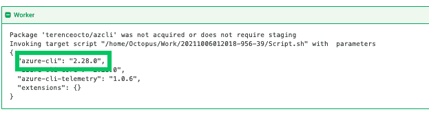

# 维护您自己版本的 Azure CLI - Octopus Deploy

> 原文：<https://octopus.com/blog/maintaining-own-version-azure-cli>

Octopus Deploy 之前支持 Azure 命令行界面(CLI)作为其[定制工人工具](https://github.com/OctopusDeploy/WorkerTools)的一部分。然而，从 Octopus 2021.1 开始，Octopus 不再保持当前的 Azure CLI 版本。如果您的部署使用预捆绑版本，您将收到一条警告，建议您维护您的工作映像。

提供了与 Octopus Deploy 捆绑在一起的 Azure 工具，以方便需要针对 Azure 目标运行脚本的用户。Octopus 捆绑了 Azure 资源管理器 PowerShell 模块(AzureRM)和 Azure CLI 的版本。从 Octopus 2021.1 开始，我们建议使用运行部署所需的版本来维护您自己的 Worker 容器。通过这种方式，提供的工具与部署指定的需求相匹配。

在这篇文章中，我将向您展示如何使用最新的 Azure CLI 版本创建自定义 Docker 映像，如何在 Docker Hub 上托管它，以及如何在 Octopus 部署中使用它。

## 安装和推送自定义容器

首先，创建一个 Dockerfile 文件，指定操作系统和 Azure CLI 安装命令。将安装最新版本的 CLI(2 . 28 . 0)。

```
FROM ubuntu:18.04

ARG DEBIAN_FRONTEND=noninteractive
ARG Azure_Cli_Version=2.28.0\*

# Install wget, apt-utils, and software-properties-common
RUN apt-get update && \
apt-get install -y wget apt-utils && \
apt-get install -y software-properties-common

# Install the Azure CLI
RUN wget --quiet -O - https://packages.microsoft.com/keys/microsoft.asc | gpg --dearmor | tee /etc/apt/trusted.gpg.d/microsoft.asc.gpg > /dev/null && \
echo "deb [arch=amd64] https://packages.microsoft.com/repos/azure-cli/ bionic main" | tee /etc/apt/sources.list.d/azure-cli.list && \
apt-get update && \
apt-get install -y azure-cli=${Azure_Cli_Version}

# Tidy up
RUN apt-get clean 
```

如果需要，该文档可以包括其他形式的工具。

我们建议每个人维护他们的工具版本，以获得一致的部署结果。

运行 Docker buildx 命令来构建映像并将其推送到 Docker Hub。(请注意，这些说明是针对 M1 Mac 电脑的。)

使用多个平台确保 Octopus Deploy 将下载适当的版本。

```
docker buildx build --platform linux/amd64,linux/arm64,linux/arm/v7 -t terenceocto/azcli:latest --push . 
```

成功后，Docker 将在 Docker Hub 上托管映像。

[](#)

## 确认成功

通过[指定自定义容器](https://octopus.com/docs/projects/steps/execution-containers-for-workers)，可以使用内置的 Azure CLI 来显示和确认 CLI 的版本号。

[](#)

使用定制容器指令，在 Octopus UI 中指定新的定制图像，并再次打印出版本。Azure CLI 现在是最新版本。

[](#)

## 结论

从 Octopus 2021.1 开始，Azure CLI 和其他工具不再是最新的。您应该为您的映像提供支持您的部署的工具。

在本文中，您学习了如何使用最新的 Azure CLI 设置 Docker 映像，并在 Octopus 部署中使用它。

愉快的部署！