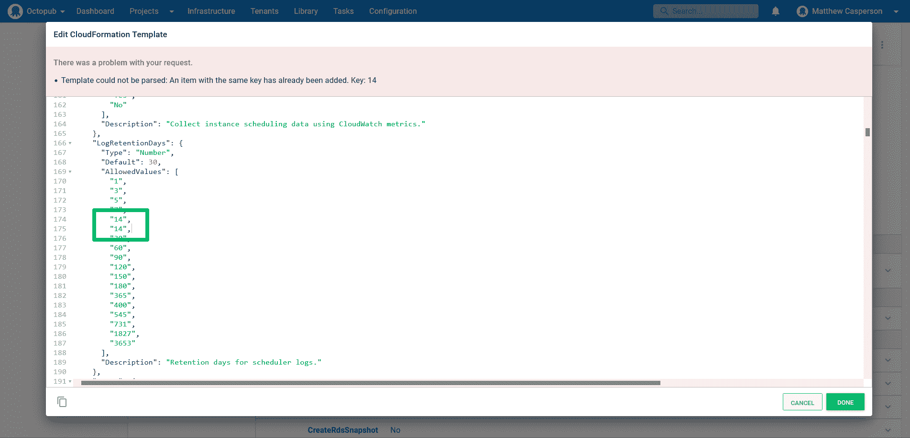
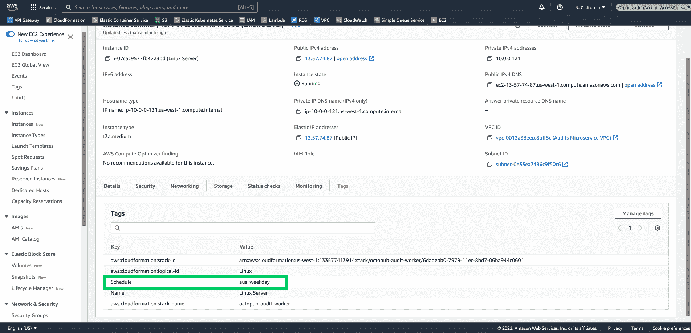

# 使用实例调度程序管理 AWS 成本- Octopus Deploy

> 原文：<https://octopus.com/blog/managing-aws-costs-instance-scheduler>

云计算的承诺是允许团队有效地按需扩展和缩减。虽然内部基础架构可以通过关闭来节省电力和冷却成本，但基于云的资源可以通过停止任何未使用的资源来避免几乎所有费用(存储费用通常适用于停止的资源)。

AWS 提供了[实例调度器](https://aws.amazon.com/solutions/implementations/instance-scheduler/)来按需关闭和重启 EC2 和 RDS 资源。对于拥有 Octopus 资源的团队来说，这是一个很好的解决方案，比如在 AWS 中运行的 Workers，他们在一天中的大部分时间都没有被使用。

在这篇文章中，您将学习如何安装实例调度器，如何用自定义周期配置它，以及如何标记自动关闭和重启的资源。

## 先决条件

这篇文章假设您将在 Linux Worker 上运行脚本。你需要安装 Python 3、`jq`、`curl`和`unzip`来完成本文中的步骤。要在 Ubuntu 中安装这些工具，请运行以下命令:

```
apt-get install jq curl unzip python3 
```

要在 Fedora、RHEL、Centos 和 Amazon Linux 中安装这些工具，请运行以下命令:

```
yum install jq curl unzip python3 
```

实例调度器由一个名为 [Scheduler CLI](https://docs.aws.amazon.com/solutions/latest/instance-scheduler-on-aws/scheduler-cli.html) 的定制 Python 应用程序管理。

CLI 需要 Python 3。如果您安装了 Python 2 和 Python 3，您可以使用以下命令强制使用 Python 3:

```
alias python=python3 
```

运行以下命令安装 CLI:

```
curl -O https://s3.amazonaws.com/solutions-reference/aws-instance-scheduler/latest/scheduler-cli.zip
unzip scheduler-cli.zip
python setup.py install 
```

一个公共的 [Octopus 实例已经配置了一个项目，该项目部署了实例调度器](https://tenpillars.octopus.app/app#/Spaces-42/projects/aws-instance-scheduler/deployments)。

## 部署实例调度程序模板

实例调度器作为下载的 [CloudFormation 模板分发。您将使用 Octopus 中的**部署 AWS CloudFormation 模板**步骤来部署它。](https://s3.amazonaws.com/solutions-reference/aws-instance-scheduler/latest/aws-instance-scheduler.template)

如果您在尝试保存模板时看到错误`Template could not be parsed: An item with the same key has already been added. Key: 14`，这是因为其中一个参数复制了`AllowedValues`数组中的一个选项。在下面的截图中，你可以看到`LogRetentionDays`参数有重复的值`14`。要解决该错误，请删除重复的值:

[](#)

您可以保留这些参数的默认值，尽管您可能希望定义`DefaultTimezone`参数来反映您的本地时区。

我们为这个步骤创建了一个[实例。](https://tenpillars.octopus.app/app#/Spaces-42/projects/aws-instance-scheduler/deployments/process/steps?actionId=4ba7211f-0531-48e6-8f88-de70b770595b)

## 添加新周期

实例调度器通过在 DynamoDB 数据库中定义多个周期来工作。Scheduler CLI 提供了一个方便的界面，通过该界面可以查看和操作这些时间段。

下面的脚本调用`scheduler-cli describe-periods`列出当前定义的时间段，然后将结果 JSON 通过管道传递给`jq`，后者检查是否存在一个名为`aus_weekday`的时间段。如果不存在，则通过调用`scheduler-cli create-period`添加句点。如果确实存在，则通过调用`scheduler-cli update-period`更新周期。

这个脚本是创建幂等部署所必需的，在幂等部署中，可以在任何时候重新部署部署，而不管数据库的现有状态如何。

该脚本与 Octopus 中的**运行 AWS CLI 脚本**步骤一起运行。你可以在我们的实例中看到这一点:

```
alias python=python3
scheduler-cli describe-periods --stack common-instance-scheduler | jq -e '.Periods|any(.Name == "aus_weekday")' > /dev/null
if [[ 0 -ne $? ]]; then
    scheduler-cli create-period --name "aus_weekday" --begintime 05:00 --endtime 17:00 --weekdays mon-fri --stack common-instance-scheduler
else
    scheduler-cli update-period --name "aus_weekday" --begintime 05:00 --endtime 17:00 --weekdays mon-fri --stack common-instance-scheduler
fi 
```

## 标记资源

实例调度器根据标记识别要关闭和重启的资源。实例调度程序寻找的默认标记名为`Schedule`(尽管可以通过更改 CloudFormation 模板中的`TagName`参数来修改标记名)。标签的值被设置为一个句点的名称。

在下面的截图中，您可以看到一个 worker EC2 实例有一个名为`Schedule`的标记设置为`aus_weekday`。这意味着这个 EC2 实例将在每个工作日的 17:00 关闭，并在 05:00 重新启动。这使得 EC2 实例的运行成本降低了一半以上，因为它现在会在夜间和周末关闭:

[](#)

## 结论

AWS 实例调度程序是一个方便的解决方案，允许您自动关闭和重启 EC2 和 RDS 实例，这可以显著降低并非全天 24 小时都需要的资源的运行成本。

在本文中，您了解了如何使用 Octopus 部署实例调度程序，使用调度程序 CLI 添加新的周期，以及标记您的资源以允许调度程序在夜间和周末关闭它们。

阅读我们的 [Runbooks 系列](https://octopus.com/blog/tag/Runbooks%20Series)的其余部分。

愉快的部署！