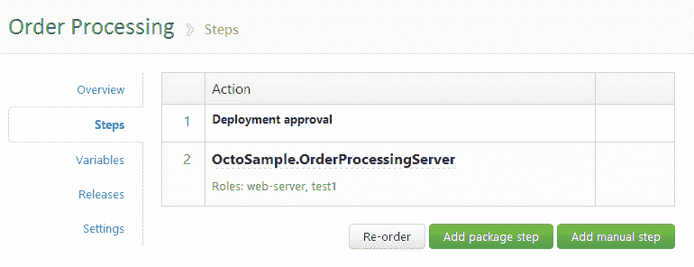
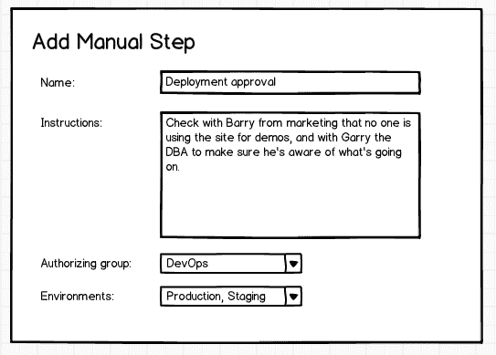
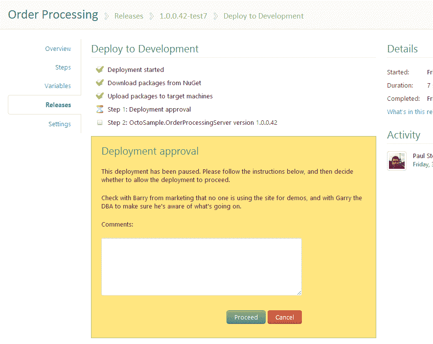
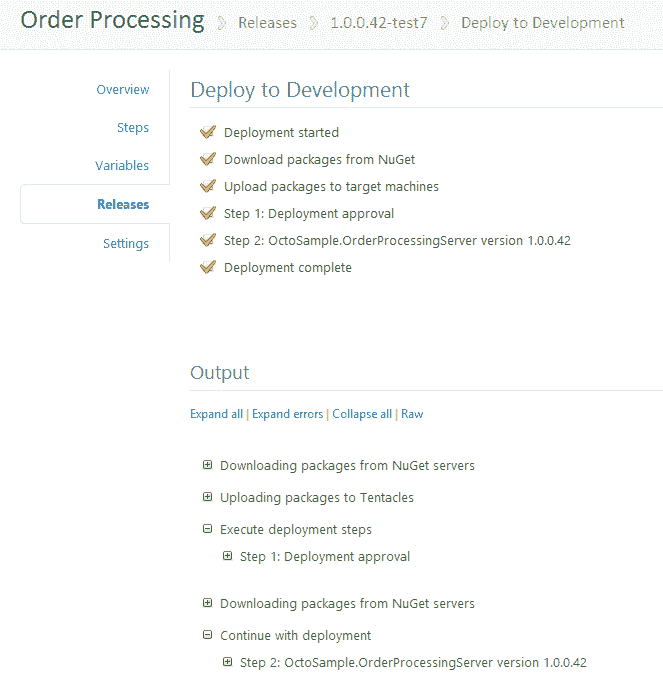

# 手动部署- RFC - Octopus 部署

> 原文：<https://octopus.com/blog/manual-deployments-rfc>

随着[保留策略](http://octopusdeploy.com/blog/1.2-with-retention-policies)的取消，我在 Octopus 中开发的下一个大特性是[手动部署](https://trello.com/card/new-deployment-step-manual/4e907de70880ba000079b75c/32)。

虽然完全自动化的部署是一个伟大的目标，但不是部署中的每个步骤都可以自动化，有时需要人工参与。生产部署可能需要:

*   部署前获得签署/批准
*   在启用新部署的网站之前，人工检查其主页是否正常工作
*   在不允许自动执行这些步骤的环境中执行数据库升级或更新某些基础架构(例如，您必须将数据库更改提交给 DBA 进行手动审查和运行)
*   部署完成后获得签署/批准

到目前为止，在 Octopus 中，我们支持的部署中唯一的“步骤”是 NuGet 包部署。我们现在引入一种新的步骤，即“手动步骤”，可以用来处理这些情况。

当您创建一个手动步骤时，您将输入一些指示，这些指示将呈现给用户以供遵循。您还将选择用户必须属于的群组。例如，如果您需要经理的批准，请创建一个拥有适当用户的“经理”组，然后选择该组。

在部署过程中，当遇到手动步骤时，部署将进入“暂停”状态。如果审批组的某人正在查看该页面，他们将看到一个屏幕，其中包含继续或取消部署的选项:

他们还可以输入将与部署一起存储的注释。例如，如果没有得到批准，经理可能会使用注释来解释原因。

一旦组中有人“继续”部署，部署任务将重新排队并运行。

该特性支持的另一个场景是[预上传包](https://trello.com/card/staged-deployment-pre-upload-packages/4e907de70880ba000079b75c/98)的想法，因为包将在遇到第一个手动步骤之前被上传到 Tentacles。

我很想得到您对这个功能和您在上面看到的内容的反馈，以及您是否认为还有其他选项/功能缺失。我看到的一个建议是，当遇到手动步骤时，向批准组发送电子邮件，我认为这是一个好建议(尽管它可能使用不同的“发送电子邮件”步骤来实现)。关于这个特性，你还想改变什么？