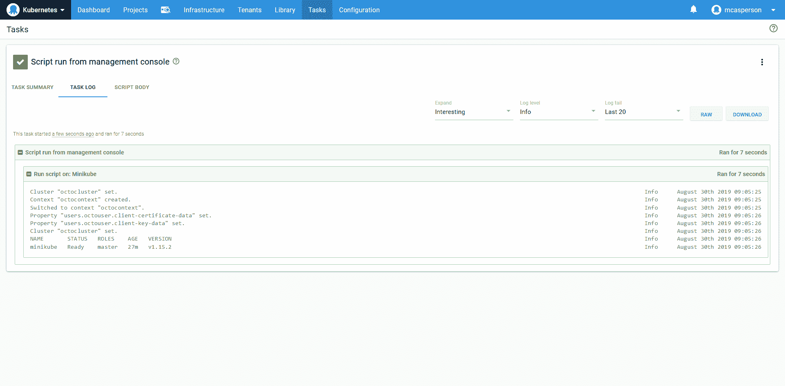

# 在 Windows 上安装 Minikube-Octopus Deploy

> 原文：<https://octopus.com/blog/minikube-on-windows>

[](#)

多亏了 [Minikube 项目](https://kubernetes.io/docs/tasks/tools/install-minikube/)，开始测试 Kubernetes 集群变得更加容易。通过使用 Windows 10 中的 HyperV 功能，只需几分钟就可以创建一个测试 Kubernetes 集群。

在本文中，我们将介绍配置 HyperV、安装`kubectl`和 Minikube 以及与测试 Kubernetes 集群交互的过程。

## 创建外部交换机

Minikube 需要一个外部 HyperV 开关来操作，你可能会发现你默认没有。

要查看开关列表，打开`HyperV Manager`并从动作列表中选择`Virtual Switch Manager...`:

[](#)

*hyper v 操作菜单。*

在下面的屏幕截图中，您可以看到没有现有的外部交换机，因此我们需要通过选择`External`选项并单击`Create Virtual Switch`按钮来创建一个:

[](#)

*现有交换机列表。*

将虚拟交换机连接到电脑的本地网络适配器(在本例中为无线网络适配器)。点击`OK`按钮创建开关:

[](#)

*创建新的 HyperV 外部交换机。*

您将收到网络连接将被中断的警告。点击`Yes`继续。

[](#)

*创建新交换机导致网络中断的警告。*

## 安装 kubectl

我们用来与 Kubernetes 交互的命令行工具叫做`kubectl`，我们将在配置 Minikube 之前安装它。`kubectl`有两种安装方式:

## 安装 Minikube

我们现在准备安装 Minikube。您可以通过两种方式安装 Minikube:

*   用[巧克力](https://chocolatey.org/packages/Minikube)使用命令`choco install minikube`。
*   从 [GitHub](https://github.com/kubernetes/minikube/releases/latest/download/minikube-installer.exe) 下载并安装可执行文件。

安装 Minikube 后，以管理员身份打开 PowerShell 终端:

[](#)

*以管理员身份启动终端。*

然后，可以使用以下命令启动 Minikube:

```
minikube start `
--vm-driver hyperv `
--hyperv-virtual-switch "External Switch" 
```

将创建一个名为`minikube`的新虚拟机:

[](#)

*运行 Minikube start 后创建的 Minikube 虚拟机。*

安装完成后，我们可以通过`kubectl`与 Minikube 集群交互:

[](#)

*Minikube 集群已成功启动。*

## 运行一些命令

Minikube 安装将使用测试集群的详细信息更新`~/.kube/config`处的文件，即`kubectl`使用的配置文件:

```
PS C:\Users\Matthew> cat ~/.kube/config
apiVersion: v1
clusters:
- cluster:
    certificate-authority: C:\Users\Matthew\.minikube\ca.crt
    server: https://10.1.1.122:8443
  name: minikube
contexts:
- context:
    cluster: minikube
    user: minikube
  name: minikube
current-context: minikube
kind: Config
preferences: {}
users:
- name: minikube
  user:
    client-certificate: C:\Users\Matthew\.minikube\client.crt
    client-key: C:\Users\Matthew\.minikube\client.key 
```

我们可以通过列出节点来测试安装是否正常工作:

```
PS C:\Users\Matthew> kubectl get nodes
NAME       STATUS   ROLES    AGE     VERSION
minikube   Ready    master   6m47s   v1.15.2 
```

## 将 Octopus 连接到 Minikube

要从 Octopus 使用 Minikube，我们需要上传客户端证书。Minikube 将证书和密钥分割成两个文件(由`~/.kube/config`文件中的`client-certificate`和`client-key`属性引用)，所以我们使用 [OpenSSL](https://slproweb.com/products/Win32OpenSSL.html) 将它们合并成一个 PFX 文件:

```
& "C:\Program Files\OpenSSL-Win64\bin\openssl.exe" pkcs12 `
  -passout pass: `
  -export `
  -out certificateandkey.pfx `
  -in C:\Users\Matthew\.minikube\client.crt `
  -inkey C:\Users\Matthew\.minikube\client.key 
```

生成的`certificateandkey.pfx`文件可以上传到 Octopus:

[](#)

*由 Minikube 创建并由 OpenSSL 组合的证书和密钥。*

为了让 Octopus 与本地虚拟机通信，我们需要在本地 PC 上创建一个 [Worker 触手](https://octopus.com/docs/infrastructure/workers):

[](#)

*与 Minikube 集群运行在同一台机器上的轮询工作器触手。*

我们现在可以创建一个指向 Minikube 集群的本地 URL 的 Kubernetes 目标，这可以从`~/.kube/config`文件中的这一行找到:

```
server: https://10.1.1.122:8443 
```

Kubernetes 目标将使用我们之前上传的证书进行身份验证，为了方便起见跳过 TLS 验证，默认使用本地的触手工作器。

您可以通过`~/.kube/config`文件中的`certificate-authority`属性上传证书引用，并将其设置为服务器证书。

[](#)

*一个 Kubernetes 目标，配置为使用本地 Worker 触手，与内部 Minikube IP 地址对话。*

定义好目标后，我们可以使用 [Octopus 脚本控制台](https://octopus.com/docs/administration/managing-infrastructure/script-console)与之交互:

[](#)

*脚本控制台是运行临时脚本的便捷方式。*

该命令将通过 Worker Tentacle 执行，以与本地 Minikube 集群进行交互:

[](#)

*脚本结果，它反映了在本地运行 kubectl 时的结果。*

## 结论

Minikube 是测试 Kubernetes 集群启动和运行的简单方法。在 Windows 中，Minikube 使用 HyperV，并且需要外部开关来操作。一旦启动，Minikube 配置`kubectl`，我们就可以开始对测试集群运行命令。

也可以从 Octopus 与 Minikube 集群进行交互。通过在 Minikube VM 所在的同一台 PC 上使用 Worker 触手，Kubernetes 目标可以向集群的私有 IP 发出命令。

有关部署到 Kubernetes 的更多信息，请参见我们的文档。