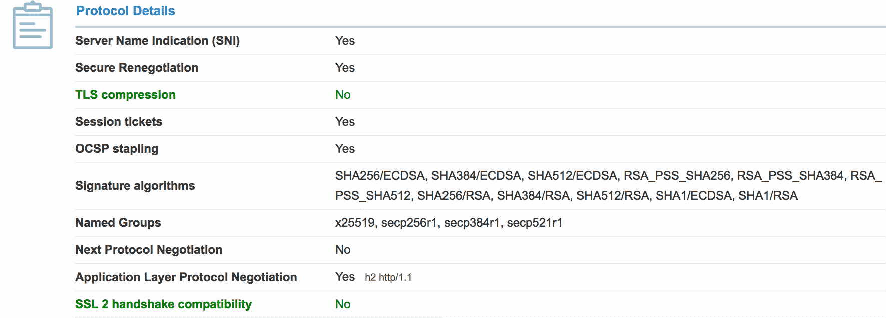
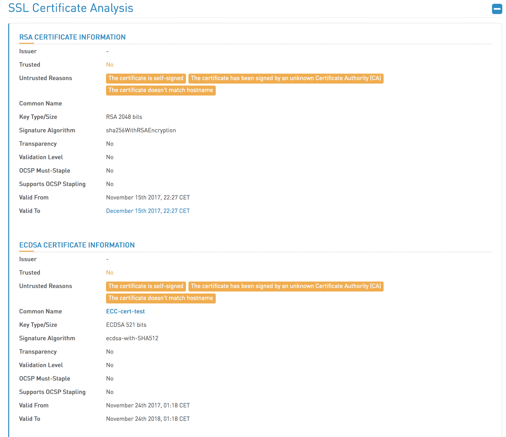

# Tomcat - Octopus 部署中的组合键

> 原文：<https://octopus.com/blog/mixing-keys-in-tomcat>

在[之前的博客文章](/blog/sni-in-tomcat)中，我们看到了 Tomcat 8.5+如何使用 SNI 将证书映射到请求的主机名。

Tomcat 8.5+可以更进一步，为每个主机支持多种证书类型。这对于在旧浏览器上支持 RSA，而在兼容浏览器上支持 ECDSA 非常有用。

在这篇博文中，我们将看看如何为 Tomcat 配置多种证书类型。

## 创建自签名 RSA 密钥

要生成 RSA 私钥和自签名证书，请使用以下命令:

```
openssl req -x509 -newkey rsa:4096 -keyout rsa.key -out rsa.crt -days 365 
```

## 创建自签名 ECDSA 密钥

要创建 ECDSA 私钥，请使用以下命令:

```
openssl ecparam -genkey -out ecdsa.key -name prime256v1 
```

`name`参数是命令返回的列表中的一个:

```
openssl ecparam -list_curves 
```

OpenSSL 支持大量的曲线，但是浏览器通常只支持非常少的曲线。 [SSL Labs](https://www.ssllabs.com/ssltest/clients.html) 允许你测试你的浏览器对命名曲线的支持。在下面的截图中可以看到 Firefox 57 支持的曲线:`x25519`、`secp256r1`、`secp384r1`、`secp521r1`。

`secp256r1`是 OpenSSL `prime256v1`曲线。

[](#)

然后使用以下命令从私钥创建证书:

```
openssl req -x509 -new -key ecdsa.key -out ecdsa.crt 
```

## 用多个键配置 Tomcat

为了支持两种证书类型，可以将多个`<Certificate>`元素添加到一个`<SSLHostConfig>`元素中。当定义了多个`<Certificate>`元素时，每个元素必须有一个惟一的`type`属性。RSA 证书具有`RSA`类型，ECDSA 证书具有`EC`类型。

这是 Tomcat `server.xml`配置文件的一个片段，其中包含使用上面的 OpenSSL 命令创建的两个自签名证书和私钥。

```
<Connector SSLEnabled="true" port="62000" protocol="org.apache.coyote.http11.Http11AprProtocol">
  <SSLHostConfig>
    <Certificate certificateFile="${catalina.base}/conf/ecdsa.crt" certificateKeyFile="${catalina.base}/conf/ecdsa.key" type="EC"/>
    <Certificate certificateFile="${catalina.base}/conf/rsa.crt" certificateKeyFile="${catalina.base}/conf/rsa.key" type="RSA"/>
  </SSLHostConfig>
</Connector> 
```

这个片段使用 APR 协议，该协议接受由 OpenSSL 创建的 PEM 文件。有关在 Tomcat 中启用 APR 的更多信息，请参见[构建 Apache 可移植运行时](/blog/building-apr-for-tomcat)。

## 验证配置

[高科桥](https://www.htbridge.com)有一个验证 web 服务器安全配置的在线服务。

在这个截图中，我们可以看到 Tomcat 服务器已经公开了 RSA 和 ECDSA 证书。

【T2 

## 结论

Tomcat 在为单个 HTTPS 端口支持 RSA 和 ECDSA 证书的能力方面是非常独特的。这使得 Tomcat 可以在不牺牲安全性的情况下，为各种客户端提供 HTTPS。这种配置可以简单地通过定义两个具有不同`type`属性的`<Connector>`元素来实现。

如果您对 Java 应用程序的自动化部署感兴趣，[下载 Octopus Deploy 的试用版](https://octopus.com/downloads)，并查看我们的文档。