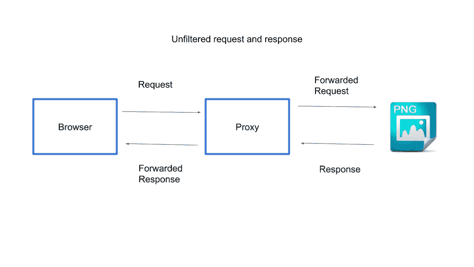
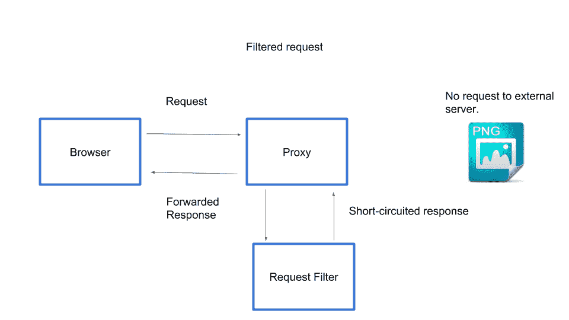
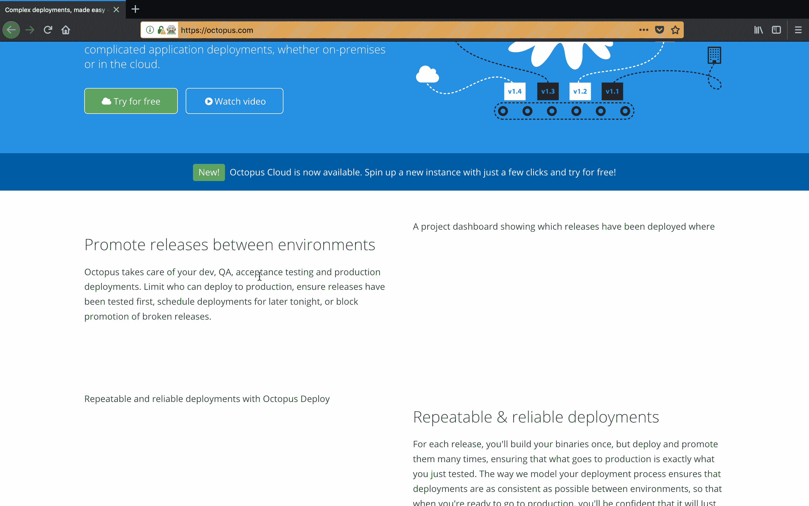
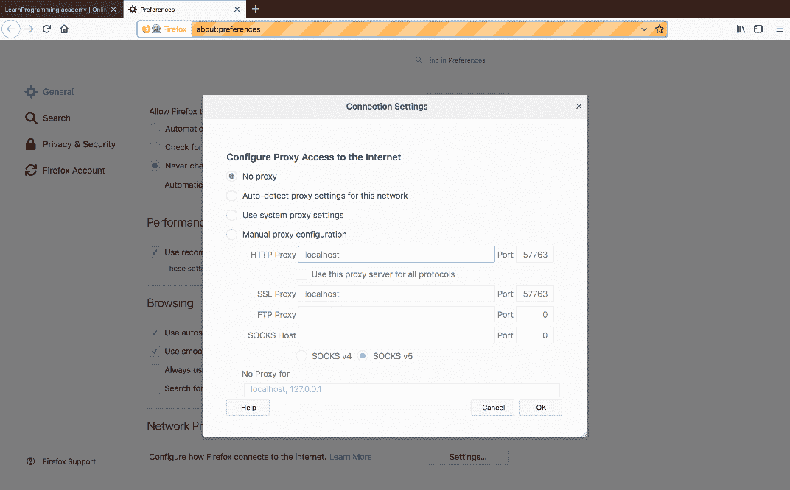
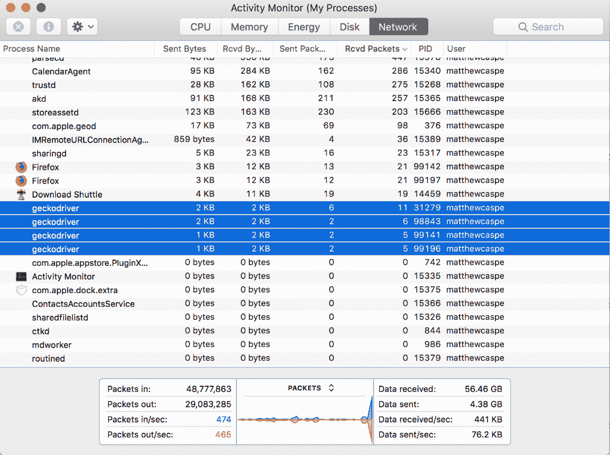

# Selenium 系列:修改 HTTP 请求- Octopus Deploy

> 原文：<https://octopus.com/blog/selenium/14-modifying-http-requests/modifying-http-requests>

这篇文章是关于[创建 Selenium WebDriver 测试框架](/blog/selenium/0-toc/webdriver-toc)的系列文章的一部分。

除了捕获网络流量，BrowserMob 还让我们能够修改浏览器发出的网络请求。在许多情况下，当运行测试时，修改请求可以证明是有用的，包括:

*   模拟外部服务的失败。
*   防止像图像这样的资产被加载，这可以提高测试的性能。
*   测试期间阻止第三方服务，如社交媒体服务。

通过代理的典型网络请求如下所示。代理位于浏览器和外部资源之间，来回传递请求。

[](#)

下图显示了我们试图实现的请求和响应。

1.  浏览器向类似 PNG 图像的资源的 URL 发出请求。
2.  该请求被定向到代理。
3.  代理使用请求过滤器来检查请求。
4.  请求因空响应而短路。永远不会联系外部 URL。
5.  空响应被发送回浏览器。

[](#)

为了支持修改请求，我们向`AutomatedBrowser`接口添加了一个新方法:

```
void blockRequestTo(String url, int responseCode); 
```

该方法接受要修改的请求的 URL，以及请求该 URL 时应该返回的 HTTP 响应代码。

我们将默认方法添加到`AutomatedBrowserBase`类中:

```
@Override
public void blockRequestTo(final String url, final int responseCode) {
  if (getAutomatedBrowser() != null) {
    getAutomatedBrowser().blockRequestTo(url, responseCode);
  }
} 
```

然后在`BrowserMobDecorator`类中实现该方法:

```
@Override
public void blockRequestTo(String url, int responseCode) {
  proxy.addRequestFilter((request, contents, messageInfo) -> {
    if (Pattern.compile(url).matcher(messageInfo.getOriginalUrl()).matches()) {
      final HttpResponse response = new DefaultHttpResponse(
        request.getProtocolVersion(),
        HttpResponseStatus.valueOf(responseCode));

      response.headers().add(HttpHeaders.CONNECTION, "Close");

      return response;
    }

    return null;

  });

  getAutomatedBrowser().blockRequestTo(url, responseCode);
} 
```

我们来分解一下这个方法。

我们首先向 BrowserMob 代理对象添加一个请求过滤器。请求过滤器作为一个 lambda 提供，它有三个参数:

*   `request`:包含 HTTP 请求的细节，比如 URL、HTTP 方法类型(GET、POST 等)、头等等。
*   `contents`:包含请求体。
*   `messageInfo`:包含一些关于请求的附加信息，比如没有经过过滤器修改的原始请求细节。

```
proxy.addRequestFilter((request, contents, messageInfo) -> { 
```

在 lambda 中，我们检查传递给`alterRequestTo()`方法的 URL 是否与请求的 URL 匹配。我们将 URL 视为正则表达式，以便在匹配 URL 时更加灵活:

```
if (Pattern.compile(url).matcher(messageInfo.getOriginalUrl()).matches()) { 
```

如果 URL 匹配，我们返回一个代表 HTTP 响应的`DefaultHttpResponse`实例。这个响应有两个参数。

第一个是 HTTP 协议版本，我们将其设置为与请求相同的版本。

第二个是 HTTP 响应代码，我们将其设置为传递给`alterRequestTo()`方法的值:

```
final HttpResponse response = new DefaultHttpResponse(
  request.getProtocolVersion(),
  HttpResponseStatus.valueOf(responseCode)); 
```

然后我们需要指出这个请求不应该使用 HTTP 保持活动功能。这是通过将 HTTP 报头`Connection`设置为`Close`来实现的。

如果我们不设置这个头，浏览器将试图保持连接打开(或保持连接活动)，您会看到页面似乎加载了很长时间:

```
response.headers().add(HttpHeaders.CONNECTION, "Close"); 
```

返回这个对象意味着请求将被短路。请求不再传递给 URL，而是由 BrowserMob 直接处理，在这种情况下，使用空响应和提供的 HTTP 响应代码:

```
return response; 
```

如果 URL 与请求不匹配，我们返回`null`，这表示这个过滤器什么也不做，请求将像平常一样通过远程服务器:

```
return null; 
```

最后一步是在测试中修改一些请求:

```
@Test
public void modifyRequests() {
  final AutomatedBrowser automatedBrowser =
  AUTOMATED_BROWSER_FACTORY.getAutomatedBrowser("Firefox");

  automatedBrowser.init();
  automatedBrowser.blockRequestTo(".*?\\.png", 201);
  automatedBrowser.blockRequestTo("https://.*?twitter\\.com/", 500);
  automatedBrowser.goTo("https://octopus.com/");
} 
```

对`blockRequestTo()`的调用将为任何对 PNG 图像的请求返回一个空响应。我们使用 HTTP 返回代码`201`来表示响应成功但为空。这是我们通过阻止下载图像来加快测试速度的一个例子:

```
automatedBrowser.blockRequestTo(".*?\\.png", 201); 
```

下一行代码块请求 Twitter 提供的服务。因为我们返回了一个 HTTP 响应代码`500`，它用于指示处理请求的服务器端错误，我们可以使用这些改变的请求作为模拟这些外部服务失败的一种方式。您可能还会发现，通过移除测试 web 应用程序不需要的更多网络流量，阻止这些可选服务可以加快测试速度:

```
automatedBrowser.blockRequestTo("https://.*?twitter\\.com/", 500); 
```

你会注意到我们在这里没有调用`automatedBrowser.destory()`。这是为了让我们能够查看因网络请求被更改而产生的网页。如您所见，通常显示的图像现在不再显示，因为这些请求被拦截并作为空响应返回。

【T2 

这里需要注意的一点是，一旦测试完成，就不可能再以任何有意义的方式与网页进行交互。这是因为 BrowserMob 已经关闭，这意味着配置浏览器的代理不再可用，因此所有未来的网络请求都将失败。

要与网页交互，您需要从浏览器设置中手动删除代理设置。下面的截图显示了我们在上一篇文章中看到的 Firefox 代理设置。选择`No proxy`选项将允许在浏览器关闭后使用浏览器。

[](#)

记住，由于没有调用`destory()`方法，我们现在负责手动关闭测试启动的驱动程序二进制文件。

[](#)

阻止对图像之类的东西的网络请求可以加速 WebDriver 测试，这在针对无头浏览器运行测试时特别有用，因为没有人监视正在运行的测试，下载永远不会被看到的图像没有什么好处。

这篇文章是关于[创建 Selenium WebDriver 测试框架](/blog/selenium/0-toc/webdriver-toc)的系列文章的一部分。