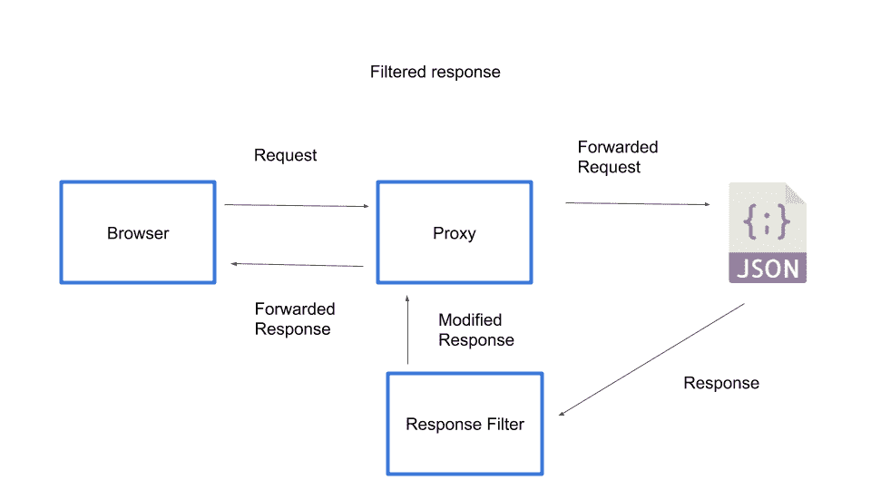

# Selenium 系列:修改 HTTP 响应- Octopus Deploy

> 原文：<https://octopus.com/blog/selenium/15-modifying-http-responses/modifying-http-responses>

这篇文章是关于[创建 Selenium WebDriver 测试框架](/blog/selenium/0-toc/webdriver-toc)的系列文章的一部分。

在上一篇文章中，我们研究了如何使用 BrowserMob 拦截请求并立即返回空响应。当您想要阻止某些资源被下载时，这是一个有用的解决方案，它可以通过阻止对可选资源(如图像)的网络请求来加速测试。

BrowserMob 提供的另一个有用的特性是改变网站响应的能力。这可以用来模拟响应，以确保测试是确定性的，或者允许测试针对特定的边缘情况。

修改响应时，网络请求和响应遵循下图所示的流程。

1.  浏览器发出请求。
2.  该请求被定向到代理。
3.  代理将请求转发到外部 URL。
4.  来自外部 URL 的响应通过响应过滤器传递。
5.  响应滤波器改变响应。
6.  更改后的响应被传递回浏览器。

[](#)

为了演示这一点，我们将创建一个非常简单的网页，查询 Yahoo weather API 来获取夏威夷的日落时间。该数据是从对[https://query.yahooapis.com/v1/public/yql?的请求中检索的 q = select % 20 astronomy . sunset % 20 from % 20 weather . forecast % 20 where % 20 woeid % 20 in % 20(select % 20 woeid % 20 from % 20 geo . places(1)% 20 where % 20 text % 3D % 22 maui % 2C % 20 hi % 22)&format = json&env = store % 3A % 2F % 2f datatables . org % 2 falltableswithkeys](https://query.yahooapis.com/v1/public/yql?q=select%20astronomy.sunset%20from%20weather.forecast%20where%20woeid%20in%20(select%20woeid%20from%20geo.places(1)%20where%20text%3D%22maui%2C%20hi%22)&format=json&env=store%3A%2F%2Fdatatables.org%2Falltableswithkeys)，它返回如下所示的 JSON 响应:

```
{
  "query": {
    "count": 1,
    "created": "2018-04-28T07:15:45Z",
    "lang": "en-US",
    "results": {
      "channel": {
        "astronomy": {
          "sunset": "6:49 pm"
        }
      }
    }
  }
} 
```

为了在网页中显示这个响应，我们有以下 HTML:

```
<html>
<head>
    <meta charset="UTF-8">
</head>
<body>
    <script>
        var xhr = new XMLHttpRequest();
        xhr.open(
            "GET",
            "https://query.yahooapis.com/v1/public/yql?q=select%20astronomy.sunset%20from%20weather.forecast%20where%20woeid%20in%20(select%20woeid%20from%20geo.places(1)%20where%20text%3D%22maui%2C%20hi%22)&format=json&env=store%3A%2F%2Fdatatables.org%2Falltableswithkeys",
            true);

        xhr.onload = function(e) {
            if (xhr.readyState === 4) {
                if (xhr.status === 200) {
                    var sunset =
                        JSON.parse(xhr.responseText).query.results.channel.astronomy.sunset;
                    var newHeading = document.createElement("h1");
                    newHeading.setAttribute("id", "sunset");
                    newHeading.textContent = "Sunset in Hawaii is at " + sunset;
                    document.body.appendChild(newHeading);
                } else {
                    console.error(xhr.statusText);
                }
            }
        };

        xhr.onerror = function(e) {
            console.error(e);
        };
        xhr.send(null);
    </script>
</body>
</html> 
```

将该 HTML 保存到文件`src/test/resources/apitest.html.`

这个 web 页面向 Yahoo API 发出一个查询，并在成功响应后创建一个带有文本`Sunset in Hawaii is at x:xx pm`的`<h1>`元素(其中时间来自 API 响应)。

以下是该页面在 Chrome 中打开时的截图。输出强调了 Yahoo 服务中一个有趣的错误，它返回了文字字符串`7:4 pm`。我假设这意味着太阳在晚上 7:40 落山。不过，这对我们来说不成问题，因为我们将用一个已知的好值替换这个错误的响应。

[](#)

即使没有返回时间中的 bug，日落时间也不是一个固定值。显然，在整个一年中，我们可以期待这个时间会有所改变。但是，如果我们需要测试的日落时间总是在晚上 7:00，那该怎么办呢？这可以通过 BrowserMob 响应过滤器实现。

我们首先向`AutomatedBrowser`接口添加一个新方法:

```
void alterResponseFrom(String url, int responseCode, String  responseBody); 
```

通常的默认方法被添加到`the AutomatedBrowserBase`类中:

```
@Override
public void alterResponseFrom(final String url, final int responseCode, final String responseBody) {
  if (getAutomatedBrowser() != null) {
    getAutomatedBrowser().alterResponseFrom(url, responseCode, responseBody);
  }
} 
```

然后在`BrowserMobDecorator`类中，我们实现这个方法:

```
@Override
public void alterResponseFrom(final String url, final int responseCode, final String responseBody) {
  proxy.addResponseFilter((response, contents, messageInfo) -> {
    if (Pattern.compile(url).matcher(messageInfo.getOriginalUrl()).matches()) {
      contents.setTextContents(responseBody);
      response.setStatus(HttpResponseStatus.valueOf(responseCode));
    }
  });

  getAutomatedBrowser().alterResponseFrom(url, responseCode, responseBody);
} 
```

像`alterRequestTo()`方法一样，`alterResponseFrom()`方法增加了一个 BrowserMob 过滤器。然而，这一次，我们添加了一个响应过滤器，它允许我们获取一个现有的响应，并根据我们的需要进行调整。

我们首先打电话给`addResponseFilter()`:

```
proxy.addResponseFilter((response, contents, messageInfo) -> { 
```

像以前一样，我们检查 URL 正则表达式是否匹配传递给`alterResponseFrom()`方法的参数:

```
if (Pattern.compile(url).matcher(messageInfo.getOriginalUrl()).matches()) { 
```

如果 URL 匹配，我们替换响应体，并更改响应 HTTP 代码:

```
contents.setTextContents(responseBody);
response.setStatus(HttpResponseStatus.valueOf(responseCode)); 
```

为了演示这一新功能，我们创建了一个新的测试:

```
@Test
public void mockRequests() throws URISyntaxException {
  final AutomatedBrowser automatedBrowser = AUTOMATED_BROWSER_FACTORY.getAutomatedBrowser("Firefox");

  try {
    automatedBrowser.init();

    automatedBrowser.alterResponseFrom(
      ".*?query\\.yahooapis\\.com.*",
      200,
      "{\"query\":{\"count\":1,\"created\":\"2018-04-28T05:20:30Z\",\"lang\":\"en-US\",\"results\":{\"channel\":{\"astronomy\":{\"sunset\":\"7:00 pm\"}}}}}");

    automatedBrowser.goTo(FormTest.class.getResource("/apitest.html").toURI().toString());

    final String sunset = automatedBrowser.getTextFromElementWithId("sunset", 60);
    Assert.assertTrue(sunset, sunset.contains("7:00 pm"));
  } finally {
    automatedBrowser.destroy();
  }
} 
```

这个测试的重要部分是对`alterResponseFrom()`方法的调用。在这里，我们将 URL 与对`query.yahooapis.com`的调用相匹配，并用我们自己的定制 JSON 替换响应。在本例中，自定义 JSON 将日落时间定义为`7:00 pm`:

```
automatedBrowser.alterResponseFrom(
  ".*?query\\.yahooapis\\.com.*",
  200,
  "{\"query\":{\"count\":1,\"created\":\"2018-04-28T05:20:30Z\",\"lang\":\"en-US\",\"results\":{\"channel\":{\"astronomy\":{\"sunset\":\"7:00 pm\"}}}}}"); 
```

打开网页后，我们检查打印到页面上的消息是否反映了这个硬编码的日落时间:

```
final String sunset = automatedBrowser.getTextFromElementWithId("sunset", 60);
Assert.assertTrue(sunset, sunset.contains("7:00 pm")); 
```

这个测试通过的事实证明，我们已经修改了 API 的响应，以包含我们自己的定制 JSON 响应。

知道 Yahoo API 可以返回类似于`7:4 pm`的时间，谨慎的做法是创建一个模拟这种边缘情况的测试。但是假设 API 返回的时间不是我们所能控制的，那么测试一个无效时间被返回的场景将会非常困难，因为明天调用 API 可能会导致一个完全有效的时间被返回。

这里是另一个测试，但是这次返回无效的日落时间。在这个例子中，我们简单的网页显示这个时间，这可能不是我们想要的，但是通过使用 BrowserMob 修改响应，我们作为测试人员可以确保在我们的测试中可靠地捕捉到这个边缘情况:

```
@Test
public void mockRequests2() throws URISyntaxException {
  final AutomatedBrowser automatedBrowser = AUTOMATED_BROWSER_FACTORY.getAutomatedBrowser("Firefox");

  try {
    automatedBrowser.init();

    automatedBrowser.alterResponseFrom(
      ".*?query\\.yahooapis\\.com.*",
      200,
      "{\"query\":{\"count\":1,\"created\":\"2018-04-28T05:20:30Z\",\"lang\":\"en-US\",\"results\":{\"channel\":{\"astronomy\":{\"sunset\":\"7:4 pm\"}}}}}");

    automatedBrowser.goTo(FormTest.class.getResource("/apitest.html").toURI().toString());

    final String sunset = automatedBrowser.getTextFromElementWithId("sunset", 60);
    Assert.assertTrue(sunset, sunset.contains("7:4 pm"));
  } finally {
    automatedBrowser.destroy();
  }
} 
```

修改来自外部服务的响应是一种有效的方法，可以确保响应具有预期的值，为您的测试提供可靠的输入，或者允许测试模拟难以重现的条件。通过在浏览器收到响应之前在代理中进行这些更改，我们可以准确地测试 web 应用程序将如何响应由实时服务返回的相同响应。

这篇文章是关于[创建 Selenium WebDriver 测试框架](/blog/selenium/0-toc/webdriver-toc)的系列文章的一部分。